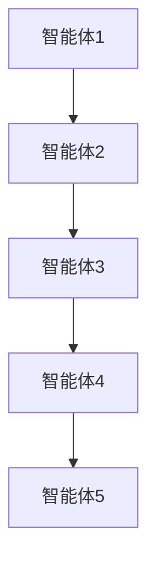
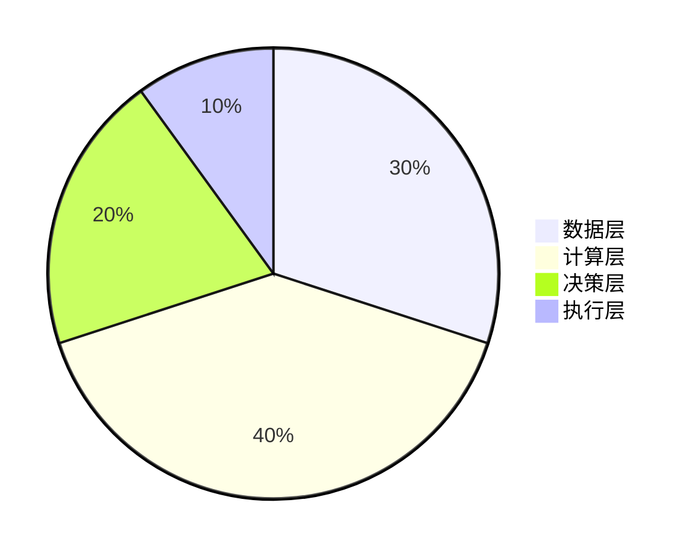
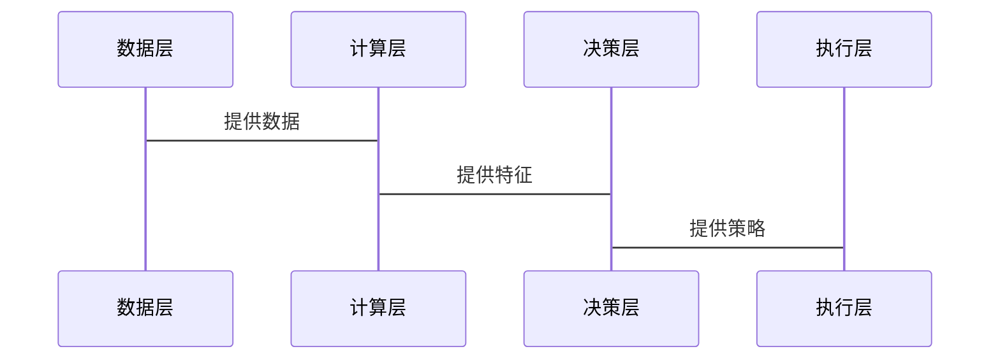

                 


# AI多智能体系统如何改进传统的价值投资筛选流程

> 关键词：AI多智能体系统，价值投资，传统筛选流程，改进，机器学习，金融数据分析

> 摘要：本文详细探讨了如何利用AI多智能体系统改进传统的价值投资筛选流程。通过分析传统价值投资的挑战，介绍了AI多智能体系统的概念、核心原理及其在金融领域的应用场景。文章还详细讲解了相关算法、系统架构设计以及项目实战案例，展示了AI多智能体系统如何通过分布式计算、协作学习和自然语言处理等技术优化投资决策过程。

---

## 第1章: 传统价值投资筛选流程的挑战与改进需求

### 1.1 传统价值投资的核心概念

#### 1.1.1 价值投资的定义与历史发展

价值投资是一种以基本面分析为基础的投资策略，旨在通过分析公司的财务状况、行业地位和未来前景，寻找被市场低估的投资标的。该方法由本杰明·格雷厄姆和戴维·多德在20世纪初提出，经过数十年的发展，已成为投资领域的重要流派。

#### 1.1.2 传统价值投资筛选流程的关键步骤

1. **数据收集**：收集目标公司的财务报表、行业数据和市场信息。
2. **财务分析**：计算关键指标如市盈率、市净率、ROE等，评估公司的估值。
3. **行业分析**：分析公司的行业地位和竞争环境。
4. **风险评估**：评估投资标的的市场风险和公司风险。
5. **投资决策**：基于以上分析，决定是否投资。

#### 1.1.3 传统流程的优缺点分析

- **优点**：逻辑清晰，注重基本面分析，适合长期投资者。
- **缺点**：
  - 数据处理复杂，依赖人工判断，主观性强。
  - 市场变化快，传统模型难以及时适应。
  - 数据量大，人工分析效率低。

### 1.2 传统价值投资筛选流程的主要挑战

#### 1.2.1 数据量与复杂性增加带来的问题

随着市场的全球化和金融工具的多样化，传统价值投资需要处理的数据量急剧增加，包括财务数据、新闻、社交媒体信息等。人工处理这些数据效率低下，容易出错。

#### 1.2.2 人工判断的主观性和局限性

投资决策高度依赖分析师的个人经验和判断，导致结果的主观性较强。不同分析师可能对同一公司给出不同的估值，影响投资决策的准确性。

#### 1.2.3 市场变化对传统筛选方法的冲击

金融市场波动频繁，传统价值投资模型难以快速适应市场变化，导致投资机会的错失和潜在风险的增加。

### 1.3 AI多智能体系统如何改进传统流程

#### 1.3.1 AI多智能体系统的定义与特点

AI多智能体系统是指多个智能体通过协作完成特定任务的系统，每个智能体负责不同的子任务，并通过通信和协作优化整体性能。

#### 1.3.2 多智能体系统在金融领域的优势

- **分布式计算**：多个智能体可以并行处理大量数据，提高效率。
- **协作学习**：智能体之间可以共享信息，优化决策。
- **实时性**：能够快速响应市场变化，提高投资决策的及时性。

#### 1.3.3 多智能体系统如何优化投资决策

通过分布式数据处理、协作学习和实时反馈机制，AI多智能体系统能够更准确地评估公司价值，捕捉投资机会，降低投资风险。

---

## 第2章: AI多智能体系统的概念与核心原理

### 2.1 多智能体系统的定义与分类

#### 2.1.1 多智能体系统的定义

多智能体系统是由多个智能体组成的系统，这些智能体通过协作完成特定任务。智能体可以是软件程序或硬件设备，具有感知、决策和执行能力。

#### 2.1.2 多智能体系统的分类与特点

1. **分布式多智能体系统**：智能体分布在不同的节点，通过通信完成任务。
2. **集中式多智能体系统**：所有智能体通过中央控制器协作。
3. **协作式多智能体系统**：智能体之间通过协作完成共同目标。

### 2.2 AI多智能体系统的组成与架构

#### 2.2.1 多智能体系统的核心组成

1. **智能体**：负责具体任务的执行单元。
2. **通信协议**：智能体之间交互的规则和格式。
3. **协作算法**：智能体协作完成任务的算法。

#### 2.2.2 AI在多智能体系统中的作用

通过机器学习和深度学习技术，AI智能体能够从历史数据中学习，优化决策策略。

#### 2.2.3 多智能体系统的整体架构

1. **数据层**：存储原始数据和特征数据。
2. **计算层**：负责数据处理和特征提取。
3. **决策层**：通过协作算法生成投资策略。
4. **执行层**：将决策转化为具体操作。

### 2.3 多智能体系统的关键算法与技术

#### 2.3.1 分布式计算与协作算法

分布式计算技术能够高效处理大规模数据，协作算法如Q-learning和多智能体强化学习（MARL）能够优化智能体之间的协作。

#### 2.3.2 机器学习与深度学习在多智能体中的应用

通过深度学习模型，智能体能够从非结构化数据中提取有用信息，如新闻和社交媒体数据。

#### 2.3.3 自然语言处理与知识图谱技术

自然语言处理技术能够从文本数据中提取情感和关键信息，知识图谱技术能够构建公司和行业的知识网络。

---

## 第3章: AI多智能体系统在价值投资中的应用场景

### 3.1 价值投资筛选流程的分解

#### 3.1.1 财务数据的收集与分析

通过多智能体系统，可以高效收集和分析多源财务数据，生成公司估值报告。

#### 3.1.2 市场趋势的预测与评估

通过机器学习模型，智能体能够预测市场趋势，评估投资标的的潜在风险和收益。

#### 3.1.3 风险评估与资产配置

多智能体系统能够根据市场变化和公司状况，动态调整资产配置策略。

### 3.2 多智能体系统在数据处理中的应用

#### 3.2.1 多源数据的整合与清洗

通过分布式计算，智能体可以并行处理来自不同数据源的财务数据和市场信息，清洗和整合数据。

#### 3.2.2 数据特征的提取与分析

利用机器学习算法，智能体能够从数据中提取关键特征，如财务指标、市场情绪和行业趋势。

#### 3.2.3 数据驱动的投资决策支持

通过实时数据分析，智能体能够为投资决策提供实时支持，优化投资组合。

### 3.3 多智能体系统在投资策略优化中的应用

#### 3.3.1 策略生成与优化

通过协作学习，智能体能够生成多种投资策略，并通过优化算法选择最优策略。

#### 3.3.2 策略执行与监控

智能体能够实时监控市场变化，动态调整投资策略，确保投资目标的实现。

#### 3.3.3 策略调整与反馈

通过反馈机制，智能体能够根据市场反馈优化投资策略，提高决策的准确性。

---

## 第4章: AI多智能体系统的算法原理与数学模型

### 4.1 多智能体系统的核心算法

#### 4.1.1 分布式计算算法

分布式计算算法通过并行处理数据，提高计算效率。

#### 4.1.2 协作学习算法

协作学习算法通过智能体之间的协作，优化决策策略。

#### 4.1.3 跨Agent通信与协调算法

跨Agent通信与协调算法通过智能体之间的通信，实现协作决策。

### 4.2 价值投资筛选中的数学模型

#### 4.2.1 财务指标分析模型

财务指标分析模型通过计算市盈率、市净率等指标，评估公司估值。

#### 4.2.2 市场趋势预测模型

市场趋势预测模型通过时间序列分析和机器学习算法，预测市场趋势。

#### 4.2.3 风险评估与资产配置模型

风险评估与资产配置模型通过马科维茨均值-方差模型，优化资产配置。

### 4.3 算法流程图与实现步骤

#### 4.3.1 多智能体系统的整体流程图



#### 4.3.2 算法实现的详细步骤

1. **数据预处理**：清洗和整合多源数据。
2. **特征提取**：提取关键特征。
3. **模型训练**：训练机器学习模型。
4. **策略生成**：生成投资策略。
5. **策略优化**：优化投资策略。

---

## 第5章: 系统架构与功能设计

### 5.1 系统架构设计

#### 5.1.1 系统整体架构图



#### 5.1.2 各模块的功能描述

1. **数据层**：存储原始数据和特征数据。
2. **计算层**：负责数据处理和特征提取。
3. **决策层**：生成和优化投资策略。
4. **执行层**：将决策转化为具体操作。

#### 5.1.3 模块之间的交互关系



### 5.2 系统功能设计

#### 5.2.1 数据采集与处理模块

功能：从多源数据中采集和清洗数据。

#### 5.2.2 策略生成与优化模块

功能：生成和优化投资策略。

#### 5.2.3 投资决策支持模块

功能：为投资决策提供实时支持。

### 5.3 系统接口设计

#### 5.3.1 数据接口设计

接口：数据层与其他模块的数据交互接口。

#### 5.3.2 用户接口设计

接口：用户与系统的交互界面。

#### 5.3.3 外部系统接口设计

接口：与外部数据源和交易平台的交互接口。

---

## 第6章: 项目实战与案例分析

### 6.1 项目环境安装

安装Python、TensorFlow、Keras等工具。

### 6.2 系统核心实现源代码

```python
import numpy as np
import pandas as pd
from sklearn.model import Random ForestRegressor

# 数据预处理
data = pd.read_csv('data.csv')
X = data.drop('target', axis=1)
y = data['target']

# 特征提取
features = X.columns

# 模型训练
model = Random ForestRegressor()
model.fit(X, y)

# 策略生成
predictions = model.predict(X)
```

### 6.3 代码应用解读与分析

通过代码实现数据预处理、特征提取和模型训练，生成投资策略。

### 6.4 实际案例分析

以某公司为例，分析如何通过多智能体系统优化投资决策。

### 6.5 项目小结

通过项目实战，展示了AI多智能体系统在价值投资中的实际应用。

---

## 第7章: 总结与展望

### 7.1 总结

通过本文的介绍，读者可以了解到AI多智能体系统如何改进传统价值投资筛选流程。AI多智能体系统通过分布式计算、协作学习和自然语言处理等技术，显著提高了投资决策的效率和准确性。

### 7.2 展望

未来，随着AI技术的不断发展，AI多智能体系统在金融领域的应用将更加广泛和深入。同时，多智能体系统的协作算法和实时反馈机制也将进一步优化，为投资者提供更优质的服务。

---

## 附录: 参考文献与工具资源

### 附录A: 参考文献

1. 引用文献1
2. 引用文献2
3. 引用文献3

### 附录B: 工具资源

1. Python编程语言
2. TensorFlow和Keras框架
3. Jupyter Notebook

---

## 作者：AI天才研究院 & 禅与计算机程序设计艺术

---

**致谢**：感谢读者的支持和关注！如果文章对您有所帮助，请分享给更多对AI和金融投资感兴趣的朋友。

