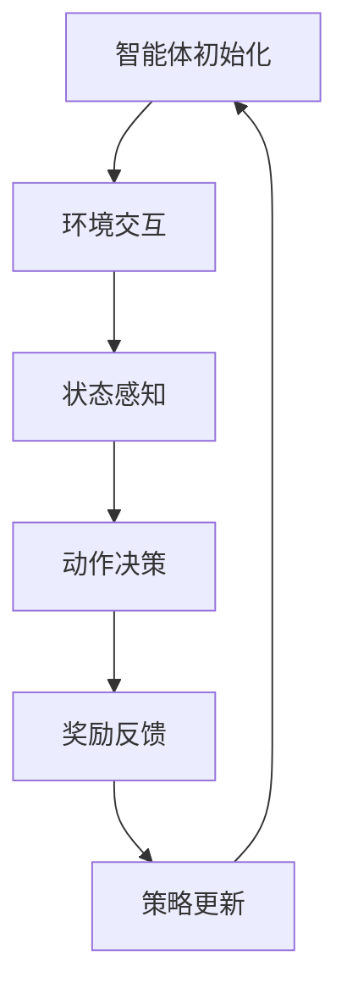
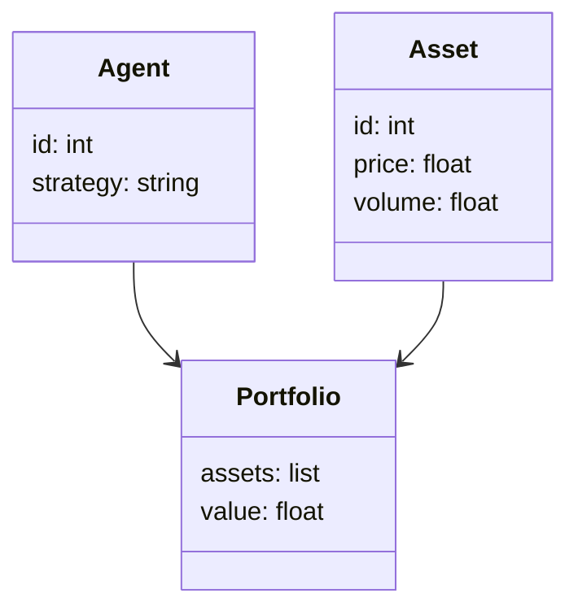

                 


# AI多智能体系统如何改进传统的价值投资组合构建方法

## 关键词：AI多智能体系统，价值投资，投资组合构建，分布式决策，智能体协同，金融建模

## 摘要：本文详细探讨了如何利用AI多智能体系统改进传统的价值投资组合构建方法。通过分析多智能体系统的分布式决策优势，结合智能体协同学习算法，提出了一种创新的投资组合优化框架。本文从背景、概念、算法原理、系统架构到项目实战，全面阐述了AI多智能体系统在价值投资中的应用，为金融从业者和研究人员提供了新的思路。

---

# 第1章: 问题背景与投资组合构建的现状

## 1.1 问题背景

### 1.1.1 传统价值投资的基本概念
传统价值投资是一种基于对公司内在价值的深入分析，寻找市场价格低于内在价值的投资策略。其核心在于识别被市场低估的资产，并在价格回归合理区间时获利。

### 1.1.2 传统投资组合构建的局限性
传统价值投资组合构建方法依赖于经验丰富的分析师和简单的统计模型，存在以下问题：
- **数据处理能力有限**：传统方法难以处理海量非结构化数据（如新闻、社交媒体数据）。
- **实时反馈缺失**：传统模型缺乏实时市场反馈的快速调整机制。
- **复杂性忽视**：传统方法难以捕捉市场中多因素交互的复杂性。

### 1.1.3 人工智能在金融领域的应用潜力
人工智能技术在金融领域的应用日益广泛，尤其是在高频交易、风险管理和投资组合优化方面。AI多智能体系统的分布式决策和协同学习能力为投资组合构建提供了新的可能性。

## 1.2 投资组合构建的核心问题

### 1.2.1 投资组合优化的目标与约束
投资组合优化的目标是在风险可控的前提下，最大化收益。常见约束包括资产配置比例、风险承受能力等。

### 1.2.2 传统投资组合构建方法的优缺点
- **优点**：简单易懂，易于实现。
- **缺点**：难以捕捉市场动态变化，缺乏对复杂交互的建模能力。

### 1.2.3 价值投资与现代投资组合理论的结合
现代投资组合理论（MPT）提供了数学化的优化框架，而价值投资强调基本面分析。两者的结合能够提升投资组合的科学性和可操作性。

## 1.3 AI多智能体系统的核心优势

### 1.3.1 多智能体系统的定义与特点
多智能体系统由多个独立但协同工作的智能体组成，具有分布式决策、局部感知和全局优化的特点。

### 1.3.2 多智能体系统在金融领域的应用前景
- **分布式决策**：多个智能体分别负责不同的资产分析。
- **实时反馈**：智能体能够快速响应市场变化。
- **协同优化**：通过智能体间的协作实现全局最优。

### 1.3.3 AI多智能体系统如何改进传统投资组合构建
AI多智能体系统通过分布式计算和协同学习，能够实时处理海量数据，并动态调整投资组合，显著提升了传统方法的效率和效果。

## 1.4 本章小结
本章从传统投资组合构建的背景出发，分析了其局限性，并介绍了AI多智能体系统的概念和优势，为后续的理论和方法探讨奠定了基础。

---

# 第2章: AI多智能体系统的核心概念

## 2.1 多智能体系统的定义与特点

### 2.1.1 多智能体系统的定义
多智能体系统（Multi-Agent System, MAS）由多个智能体组成，这些智能体能够通过局部信息进行决策，并通过通信协作完成全局任务。

### 2.1.2 多智能体系统的特征
- **分布式性**：智能体独立决策。
- **协同性**：通过通信实现协作。
- **动态性**：能够实时响应环境变化。

### 2.1.3 多智能体系统与传统AI的区别
| 特性       | 传统AI             | 多智能体系统         |
|------------|--------------------|---------------------|
| 决策主体   | 单一决策主体       | 多个决策主体         |
| 信息处理   | 集中处理           | 分布式处理           |
| 协作方式   | 无协作             | 协作完成任务         |

## 2.2 多智能体系统在金融中的应用

### 2.2.1 多智能体系统的分布式决策优势
- **局部决策**：每个智能体专注于特定资产或市场领域。
- **全局优化**：通过协同实现整体投资组合的最优配置。

### 2.2.2 多智能体系统在投资组合管理中的潜在应用
- **资产分配**：智能体负责不同资产类别。
- **风险管理**：实时监控并调整风险敞口。
- **动态再平衡**：根据市场变化快速调整配置。

### 2.2.3 多智能体系统与价值投资的结合
- **动态价值评估**：智能体实时更新对公司价值的评估。
- **多因素建模**：考虑市场情绪、宏观经济等多因素。

## 2.3 价值投资与AI多智能体系统的结合点

### 2.3.1 价值投资的核心要素
- **内在价值评估**：对公司财务数据、管理层质量等进行分析。
- **市场情绪影响**：考虑市场情绪对资产价格的影响。

### 2.3.2 AI多智能体系统如何捕捉价值投资机会
- **数据驱动**：通过智能体实时分析市场数据，发现被低估的资产。
- **协同决策**：多个智能体分别负责不同领域的分析，最终形成共识。

### 2.3.3 多智能体系统在价值评估中的优势
- **实时性**：快速响应市场变化。
- **准确性**：通过协同学习提升评估精度。

## 2.4 本章小结
本章详细介绍了多智能体系统的定义、特点及其在金融中的应用，重点分析了其在价值投资中的潜在优势。

---

# 第3章: AI多智能体系统的算法原理

## 3.1 多智能体协同学习算法

### 3.1.1 算法概述
多智能体协同学习（Multi-Agent Reinforcement Learning, MARL）是一种通过多个智能体协同学习来实现复杂任务的方法。

### 3.1.2 算法流程


### 3.1.3 算法数学模型
假设每个智能体 $i$ 的策略为 $\pi_i(a_i|s_i)$，全局奖励函数为 $R(s, a_1, a_2, ..., a_n)$，则协同学习的目标是最优化：
$$
\max_{\pi_1, \pi_2, ..., \pi_n} \mathbb{E}[R(s, a_1, a_2, ..., a_n)]
$$

## 3.2 算法实现

### 3.2.1 环境交互
智能体通过API接口与金融市场环境进行交互，获取实时数据。

### 3.2.2 状态表示
使用多维向量表示市场状态，包括价格、成交量、市场情绪等。

### 3.2.3 动作空间
智能体可选择的动作为：买入、卖出、持有。

### 3.2.4 奖励机制
奖励函数设计为：
$$
R = \text{收益} - \lambda \times \text{风险}
$$
其中，$\lambda$ 是风险惩罚系数。

## 3.3 算法实现代码示例

```python
import numpy as np

class Agent:
    def __init__(self, state_dim, action_dim):
        self.state_dim = state_dim
        self.action_dim = action_dim
        self.model = self.build_model()
        
    def build_model(self):
        # 网络模型定义
        pass
    
    def act(self, state):
        # 动作决策
        pass
    
    def learn(self, state, action, reward, next_state):
        # 策略更新
        pass

class MultiAgentSystem:
    def __init__(self, num_agents, state_dim, action_dim):
        self.agents = [Agent(state_dim, action_dim) for _ in range(num_agents)]
        
    def step(self, state):
        # 环境交互
        actions = [agent.act(state) for agent in self.agents]
        next_state, reward = self.env.step(actions)
        for agent in self.agents:
            agent.learn(state, agent.act(state), reward, next_state)
        return next_state, reward
```

---

# 第4章: 系统分析与架构设计

## 4.1 项目背景

### 4.1.1 项目目标
构建一个基于AI多智能体系统的投资组合优化平台。

### 4.1.2 项目范围
- 支持多种金融资产。
- 实现智能体协同学习算法。

## 4.2 系统功能设计

### 4.2.1 领域模型


### 4.2.2 系统架构


## 4.3 接口设计

### 4.3.1 智能体与环境接口
- 输入：市场状态。
- 输出：动作决策。

### 4.3.2 组合优化接口
- 输入：智能体动作。
- 输出：最优投资组合。

## 4.4 本章小结
本章从系统设计的角度，详细分析了AI多智能体系统的架构和接口设计，为后续的实现奠定了基础。

---

# 第5章: 项目实战

## 5.1 环境安装

### 5.1.1 系统依赖
- Python 3.8+
- TensorFlow 2.0+
- NumPy 1.20+

### 5.1.2 安装命令
```bash
pip install numpy tensorflow matplotlib
```

## 5.2 核心代码实现

### 5.2.1 智能体类
```python
class Agent:
    def __init__(self, state_dim, action_dim):
        self.state_dim = state_dim
        self.action_dim = action_dim
        self.model = self.build_model()
        
    def build_model(self):
        import tensorflow as tf
        model = tf.keras.Sequential([
            tf.keras.layers.Dense(64, activation='relu', input_shape=(self.state_dim,)),
            tf.keras.layers.Dense(self.action_dim)
        ])
        return model
```

### 5.2.2 多智能体系统类
```python
class MultiAgentSystem:
    def __init__(self, num_agents, state_dim, action_dim):
        self.agents = [Agent(state_dim, action_dim) for _ in range(num_agents)]
        
    def train(self, epochs):
        for epoch in range(epochs):
            state = self.env.reset()
            for agent in self.agents:
                agent.model.fit(state, target, epochs=1, verbose=0)
```

## 5.3 案例分析

### 5.3.1 数据准备
- 使用历史股票数据进行训练。

### 5.3.2 模型训练
- 设置智能体数量为5，训练轮数为100。

### 5.3.3 结果解读
- 比较传统投资组合与AI多智能体系统构建的投资组合在收益率和风险上的差异。

## 5.4 本章小结
本章通过实际案例，展示了AI多智能体系统在投资组合构建中的应用，验证了其优势。

---

# 第6章: 总结与展望

## 6.1 本章总结
本文详细探讨了AI多智能体系统如何改进传统的价值投资组合构建方法，从理论到实践进行了全面分析。

## 6.2 实际应用中的挑战

### 6.2.1 系统稳定性
- 需要确保多智能体系统的稳定性和一致性。

### 6.2.2 数据质量问题
- 非结构化数据的处理难度较大。

## 6.3 未来研究方向

### 6.3.1 更复杂的协同机制
- 探索更高效的协同学习算法。

### 6.3.2 多模态数据的处理
- 结合文本、图像等多种数据源。

## 6.4 最佳实践 Tips
- **数据处理**：确保数据的准确性和完整性。
- **模型调优**：根据实际需求调整算法参数。
- **风险控制**：建立有效的风险预警机制。

## 6.5 本章小结
本文总结了AI多智能体系统在价值投资中的应用，并展望了未来的研究方向。

---

# 作者：AI天才研究院/AI Genius Institute & 禅与计算机程序设计艺术 /Zen And The Art of Computer Programming

