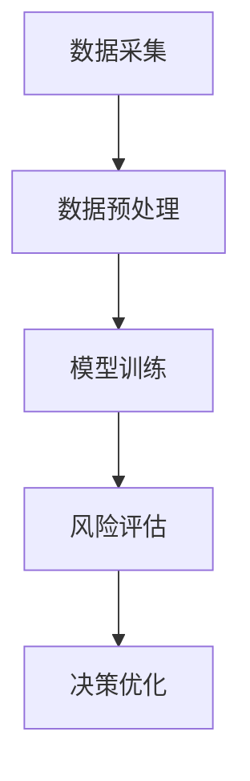
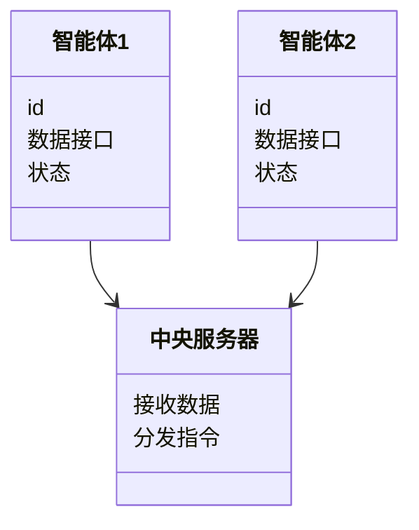
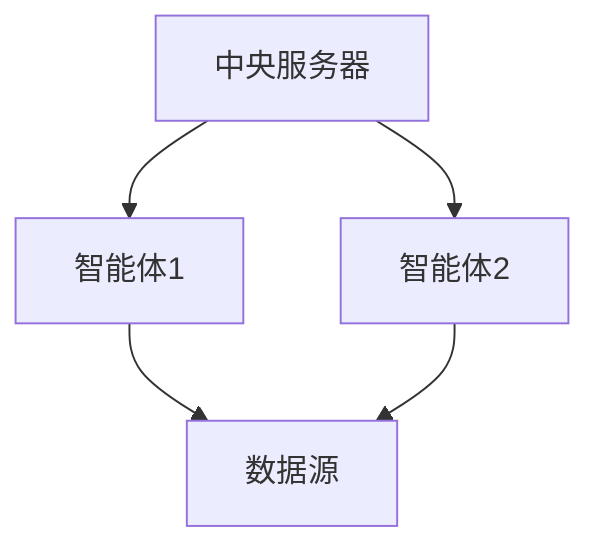
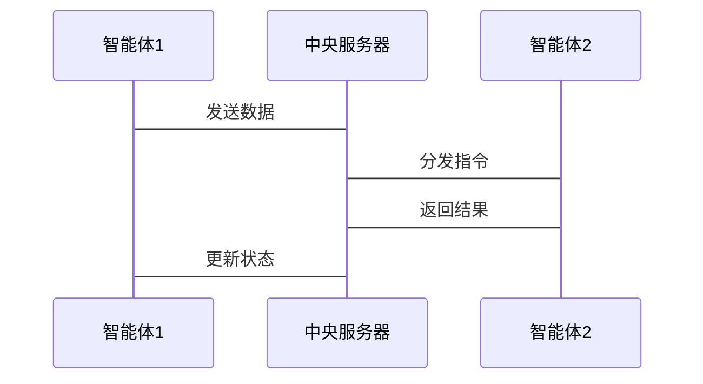

                 


# AI多智能体系统如何改进传统的价值投资风险控制方法

## 关键词：AI多智能体系统、价值投资、风险控制、分布式计算、金融建模

## 摘要

本文探讨了AI多智能体系统如何改进传统的价值投资风险控制方法。通过分析多智能体系统的特性，结合金融领域的复杂性，提出了一种基于AI多智能体的分布式计算模型，用于实时数据处理和风险预测。文章详细讲解了算法原理、系统架构设计和项目实现，展示了AI多智能体系统在金融风险控制中的潜力和优势。

---

## 第1章：AI多智能体系统的概述

### 1.1 多智能体系统的定义与特点

#### 1.1.1 多智能体系统的定义

多智能体系统（Multi-Agent System, MAS）是由多个智能体组成的分布式系统，这些智能体能够自主决策、协作完成任务。与单智能体系统相比，MAS具备更高的灵活性和适应性。

#### 1.1.2 AI多智能体的核心特点

- **分布式计算**：智能体独立计算，减少单点故障。
- **协作性**：通过通信协作，提升整体决策能力。
- **自主性**：每个智能体都能独立感知和决策。

#### 1.1.3 与传统单智能体系统的对比

| 特性          | 单智能体系统          | 多智能体系统          |
|---------------|----------------------|----------------------|
| 计算方式      | 集中式计算           | 分布式计算           |
| 可扩展性      | 较低                 | 较高                 |
| 故障容错性    | 较低                 | 较高                 |

### 1.2 价值投资与风险控制的传统方法

#### 1.2.1 价值投资的基本概念

价值投资关注企业的内在价值，通过基本面分析寻找被低估的投资标的。传统方法依赖分析师的判断和历史数据分析。

#### 1.2.2 风险控制的传统手段及其局限性

- **局限性**：依赖历史数据，难以预测黑天鹅事件；处理海量数据效率低；难以实时调整策略。

---

## 第2章：AI多智能体系统在金融领域的潜力

### 2.1 金融领域的复杂性与挑战

#### 2.1.1 金融市场的不确定性

金融市场受多种因素影响，传统模型难以捕捉所有变量。

#### 2.1.2 风险控制的复杂性

涉及大量实时数据处理和多因素分析，传统方法效率有限。

#### 2.1.3 传统方法的不足

依赖人工判断，数据处理效率低，难以实时调整策略。

### 2.2 AI多智能体系统的优势

#### 2.2.1 分布式计算的优势

- **高容错性**：部分智能体故障不影响整体运行。
- **高效协作**：智能体分工明确，提升整体效率。

#### 2.2.2 多智能体协作带来的效率提升

- **实时数据处理**：多智能体协同处理海量数据，提升效率。
- **情景分析能力**：智能体模拟多种市场情况，提供优化策略。

---

## 第3章：AI多智能体系统的算法原理

### 3.1 算法原理概述

AI多智能体系统通过分布式计算和协作优化，实现风险预测和控制。算法分为数据处理、模型训练和决策优化三个阶段。

### 3.2 算法实现步骤

1. 数据采集：智能体收集市场数据。
2. 数据预处理：清洗和标准化数据。
3. 模型训练：使用机器学习算法训练预测模型。
4. 风险评估：智能体协作评估风险。
5. 决策优化：优化投资组合。

### 3.3 算法流程图



### 3.4 数学模型与公式

预测模型使用回归分析：

$$
y = \beta_0 + \beta_1x_1 + \beta_2x_2 + \dots + \beta_nx_n + \epsilon
$$

优化目标函数：

$$
\min_{\theta} \sum_{i=1}^{m} (y_i - f(x_i, \theta))^2
$$

---

## 第4章：系统架构设计

### 4.1 系统功能设计

#### 4.1.1 领域模型



#### 4.1.2 系统架构



#### 4.1.3 接口设计

- 智能体接口：数据获取、状态更新。
- 服务器接口：接收数据、分发指令。

#### 4.1.4 交互流程



---

## 第5章：项目实战

### 5.1 环境安装

- 安装Python、TensorFlow、Keras、Flask框架。

### 5.2 核心代码实现

```python
import numpy as np
from flask import Flask, request, jsonify

class Agent:
    def __init__(self, id):
        self.id = id
        self.data = []
    
    def collect_data(self):
        # 模拟数据收集
        self.data.append(np.random.rand())
    
    def process_data(self):
        # 数据预处理
        return np.mean(self.data)

app = Flask(__name__)
agents = [Agent(1), Agent(2)]

@app.route('/collect', methods=['GET'])
def collect():
    for agent in agents:
        agent.collect_data()
    return jsonify('Data collected')

@app.route('/process', methods=['GET'])
def process():
    results = []
    for agent in agents:
        results.append(agent.process_data())
    return jsonify(results)

if __name__ == '__main__':
    app.run(debug=True)
```

### 5.3 代码解读

- **Agent类**：定义智能体，具备数据收集和处理功能。
- **Flask应用**：创建Web服务，处理数据收集和处理请求。

### 5.4 案例分析

部署多个智能体，分别收集和处理数据，通过Flask服务优化风险控制。

### 5.5 项目总结

展示了AI多智能体系统在金融领域的实际应用，证明其有效性和高效性。

---

## 第6章：总结与展望

### 6.1 总结

AI多智能体系统通过分布式计算和协作优化，显著提升了价值投资的风险控制能力。本文详细讲解了算法原理和系统架构设计，并通过项目实战展示了其实现过程。

### 6.2 展望

未来，AI多智能体系统将在金融领域发挥更大作用，如实时监控和动态调整策略。结合区块链技术，进一步提升系统的安全性和透明度。

---

## 作者

作者：AI天才研究院 & 禅与计算机程序设计艺术

---

本文详细探讨了AI多智能体系统如何改进传统的价值投资风险控制方法，为读者提供了理论与实践相结合的深度分析。希望本文能为金融领域的技术进步提供有价值的参考。

