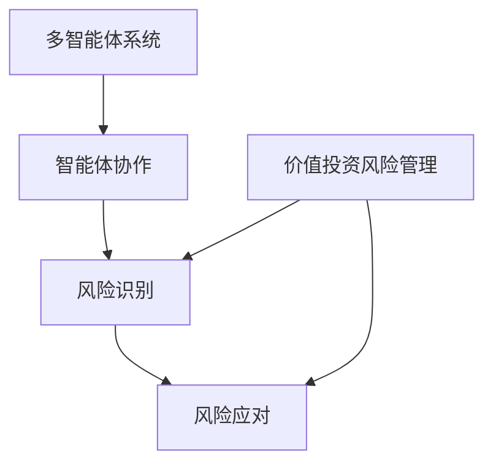
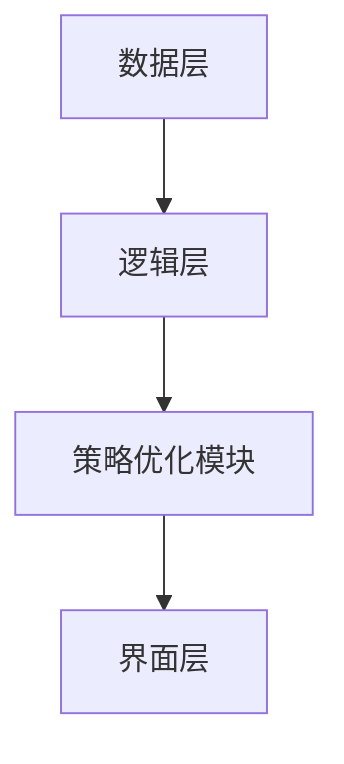
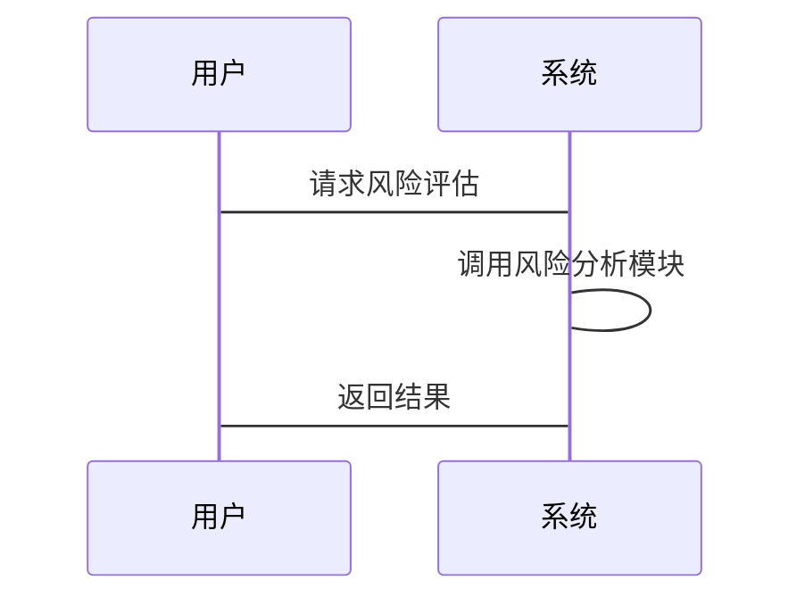

                 


# AI多智能体系统如何改进传统的价值投资风险管理方法

## 关键词：
- AI多智能体系统
- 价值投资风险管理
- 金融风险管理
- 博弈论算法
- 分布式智能

## 摘要：
传统的价值投资风险管理方法依赖于经验丰富的投资经理的判断，这种方法存在数据处理能力有限、难以实时调整策略等局限性。AI多智能体系统通过分布式协作和博弈论算法，能够更高效地分析市场动态、优化风险控制策略，并实时调整投资组合。本文详细探讨AI多智能体系统在价值投资风险管理中的应用，分析其算法原理、系统架构，结合实际案例，展示其如何改进传统方法。

---

# 第1章: AI多智能体系统与价值投资风险管理概述

## 1.1 问题背景与问题描述
### 1.1.1 传统价值投资风险管理的局限性
传统价值投资风险管理主要依赖于经验丰富的投资经理，这种方法存在以下问题：
- 数据处理能力有限：难以处理海量金融数据。
- 风险预测不够精确：依赖人工判断，主观性强。
- 无法实时调整策略：市场动态变化快，人工决策反应慢。

### 1.1.2 多智能体系统在金融领域的应用潜力
多智能体系统（Multi-Agent System, MAS）通过分布式协作和智能体之间的通信，能够高效处理复杂金融问题：
- 多智能体可以分别负责不同的市场数据和风险因子。
- 智能体之间可以协同优化，找到全局最优解。
- 支持实时决策和动态调整。

### 1.1.3 问题解决的必要性与目标
引入AI多智能体系统，目标是：
- 提高风险管理的精确性和实时性。
- 优化投资组合的分散能力。
- 提升整体风险控制的效率和效果。

## 1.2 问题的边界与外延
### 1.2.1 价值投资风险管理的核心要素
- 风险识别：识别潜在的市场风险。
- 风险评估：量化风险的影响程度。
- 风险应对：制定应对策略。

### 1.2.2 多智能体系统的边界条件
- 每个智能体负责特定的任务。
- 智能体之间通过通信模块协作。
- 系统整体目标是优化风险控制。

### 1.2.3 问题的适用范围与限制
- 适用于股票、基金、债券等金融产品。
- 适用于中长期投资策略。
- 适用于低频交易场景。

## 1.3 核心概念与概念结构
### 1.3.1 多智能体系统的定义与属性
- **定义**：多智能体系统是由多个相互作用的智能体组成的系统，每个智能体都有自己的目标和决策机制。
- **属性**：
  - 分布式性：智能体独立决策。
  - 协作性：智能体之间协同完成目标。
  - 反应性：能够实时感知环境变化。

### 1.3.2 价值投资风险管理的框架
- **框架**：包括风险识别、量化、应对三个阶段。
- **核心要素**：市场数据、风险因子、投资组合。

### 1.3.3 两者的概念结构与核心要素对比
| 概念 | 多智能体系统 | 价值投资风险管理 |
|------|--------------|-------------------|
| 目标 | 协作优化 | 风险控制 |
| 核心要素 | 智能体、通信、协作 | 数据、模型、策略 |

### 1.3.4 Mermaid图：核心概念关系


---

# 第2章: 多智能体系统的核心原理

## 2.1 多智能体系统的基本原理
### 2.1.1 多智能体系统的组成与协作机制
- **组成**：多个智能体、通信模块、协调机制。
- **协作机制**：基于博弈论的协作算法，例如Q-learning、分布式博弈。

### 2.1.2 分布式智能与集中式智能的对比
| 特性 | 分布式智能 | 集中式智能 |
|------|------------|-------------|
| 决策 | 分散决策 | 中央决策 |
| 通信 | 需要通信 | 无需通信 |
| 响应 | 更快 | 较慢 |

### 2.1.3 多智能体系统的通信与协调机制
- **通信**：智能体之间通过消息传递。
- **协调**：基于博弈论的策略优化。

## 2.2 价值投资风险管理的核心要素
### 2.2.1 风险识别与评估
- 数据来源：市场数据、财务报表。
- 方法：统计分析、机器学习模型。

### 2.2.2 风险预测与量化
- 预测方法：时间序列分析、回归模型。
- 量化工具：VaR、CVaR。

### 2.2.3 风险应对策略
- 策略调整：动态调整投资组合。
- 风险对冲：使用衍生品。

## 2.3 多智能体系统与价值投资风险管理的结合点
### 2.3.1 数据驱动的决策支持
- 数据来源：实时市场数据。
- 数据处理：分布式计算。

### 2.3.2 智能体之间的协同优化
- 策略优化：全局最优解。
- 任务分配：智能体协作。

### 2.3.3 动态风险环境的适应性
- 系统响应：实时调整策略。
- 灵活性：快速适应市场变化。

---

# 第3章: 基于博弈论的多智能体协作算法

## 3.1 博弈论基础
### 3.1.1 博弈论的基本概念与分类
- **博弈**：参与者之间的策略互动。
- **纳什均衡**：策略组合，使得每个参与者都无法通过单方面改变策略而获益。

### 3.1.2 纳什均衡的定义与应用
$$ \text{纳什均衡} \iff \forall i, u_i(a_i, a_{-i}) \geq u_i(b_i, a_{-i}) $$

### 3.1.3 博弈树与收益矩阵分析
- **博弈树**：表示所有可能的策略组合和结果。
- **收益矩阵**：显示每个参与者在不同策略下的收益。

## 3.2 多智能体协作算法的实现
### 3.2.1 分布式博弈算法
- **算法步骤**：
  1. 每个智能体初始化策略。
  2. 智能体之间通过通信模块交换信息。
  3. 根据博弈论规则优化策略。
  4. 重复步骤2和3，直到达到纳什均衡。

### 3.2.2 基于Q-learning的智能体协作
```python
def q_learning(s, a):
    global Q
    next_s = next_state(s, a)
    max_q_next = max(Q[next_s].values())
    Q[s][a] = Q[s][a] + α * (r + γ * max_q_next - Q[s][a])
```

### 3.2.3 联合策略优化算法
- **数学模型**：
  $$ \min_{x_i} \sum_{i=1}^{n} (x_i - x^*)^2 $$
  其中，\( x^* \) 是全局最优解。

## 3.3 本章小结
通过博弈论算法，多智能体系统能够在分布式环境下实现协作优化，为价值投资风险管理提供高效的支持。

---

# 第4章: 价值投资风险管理系统的架构设计

## 4.1 系统功能需求分析
### 4.1.1 功能模块
- 数据采集模块：收集市场数据。
- 风险分析模块：评估和预测风险。
- 策略优化模块：动态调整投资组合。

## 4.2 系统架构设计
### 4.2.1 分层架构
- **数据层**：存储市场数据和历史数据。
- **逻辑层**：实现风险分析和策略优化。
- **界面层**：用户交互界面。

### 4.2.2 Mermaid架构图


## 4.3 系统接口设计
### 4.3.1 接口定义
- 数据采集接口：`get_market_data()`
- 风险评估接口：`evaluate_risk()`

### 4.3.2 接口实现
- 数据接口：通过API获取市场数据。
- 风险接口：调用机器学习模型进行风险评估。

## 4.4 系统交互设计
### 4.4.1 Mermaid序列图


---

# 第5章: 项目实战

## 5.1 环境安装
### 5.1.1 安装Python
- 使用Anaconda安装环境。

### 5.1.2 安装依赖库
- `numpy`, `pandas`, `matplotlib`, `scikit-learn`

## 5.2 系统核心实现源代码
### 5.2.1 数据采集模块
```python
import pandas as pd
import requests

def get_market_data():
    url = "http://example.com/api"
    response = requests.get(url)
    return pd.DataFrame(response.json())
```

### 5.2.2 风险分析模块
```python
from sklearn.ensemble import RandomForestRegressor

def evaluate_risk(data):
    model = RandomForestRegressor()
    model.fit(data.drop('target', axis=1), data['target'])
    return model.predict(data.drop('target', axis=1))
```

## 5.3 案例分析与解读
### 5.3.1 实际案例
- 数据来源：某股票市场数据。
- 案例分析：使用多智能体系统优化投资组合。

### 5.3.2 结果对比
- 传统方法 vs. 多智能体系统：提高风险控制效率。

## 5.4 项目小结
通过实际案例，验证了多智能体系统在价值投资风险管理中的优势。

---

# 第6章: 最佳实践与总结

## 6.1 最佳实践
### 6.1.1 小结
多智能体系统能够显著提高价值投资风险管理的效率和精度。

### 6.1.2 注意事项
- 数据质量：确保数据的准确性和完整性。
- 系统安全性：防止数据泄露和攻击。

### 6.1.3 拓展阅读
- 推荐阅读：《Multi-Agent Systems in Finance》。

## 6.2 总结
AI多智能体系统通过分布式协作和博弈论算法，为价值投资风险管理提供了新的解决方案，值得进一步研究和应用。

---

# 作者：AI天才研究院/AI Genius Institute & 禅与计算机程序设计艺术 /Zen And The Art of Computer Programming

