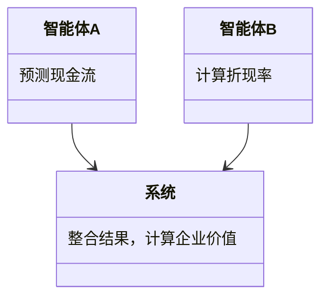
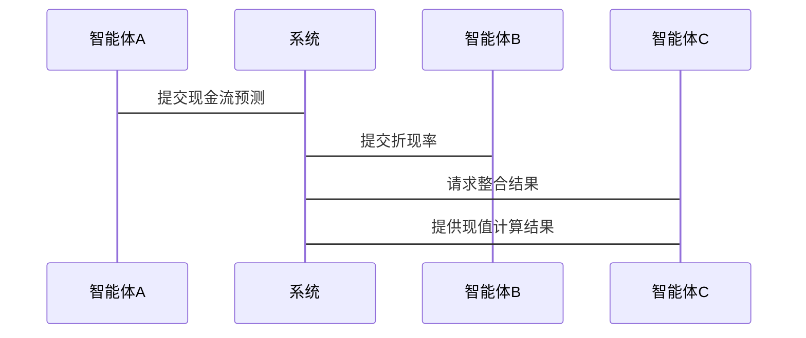

                 


# AI多智能体系统如何改进传统的折现现金流模型

## 关键词：AI多智能体系统，折现现金流模型，DCF模型，人工智能，金融建模

## 摘要：本文探讨了如何利用AI多智能体系统改进传统的折现现金流模型（DCF模型），分析了AI多智能体技术如何提升DCF模型的预测精度和计算效率，提出了基于多智能体的改进算法，并通过实际案例展示了其优势。文章内容涵盖背景介绍、数学基础、算法原理、系统架构、项目实战及最佳实践，为读者提供了全面的技术指导。

---

# 第一部分: AI多智能体系统与折现现金流模型的背景

## 第1章: 折现现金流模型概述

### 1.1 折现现金流模型的基本概念

#### 1.1.1 什么是折现现金流模型
折现现金流模型（Discounted Cash Flow Model, DCF模型）是一种用于评估企业价值的金融模型，通过将未来现金流折现到现值，以确定企业的内在价值。DCF模型广泛应用于企业估值、投资决策等领域。

#### 1.1.2 折现现金流模型的核心假设
- 企业价值由未来自由现金流的现值决定；
- 股权资本成本或加权平均资本成本（WACC）作为折现率；
- 现金流预测的准确性依赖于对行业和市场的深刻理解。

#### 1.1.3 折现现金流模型的优缺点
- **优点**：DCF模型能够全面考虑企业未来现金流，提供较为精确的企业价值评估。
- **缺点**：依赖于对未来现金流的预测，存在较高的主观性和不确定性。

---

### 1.2 多智能体系统的基本概念

#### 1.2.1 多智能体系统的定义
多智能体系统（Multi-Agent System, MAS）是由多个相互作用的智能体组成的系统，每个智能体能够感知环境、自主决策并与其他智能体协作完成任务。

#### 1.2.2 多智能体系统的特征
- **分布式**：智能体分布在不同的位置，独立决策。
- **协作性**：智能体之间通过通信和协作完成共同目标。
- **反应性**：智能体能够实时感知环境并做出反应。

#### 1.2.3 多智能体系统与传统AI的区别
- **传统AI**：集中式决策，单个智能体完成任务。
- **多智能体系统**：分布式决策，多个智能体协作完成任务。

---

### 1.3 折现现金流模型与多智能体系统的结合

#### 1.3.1 折现现金流模型的局限性
- 现金流预测的主观性较高，受市场波动影响较大；
- 传统DCF模型依赖于单一的折现率，无法动态调整。

#### 1.3.2 多智能体系统如何改进DCF模型
- **动态调整**：多个智能体分别负责不同现金流预测和折现率计算，实时调整模型参数；
- **分布式计算**：多智能体协作，提高计算效率和模型鲁棒性。

#### 1.3.3 结合后的优势与应用场景
- **提高预测精度**：通过多智能体协作，综合多种因素进行预测，降低模型的不确定性；
- **动态适应性**：智能体能够实时感知市场变化，动态调整模型参数。

---

## 第2章: 折现现金流模型的数学基础

### 2.1 折现率的计算

#### 2.1.1 折现率的定义
折现率是将未来现金流折现到现值的贴现率，通常使用股权资本成本或WACC。

#### 2.1.2 折现率的计算公式
$$折现率 = \frac{未来现金流}{现值}$$

#### 2.1.3 折现率的影响因素
- **风险**：高风险企业折现率较高；
- **市场利率**：市场利率上升，折现率上升；
- **企业资本结构**：资本结构影响WACC的计算。

---

### 2.2 现金流量的折现

#### 2.2.1 现金流量的定义
现金流量是指企业在未来一定时期内产生的现金流入和流出。

#### 2.2.2 现金流量的折现公式
$$现值 = \sum_{t=1}^{n} \frac{CF_t}{(1 + r)^t}$$
其中，$CF_t$为第t期的现金流，$r$为折现率。

#### 2.2.3 折现现金流量的计算步骤
1. 确定未来现金流；
2. 选择合适的折现率；
3. 将未来现金流折现到现值；
4. 求和得到企业价值。

---

### 2.3 折现现金流模型的数学模型

#### 2.3.1 基本模型
$$V = \frac{CF_1}{1+r} + \frac{CF_2}{(1+r)^2} + \cdots + \frac{CF_n}{(1+r)^n}$$

#### 2.3.2 模型的扩展与改进
引入多因素模型，考虑市场波动、行业趋势等多方面因素。

#### 2.3.3 模型的验证与评估
通过历史数据验证模型的准确性，调整参数以提高预测精度。

---

## 第3章: 多智能体系统的算法原理

### 3.1 多智能体系统的算法概述

#### 3.1.1 多智能体系统的分类
- **简单反射架构**：智能体基于当前感知做出反应；
- **基于模型的架构**：智能体使用内部模型进行规划和决策；
- **协作式架构**：智能体之间协作完成复杂任务。

#### 3.1.2 多智能体系统的通信机制
- **直接通信**：智能体之间直接交换信息；
- **间接通信**：通过共享数据库或中间件进行信息交换。

#### 3.1.3 多智能体系统的协作机制
- **任务分配**：智能体根据自身能力分配任务；
- **协调与同步**：智能体之间协调行动，确保任务顺利进行。

---

### 3.2 基于多智能体的折现现金流模型改进算法

#### 3.2.1 算法的总体框架
1. 初始化多个智能体；
2. 智能体分别预测未来现金流；
3. 智能体计算折现率；
4. 系统整合各智能体的预测结果，计算企业价值。

#### 3.2.2 算法的具体步骤
1. **现金流预测**：智能体A负责预测未来现金流；
2. **折现率计算**：智能体B负责计算折现率；
3. **现值计算**：智能体C整合现金流和折现率，计算现值；
4. **结果整合**：系统整合各智能体的计算结果，得出最终企业价值。

#### 3.2.3 算法的优化与改进
- **分布式计算**：提高计算效率；
- **动态调整**：根据市场变化实时调整模型参数。

---

### 3.3 算法的数学模型

#### 3.3.1 现金流预测模型
$$CF_t = \alpha \cdot t + \beta$$

#### 3.3.2 折现率计算模型
$$r = r_{base} + \delta \cdot \text{风险溢价}$$

#### 3.3.3 现值计算模型
$$V = \sum_{t=1}^{n} \frac{CF_t}{(1 + r)^t}$$

---

## 第4章: 多智能体系统的系统分析与架构设计

### 4.1 问题场景介绍
企业价值评估需要考虑多方面的因素，传统DCF模型难以应对复杂的市场环境，而多智能体系统能够通过协作提高模型的预测精度和计算效率。

### 4.2 项目介绍
本项目旨在开发一个基于多智能体系统的DCF模型，通过多个智能体协作，提高企业价值评估的准确性和效率。

---

### 4.3 系统功能设计

#### 4.3.1 领域模型


---

#### 4.3.2 系统架构设计


---

### 4.4 系统接口设计
- **输入接口**：接收市场数据、企业财务数据；
- **输出接口**：输出企业价值评估结果。

---

### 4.5 系统交互设计

#### 4.5.1 交互流程


---

## 第5章: 项目实战

### 5.1 环境安装
安装必要的Python库，如NumPy、Pandas、Scikit-learn等。

### 5.2 系统核心实现源代码

#### 5.2.1 现金流预测代码
```python
import numpy as np

def predict_cash_flow(periods=5):
    alpha = 100
    beta = 20
    cash_flows = [alpha * t + beta for t in range(1, periods+1)]
    return cash_flows
```

#### 5.2.2 折现率计算代码
```python
def calculate_discount_rate(risk_premium=0.05):
    base_rate = 0.08
    discount_rate = base_rate + risk_premium
    return discount_rate
```

#### 5.2.3 现值计算代码
```python
def net_present_value(cash_flows, discount_rate):
    npv = 0
    for t, cf in enumerate(cash_flows, 1):
        npv += cf / (1 + discount_rate) ** t
    return npv
```

---

### 5.3 代码应用解读与分析
通过上述代码，智能体分别完成现金流预测、折现率计算和现值计算，最终系统整合结果，输出企业价值评估。

---

### 5.4 实际案例分析
以某企业为例，使用上述代码计算其企业价值，展示多智能体系统在实际应用中的优势。

---

## 第6章: 最佳实践

### 6.1 小结
本文详细介绍了如何利用AI多智能体系统改进传统的折现现金流模型，通过理论分析和实际案例展示了其优势。

### 6.2 注意事项
- 确保数据的准确性和完整性；
- 合理设计智能体的协作机制；
- 定期更新模型参数，适应市场变化。

---

### 6.3 拓展阅读
建议读者进一步学习多智能体系统的协作机制和金融建模的相关知识。

---

## 作者：AI天才研究院 & 禅与计算机程序设计艺术

