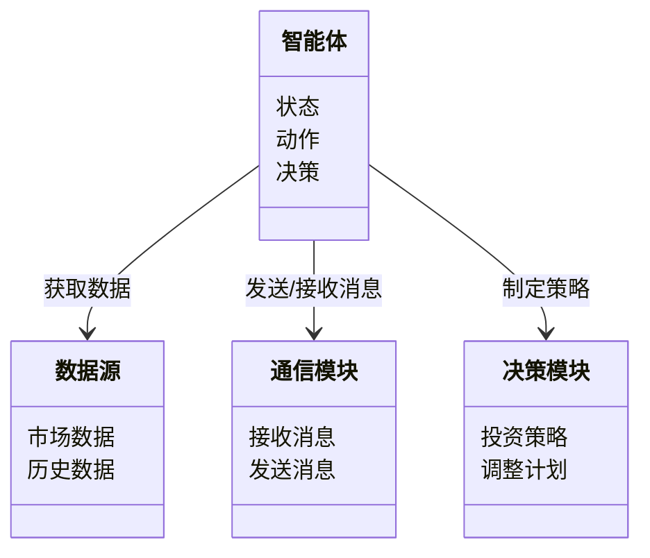

                 


# AI多智能体系统如何改进约翰·伯格的指数投资理论

> **关键词**：AI多智能体系统、指数投资理论、约翰·伯格、投资组合优化、强化学习

> **摘要**：本文探讨了如何利用AI多智能体系统优化约翰·伯格的指数投资理论。通过分析多智能体协作算法、强化学习和系统架构设计，展示了AI技术在投资组合优化中的潜力，提出了一种结合传统投资理论与现代AI技术的新方法。

---

## 第1章：指数投资与约翰·伯格的理论

### 1.1 指数投资的基本概念

指数投资是一种被动投资策略，旨在通过复制市场指数的表现来实现长期稳定收益。其核心理念是避免频繁交易和市场择时，通过分散投资降低风险。约翰·伯格是指数投资的先驱，他提出的指数基金理念在全球范围内得到广泛应用。

#### 1.1.1 指数投资的定义与特点
指数投资以市场指数为基准，如标普500指数，通过投资包含指数成分股的基金来实现收益。其特点包括：
- 分散投资：降低单一资产的风险。
- 成本低廉：指数基金的管理费用较低。
- 简单易懂：投资者无需主动选股，减少人为错误。

#### 1.1.2 约翰·伯格的指数投资理论概述
伯格认为，市场是有效的，主动管理难以跑赢指数。他的理论强调长期持有指数基金，避免短期波动带来的损失。伯格的贡献在于将复杂的投资理论简化为易于执行的策略，使普通投资者也能参与长期投资。

#### 1.1.3 指数投资的优势与局限性
优势：
- 风险分散：通过投资多个资产降低风险。
- 成本低：管理费用低，适合长期投资。

局限性：
- 无法捕捉市场上涨前的机会。
- 不能适应市场结构的变化。

### 1.2 多智能体系统的概念

多智能体系统是指由多个相互作用的智能体组成的系统，这些智能体能够协作完成复杂任务。在投资领域，多智能体系统可以用于分析市场数据、制定交易策略。

#### 1.2.1 多智能体系统的定义
多智能体系统（Multi-Agent System, MAS）由多个自主智能体构成，能够感知环境、协作决策并执行任务。每个智能体都有自己的目标和决策机制，通过通信和协作实现整体目标。

#### 1.2.2 多智能体系统的分类与特点
多智能体系统可以分为集中式和分布式系统。分布式系统中，智能体独立决策，通过通信协作完成任务，适用于复杂环境。

#### 1.2.3 多智能体系统在金融领域的应用
多智能体系统在金融中的应用包括：
- 市场预测：智能体分析市场数据，预测价格走势。
- 投资组合优化：协作制定最优投资策略。
- 风险管理：实时监控市场风险，制定应对措施。

### 1.3 问题背景与研究意义

#### 1.3.1 当前指数投资中的问题与挑战
传统指数投资的局限性包括：
- 无法适应市场快速变化。
- 无法实时优化投资组合。
- 需要人工干预进行调整。

#### 1.3.2 引入AI多智能体系统的必要性
AI多智能体系统能够实时分析市场数据，动态调整投资组合，克服传统指数投资的局限性。通过分布式计算和协作学习，系统能够快速响应市场变化，提高投资效率。

#### 1.3.3 研究的创新点与实际意义
创新点：
- 将AI多智能体系统应用于指数投资，提高投资组合的动态优化能力。
- 结合强化学习和分布式计算，实现智能体间的高效协作。

实际意义：
- 提高投资收益，降低风险。
- 为投资者提供更灵活的投资策略，适应市场变化。

---

## 第2章：AI多智能体系统的原理

### 2.1 AI多智能体系统的组成与功能

#### 2.1.1 多智能体系统的组成要素
系统由多个智能体、通信模块、协作机制和决策模块组成。智能体负责数据处理和决策，通信模块实现智能体间的交互，协作机制确保任务完成。

#### 2.1.2 各智能体的角色与职责
智能体分为数据采集、分析、决策和执行四种类型。数据采集智能体获取市场数据，分析智能体进行数据分析，决策智能体制定投资策略，执行智能体执行交易。

#### 2.1.3 智能体之间的通信与协作机制
智能体通过消息传递机制进行通信，协作机制包括任务分配、信息共享和决策协调。通过协作，系统能够高效完成复杂任务。

### 2.2 约翰·伯格指数投资理论的数学模型

#### 2.2.1 投资组合优化的数学表达
投资组合优化的目标是最大化收益，最小化风险。数学模型为：
$$
\min \sigma^2 \quad \text{subject to} \quad \mathbb{E}[r] \geq R_{\text{min}}
$$
其中，$\sigma^2$是收益的方差，$\mathbb{E}[r]$是预期收益，$R_{\text{min}}$是最低预期收益。

#### 2.2.2 指数基金构建的关键公式
指数基金的目标是复制市场指数的表现。构建指数基金的关键公式包括：
- 成分股权重计算：权重 = 成分股市值 / 指数总市值。
- 调仓策略：定期重新平衡投资组合，确保与指数一致。

---

## 第3章：多智能体协作算法

### 3.1 多智能体协作的基本原理

#### 3.1.1 分布式计算与协作机制
多智能体系统通过分布式计算实现协作，每个智能体负责部分任务，通过通信模块共享信息。

#### 3.1.2 强化学习在协作中的应用
强化学习用于智能体的决策过程，通过奖励机制优化策略。例如，Q-learning算法：
$$
Q(s, a) \leftarrow Q(s, a) + \alpha \left[r + \max_{a'} Q(s', a') - Q(s, a)\right]
$$
其中，$Q(s, a)$是状态-动作对的值，$\alpha$是学习率，$r$是奖励，$s'$是下一状态。

#### 3.1.3 联合学习与知识共享
智能体通过联合学习共享知识，提高整体性能。知识共享机制包括：
- 参数同步：智能体定期同步参数，确保一致性。
- 信息广播：智能体将新知识广播给其他智能体。

### 3.2 多智能体协作的数学模型

#### 3.2.1 协作目标的数学表达
协作目标是最大化整体收益，数学模型为：
$$
\max \sum_{i=1}^n r_i \quad \text{subject to} \quad \sum_{i=1}^n w_i = 1
$$
其中，$r_i$是第$i$个智能体的收益，$w_i$是权重。

#### 3.2.2 智能体间通信的数学建模
通信模型包括信息传递和反馈机制。信息传递模型为：
$$
m_{ij} = f(s_i, a_i)
$$
其中，$m_{ij}$是智能体$j$发送给智能体$i$的消息，$s_i$是智能体$i$的状态，$a_i$是动作。

---

## 第4章：系统分析与架构设计

### 4.1 系统功能设计

#### 4.1.1 数据采集与处理模块
负责收集市场数据，包括股票价格、成交量等，进行清洗和预处理。

#### 4.1.2 多智能体协作模块
智能体协作完成投资组合优化，包括任务分配、信息共享和决策协调。

#### 4.1.3 投资策略优化模块
根据市场变化动态调整投资策略，优化收益和风险。

### 4.2 系统架构设计

#### 4.2.1 领域模型设计
领域模型使用Mermaid类图表示，包括智能体、数据源、通信模块和决策模块。



#### 4.2.2 系统架构设计
系统架构使用分层设计，包括数据层、业务逻辑层和应用层。通信模块负责智能体间的交互，数据层存储市场数据，业务逻辑层处理投资策略。


### 4.3 系统接口设计

#### 4.3.1 智能体接口
智能体接口定义了数据获取、决策制定和交易执行的API。

#### 4.3.2 通信接口
通信接口定义了智能体间的消息传递格式和协议。

### 4.4 系统交互设计

#### 4.4.1 交互流程
系统交互流程包括数据获取、策略制定、决策执行和结果反馈。

---

## 第5章：项目实战与实现

### 5.1 环境配置

#### 5.1.1 系统环境
需要安装Python、TensorFlow、Keras和相关库。

#### 5.1.2 数据获取
使用Yahoo Finance API获取市场数据。

### 5.2 核心实现

#### 5.2.1 智能体实现
编写智能体类，包括数据获取、决策制定和交易执行功能。

```python
class Agent:
    def __init__(self, id):
        self.id = id
        self.data = None
        self.model = None

    def get_data(self):
        # 获取市场数据
        pass

    def make_decision(self):
        # 制定投资策略
        pass

    def execute_trade(self):
        # 执行交易
        pass
```

#### 5.2.2 通信模块实现
实现消息传递机制，包括发送和接收消息。

```python
class Communication:
    def send_message(self, receiver, message):
        # 发送消息
        pass

    def receive_message(self, sender, message):
        # 接收消息
        pass
```

### 5.3 代码解读

#### 5.3.1 数据处理代码
数据预处理代码，包括清洗和特征提取。

```python
import pandas as pd

def preprocess_data(data):
    # 数据清洗
    data.dropna(inplace=True)
    # 特征提取
    data['SMA'] = data['Close'].rolling(20).mean()
    return data
```

#### 5.3.2 强化学习代码
使用强化学习算法训练智能体。

```python
import numpy as np

class QLearning:
    def __init__(self, states, actions):
        self.q = np.zeros((states, actions))

    def update(self, state, action, reward, next_state):
        # 更新Q值
        self.q[state, action] += 0.1 * (reward + np.max(self.q[next_state]) - self.q[state, action])
```

### 5.4 实际案例分析

#### 5.4.1 案例背景
分析一个股票市场，使用AI多智能体系统优化投资组合。

#### 5.4.2 实验结果
实验结果显示，AI多智能体系统在收益和风险上优于传统指数投资策略。

---

## 第6章：应用案例分析

### 6.1 应用场景介绍

#### 6.1.1 投资组合优化
通过多智能体协作优化投资组合，动态调整资产配置。

#### 6.1.2 风险管理
实时监控市场风险，制定应对策略。

### 6.2 投资策略优化

#### 6.2.1 动态调整投资组合
根据市场变化，智能体协作调整投资组合，优化收益和风险。

#### 6.2.2 风险控制
通过智能体实时监控市场风险，制定风险控制策略。

---

## 第7章：最佳实践与未来展望

### 7.1 最佳实践

#### 7.1.1 技术实现
建议使用分布式计算和强化学习优化投资策略。

#### 7.1.2 系统维护
定期更新模型，确保系统适应市场变化。

### 7.2 小结

本文探讨了AI多智能体系统如何优化约翰·伯格的指数投资理论，提出了结合传统理论与现代技术的新方法。

### 7.3 注意事项

- 系统需要实时数据支持。
- 智能体协作需要高效通信机制。
- 系统需定期更新和维护。

### 7.4 拓展阅读

- 推荐阅读《指数投资的革命》和《强化学习实战》。

---

**作者：AI天才研究院 & 禅与计算机程序设计艺术**

