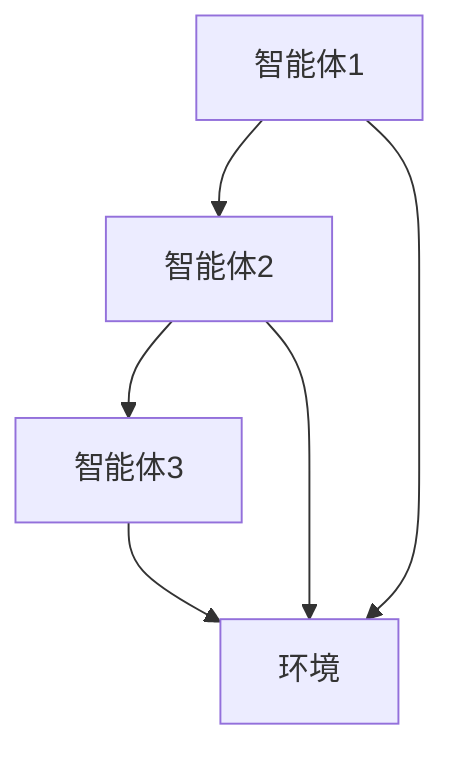
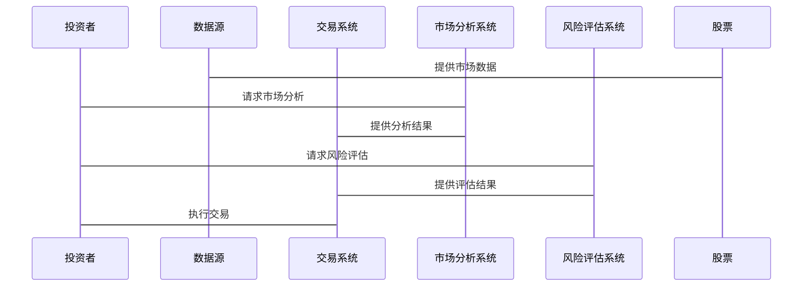
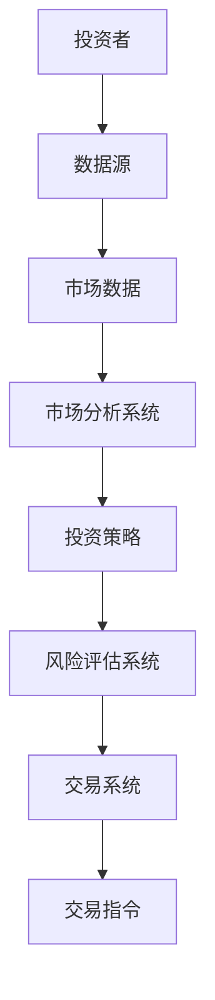
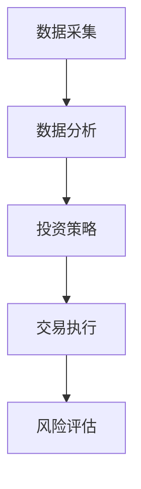

                 


# AI多智能体系统革新价值投资分析流程

## 关键词：AI多智能体系统，价值投资，投资分析流程，多智能体系统，价值投资分析，投资决策优化，AI系统应用

## 摘要：本文详细探讨了AI多智能体系统在价值投资分析中的革新应用。通过系统地分析多智能体系统的构成、算法原理及实际应用，本文揭示了如何利用AI技术优化投资决策流程，提升投资分析的准确性和效率。文章从基础概念到高级算法，结合实际案例，为读者提供了一套完整的AI驱动的价值投资分析解决方案。

---

# 第1章 AI多智能体系统的概述

## 1.1 AI多智能体系统的定义与特点

### 1.1.1 多智能体系统的定义
多智能体系统（Multi-Agent System, MAS）是由多个相互作用的智能体组成的系统，这些智能体能够通过协同工作完成复杂任务。每个智能体都有自己的目标、知识和决策机制。

### 1.1.2 AI多智能体系统的核心特点
- **分布式智能**：每个智能体独立决策，但通过协作完成整体目标。
- **自主性**：智能体能够自主感知环境并做出决策。
- **反应性**：智能体能够实时响应环境变化。
- **协作性**：智能体之间通过通信和协调完成任务。

### 1.1.3 多智能体系统与单智能体系统的区别
| 特性               | 单智能体系统         | 多智能体系统         |
|--------------------|--------------------|--------------------|
| 决策中心           | 单一决策中心       | 分布式决策中心     |
| 信息处理           | 中央处理           | 分散处理           |
| 协作性             | 无                 | 强                 |
| 应用场景           | 简单任务           | 复杂任务           |

## 1.2 价值投资分析的基本原理

### 1.2.1 价值投资的定义与核心理念
价值投资是一种投资策略，旨在通过分析企业的内在价值来决定其股票的合理价格。核心理念是寻找被市场低估的股票。

### 1.2.2 传统价值投资分析的流程与方法
1. **基本面分析**：分析企业的财务状况、行业地位、盈利能力等。
2. **市场分析**：研究市场趋势、行业周期等。
3. **风险评估**：评估投资的风险，包括市场风险、流动性风险等。

### 1.2.3 价值投资分析中的关键因素
- **财务数据**：收入、利润、负债等。
- **行业趋势**：行业的发展前景。
- **市场情绪**：投资者的心理和行为。

## 1.3 AI多智能体系统在价值投资中的应用前景

### 1.3.1 价值投资分析中的数据需求
- **结构化数据**：财务报表、市场数据等。
- **非结构化数据**：新闻、社交媒体、行业报告等。

### 1.3.2 多智能体系统在数据处理中的优势
- **分布式处理**：多个智能体可以同时处理不同类型的数据。
- **实时响应**：智能体能够实时分析市场动态。
- **协作决策**：多个智能体协同工作，提高决策的准确性。

### 1.3.3 AI多智能体系统对投资决策的潜在影响
- **提高效率**：通过自动化处理大量数据，节省时间和成本。
- **增强准确性**：多智能体协同分析，降低人为错误。
- **动态适应**：系统能够实时调整策略，应对市场变化。

## 1.4 本章小结
本章介绍了AI多智能体系统的定义、特点及其在价值投资中的应用前景。通过对比分析，展示了多智能体系统在投资决策中的优势。

---

# 第2章 多智能体系统的核心概念与联系

## 2.1 多智能体系统的组成与结构

### 2.1.1 多智能体系统的组成
- **智能体**：独立决策的个体。
- **环境**：智能体所处的外部环境。
- **通信机制**：智能体之间的通信方式。
- **协作机制**：智能体之间的协作方式。

### 2.1.2 多智能体系统的结构


## 2.2 多智能体系统的交互关系

### 2.2.1 实体关系图（ER图）
```mermaid
er
    actor 投资者
    actor 数据源
    actor 交易系统
    actor 市场分析系统
    actor 风险评估系统
    entity 股票
    entity 市场数据
    entity 投资策略
    entity 风险评估结果
    entity 交易指令
    -- 投资者 -> 股票: 持有关系
    -- 投资者 -> 投资策略: 选择关系
    -- 数据源 -> 市场数据: 提供关系
    -- 市场分析系统 -> 市场数据: 分析关系
    -- 交易系统 -> 交易指令: 执行关系
    -- 风险评估系统 -> 投资策略: 评估关系
```

### 2.2.2 交互关系图


## 2.3 本章小结
本章详细介绍了多智能体系统的组成、结构及其交互关系，为后续章节的分析奠定了基础。

---

# 第3章 AI多智能体系统的数学模型与算法原理

## 3.1 多智能体系统的数学模型

### 3.1.1 多智能体系统的基本数学模型
$$ V = \sum_{i=1}^{n} v_i $$
其中，\( V \) 表示系统的总价值，\( v_i \) 表示第 \( i \) 个智能体的贡献。

### 3.1.2 多智能体系统中的状态表示
$$ s_i = (s_{i,1}, s_{i,2}, \ldots, s_{i,m}) $$
其中，\( s_i \) 表示第 \( i \) 个智能体的状态，\( m \) 表示状态的维度。

### 3.1.3 多智能体系统中的动作空间
$$ a_i = \{a_{i,1}, a_{i,2}, \ldots, a_{i,k}\} $$
其中，\( a_i \) 表示第 \( i \) 个智能体的动作，\( k \) 表示动作的数量。

## 3.2 价值投资分析的数学模型

### 3.2.1 价值投资中的收益预测模型
$$ R = \alpha \cdot E + \beta \cdot F $$
其中，\( R \) 表示收益，\( E \) 表示企业的盈利能力，\( F \) 表示市场的繁荣程度，\( \alpha \) 和 \( \beta \) 是系数。

### 3.2.2 风险评估模型
$$ Risk = \gamma \cdot (V - V_{target})^2 $$
其中，\( V \) 表示实际价值，\( V_{target} \) 表示目标价值，\( \gamma \) 是风险系数。

## 3.3 多智能体系统的算法流程

### 3.3.1 算法流程图


## 3.4 本章小结
本章通过数学模型和算法流程图，详细阐述了AI多智能体系统在价值投资分析中的实现原理。

---

# 第4章 AI多智能体系统的系统架构设计

## 4.1 系统功能设计

### 4.1.1 功能模块
- **数据采集模块**：采集市场数据、企业财务数据等。
- **数据分析模块**：分析数据，生成投资策略。
- **交易执行模块**：根据分析结果执行交易。
- **风险评估模块**：评估投资风险。

### 4.1.2 功能流程图


## 4.2 系统架构设计

### 4.2.1 系统架构图


## 4.3 系统接口设计

### 4.3.1 接口定义
- **数据接口**：数据采集模块与数据源的接口。
- **分析接口**：数据分析模块与投资策略模块的接口。
- **交易接口**：交易执行模块与交易系统的接口。

## 4.4 本章小结
本章详细介绍了AI多智能体系统的系统架构设计，包括功能模块、架构图和接口设计。

---

# 第5章 AI多智能体系统的项目实战

## 5.1 项目环境安装

### 5.1.1 环境要求
- **操作系统**：Windows/Mac/Linux
- **编程语言**：Python 3.8+
- **框架**：TensorFlow, Keras
- **工具**：Jupyter Notebook, Git

### 5.1.2 安装步骤
```bash
pip install numpy
pip install pandas
pip install tensorflow
pip install keras
pip install matplotlib
```

## 5.2 核心代码实现

### 5.2.1 数据采集模块
```python
import requests
import pandas as pd

def get_market_data(ticker):
    url = f"https://api.example.com/{ticker}"
    response = requests.get(url)
    data = response.json()
    return pd.DataFrame(data)
```

### 5.2.2 数据分析模块
```python
def analyze_data(df):
    # 计算收益预测
    df['predicted_return'] = df['return'].apply(lambda x: x * 1.1 if x > 0 else x)
    return df
```

### 5.2.3 交易执行模块
```python
def execute_trade(signal):
    if signal == 'buy':
        print("执行买入操作")
    elif signal == 'sell':
        print("执行卖出操作")
```

## 5.3 案例分析

### 5.3.1 案例背景
假设我们有一个股票数据集，包含股票价格、成交量等信息。

### 5.3.2 数据分析与交易策略
```python
data = get_market_data('AAPL')
data = analyze_data(data)
execute_trade('buy')
```

## 5.4 本章小结
本章通过具体代码实现和案例分析，展示了AI多智能体系统在价值投资中的实际应用。

---

# 第6章 最佳实践与总结

## 6.1 最佳实践

### 6.1.1 数据质量
确保数据的准确性和完整性。

### 6.1.2 模型优化
定期优化模型，提高预测精度。

### 6.1.3 风险管理
建立有效的风险管理机制，降低投资风险。

## 6.2 本章小结
本章总结了AI多智能体系统在价值投资分析中的应用，并提出了未来的优化方向。

---

# 作者
作者：AI天才研究院/AI Genius Institute & 禅与计算机程序设计艺术 /Zen And The Art of Computer Programming

---

以上是《AI多智能体系统革新价值投资分析流程》的完整目录大纲和文章内容。

