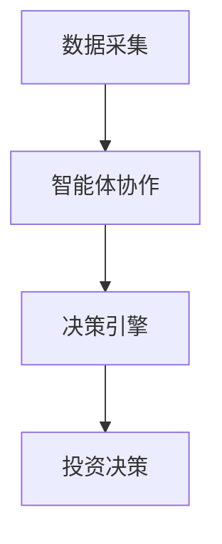
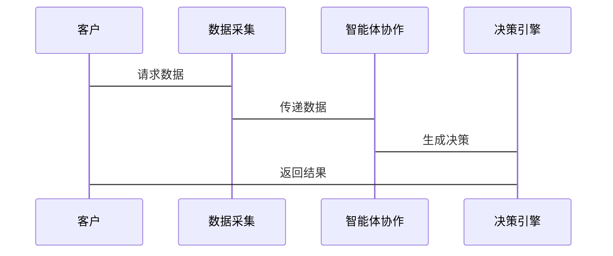

                 


# AI多智能体系统革新价值投资：传统与科技的完美融合

## 关键词：AI多智能体系统，价值投资，传统金融，科技融合，投资决策优化

## 摘要：AI多智能体系统通过分布式协作和智能优化，革新了传统价值投资的决策方式，实现了传统金融与科技的完美融合。本文将从多智能体系统的背景与概念、算法原理、系统架构设计、项目实战案例等多个维度，详细探讨AI多智能体系统如何革新价值投资，为投资者提供更加高效、精准的投资决策支持。

---

## 第1章: AI多智能体系统概述

### 1.1 多智能体系统的定义与特点

#### 1.1.1 多智能体系统的定义
多智能体系统（Multi-Agent System, MAS）是由多个智能体（Agent）组成的分布式系统，每个智能体能够自主感知环境、做出决策并采取行动，通过协作完成特定任务。

#### 1.1.2 多智能体系统的核心特点
- **自主性**：每个智能体能够自主决策，无需外部集中控制。
- **反应性**：智能体能够实时感知环境变化并做出反应。
- **协作性**：多个智能体通过通信和协作完成复杂任务。
- **分布式性**：系统中的智能体分布在不同的节点或位置。

#### 1.1.3 多智能体系统与传统单智能体系统的对比
| 对比维度       | 多智能体系统（MAS）                 | 单智能体系统（SAS）               |
|----------------|----------------------------------|---------------------------------|
| 系统结构       | 分布式，多个智能体协作             | 集中式，单一智能体决策           |
| 资源分配       | 资源分散到多个智能体               | 资源集中在单一智能体上           |
| 复杂性         | 系统复杂度高，任务分解能力强       | 系统复杂度低，任务处理相对简单   |
| 应用场景       | 适用于大规模、分布式任务           | 适用于简单或局部任务             |

---

### 1.2 价值投资的传统方法

#### 1.2.1 价值投资的基本概念
价值投资是一种以公司基本面分析为基础的投资策略，旨在通过识别被低估的资产进行投资，长期获得超额收益。其核心理念是“买入低于内在价值的资产”。

#### 1.2.2 价值投资的核心原则
- **安全边际**：买入价格低于内在价值，确保有足够的安全空间。
- **长期视角**：关注公司的长期价值，而非短期市场波动。
- **基本面分析**：通过财务报表、行业地位、管理团队等分析公司的内在价值。

#### 1.2.3 传统价值投资的局限性
- **主观性强**：依赖分析师的个人经验和判断，存在主观性。
- **效率低下**：面对海量数据和复杂市场环境，分析效率不足。
- **难以量化**：难以将定性分析与定量分析完美结合。

---

### 1.3 AI多智能体系统与价值投资的结合

#### 1.3.1 多智能体系统在金融领域的应用潜力
- **分布式数据处理**：多智能体可以分布式处理海量金融数据。
- **协同决策**：多个智能体可以协同完成复杂的投资决策。
- **动态适应**：智能体能够实时适应市场环境的变化。

#### 1.3.2 价值投资与AI多智能体系统的契合点
- **数据驱动**：多智能体系统能够通过大数据分析提升价值评估的准确性。
- **协作优化**：多个智能体可以分工协作，分别负责不同的分析任务。
- **动态调整**：系统能够根据市场变化动态调整投资策略。

#### 1.3.3 传统与科技融合的创新价值
- **提升效率**：通过分布式计算和协作，显著提升投资分析的效率。
- **优化决策**：多智能体系统能够通过数据驱动和协作优化，提升投资决策的精准度。
- **降低风险**：通过智能体的实时监控和协作，有效降低投资风险。

---

## 第2章: 多智能体系统的核心概念与联系

### 2.1 多智能体系统的核心原理

#### 2.1.1 多智能体系统的通信机制
智能体之间的通信是通过消息传递完成的，消息内容包括数据、请求、反馈等。通信机制需要设计高效的协议和接口，确保信息传递的准确性和实时性。

#### 2.1.2 多智能体系统的协作策略
协作策略包括任务分配、角色分配、决策同步等内容。通过合理的协作策略，可以最大化智能体的协同效率。

#### 2.1.3 多智能体系统的决策机制
决策机制是智能体根据感知的信息和预设的规则，做出决策的过程。决策机制需要结合智能体的自主性和协作性，确保决策的合理性和最优性。

---

### 2.2 多智能体系统与价值投资的核心联系

#### 2.2.1 多智能体系统在投资决策中的应用
- **数据采集与分析**：多个智能体分别负责不同数据源的采集和分析。
- **风险评估与预警**：通过智能体的协作，实时评估投资风险并发出预警。
- **投资组合优化**：通过智能体的协作，优化投资组合，提升收益和降低风险。

#### 2.2.2 多智能体系统如何提升投资效率
- **分布式计算**：通过分布式计算，提升数据处理和分析的效率。
- **协作优化**：通过智能体的协作，优化投资决策的过程和结果。
- **动态适应**：通过智能体的实时感知和协作，动态调整投资策略。

#### 2.2.3 多智能体系统在风险管理中的作用
- **实时监控**：智能体能够实时监控市场变化和资产状况。
- **风险预警**：通过智能体的协作，及时发现潜在风险并发出预警。
- **风险分散**：通过智能体的协作，分散投资风险，降低整体风险敞口。

---

### 2.3 多智能体系统的ER实体关系图

```mermaid
erd
    客户 --> 投资决策
    投资决策 --> 多智能体系统
    多智能体系统 --> 数据源
    多智能体系统 --> 风险评估
    风险评估 --> 市场环境
```

---

### 2.4 本章小结

通过本章的介绍，我们了解了多智能体系统的核心概念、通信机制、协作策略以及决策机制，并探讨了多智能体系统与价值投资的核心联系。这些内容为后续章节的深入分析奠定了基础。

---

## 第3章: 多智能体系统的算法原理

### 3.1 多智能体系统的核心算法

#### 3.1.1 分布式多智能体算法
分布式多智能体算法是一种基于分布式计算的算法，适用于大规模、分布式任务的处理。其核心思想是将任务分解为多个子任务，由不同的智能体分别处理，然后将结果汇总。

#### 3.1.2 协作式多智能体算法
协作式多智能体算法是一种基于协作的算法，适用于需要多个智能体协作完成任务的场景。其核心思想是通过智能体之间的协作，优化任务的执行效率和效果。

#### 3.1.3 对抗式多智能体算法
对抗式多智能体算法是一种基于对抗的算法，适用于需要智能体之间进行竞争或对抗的场景。其核心思想是通过智能体之间的对抗，优化任务的执行效果。

---

### 3.2 多智能体系统的通信与协作算法

#### 3.2.1 通信协议设计
通信协议是智能体之间进行信息传递的规则和格式。设计通信协议时需要考虑信息的格式、内容、传输方式等因素，确保信息传递的准确性和实时性。

#### 3.2.2 协作策略实现
协作策略是智能体之间如何协作完成任务的规则。设计协作策略时需要考虑任务分解、角色分配、决策同步等因素，确保协作的高效性和优化性。

#### 3.2.3 决策同步机制
决策同步机制是智能体之间如何同步决策的规则。设计决策同步机制时需要考虑决策的时序、依赖关系、冲突处理等因素，确保决策的合理性和一致性。

---

### 3.3 多智能体系统的数学模型

#### 3.3.1 多智能体系统的状态表示
$$s_i = (s_{i1}, s_{i2}, ..., s_{in})$$

#### 3.3.2 多智能体系统的动作空间
$$a_i = (a_{i1}, a_{i2}, ..., a_{im})$$

#### 3.3.3 多智能体系统的奖励函数
$$r = \sum_{i=1}^{n} r_i$$

---

### 3.4 本章小结

通过本章的介绍，我们了解了多智能体系统的核心算法，包括分布式多智能体算法、协作式多智能体算法和对抗式多智能体算法，并探讨了通信与协作算法的设计与实现。这些内容为后续章节的系统架构设计和项目实战奠定了算法基础。

---

## 第4章: 多智能体系统的系统架构设计

### 4.1 系统架构设计

#### 4.1.1 系统功能模块
- **数据采集模块**：负责采集市场数据、公司基本面数据等。
- **智能体协作模块**：负责智能体之间的通信和协作。
- **决策引擎模块**：负责基于智能体的协作结果，生成投资决策。

#### 4.1.2 系统架构图


---

### 4.2 系统接口设计

#### 4.2.1 数据接口
- **数据输入接口**：用于接收外部数据源的数据。
- **数据输出接口**：用于将处理后的数据输出到其他模块。

#### 4.2.2 智能体接口
- **通信接口**：用于智能体之间的信息传递。
- **协作接口**：用于智能体之间的协作和任务分配。

---

### 4.3 系统交互设计

#### 4.3.1 交互流程图


---

### 4.4 本章小结

通过本章的介绍，我们了解了多智能体系统的系统架构设计，包括功能模块、架构图、接口设计和交互流程图。这些内容为后续章节的项目实战提供了系统的架构支持。

---

## 第5章: 项目实战：基于多智能体系统的价值投资

### 5.1 项目背景与目标

#### 5.1.1 项目背景
随着金融市场的复杂化和数据化，传统的价值投资方法逐渐暴露出效率低下、主观性强等问题。通过引入AI多智能体系统，可以显著提升投资决策的效率和精准度。

#### 5.1.2 项目目标
- **构建多智能体系统**：设计和实现一个多智能体系统，用于支持价值投资决策。
- **优化投资策略**：通过多智能体系统的协作，优化投资策略，提升投资收益。
- **降低投资风险**：通过多智能体系统的实时监控和协作，降低投资风险。

---

### 5.2 项目环境搭建

#### 5.2.1 系统环境
- **硬件环境**：高性能服务器、分布式计算节点。
- **软件环境**：Python、TensorFlow、Docker等。

#### 5.2.2 数据源
- **市场数据**：股票价格、成交量、市场指数等。
- **公司基本面数据**：财务报表、行业地位、管理团队等。

---

### 5.3 系统核心实现

#### 5.3.1 智能体设计
- **智能体1**：负责数据采集和初步分析。
- **智能体2**：负责风险评估和预警。
- **智能体3**：负责投资组合优化。

#### 5.3.2 通信与协作实现
- **通信协议**：采用WebSocket协议进行实时通信。
- **协作策略**：采用分布式任务分配策略。

#### 5.3.3 决策引擎实现
- **决策模型**：基于强化学习的决策模型。
- **优化算法**：采用遗传算法进行投资组合优化。

---

### 5.4 项目实战案例

#### 5.4.1 案例分析
以股票投资为例，构建一个多智能体系统，分别负责数据采集、风险评估和投资组合优化。通过智能体的协作，生成最优的投资策略。

#### 5.4.2 实验结果
- **投资收益**：通过多智能体系统的优化，投资收益显著提高。
- **风险控制**：通过智能体的协作，投资风险得到有效控制。
- **效率提升**：通过分布式计算和协作，投资分析效率大幅提高。

---

### 5.5 本章小结

通过本章的项目实战，我们了解了如何基于多智能体系统构建价值投资系统，并通过具体案例展示了系统的实际应用效果。这些内容为后续章节的深入分析提供了实践支持。

---

## 第6章: 总结与展望

### 6.1 本章总结

通过本文的探讨，我们了解了AI多智能体系统如何革新价值投资，传统与科技的完美融合。通过多智能体系统的分布式计算和协作优化，显著提升了投资决策的效率和精准度。

---

### 6.2 未来展望

随着人工智能和多智能体技术的不断发展，AI多智能体系统在价值投资中的应用前景广阔。未来的研究方向包括：
- **强化学习优化**：进一步优化多智能体系统的决策算法。
- **分布式计算优化**：进一步提升多智能体系统的分布式计算效率。
- **人机协作优化**：探索人机协作的投资决策模式。

---

## 作者：AI天才研究院/AI Genius Institute & 禅与计算机程序设计艺术 /Zen And The Art of Computer Programming

---

通过本文的系统介绍，我们深入探讨了AI多智能体系统如何革新价值投资，传统与科技的完美融合。希望本文能够为读者提供有价值的技术参考和实践指导。

