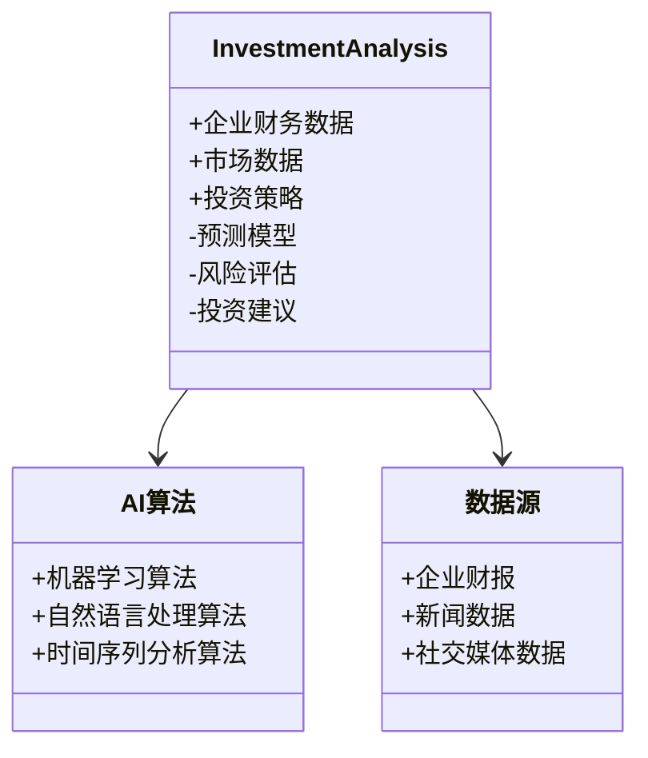
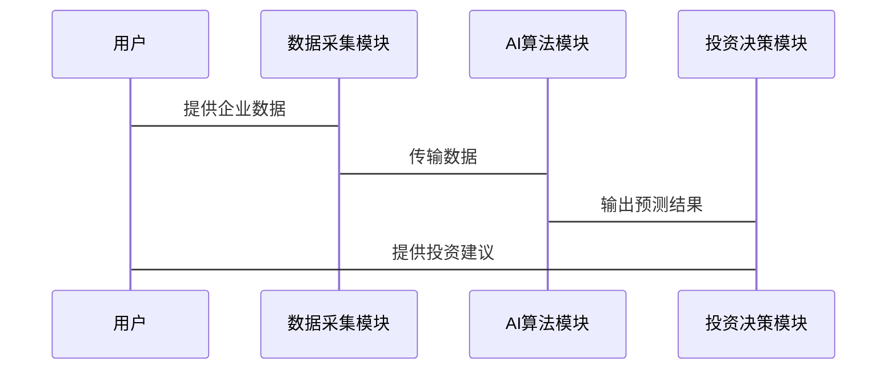

                 


# AI如何优化塞思·卡拉曼的特殊情况投资

## 关键词：
- AI, 特殊情况投资, 塞思·卡拉曼, 机器学习, 投资优化, 自然语言处理

## 摘要：
本文探讨如何利用人工智能技术优化塞思·卡拉曼的特殊情况投资策略。通过分析AI在数据处理、预测模型和决策优化中的应用，结合实际案例和系统架构设计，揭示AI如何提升投资分析的效率和准确性，降低投资风险，为投资者提供更科学的投资决策支持。

---

# 第1章：特殊情况投资与AI的结合

## 1.1 特殊情况投资的定义与特点

### 1.1.1 特殊情况投资的定义
特殊情况投资是指对处于困境中的企业进行投资，例如破产企业、濒临重组的企业或财务状况极度不稳定的企业。这种投资策略的核心在于通过识别企业的潜在价值，利用市场低估的机会获得超额收益。

### 1.1.2 特殊情况投资的核心要素
- **企业基本面分析**：重点关注企业的财务状况、债务结构和重组计划。
- **市场情绪分析**：识别市场低估的机会，利用短期市场波动进行投资。
- **风险控制**：由于投资对象处于困境中，风险较高，需要严格的风险评估和控制。

### 1.1.3 塞思·卡拉曼投资方法的核心理念
塞思·卡拉曼是特殊情况投资领域的权威，他提出的核心理念包括：
1. **安全边际**：买入价格低于企业价值，确保投资的安全性。
2. **逆向投资**：在市场恐慌时寻找被低估的机会。
3. **基本面分析**：通过深入分析企业财务数据和重组计划，识别潜在价值。

---

## 1.2 AI技术的定义与特点

### 1.2.1 AI技术的定义
人工智能（Artificial Intelligence, AI）是指模拟人类智能的计算机系统，能够通过数据学习、推理和决策，实现特定任务的自动化。

### 1.2.2 AI技术的核心特点
- **数据驱动**：AI依赖大量数据进行训练和推理。
- **自我学习**：通过机器学习算法，AI能够从数据中自动提取特征和规律。
- **高效计算**：利用并行计算和分布式系统，AI能够快速处理海量数据。

### 1.2.3 AI技术与传统投资分析的区别
| 特性 | 传统投资分析 | AI驱动投资分析 |
|------|---------------|----------------|
| 数据来源 | 依赖历史数据 | 利用结构化和非结构化数据 |
| 分析效率 | 人工分析，效率低 | 高效自动化分析 |
| 决策依据 | 主观判断为主 | 数据驱动的客观分析 |
| 风险控制 | 依赖人工经验 | 系统化风险控制 |

---

## 1.3 AI在特殊情况投资中的应用前景

### 1.3.1 AI在特殊情况投资中的潜在应用领域
- **企业基本面分析**：利用AI分析企业的财务数据和重组计划。
- **市场情绪分析**：通过自然语言处理技术分析新闻和社交媒体情绪。
- **风险评估**：利用AI预测企业的违约风险和市场波动。

### 1.3.2 企业采用AI优化投资的优势
- **提高分析效率**：AI能够快速处理大量数据，显著提高分析效率。
- **降低投资风险**：通过AI的预测模型，提前识别潜在风险。
- **发现潜在机会**：AI能够挖掘隐藏在数据中的投资机会。

### 1.3.3 AI在特殊情况投资中的挑战与机遇
- **挑战**：数据质量、模型过拟合、市场波动性。
- **机遇**：通过AI技术实现投资决策的自动化和精准化。

---

# 第2章：AI与特殊情况投资的核心概念

## 2.1 AI技术在特殊情况投资中的核心概念

### 2.1.1 机器学习在投资分析中的应用
- **监督学习**：用于预测企业违约概率和股价走势。
- **非监督学习**：用于发现数据中的隐藏模式和集群。

### 2.1.2 自然语言处理在投资决策中的作用
- **文本挖掘**：分析新闻、财报和社交媒体数据，提取情感和关键词。
- **实体识别**：识别企业和人物在新闻中的提及。

### 2.1.3 时间序列分析在投资预测中的应用
- **ARIMA模型**：用于预测企业的财务指标和市场走势。
- **LSTM网络**：用于捕捉时间序列中的长期依赖关系。

---

## 2.2 AI技术与特殊情况投资的联系

### 2.2.1 AI技术如何提高投资分析的效率
- **自动化数据处理**：AI能够快速整理和分析大量财务数据。
- **实时监控**：通过AI实时跟踪市场动态，及时发现投资机会。

### 2.2.2 AI技术如何优化投资决策的准确性
- **数据驱动的决策**：AI通过大量数据训练，提供更准确的投资建议。
- **多维度分析**：结合财务数据、市场情绪和行业趋势，提供全面的分析。

### 2.2.3 AI技术如何降低投资风险
- **风险预警系统**：通过AI预测企业的违约风险和市场波动。
- **多样化投资策略**：AI能够根据市场变化动态调整投资组合。

---

# 第3章：AI算法在特殊情况投资中的应用

## 3.1 机器学习算法在投资分析中的应用

### 3.1.1 监督学习在投资预测中的应用
- **线性回归**：用于预测企业的股价走势。
- **支持向量机（SVM）**：用于分类企业财务状况。

### 3.1.2 非监督学习在投资分析中的应用
- **聚类分析**：用于发现市场中的隐藏趋势和模式。

### 3.1.3 强化学习在投资策略优化中的应用
- **Q-Learning**：用于动态调整投资组合。

---

## 3.2 自然语言处理算法在投资决策中的应用

### 3.2.1 文本挖掘在投资分析中的应用
- **关键词提取**：识别企业财报中的关键词，发现潜在机会。
- **情感分析**：分析市场情绪，预测股价走势。

### 3.2.2 命名实体识别在投资数据中的应用
- **识别企业名称**：从新闻中提取企业名称，跟踪企业动态。

### 3.2.3 情感分析在投资决策中的应用
- **社交媒体情绪分析**：通过分析社交媒体情绪，预测市场走势。

---

# 第4章：数学模型在AI优化投资中的应用

## 4.1 投资分析中的数学模型

### 4.1.1 CAPM模型的数学公式
$$ E(r_i) = r_f + β_i (E(r_m) - r_f) $$
其中，\( E(r_i) \) 是资产的预期回报率，\( r_f \) 是无风险利率，\( β_i \) 是资产的贝塔系数，\( E(r_m) \) 是市场预期回报率。

### 4.1.2 马科夫链模型在投资预测中的应用
- **状态转移概率矩阵**：用于预测企业的财务状态变化。

### 4.1.3 时间序列分析的数学模型
- **ARIMA模型**：用于预测企业的财务指标和市场走势。

---

## 4.2 AI算法的数学公式

### 4.2.1 线性回归的数学公式
$$ y = \beta_0 + \beta_1 x + \epsilon $$
其中，\( y \) 是目标变量，\( x \) 是自变量，\( \epsilon \) 是误差项。

### 4.2.2 支持向量机的数学公式
$$ \text{目标函数}：\min_{\beta, \beta_0, \epsilon} \frac{1}{2} \|\beta\|^2 + C \sum_{i=1}^n \epsilon_i $$
$$ \text{约束条件}：y_i (\beta_0 + \beta^T x_i) \geq 1 - \epsilon_i $$

---

# 第5章：系统分析与架构设计方案

## 5.1 问题场景介绍
- **目标**：优化塞思·卡拉曼的特殊情况投资策略。
- **核心问题**：如何利用AI技术提高投资分析的效率和准确性。

## 5.2 系统功能设计

### 5.2.1 领域模型（Mermaid 类图）


---

## 5.3 系统架构设计

### 5.3.1 系统架构（Mermaid 架构图）


---

## 5.4 系统接口设计

### 5.4.1 API 接口
- **输入接口**：企业财务数据、市场数据。
- **输出接口**：投资建议、风险评估。

### 5.4.2 数据格式
- **JSON格式**：用于数据传输和存储。

---

## 5.5 系统交互（Mermaid 序列图）



---

# 第6章：项目实战

## 6.1 环境安装

### 6.1.1 安装Python
```bash
# 安装Python
sudo apt-get install python3
```

### 6.1.2 安装机器学习库
```bash
# 安装TensorFlow和Scikit-learn
pip install tensorflow scikit-learn
```

---

## 6.2 系统核心实现

### 6.2.1 代码实现
```python
# 线性回归模型实现
import numpy as np
from sklearn.linear_model import LinearRegression

# 训练数据
X = np.array([1, 2, 3, 4, 5])
y = np.array([2, 4, 5, 4, 6])

# 创建模型
model = LinearRegression()
model.fit(X.reshape(-1, 1), y)

# 预测
print(model.predict(np.array([6]).reshape(-1, 1)))
```

---

## 6.3 实际案例分析

### 6.3.1 案例分析
- **企业A**：财务数据表明企业处于困境，但市场低估。
- **AI预测**：模型预测企业股价将上涨，建议买入。

---

## 6.4 项目小结

### 6.4.1 核心代码总结
```python
# 线性回归模型实现
import numpy as np
from sklearn.linear_model import LinearRegression

# 训练数据
X = np.array([1, 2, 3, 4, 5])
y = np.array([2, 4, 5, 4, 6])

# 创建模型
model = LinearRegression()
model.fit(X.reshape(-1, 1), y)

# 预测
print(model.predict(np.array([6]).reshape(-1, 1)))
```

### 6.4.2 系统架构总结
- **数据采集模块**：负责收集企业财务数据和市场数据。
- **AI算法模块**：利用机器学习算法进行预测和分析。
- **投资决策模块**：根据AI算法的输出，提供投资建议。

---

# 第7章：总结与展望

## 7.1 总结
- AI技术能够显著提高特殊情况投资的效率和准确性。
- 通过机器学习、自然语言处理和时间序列分析，AI能够帮助投资者发现潜在机会，降低投资风险。

## 7.2 小结
- **优势**：提高投资决策的科学性和准确性。
- **注意事项**：数据质量、模型过拟合、市场波动性。
- **未来趋势**：AI技术在特殊情况投资中的应用将更加广泛和深入。

---

## 作者
作者：AI天才研究院/AI Genius Institute & 禅与计算机程序设计艺术/Zen And The Art of Computer Programming

