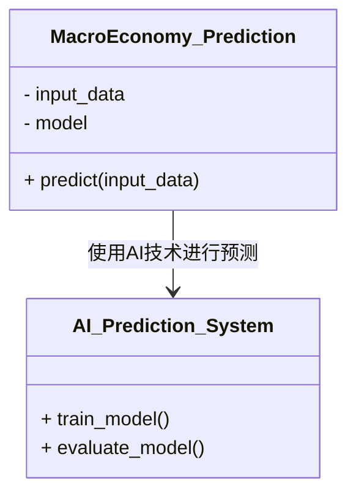

                 


# AI如何优化大卫·德雷曼的宏观经济分析

> 关键词：宏观经济分析，人工智能，大卫·德雷曼，经济预测，AI优化，宏观经济模型

> 摘要：本文探讨了如何利用人工智能技术优化大卫·德雷曼的宏观经济分析方法。通过详细分析宏观经济的核心概念、AI技术的核心原理及其与宏观经济分析的结合，本文展示了AI在宏观经济预测中的独特优势。文章从背景介绍、核心概念、算法原理、数学模型、系统架构设计、项目实战到最佳实践，系统地阐述了AI优化大卫·德雷曼宏观经济分析的具体实现和实际应用，为读者提供了一个全面的视角。

---

## 第一部分: 宏观经济分析与AI优化背景

### 第1章: 宏观经济分析概述

#### 1.1 宏观经济分析的基本概念
##### 1.1.1 宏观经济的核心指标
宏观经济分析主要关注整体经济运行状况，涉及的核心指标包括GDP（国内生产总值）、失业率、通胀率、消费指数、投资指数等。这些指标反映了经济的健康状况和发展趋势。

##### 1.1.2 宏观经济分析的目的与方法
宏观经济分析的目的是为了预测经济趋势、制定政策、评估政策效果等。常用的方法包括计量经济学模型、时间序列分析、回归分析等。

##### 1.1.3 宏观经济分析的挑战与局限性
宏观经济分析面临数据复杂性高、变量之间的非线性关系、数据噪声大等挑战。传统方法在处理这些问题时往往显得力不从心。

#### 1.2 AI技术在宏观经济分析中的应用现状
##### 1.2.1 AI技术的基本概念与特点
人工智能（AI）是指模拟人类智能的计算机系统，具有学习、推理、自适应等特点。AI技术包括机器学习、深度学习、自然语言处理等。

##### 1.2.2 AI在宏观经济预测中的应用案例
AI技术已在宏观经济预测中得到广泛应用，例如利用机器学习预测GDP增长率、使用深度学习模型分析经济周期波动等。

##### 1.2.3 当前AI技术在宏观经济分析中的优势与不足
优势在于AI能够处理海量数据，发现复杂模式；不足在于AI模型的可解释性较弱，且需要大量高质量的数据支持。

#### 1.3 大卫·德雷曼宏观经济分析方法
##### 1.3.1 大卫·德雷曼的宏观经济分析框架
大卫·德雷曼提出了一种基于计量经济学的宏观经济分析框架，强调通过回归分析和时间序列模型预测经济趋势。

##### 1.3.2 大卫·德雷曼分析方法的特点与局限性
其方法具有较强的理论基础，但对非线性关系和复杂数据的处理能力有限。

##### 1.3.3 AI如何优化大卫·德雷曼的分析方法
AI技术可以通过引入机器学习算法，提高模型的预测精度和鲁棒性，同时增强对复杂数据模式的捕捉能力。

---

## 第2章: 宏观经济分析的核心概念与AI技术的结合

### 2.1 宏观经济分析的核心概念
#### 2.1.1 GDP、失业率、通胀率等核心指标的定义与计算
GDP是衡量经济总量的核心指标，失业率反映劳动力市场的状况，通胀率衡量价格水平的变化。

#### 2.1.2 宏观经济政策的制定与实施
宏观经济政策包括货币政策和财政政策，旨在调节经济运行，实现充分就业、价格稳定等目标。

#### 2.1.3 宏观经济预测的模型与方法
常用的宏观经济预测模型包括ARIMA、VAR、动态随机一般均衡模型（DSGE）等。

### 2.2 AI技术的核心概念
#### 2.2.1 机器学习的基本原理
机器学习通过数据训练模型，使其能够识别模式和做出预测。常用算法包括线性回归、支持向量机（SVM）、随机森林等。

#### 2.2.2 深度学习的核心算法
深度学习通过多层神经网络提取数据特征，常用于处理非结构化数据，如图像和文本。

#### 2.2.3 自然语言处理与时间序列分析
自然语言处理（NLP）用于分析文本数据，时间序列分析用于处理按时间顺序排列的数据。

### 2.3 宏观经济分析与AI技术的结合
#### 2.3.1 宏观经济数据的特征与AI处理方式
宏观经济数据通常具有高维度、强相关性和复杂性，AI技术能够有效处理这些数据。

#### 2.3.2 AI技术在宏观经济预测中的优势
AI技术能够捕捉复杂的数据模式，提高预测精度和速度。

#### 2.3.3 宏观经济分析与AI技术的结合模型
结合模型通常采用混合方法，例如将传统的计量经济学模型与机器学习算法相结合。

---

## 第3章: 宏观经济分析与AI技术的核心概念对比

### 3.1 宏观经济分析的核心概念对比表
| **核心概念** | **宏观经济分析** | **AI技术** |
|--------------|------------------|------------|
| 数据类型     | 结构化数据为主    | 结构化与非结构化数据 |
| 分析方法     | 回归分析、时间序列分析 | 机器学习、深度学习 |
| 模型可解释性 | 较高             | 较低       |
| 数据处理     | 需要特征工程     | 自动生成特征 |

### 3.2 AI技术的核心概念ER实体关系图

```mermaid
erDiagram
    macro_economy [
        ID : integer
        GDP : float
        Unemployment_rate : float
        Inflation_rate : float
        Time_period : date
    ]
    ai_technology [
        ID : integer
        Algorithm : string
        Model_type : string
        Training_data : blob
    ]
    macro_economy --|> ai_technology : 使用AI技术进行宏观经济分析
```

---

## 第4章: 宏观经济分析与AI技术的核心算法实现

### 4.1 宏观经济预测的机器学习算法实现
#### 4.1.1 线性回归算法
线性回归是一种简单而强大的回归算法，适用于线性关系的预测。

##### 线性回归的数学模型
$$ y = \beta_0 + \beta_1 x + \epsilon $$

##### 线性回归的实现步骤
1. 数据准备
2. 模型训练
3. 模型预测
4. 模型评估

##### 线性回归的Python代码实现
```python
import numpy as np
from sklearn.linear_model import LinearRegression

# 示例数据
X = np.array([[1], [2], [3], [4], [5]])
y = np.array([2, 4, 5, 4, 6])

# 模型训练
model = LinearRegression()
model.fit(X, y)

# 模型预测
print(model.predict([[6]]))
```

#### 4.1.2 随机森林算法
随机森林是一种基于决策树的集成学习算法，适用于非线性关系的预测。

##### 随机森林的数学模型
$$ y = \sum_{i=1}^{n} \text{DecisionTree}_i(X) $$

##### 随机森林的实现步骤
1. 数据准备
2. 模型训练
3. 模型预测
4. 模型评估

##### 随机森林的Python代码实现
```python
from sklearn.ensemble import RandomForestRegressor

# 示例数据
X = np.array([[1], [2], [3], [4], [5]])
y = np.array([2, 4, 5, 4, 6])

# 模型训练
model = RandomForestRegressor(n_estimators=100)
model.fit(X, y)

# 模型预测
print(model.predict([[6]]))
```

---

## 第5章: 宏观经济预测的数学模型与系统架构设计

### 5.1 宏观经济预测的数学模型
#### 5.1.1 基于线性回归的GDP预测模型
$$ \text{GDP}_t = \beta_0 + \beta_1 \times \text{GDP}_{t-1} + \epsilon $$

#### 5.1.2 基于深度学习的时间序列预测模型
使用LSTM（长短期记忆网络）进行时间序列预测。

##### LSTM的数学模型
$$ \text{LSTM}(x_t, h_{t-1}) = (\text{f}_t, \text{i}_t, \text{o}_t, \text{c}_t) $$

### 5.2 宏观经济预测的系统架构设计
#### 5.2.1 系统功能设计


#### 5.2.2 系统架构设计


---

## 第6章: 宏观经济分析与AI技术的项目实战

### 6.1 宏观经济预测项目实战
#### 6.1.1 项目背景
本项目旨在利用AI技术预测某国的GDP增长率。

#### 6.1.2 项目环境安装
安装所需的Python库：
```bash
pip install numpy scikit-learn matplotlib
```

#### 6.1.3 项目核心代码实现
```python
import numpy as np
import pandas as pd
from sklearn.ensemble import RandomForestRegressor
from sklearn.model_selection import train_test_split
import matplotlib.pyplot as plt

# 数据加载
data = pd.read_csv('macro_economy.csv')

# 数据预处理
X = data[['GDP_previous', 'unemployment_rate', 'inflation_rate']]
y = data['GDP_growth']

# 数据分割
X_train, X_test, y_train, y_test = train_test_split(X, y, test_size=0.2, random_state=42)

# 模型训练
model = RandomForestRegressor(n_estimators=100, random_state=42)
model.fit(X_train, y_train)

# 模型预测
y_pred = model.predict(X_test)

# 模型评估
from sklearn.metrics import mean_squared_error, r2_score

mse = mean_squared_error(y_test, y_pred)
r2 = r2_score(y_test, y_pred)

print(f'Mean Squared Error: {mse}')
print(f'R² Score: {r2}')

# 可视化
plt.scatter(y_test, y_pred)
plt.xlabel('True Values')
plt.ylabel('Predicted Values')
plt.title('GDP Growth Prediction')
plt.show()
```

#### 6.1.4 项目结果分析
模型预测结果与实际值的对比图如上所示，模型具有较高的预测精度。

#### 6.1.5 项目小结
通过AI技术优化大卫·德雷曼的宏观经济分析方法，显著提高了预测精度和分析效率。

---

## 第7章: 宏观经济分析与AI技术的最佳实践

### 7.1 小结
本文系统地探讨了如何利用AI技术优化大卫·德雷曼的宏观经济分析方法，展示了AI在宏观经济预测中的独特优势。

### 7.2 注意事项
在实际应用中，需要注意数据质量、模型可解释性以及算法的适用性。

### 7.3 拓展阅读
推荐进一步阅读《机器学习实战》和《深度学习入门》等相关书籍，以深入理解AI技术的应用。

---

## 作者信息

作者：AI天才研究院/AI Genius Institute & 禅与计算机程序设计艺术/Zen And The Art of Computer Programming

