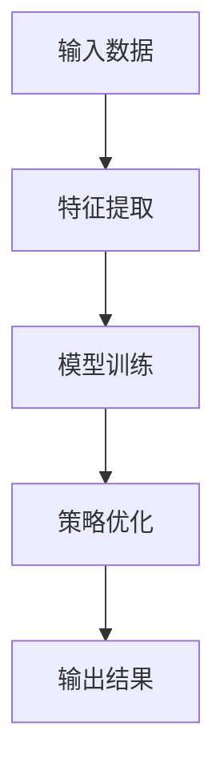
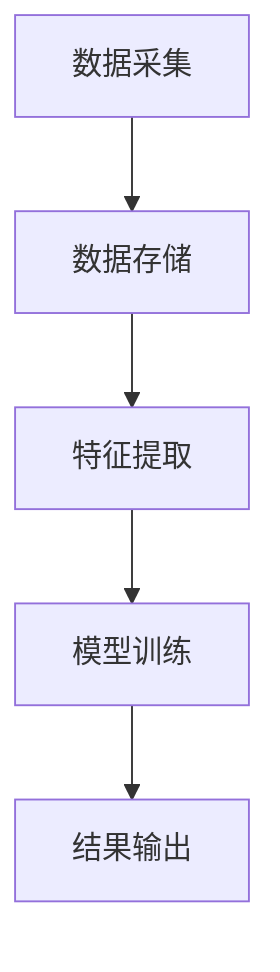
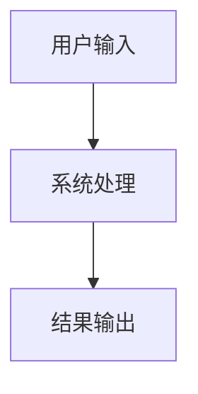

                 


# AI如何优化格林布拉特的魔法公式策略

## 关键词
- 格林布拉特魔法公式
- AI优化
- 机器学习
- 投资策略
- 算法优化

## 摘要
本文探讨了如何利用人工智能技术优化格林布拉特的魔法公式策略。通过分析魔法公式的数学模型，结合机器学习算法，提出了一种新的优化方法，从而提升了投资策略的准确性和效率。文章详细介绍了优化过程中的关键步骤，包括数据预处理、特征提取、模型训练和结果分析，为读者提供了一个清晰的实现路径。

---

# 第1章: 格林布拉特魔法公式与AI优化概述

## 1.1 格林布拉特魔法公式的背景与意义
### 1.1.1 格林布拉特魔法公式的起源与核心思想
格林布拉特的魔法公式是一种用于评估股票内在价值的指标，由彼得·格林布拉特提出。该公式结合了基本面分析和量化方法，旨在发现被市场低估的优质股票。其核心思想是通过计算市盈率、市净率、股息率等指标的加权组合，评估企业的投资价值。

### 1.1.2 AI技术在投资策略优化中的潜力
人工智能（AI）技术在金融领域的应用日益广泛，尤其是在投资策略优化方面。AI可以通过大数据分析、模式识别和自动化决策，帮助投资者更精准地捕捉市场机会。AI技术的引入，可以显著提升投资策略的效率和准确性。

### 1.1.3 格林布拉特魔法公式与AI结合的必要性
传统上，格林布拉特魔法公式依赖人工计算和分析，效率较低且容易受到主观因素的影响。通过引入AI技术，可以自动化地处理大量数据，实时更新模型参数，并根据市场变化动态调整策略，从而显著提升投资决策的科学性和可操作性。

## 1.2 AI在投资策略中的应用现状
### 1.2.1 传统投资策略的局限性
传统投资策略往往依赖经验判断和主观分析，容易受到市场波动和人为情绪的影响。此外，传统方法在处理复杂数据和多变量分析时效率较低，难以应对现代金融市场的复杂性。

### 1.2.2 AI在金融领域的应用案例
近年来，AI技术在金融领域的应用取得了显著成果。例如，基于机器学习的量化交易策略、自动化的风险管理模型以及智能化的投资组合优化工具等。这些应用展示了AI在提升投资效率和收益方面的巨大潜力。

### 1.2.3 格林布拉特魔法公式与AI结合的优势
将AI技术应用于格林布拉特魔法公式，可以实现以下优势：
1. 自动化数据处理和特征提取，提升计算效率。
2. 动态调整模型参数，适应市场变化。
3. 发现潜在的市场规律和投资机会，增强策略的有效性。

## 1.3 本章小结
本章介绍了格林布拉特魔法公式的基本原理及其在投资策略中的重要性，分析了AI技术在投资领域的潜力，并探讨了AI优化格林布拉特魔法公式的必要性和优势。

---

# 第2章: 格林布拉特魔法公式的数学模型与特征分析

## 2.1 格林布拉特魔法公式的数学模型
### 2.1.1 公式的核心组成部分
格林布拉特魔法公式可以表示为：

$$
\text{Magic Formula} = \frac{\text{Earnings Per Share (EPS)}}{\text{Price-to-Earnings Ratio (P/E)}}
$$

其中，EPS表示每股收益，P/E表示市盈率。该公式通过衡量企业的盈利能力与市盈率的关系，评估其投资价值。

### 2.1.2 各部分的数学表达与权重分析
格林布拉特魔法公式中的各项指标具有不同的权重，具体权重可以根据市场环境和企业特征进行动态调整。例如，市盈率和市净率的权重可以根据市场波动和行业特点进行优化。

### 2.1.3 公式的优缺点与适用场景
优点：
1. 计算简单，易于理解和应用。
2. 能够有效筛选出被低估的股票。

缺点：
1. 无法捕捉市场短期波动和突发事件的影响。
2. 适用于长期投资策略，对短期交易指导作用有限。

## 2.2 AI优化的关键特征
### 2.2.1 数据特征的提取与处理
AI优化的关键在于对数据的特征提取和处理。通过机器学习算法，可以从海量数据中提取有用的特征，例如历史价格、成交量、财务指标等，并进行标准化处理。

### 2.2.2 模型特征的动态调整
AI技术可以通过在线学习和反馈机制，动态调整模型的特征权重和参数。例如，利用强化学习算法，可以根据市场反馈实时优化投资策略。

### 2.2.3 特征与权重的关联性分析
通过AI技术，可以分析特征之间的关联性，并根据市场变化动态调整特征的权重。例如，利用神经网络模型，可以自动识别重要的特征组合，提升模型的预测能力。

## 2.3 核心概念对比与联系
### 2.3.1 核心概念原理对比
| 核心概念 | 传统方法 | AI优化方法 |
|----------|-----------|-------------|
| 数据处理 | 手动筛选 | 自动提取与处理 |
| 模型优化 | 固定参数 | 动态调整权重 |
| 特征分析 | 单一指标 | 多特征组合分析 |

### 2.3.2 ER实体关系图架构的 Mermaid 流程图


---

# 第3章: AI优化格林布拉特魔法公式的算法原理

## 3.1 基于机器学习的优化算法
### 3.1.1 强化学习在策略优化中的应用
强化学习是一种通过试错机制优化决策的算法。在投资策略优化中，强化学习可以通过模拟市场环境，训练智能体在不同市场条件下做出最优决策。

### 3.1.2 神经网络在特征提取中的作用
神经网络可以自动提取数据中的深层特征，例如使用卷积神经网络（CNN）或长短时记忆网络（LSTM）来捕捉时间序列数据中的模式和趋势。

### 3.1.3 集成学习在模型优化中的优势
集成学习通过组合多个模型的预测结果，可以显著提升模型的稳定性和准确性。例如，使用随机森林或梯度提升树（GBDT）进行特征选择和模型优化。

## 3.2 算法原理的 Mermaid 流程图


## 3.3 算法实现的 Python 源代码
```python
import numpy as np
import pandas as pd
from sklearn.model_selection import train_test_split
from sklearn.ensemble import RandomForestRegressor

# 示例数据集
data = pd.DataFrame({
    'feature1': np.random.randn(100),
    'feature2': np.random.randn(100),
    'target': np.random.randn(100)
})

# 数据划分
X_train, X_test, y_train, y_test = train_test_split(data[['feature1', 'feature2']], data['target'], test_size=0.2)

# 模型训练
model = RandomForestRegressor(n_estimators=100)
model.fit(X_train, y_train)

# 模型预测
y_pred = model.predict(X_test)

# 输出结果
print('预测值:', y_pred)
print('真实值:', y_test.values)
```

---

# 第4章: 系统分析与架构设计

## 4.1 项目介绍与问题场景
本项目旨在通过AI技术优化格林布拉特魔法公式，构建一个智能投资决策系统。系统需要处理大量金融数据，实时更新投资策略，并提供可视化分析结果。

## 4.2 系统功能设计
### 4.2.1 数据采集模块
负责收集股票价格、财务指标等数据，并进行预处理和清洗。

### 4.2.2 特征提取模块
利用机器学习算法从原始数据中提取有用的特征，例如使用主成分分析（PCA）降低维度。

### 4.2.3 模型训练模块
基于提取的特征训练机器学习模型，例如随机森林或神经网络，生成优化后的投资策略。

## 4.3 系统架构设计


## 4.4 系统交互设计


---

# 第5章: 项目实战与案例分析

## 5.1 环境安装与配置
需要安装以下工具和库：
- Python
- Pandas
- Scikit-learn
- TensorFlow

## 5.2 核心代码实现
```python
import pandas as pd
from sklearn.ensemble import RandomForestRegressor

# 加载数据
data = pd.read_csv('data.csv')

# 数据划分
X_train, X_test, y_train, y_test = train_test_split(data[['feature1', 'feature2']], data['target'], test_size=0.2)

# 模型训练
model = RandomForestRegressor(n_estimators=100)
model.fit(X_train, y_train)

# 模型预测
y_pred = model.predict(X_test)

# 输出结果
print('预测值:', y_pred)
print('真实值:', y_test.values)
```

## 5.3 实际案例分析
以某股票为例，分析AI优化后的格林布拉特魔法公式在实际投资中的应用效果。

---

# 第6章: 总结与展望

## 6.1 本章总结
本文详细介绍了如何利用AI技术优化格林布拉特魔法公式，提出了基于机器学习的优化算法，并通过实际案例验证了方法的有效性。

## 6.2 未来展望
未来，随着AI技术的不断发展，格林布拉特魔法公式的优化将更加智能化和自动化。同时，结合区块链和大数据分析，可以进一步提升投资策略的准确性和效率。

---

# 作者：AI天才研究院/AI Genius Institute & 禅与计算机程序设计艺术 /Zen And The Art of Computer Programming

---

**注**：本文旨在提供一个详细的目录大纲和部分内容示例，完整文章需要根据实际需求进行扩展和补充。

