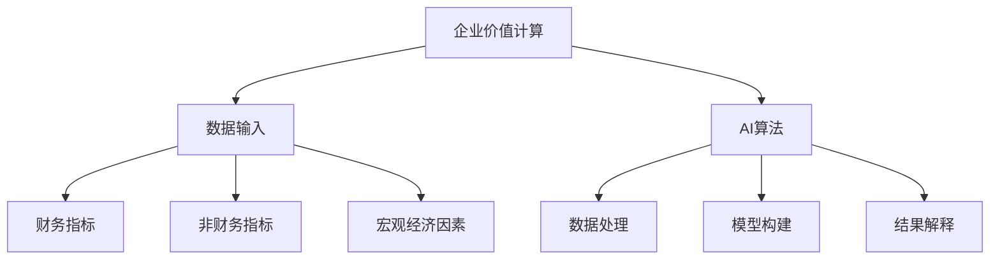
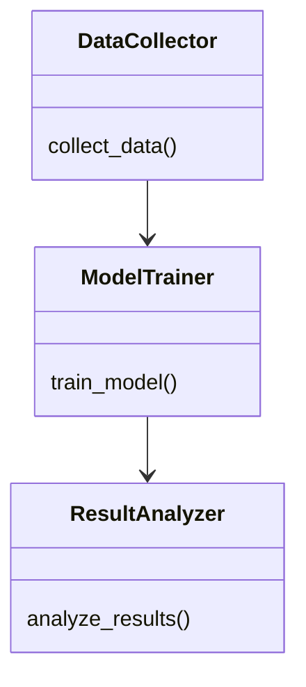

                 


# AI如何优化格雷厄姆的企业价值计算

> **关键词**：AI优化、企业价值计算、格雷厄姆、机器学习、金融数据分析

> **摘要**：本文探讨如何利用人工智能技术优化格雷厄姆的企业价值计算方法。通过分析传统计算的局限性，引入AI技术进行数据处理、模型构建和结果解释，提升企业价值评估的效率和准确性。文章详细讲解AI算法的应用，提供数学模型和系统架构设计，并通过实际案例分析展示优化效果。

---

## 第一部分：企业价值计算的背景与AI的引入

### 第1章：企业价值计算的背景与意义

#### 1.1 企业价值计算的核心概念

企业价值（Enterprise Value, EV）是衡量企业整体价值的重要指标，通常用于评估企业的内在价值，帮助投资者做出决策。格雷厄姆在其投资理论中强调，企业价值应基于基本面分析，考虑企业的财务状况、行业地位和宏观经济环境等因素。

#### 1.2 AI技术在金融领域的应用现状

AI技术在金融领域的应用日益广泛，尤其是在数据处理、预测分析和投资决策方面。通过机器学习算法，AI能够快速分析大量非结构化数据，识别潜在的市场趋势和风险因素，从而提升金融分析的效率和准确性。

#### 1.3 AI优化企业价值计算的必要性

传统的企业价值计算方法依赖于财务报表和经验判断，存在数据量有限、计算复杂和难以处理非结构化数据等问题。AI技术的引入能够通过自动化数据处理和模型优化，弥补传统方法的不足，提高计算的准确性和效率。

---

### 第2章：企业价值计算的关键要素

#### 2.1 企业价值的核心要素

企业价值计算涉及多个关键要素，包括财务指标（如收入、利润、现金流）、非财务指标（如市场地位、竞争优势）和宏观经济因素（如行业周期、政策环境）。这些要素共同构成了企业的综合价值评估体系。

#### 2.2 AI在企业价值计算中的角色

AI技术在企业价值计算中的角色主要体现在数据处理、模型构建和结果解释三个方面。通过机器学习算法，AI能够从大量数据中提取有用信息，构建预测模型，并提供可解释的结果，辅助投资决策。

#### 2.3 核心概念的对比分析

对比传统方法和AI优化方法，AI技术在数据处理能力、计算效率和结果准确性方面具有显著优势。例如，传统方法通常依赖于经验判断，而AI方法可以通过训练模型自动识别潜在的市场信号，提升计算的客观性和准确性。

---

### 第3章：企业价值计算与AI的联系

#### 3.1 企业价值计算的数学模型

传统的企业价值计算公式通常基于财务指标，例如：

$$ EV = EBIT \times (EV/EBIT) $$

其中，EV表示企业价值，EBIT表示息税折旧前利润，EV/EBIT是基于市场数据的倍数。AI优化后的模型可以通过引入更多变量，如市场情绪、行业趋势等，构建更复杂的预测模型。

#### 3.2 AI算法在企业价值计算中的应用

机器学习算法（如随机森林、神经网络）和自然语言处理技术被广泛应用于企业价值计算。例如，NLP技术可以分析公司财报中的文本信息，提取潜在的财务信号，用于模型训练。

#### 3.3 实体关系图

以下是企业价值计算与AI技术之间的关系示意图：



---

## 第二部分：AI优化企业价值计算的实现

### 第4章：数据处理与特征选择

#### 4.1 数据预处理

数据预处理是AI优化企业价值计算的关键步骤。包括数据清洗（处理缺失值、异常值）、标准化和特征提取。例如，使用Python代码清洗数据：

```python
import pandas as pd
data = pd.read_csv('enterprise_value.csv')
data.dropna(inplace=True)
data['EBIT'] = data['EBIT'].apply(lambda x: x.strip())
```

#### 4.2 特征选择

特征选择旨在识别对模型最重要的变量。常用方法包括递归特征消除（RFE）和LASSO回归。例如：

```python
from sklearn.feature_selection import RFE
from sklearn.linear_model import LinearRegression

selector = RFE(estimator=LinearRegression(), n_features_to_select=5)
selector.fit(data[['feature1', 'feature2', ...], data['target']])
selected_features = data.columns[selector.support_]
```

---

### 第5章：模型构建与训练

#### 5.1 算法选择

选择合适的算法是模型构建的关键。随机森林和梯度提升机（如XGBoost）常用于企业价值预测。例如：

```python
from sklearn.ensemble import RandomForestRegressor
model = RandomForestRegressor(n_estimators=100, random_state=42)
model.fit(X_train, y_train)
```

#### 5.2 训练过程

模型训练过程包括数据分割、参数调优和模型验证。例如，使用交叉验证评估模型性能：

```python
from sklearn.model_selection import GridSearchCV
param_grid = {'n_estimators': [100, 200], 'max_depth': [None, 10]}
grid_search = GridSearchCV(model, param_grid, cv=5)
grid_search.fit(X_train, y_train)
best_model = grid_search.best_estimator_
```

---

### 第6章：结果解释与优化

#### 6.1 结果解释

模型输出的结果需要进行解释，以便投资者理解AI计算的企业价值。例如，通过特征重要性分析识别关键因素。

#### 6.2 模型优化

根据实际应用情况，不断优化模型参数和结构。例如，调整模型超参数以提高预测精度。

---

## 第三部分：系统分析与架构设计

### 第7章：系统分析

#### 7.1 项目介绍

本项目旨在构建一个AI驱动的企业价值计算系统，利用机器学习技术优化传统方法。

#### 7.2 功能设计

系统功能模块包括数据采集、模型训练、结果展示等。以下是系统功能模块的类图：



---

## 第四部分：项目实战

### 第8章：项目实战

#### 8.1 环境安装

安装必要的Python库，如scikit-learn、pandas和numpy。

#### 8.2 核心代码实现

编写数据处理、模型训练和结果分析的代码。

#### 8.3 案例分析

通过实际案例分析，展示AI优化的企业价值计算过程。

---

## 第五部分：总结与展望

### 第9章：总结与展望

#### 9.1 最佳实践

建议在企业价值计算中结合AI技术，利用机器学习模型提高计算的准确性和效率。

#### 9.2 未来展望

未来，随着AI技术的发展，企业价值计算将更加智能化和自动化，帮助投资者做出更明智的决策。

---

## 作者

作者：AI天才研究院/AI Genius Institute & 禅与计算机程序设计艺术 /Zen And The Art of Computer Programming

---

这篇文章系统地介绍了AI如何优化格雷厄姆的企业价值计算，从背景分析到算法实现，再到系统设计，为读者提供了全面的视角和实用的指导。

