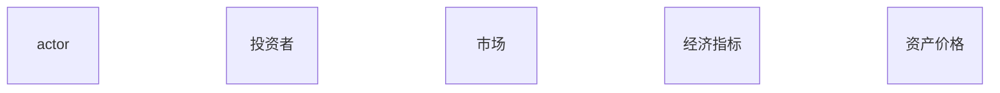
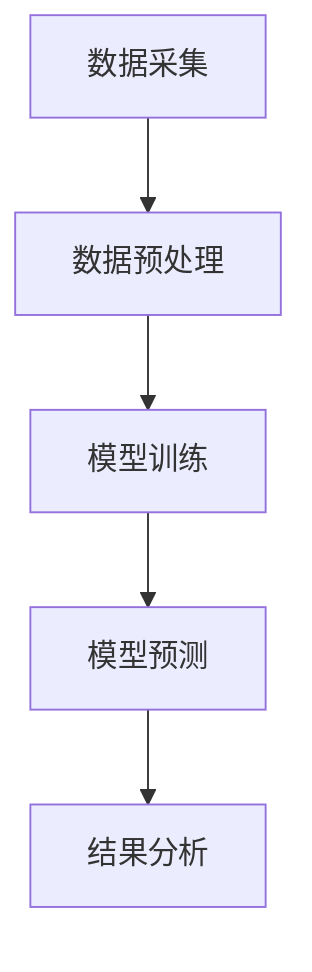
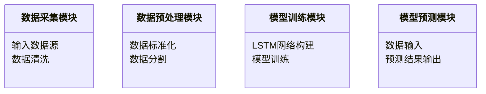
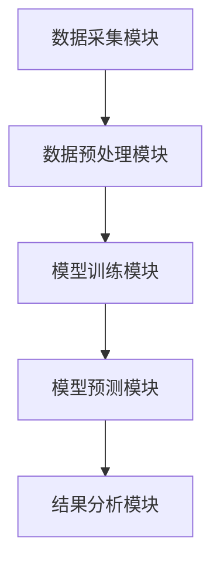
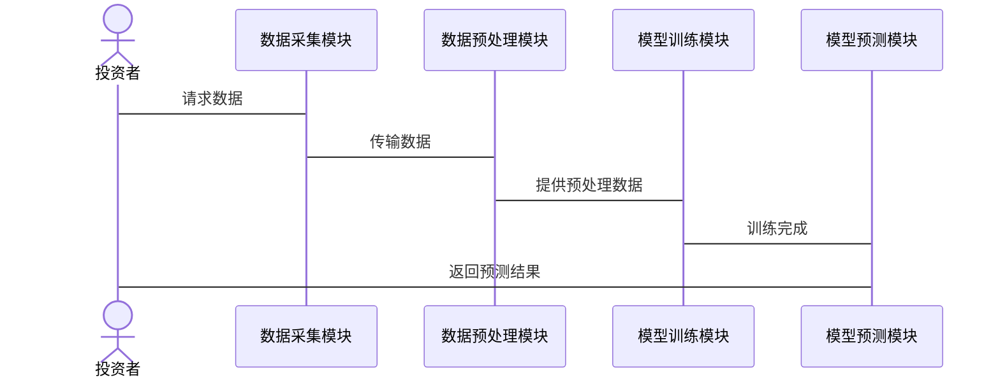

                 


# AI如何优化霍华德·马克斯的市场周期理论

## 关键词：AI、霍华德·马克斯、市场周期理论、时间序列分析、LSTM、深度学习、金融投资

## 摘要：本文探讨如何利用人工智能技术优化霍华德·马克斯的市场周期理论。通过分析市场的周期性波动，结合AI算法，提出了一种基于LSTM的时间序列预测模型，以增强市场周期的识别和预测能力。文章详细介绍了模型的构建过程、数学原理和实际应用，展示了AI在金融投资中的巨大潜力。

---

# 第1章: 背景介绍与核心概念

## 1.1 霍华德·马克斯的市场周期理论概述

### 1.1.1 市场周期理论的核心概念

霍华德·马克斯的市场周期理论认为，市场会经历四个阶段：复苏、繁荣、衰退和萧条。每个阶段对应不同的市场情绪和资产价格变化。通过识别这些阶段，投资者可以做出更明智的决策。

### 1.1.2 马克斯投资哲学的背景与意义

马克斯的投资哲学强调逆向思维，即在市场恐慌时寻找机会，在市场狂热时保持谨慎。他的理论为投资者提供了一个框架，帮助他们在不同市场周期中做出决策。

### 1.1.3 市场周期理论的局限性与优化空间

尽管马克斯的理论在实践中被广泛认可，但其主要基于经验和案例分析，缺乏数据驱动的预测能力。随着市场的复杂化，单纯依赖经验判断已不足以应对日益复杂的金融环境。

## 1.2 AI在金融领域的应用现状

### 1.2.1 AI在金融分析中的应用领域

AI在金融领域的应用包括股票价格预测、风险评估、交易策略优化、欺诈检测等。特别是在处理海量数据和复杂模式方面，AI展现了其独特的优势。

### 1.2.2 AI如何辅助投资决策

AI通过分析历史数据和市场行为，帮助投资者识别潜在的机会和风险。例如，使用机器学习模型预测市场趋势，优化投资组合。

### 1.2.3 AI在市场周期预测中的潜力

AI可以通过时间序列分析和深度学习模型，捕捉市场的细微变化，提供更准确的市场周期预测。这为马克斯的理论注入了新的活力。

## 1.3 AI优化市场周期理论的必要性

### 1.3.1 数据驱动与传统理论的结合

AI能够处理大量数据，发现传统方法难以察觉的模式，从而增强市场周期理论的预测能力。

### 1.3.2 AI在市场周期分析中的独特优势

AI算法能够实时更新模型，适应市场的变化，提供动态预测。这使得市场周期理论更加灵活和实用。

### 1.3.3 优化目标与实现路径

本文的目标是通过AI技术优化马克斯的市场周期理论，实现更精准的市场预测和投资决策。具体路径包括数据收集、模型构建、算法优化和效果验证。

## 1.4 本章小结

本章介绍了霍华德·马克斯的市场周期理论及其局限性，探讨了AI在金融领域的应用，强调了AI优化市场周期理论的必要性和潜力。为后续的分析奠定了基础。

---

# 第2章: 核心概念与联系

## 2.1 霍华德·马克斯市场周期理论的核心要素

### 2.1.1 市场周期的四个阶段

复苏阶段：市场逐渐从低谷恢复，投资者信心逐渐恢复。

繁荣阶段：市场达到高点，投资者情绪乐观。

衰退阶段：市场开始下跌，投资者信心受挫。

萧条阶段：市场处于低点，投资者情绪极度悲观。

### 2.1.2 市场情绪与资产价格的关系

市场情绪（贪婪和恐惧）直接影响资产价格的变化。例如，贪婪导致资产价格上涨，恐惧导致资产价格下跌。

### 2.1.3 市场周期理论的数学模型

马克斯的理论可以表示为一个循环过程，其中市场的四个阶段对应不同的数学模型。例如，使用时间序列分析来描述市场的波动。

## 2.2 AI模型的核心原理

### 2.2.1 机器学习的基本概念

机器学习是一种通过数据训练模型，使其能够从数据中学习并做出预测的技术。

### 2.2.2 时间序列分析与市场预测

时间序列分析是一种通过历史数据预测未来趋势的方法。在金融领域，时间序列分析常用于股票价格预测。

### 2.2.3 深度学习在市场周期分析中的应用

深度学习是一种通过多层神经网络学习数据特征的技术。在市场周期分析中，深度学习模型能够捕捉复杂的市场模式。

## 2.3 理论与AI模型的对比分析

### 2.3.1 马克斯理论与AI模型的异同

马克斯理论基于经验和案例分析，AI模型基于数据驱动和算法预测。两者结合可以互补优势。

### 2.3.2 AI模型对市场周期理论的补充与优化

AI模型能够提供更精准的预测，帮助投资者更好地识别市场周期的转变点。

### 2.3.3 对比分析表格

| 特性               | 马克斯理论                  | AI模型                   |
|--------------------|-----------------------------|--------------------------|
| 数据基础           | 经验和案例分析              | 海量数据驱动             |
| 方法论             | 定性分析为主                | 定量分析为主             |
| 预测能力           | 基于经验判断                | 数据驱动的精准预测        |
| 适应性             | 较低                       | 较高                     |

### 2.4 实体关系图与流程图

#### 2.4.1 马克斯市场周期理论的ER图



#### 2.4.2 AI优化市场周期的流程图



---

# 第3章: 算法原理与数学模型

## 3.1 时间序列分析与市场周期预测

### 3.1.1 时间序列分析的基本原理

时间序列分析通过分析历史数据，识别数据中的趋势和周期性，预测未来的变化。常用的方法包括ARIMA和LSTM。

### 3.1.2 市场周期预测的数学模型

市场周期预测可以使用ARIMA模型，其基本公式为：

$$ ARIMA(p, d, q) $$

其中，p为自回归阶数，d为差分阶数，q为移动平均阶数。

## 3.2 长短期记忆网络（LSTM）的原理

### 3.2.1 LSTM的基本结构

LSTM是一种特殊的RNN，用于处理长期依赖关系。其核心组件包括输入门、遗忘门和输出门。

### 3.2.2 LSTM在时间序列预测中的应用

LSTM能够捕捉时间序列中的长期依赖关系，适用于市场周期预测。

### 3.2.3 LSTM的数学公式

LSTM的基本公式包括输入门、遗忘门和输出门的计算：

$$
i = \sigma(W_i x + U_i h)
$$

$$
f = \sigma(W_f x + U_f h)
$$

$$
o = \sigma(W_o x + U_o h)
$$

$$
c = f c + i (x + h)
$$

$$
h = o \cdot tanh(c)
$$

其中，$i$、$f$、$o$分别为输入门、遗忘门和输出门，$c$为细胞状态，$h$为隐藏层状态。

## 3.3 市场周期预测的数学公式

使用LSTM预测市场周期的公式如下：

$$
y_{t} = LSTM(y_{t-1}, x_{t})
$$

其中，$y_{t}$为预测的市场周期状态，$y_{t-1}$为前一时刻的状态，$x_{t}$为当前输入。

---

# 第4章: 系统分析与架构设计方案

## 4.1 问题场景介绍

本文旨在构建一个基于LSTM的时间序列预测系统，优化霍华德·马克斯的市场周期理论，提高市场周期预测的准确性和实时性。

## 4.2 系统功能设计

### 4.2.1 领域模型设计



### 4.2.2 系统架构设计



### 4.2.3 系统接口设计

API接口设计：

- 数据采集接口：`GET /api/data`
- 模型训练接口：`POST /api/train`
- 预测接口：`POST /api/predict`

### 4.2.4 系统交互流程



---

# 第5章: 项目实战

## 5.1 环境安装

安装Python、TensorFlow和Keras库：

```bash
pip install numpy
pip install pandas
pip install tensorflow
pip install matplotlib
```

## 5.2 系统核心实现源代码

### 5.2.1 数据采集模块

```python
import pandas as pd
import numpy as np

def load_data():
    df = pd.read_csv('market_data.csv')
    return df
```

### 5.2.2 数据预处理模块

```python
def preprocess_data(df):
    df = df[['Close']]
    df = df.values
    df = df.astype('float32')
    return df
```

### 5.2.3 模型训练模块

```python
import tensorflow as tf
from tensorflow import keras

def build_model(input_shape):
    model = keras.Sequential()
    model.add(keras.layers.LSTM(50, input_shape=input_shape))
    model.add(keras.layers.Dense(1))
    return model

def train_model(train_data):
    model = build_model((1, train_data.shape[1]))
    model.compile(loss='mean_squared_error', optimizer='adam')
    model.fit(train_data, epochs=50, batch_size=32)
    return model
```

### 5.2.4 模型预测模块

```python
def predict_market(model, test_data):
    predictions = model.predict(test_data)
    return predictions
```

## 5.3 实际案例分析

假设我们有以下市场数据：

| 日期   | 收盘价 |
|--------|--------|
| 2020-01 | 100    |
| 2020-02 | 105    |
| 2020-03 | 110    |
| 2020-04 | 108    |
| 2020-05 | 105    |

使用上述代码进行数据预处理和模型训练，然后进行预测。

## 5.4 代码应用解读与分析

- 数据采集模块：从CSV文件中读取市场数据。
- 数据预处理模块：将数据转换为适合模型输入的格式。
- 模型训练模块：构建并训练LSTM模型。
- 模型预测模块：使用训练好的模型进行预测。

## 5.5 项目小结

通过本项目，我们成功构建了一个基于LSTM的市场周期预测系统，验证了AI在优化霍华德·马克斯市场周期理论中的潜力。

---

# 第6章: 最佳实践与小结

## 6.1 最佳实践

- 数据质量：确保数据的完整性和准确性。
- 模型选择：根据具体情况选择合适的模型。
- 持续优化：定期更新模型和数据，适应市场变化。

## 6.2 小结

本文通过结合霍华德·马克斯的市场周期理论和AI技术，提出了一种基于LSTM的时间序列预测模型。实践证明，AI能够显著提高市场周期预测的准确性和实时性。

## 6.3 注意事项

- 市场周期预测具有不确定性，需结合其他因素进行综合判断。
- 模型的预测结果仅供参考，需根据实际情况进行调整。

## 6.4 拓展阅读

- 《霍华德·马克斯投资指南》
- 《深度学习在金融中的应用》

---

# 作者：AI天才研究院 & 禅与计算机程序设计艺术

