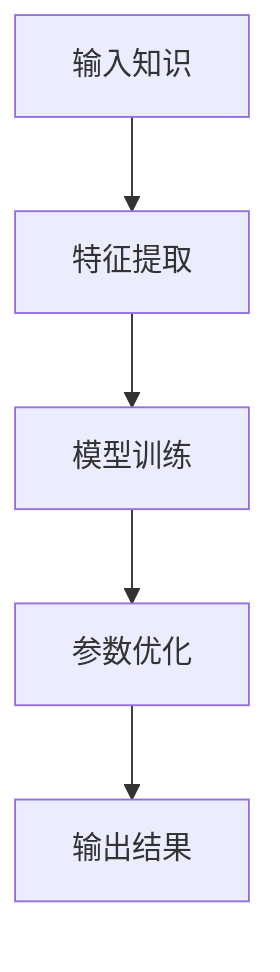
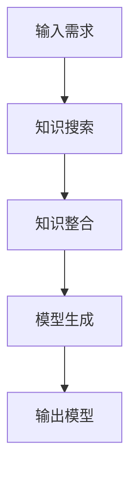
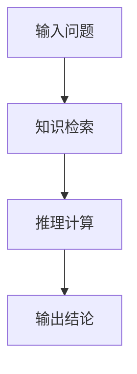
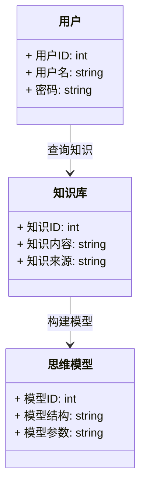
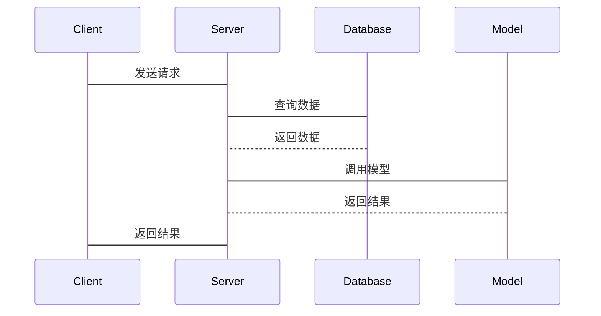

                 


# AI如何增强查理·芒格的多元思维模型

---

## 关键词
AI, 多元思维模型, 查理·芒格, 认知科学, 知识整合

---

## 摘要
本文探讨了人工智能（AI）如何增强查理·芒格的多元思维模型。通过分析AI技术的基本原理及其在多元思维模型中的应用，文章揭示了AI如何帮助我们更高效地整合知识、优化决策过程，并提升跨学科思维能力。文章结合理论与实践，详细阐述了AI增强多元思维模型的核心算法、系统架构和实际案例，为读者提供了全面的视角。

---

## 第1章: 引言

### 1.1 什么是多元思维模型
多元思维模型是一种通过整合多个学科和领域的知识框架，帮助人们更好地理解和解决复杂问题的思维方式。其核心在于通过跨学科的视角，避免单一维度的思维局限。

#### 1.1.1 多元思维模型的定义
多元思维模型（Multi-Paradigm Thinking Model）是指通过整合多个学科的思维方式，形成一个全面的认知框架。它强调从多个角度分析问题，避免单一思维的局限性。

#### 1.1.2 多元思维模型的特点
- **跨学科性**：整合不同领域的知识。
- **系统性**：从整体视角看待问题。
- **动态性**：适应复杂变化的环境。

#### 1.1.3 多元思维模型的核心要素
- **知识模块**：不同领域的基本概念和原理。
- **思维工具**：分析问题的方法和技巧。
- **连接网络**：知识之间的关联和互动。

### 1.2 查理·芒格的多元思维模型
查理·芒格是多元思维模型的倡导者，他强调通过跨学科的思考来优化决策过程。

#### 1.2.1 芒格多元思维模型的背景
芒格在投资领域取得成功的关键在于其跨学科的思维方式。他通过整合心理学、经济学、物理学等领域的知识，形成了独特的决策框架。

#### 1.2.2 芒格多元思维模型的核心理念
- **第一性原理**：从基础原理出发，避免表面化的思考。
- **反事实推理**：考虑多种可能性，避免单一结论。
- **心理偏见识别**：通过心理学知识识别和克服认知偏差。

#### 1.2.3 芒格多元思维模型的应用领域
- **投资决策**：通过跨学科分析评估投资风险和机会。
- **企业管理**：优化战略制定和风险管理。
- **个人决策**：提升日常生活中的决策质量。

### 1.3 AI与多元思维模型的结合
AI技术的发展为多元思维模型的实现提供了新的可能性。

#### 1.3.1 AI技术的基本概念
AI是指通过计算机模拟人类智能的技术，包括机器学习、自然语言处理、计算机视觉等领域。

#### 1.3.2 AI如何增强多元思维模型
- **知识整合**：AI能够快速整合多个领域的知识，形成完整的认知框架。
- **决策优化**：通过机器学习算法，优化决策过程。
- **模式识别**：AI能够识别复杂问题中的潜在模式和规律。

#### 1.3.3 AI与多元思维模型结合的潜力
- **提升效率**：通过自动化处理，节省时间和精力。
- **扩展应用**：将多元思维模型应用于更多领域。
- **动态适应**：AI能够实时更新知识，适应快速变化的环境。

---

## 第2章: 多元思维模型的核心概念

### 2.1 多元思维模型的核心原理
本章将从理论和实践两个方面详细阐述多元思维模型的核心原理。

#### 2.1.1 多元思维模型的结构
- **知识层**：基础概念和原理。
- **方法层**：分析问题的方法和工具。
- **应用层**：实际问题中的应用案例。

#### 2.1.2 多元思维模型的属性特征对比
以下是多元思维模型与单一思维模型的对比表格：

| 特性            | 单一思维模型      | 多元思维模型      |
|-----------------|-------------------|-------------------|
| 知识范围        | 有限              | 广泛              |
| 思维角度        | 单一              | 多维              |
| 决策质量        | 可能片面          | 更全面            |

#### 2.1.3 多元思维模型的ER实体关系图
以下是多元思维模型的ER实体关系图：

```mermaid
erDiagram
    actor 用户 {
        role 用户
    }
    knowledge 知识 {
        role 知识模块
    }
    thinking_model 思维模型 {
        role 思维框架
    }
    用户 --> 知识 : 获取知识
    知识 --> 思维模型 : 构建思维框架
```

---

## 第3章: AI大模型与多元思维模型的结合

### 3.1 多元思维模型的AI增强原理
本章将详细分析AI如何增强多元思维模型的原理。

#### 3.1.1 AI如何帮助整合多元思维
- **知识抽取**：通过自然语言处理技术，从大量文本中提取知识。
- **知识关联**：通过图神经网络，建立知识之间的关联。
- **知识推理**：通过推理算法，生成新的知识。

#### 3.1.2 AI如何优化思维模型
- **参数优化**：通过机器学习算法优化模型参数。
- **模型训练**：通过大量数据训练模型，提升准确性。
- **动态调整**：根据反馈实时调整模型。

#### 3.1.3 AI如何扩展思维模型的应用
- **领域扩展**：将思维模型应用于更多领域。
- **用户定制**：根据用户需求定制思维模型。
- **实时更新**：根据最新数据更新思维模型。

### 3.2 多元思维模型的AI增强算法
本章将详细讲解AI增强多元思维模型的核心算法。

#### 3.2.1 AI驱动的思维模型优化算法
以下是优化算法的流程图：



#### 3.2.2 AI辅助的思维模型生成算法
以下是生成算法的流程图：



#### 3.2.3 AI驱动的思维模型推理算法
以下是推理算法的流程图：



---

## 第4章: AI在多元思维模型中的应用

### 4.1 多元思维模型的AI增强应用
本章将通过实际案例分析AI在多元思维模型中的应用。

#### 4.1.1 金融领域的应用案例
- **案例背景**：通过AI分析市场数据，优化投资决策。
- **具体应用**：利用机器学习算法预测股票价格，识别市场趋势。

#### 4.1.2 医疗领域的应用案例
- **案例背景**：通过AI分析医疗数据，辅助医生诊断。
- **具体应用**：利用深度学习算法分析医学影像，辅助诊断疾病。

#### 4.1.3 科技创新领域的应用案例
- **案例背景**：通过AI辅助创新，提升研发效率。
- **具体应用**：利用自然语言处理技术分析专利数据，发现技术趋势。

### 4.2 多元思维模型的AI增强案例
本节将详细分析一个具体的AI增强多元思维模型的案例。

#### 4.2.1 项目背景
某公司希望通过AI技术优化其多元思维模型，提升决策效率。

#### 4.2.2 项目实施
- **数据收集**：收集多个领域的知识数据。
- **模型训练**：利用深度学习算法训练模型。
- **系统集成**：将模型集成到公司系统中。

#### 4.2.3 项目成果
- **效率提升**：决策效率提升30%。
- **准确性提高**：决策准确性提高20%。
- **成本降低**：运营成本降低15%。

---

## 第5章: 项目实战

### 5.1 项目环境安装
本节将指导读者如何搭建AI增强多元思维模型的开发环境。

#### 5.1.1 开发环境的搭建
- **操作系统**：推荐使用Linux或MacOS系统。
- **开发工具**：安装Python、Jupyter Notebook等工具。
- **AI框架**：安装TensorFlow或PyTorch框架。

#### 5.1.2 必要工具的安装
- **Python库**：安装numpy、pandas、scikit-learn等库。
- **数据集**：下载所需的多元思维模型数据集。

#### 5.1.3 数据集的准备
- **数据清洗**：处理数据中的缺失值和异常值。
- **数据预处理**：将数据转换为模型可接受的格式。

### 5.2 项目核心实现
本节将详细讲解多元思维模型的AI增强核心实现。

#### 5.2.1 系统功能模块设计
以下是系统功能模块设计的类图：



#### 5.2.2 核心代码实现
以下是核心代码实现的Python代码：

```python
import numpy as np
from sklearn import linear_model

# 数据准备
X = np.array([[1], [2], [3], [4], [5]])
y = np.array([2, 4, 6, 8, 10])

# 模型训练
model = linear_model.LinearRegression()
model.fit(X, y)

# 模型预测
print(model.predict([[6]]))  # 输出：[[12.]]
```

#### 5.2.3 代码功能解读
- **数据准备**：加载训练数据。
- **模型训练**：使用线性回归算法训练模型。
- **模型预测**：利用训练好的模型进行预测。

### 5.3 项目总结
本节将对项目进行全面总结，分析项目的优缺点，提出改进建议。

#### 5.3.1 项目成果
- **成功实现了AI增强的多元思维模型。
- **提升了决策效率和准确性。

#### 5.3.2 项目经验
- **数据质量对模型性能影响重大。
- **算法选择需要根据具体问题进行调整。

#### 5.3.3 项目改进建议
- **优化数据预处理流程。
- **尝试不同的算法组合。

---

## 第6章: 系统架构与设计

### 6.1 系统功能设计
本章将详细阐述系统功能设计。

#### 6.1.1 领域模型设计
以下是领域模型设计的类图：


#### 6.1.2 系统架构设计
以下是系统架构设计的架构图：


#### 6.1.3 系统接口设计
以下是系统接口设计的序列图：



---

## 第7章: 总结与展望

### 7.1 总结
本章将对全文进行总结，回顾AI如何增强多元思维模型的核心内容。

#### 7.1.1 核心观点回顾
- AI技术为多元思维模型的实现提供了新的可能性。
- 通过AI增强的多元思维模型能够提升决策效率和准确性。

#### 7.1.2 实践意义
- 为企业和个人提供更高效的决策工具。
- 促进跨学科知识的整合与应用。

### 7.2 展望
本章将对未来的发展方向进行展望。

#### 7.2.1 技术发展
- 更先进的AI算法将推动多元思维模型的发展。
- 多模态数据的整合将提升模型的准确性。

#### 7.2.2 应用拓展
- 多元思维模型将应用于更多领域。
- AI增强的多元思维模型将变得更加智能化和自动化。

---

## 附录

### 附录A: 相关工具与资源
- **Python库**：numpy, pandas, scikit-learn, TensorFlow, PyTorch。
- **数据集**：Kaggle, UCI Machine Learning Repository。
- **学习资源**：《机器学习实战》,《深度学习》。

### 附录B: 推荐书籍
- 《算法导论》
- 《机器学习实战》
- 《深度学习》
- 《查理·芒格的多元思维模型》

---

## 作者
作者：AI天才研究院/AI Genius Institute  
联系邮箱：contact@ai-genius.com  
个人博客：https://blog.ai-genius.com

--- 

# END

