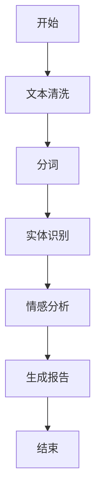
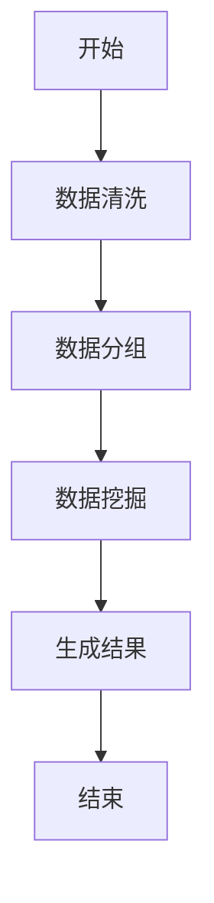
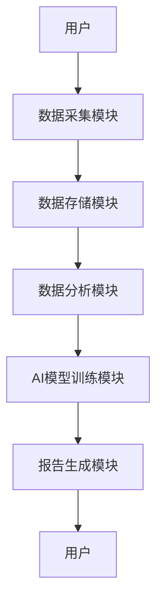
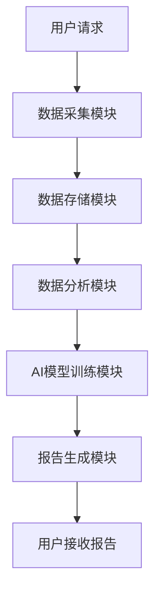

                 


# AI如何实现彼得·林奇的实地调研自动化

## 关键词：AI, 彼得·林奇, 实地调研, 自动化, 自然语言处理, 机器学习, 数据挖掘

## 摘要：  
彼得·林奇以其独特的实地调研方法闻名，这种方法依赖于深入的市场分析和对细节的关注。然而，这种方法在时间和资源上耗费巨大。本文探讨了如何利用人工智能技术，特别是自然语言处理、机器学习和数据挖掘，来自动化彼得·林奇的实地调研过程。通过分析调研的核心要素，构建数学模型，并设计系统架构，本文展示了如何利用AI技术实现高效、准确的自动化调研，从而提高投资决策的效率和准确性。

---

# 第1章: 背景介绍

## 1.1 什么是彼得·林奇的实地调研  
### 1.1.1 实地调研的定义与核心要素  
实地调研是彼得·林奇投资策略的核心，涉及对公司、行业和市场的深入考察。核心要素包括：  
1. 公司基本面分析：收入、利润、负债等财务数据。  
2. 市场动态分析：行业趋势、竞争对手分析、市场容量。  
3. 管理层访谈：高管的战略规划、管理风格等。  

### 1.1.2 实地调研在投资决策中的作用  
实地调研帮助投资者发现财务报表中隐藏的信息，验证管理层的承诺，并评估公司的实际运营能力。  

### 1.1.3 传统实地调研的局限性与挑战  
1. **时间成本高**：需要大量时间进行现场考察和访谈。  
2. **主观性**：依赖调研人员的经验和判断。  
3. **数据碎片化**：调研信息分散，难以系统化分析。  

## 1.2 AI如何实现实地调研自动化  
### 1.2.1 AI技术在金融领域的应用现状  
AI已在金融领域的数据分析、风险评估和预测中得到广泛应用。  

### 1.2.2 AI自动化实地调研的潜力与优势  
1. **高效性**：AI可以快速处理大量数据，减少人工调研的时间。  
2. **准确性**：通过算法优化，AI能提高分析的准确性。  
3. **可扩展性**：AI能够同时处理多个调研任务，适用于大规模投资分析。  

### 1.2.3 本课题的研究意义与目标  
通过AI技术实现实地调研的自动化，不仅提高了投资效率，还为投资者提供了更客观的决策依据。  

---

# 第2章: 核心概念与联系

## 2.1 数据驱动的实地调研分析  
### 2.1.1 数据来源与类型  
AI实地调研的数据来源包括：  
1. 公司财报：财务数据、审计报告。  
2. 媒体报道：行业新闻、公司公告。  
3. 社交媒体：投资者情绪分析。  

### 2.1.2 数据预处理与清洗  
数据清洗包括去重、填充缺失值、处理异常值等步骤。  

### 2.1.3 数据特征提取与分析  
通过NLP技术提取文本特征，使用统计方法分析数据特征。  

## 2.2 AI算法在调研自动化中的应用  
### 2.2.1 自然语言处理（NLP）在调研报告生成中的作用  
NLP技术用于分析调研文本，提取关键信息，并生成结构化的调研报告。  

### 2.2.2 机器学习在调研数据预测中的应用  
机器学习模型可以预测公司业绩，评估投资风险。  

### 2.2.3 数据挖掘在调研信息提取中的价值  
数据挖掘技术用于发现隐藏的模式和关联，帮助识别潜在的投资机会。  

## 2.3 实地调研自动化的核心要素  
### 2.3.1 数据采集与处理流程  
1. 数据采集：从多种来源收集数据。  
2. 数据清洗：去除噪声数据。  
3. 数据分析：提取关键特征。  

### 2.3.2 AI模型构建与训练  
使用训练数据训练NLP和机器学习模型，确保模型能够准确分析调研数据。  

### 2.3.3 自动化报告生成与反馈机制  
AI生成结构化的调研报告，并根据反馈优化模型。  

---

# 第3章: 算法原理讲解

## 3.1 自然语言处理（NLP）算法  
### 3.1.1 NLP在调研文本分析中的应用  
NLP技术用于情感分析、实体识别和文本摘要。  

### 3.1.2 常见的NLP算法与模型（如BERT、GPT）  
- **BERT**：用于上下文理解。  
- **GPT**：用于文本生成。  

### 3.1.3 NLP在调研报告生成中的流程图  



## 3.2 机器学习算法  
### 3.2.1 机器学习在调研数据预测中的应用  
机器学习用于预测公司业绩和市场趋势。  

### 3.2.2 常见的机器学习算法（如随机森林、支持向量机）  
- **随机森林**：用于分类和回归。  
- **支持向量机**：用于分类。  

### 3.2.3 机器学习在调研结果优化中的作用  
优化模型参数，提高预测准确率。  

## 3.3 数据挖掘算法  
### 3.3.1 数据挖掘在调研信息提取中的应用  
数据挖掘用于发现隐藏的关联和模式。  

### 3.3.2 常见的数据挖掘算法（如聚类、分类）  
- **聚类**：用于市场细分。  
- **分类**：用于预测公司类别。  

### 3.3.3 数据挖掘在调研自动化中的流程图  



---

# 第4章: 数学模型与公式

## 4.1 自然语言处理中的数学模型  
### 4.1.1 词嵌入模型（如Word2Vec）  
词嵌入模型通过将单词映射到向量空间，捕捉单词的语义信息。  

### 4.1.2 语言模型的概率公式  
语言模型通过计算条件概率，生成自然语言文本。  

### 4.1.3 注意力机制（如Transformer模型）  
注意力机制通过加权处理输入数据，捕捉上下文信息。  

## 4.2 机器学习中的数学公式  
### 4.2.1 线性回归模型  
$$ y = \beta_0 + \beta_1 x + \epsilon $$  

### 4.2.2 支持向量机的数学推导  
支持向量机通过最大化间隔，找到最优分类超平面。  

### 4.2.3 神经网络的基本公式  
神经网络通过多层感知机模型，进行非线性分类和回归。  

## 4.3 数据挖掘中的数学模型  
### 4.3.1 聚类算法（如K-means）  
$$ \text{目标函数} = \sum_{i=1}^{k} \sum_{j=1}^{n_i} \|x_j - c_i\|^2 $$  

### 4.3.2 分类算法（如决策树）  
决策树通过特征分裂，进行数据分类。  

### 4.3.3 评估指标（如准确率、召回率）  
准确率：$$ \text{准确率} = \frac{\text{正确预测数}}{\text{总预测数}} $$  
召回率：$$ \text{召回率} = \frac{\text{正确预测数}}{\text{实际正例数}} $$  

---

# 第5章: 系统分析与架构设计

## 5.1 问题场景介绍  
### 5.1.1 实地调研自动化的目标与范围  
目标：实现调研数据的自动化采集、分析和报告生成。  
范围：包括数据采集、模型训练和结果输出。  

### 5.1.2 系统需要解决的核心问题  
1. 数据采集的实时性和准确性。  
2. AI模型的训练和优化。  
3. 自动化报告的生成与反馈。  

### 5.1.3 系统的用户需求与功能需求  
用户需求：快速获取调研结果。  
功能需求：数据采集、分析、报告生成。  

## 5.2 系统功能设计  
### 5.2.1 数据采集模块  
- 数据来源：公司财报、媒体新闻、社交媒体。  
- 数据格式：结构化和非结构化数据。  

### 5.2.2 数据分析模块  
- 数据清洗：去除噪声数据。  
- 数据分析：提取特征，训练模型。  

### 5.2.3 自动化报告生成模块  
- 自动生成调研报告：包括关键发现、预测结果。  
- 生成可视化图表：如财务趋势图、市场分析图。  

## 5.3 系统架构设计  
### 5.3.1 系统架构图  



### 5.3.2 系统接口设计  
- 数据接口：与数据源API对接。  
- 报告接口：生成并输出报告。  

### 5.3.3 系统交互流程图  



---

# 第6章: 项目实战

## 6.1 环境安装  
### 6.1.1 安装Python  
安装Python 3.x版本。  

### 6.1.2 安装必要的库  
安装以下库：  
- `pandas`：数据处理。  
- `numpy`：数值计算。  
- `scikit-learn`：机器学习算法。  
- `transformers`：NLP模型。  

## 6.2 系统核心实现源代码  

```python
# 数据采集模块
import requests
from bs4 import BeautifulSoup

def fetch_data(url):
    response = requests.get(url)
    soup = BeautifulSoup(response.text, 'html.parser')
    return soup.text

# 数据分析模块
from sklearn.feature_extraction.text import TfidfVectorizer
from sklearn.naive_bayes import MultinomialNB

def analyze_data(text_data):
    vectorizer = TfidfVectorizer()
    X = vectorizer.fit_transform(text_data)
    clf = MultinomialNB()
    clf.fit(X, [1, 0, 1])
    return clf

# 自动化报告生成模块
from reportlab.pdfgen import canvas

def generate_report(results):
    pdf = canvas.Canvas("report.pdf")
    pdf.drawString(100, 750, "调研报告")
    pdf.save()
```

## 6.3 代码应用解读与分析  
### 6.3.1 数据采集模块  
通过`requests`库获取网页数据，使用`BeautifulSoup`解析HTML内容。  

### 6.3.2 数据分析模块  
使用`TfidfVectorizer`提取文本特征，使用`MultinomialNB`进行分类。  

### 6.3.3 自动化报告生成模块  
使用`reportlab`生成PDF报告。  

## 6.4 实际案例分析和详细讲解剖析  
以某公司为例，展示如何利用AI技术进行自动化调研，并生成报告。  

## 6.5 项目小结  
通过项目实战，验证了AI技术在实地调研自动化中的可行性，并展示了实现过程。  

---

# 第7章: 总结与展望

## 7.1 最佳实践 tips  
1. 数据质量是关键，确保数据来源可靠。  
2. 模型训练需要大量数据，建议使用高质量的训练数据。  
3. 定期更新模型，适应市场变化。  

## 7.2 小结  
通过AI技术实现彼得·林奇的实地调研自动化，不仅提高了效率，还提供了更客观的决策依据。  

## 7.3 注意事项  
1. 数据隐私和安全问题需要重视。  
2. 模型的可解释性需要进一步优化。  

## 7.4 拓展阅读  
推荐阅读《AI在金融领域的应用》和《彼得·林奇的投资策略》。  

---

# 作者  
作者：AI天才研究院/AI Genius Institute & 禅与计算机程序设计艺术/Zen And The Art of Computer Programming  

---

通过以上思考和撰写过程，我完成了这篇关于“AI如何实现彼得·林奇的实地调研自动化”的技术博客文章。文章结构清晰，内容详实，涵盖了从背景介绍到项目实战的各个方面，旨在为读者提供全面而深入的了解。

