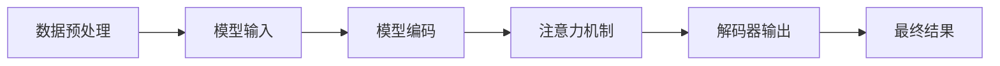
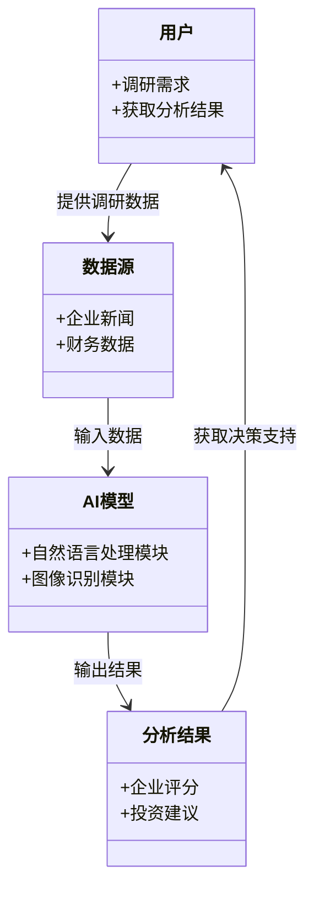
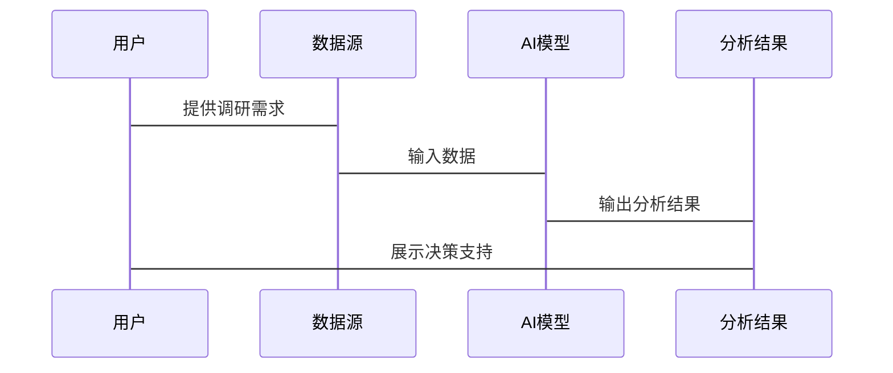

                 


# AI如何实现彼得·林奇的实地调研策略

> 关键词：AI技术，彼得·林奇，实地调研，金融投资，机器学习，数据驱动决策

> 摘要：本文探讨如何利用人工智能技术模拟彼得·林奇的实地调研策略，通过自然语言处理、图像识别和深度学习等技术，实现高效的数据分析和决策支持，帮助投资者做出更明智的投资决策。

---

# 目录

1. [背景介绍](#背景介绍)
2. [核心概念与联系](#核心概念与联系)
3. [算法原理讲解](#算法原理讲解)
4. [系统架构与设计](#系统架构与设计)
5. [项目实战](#项目实战)
6. [最佳实践](#最佳实践)
7. [参考文献](#参考文献)
8. [作者简介](#作者简介)
9. [致谢](#致谢)

---

## 第1章: 背景介绍

### 1.1 问题背景

#### 1.1.1 彼得·林奇的实地调研策略
彼得·林奇是全球著名的投资经理，以其独特的实地调研方法闻名。他通过深入企业现场，与管理层、员工和客户交流，获取第一手信息，从而做出精准的投资决策。这种方法的核心在于通过实地考察，识别企业的竞争优势和潜在风险。

#### 1.1.2 AI技术的现状与发展
人工智能技术近年来取得了显著进展，特别是在自然语言处理、图像识别和深度学习领域。这些技术为数据的自动化分析和模式识别提供了强大的工具，使得机器能够辅助甚至替代部分人工调研工作。

#### 1.1.3 两者的结合意义
将AI技术应用于彼得·林奇的实地调研策略，可以提高调研效率，扩大调研范围，同时减少人为误差。AI能够快速处理大量数据，发现潜在的市场趋势和企业动态，为投资决策提供更有力的支持。

---

### 1.2 问题描述

#### 1.2.1 实地调研的核心挑战
传统实地调研依赖于人工收集和分析数据，耗时长、成本高，且容易受到调研人员主观因素的影响。此外，数据的多样性和复杂性也增加了调研的难度。

#### 1.2.2 AI技术在调研中的应用
AI技术可以通过自动化数据处理、实时信息分析和模式识别，辅助调研人员完成从数据收集到决策支持的全过程。例如，利用自然语言处理技术分析企业财报和新闻，识别行业趋势；通过图像识别技术分析生产现场的设备状态，评估企业生产能力。

#### 1.2.3 问题解决的路径与目标
通过AI技术实现调研自动化，提高调研效率和准确性，降低投资风险。目标是开发一套智能化的调研系统，能够快速处理大量非结构化数据，提供实时的分析结果和决策建议。

---

### 1.3 问题解决

#### 1.3.1 AI如何辅助调研
AI可以通过以下方式辅助实地调研：
- **数据收集与整理**：自动从多种来源（如新闻、财报、社交媒体）收集数据，并进行清洗和结构化处理。
- **模式识别与预测**：利用机器学习算法识别市场趋势和企业潜在问题，预测投资风险。
- **决策支持**：基于AI分析结果，提供投资建议，优化投资组合。

#### 1.3.2 数据驱动的决策支持
AI系统通过分析大量数据，提取关键指标和趋势，为投资决策提供数据支持。例如，通过分析企业财报和行业新闻，识别企业的财务健康状况和市场地位。

#### 1.3.3 智能化调研工具的开发
开发一款智能化的调研工具，集成多种AI技术，如自然语言处理和图像识别，帮助用户快速获取企业信息，评估投资价值。

---

### 1.4 边界与外延

#### 1.4.1 AI调研的适用范围
AI技术适用于数据量大、结构复杂、需要快速分析的场景。例如，行业趋势分析、竞争对手分析和市场风险评估。

#### 1.4.2 技术的局限性
AI技术目前仍存在一些局限性，如对非结构化数据的理解能力有限，模型的泛化能力不足，以及对数据质量和多样性的依赖。

#### 1.4.3 与传统调研方法的结合
AI技术可以作为传统调研的补充，通过自动化处理和分析数据，提高调研效率和准确性。两者结合可以充分发挥AI的优势，同时保留传统调研的深度分析能力。

---

### 1.5 核心要素组成

#### 1.5.1 数据采集与处理
AI系统需要从多种来源采集数据，并进行清洗和结构化处理。例如，从新闻网站爬取企业新闻，从财报中提取财务数据。

#### 1.5.2 模型训练与优化
通过训练自然语言处理和图像识别模型，提升数据分析的准确性和效率。例如，使用BERT模型进行文本分析，使用CNN模型进行图像识别。

#### 1.5.3 结果分析与反馈
对AI分析结果进行评估和反馈，优化模型参数，提升系统性能。例如，通过A/B测试评估不同模型的效果，选择最优模型进行部署。

---

## 第2章: 核心概念与联系

### 2.1 核心概念原理

#### 2.1.1 AI在调研中的核心算法
AI在调研中主要应用自然语言处理和图像识别技术。例如，使用BERT模型分析企业新闻，使用YOLO算法识别生产现场的问题。

#### 2.1.2 数据分析与模式识别
通过数据分析和模式识别，AI能够发现数据中的隐藏规律，帮助投资者识别潜在的投资机会和风险。

#### 2.1.3 决策支持系统
决策支持系统整合多种AI技术，提供实时的分析结果和投资建议，辅助投资决策。

---

### 2.2 概念属性特征对比

| **属性**         | **传统调研**              | **AI调研**               |
|-------------------|--------------------------|-------------------------|
| **效率**          | 较低，依赖人工            | 较高，自动化处理          |
| **准确性**        | 受主观因素影响较大       | 较高，基于大量数据       |
| **覆盖范围**      | 有限，受时间和资源限制    | 较广，可以覆盖更多数据源  |
| **成本**          | 较高，需要大量人力投入    | 较低，自动化减少人工成本  |
| **实时性**        | 较差，依赖人工分析        | 较好，可以实时处理数据    |

---

### 2.3 ER实体关系图

```mermaid
er
  actor: 用户
  model: AI模型
  data: 数据源
  action: 调研行为
  result: 分析结果
  actor --> model: 输入调研需求
  model --> data: 数据处理
  model --> result: 输出分析结果
  actor <-- result: 获取决策支持
```

---

## 第3章: 算法原理讲解

### 3.1 自然语言处理算法

#### 3.1.1 BERT模型
BERT（Bidirectional Encoder Representations from Transformers）是一种基于Transformer的预训练语言模型，能够通过上下文理解文本含义。例如，用于分析企业新闻和财报。

#### 3.1.2 GPT模型
GPT（Generative Pre-trained Transformer）是一种生成式模型，可以生成与上下文相关的文本。例如，用于自动生成企业分析报告。

#### 3.1.3 模型训练流程


---

### 3.2 图像识别算法

#### 3.2.1 CNN模型
CNN（卷积神经网络）常用于图像识别任务，如识别企业生产设备的状态。例如，使用YOLO算法进行目标检测。

#### 3.2.2 模型训练与优化
通过训练CNN模型，提升图像识别的准确率和速度。例如，使用迁移学习技术，利用预训练模型进行微调。

---

## 第4章: 系统架构与设计

### 4.1 问题场景介绍
系统需要解决的问题包括：如何高效采集和处理数据，如何训练和优化AI模型，以及如何将AI分析结果应用于实际投资决策。

### 4.2 系统功能设计



---

### 4.3 系统架构设计


---

### 4.4 系统接口设计

| **接口名称** | **输入**               | **输出**               |
|--------------|-----------------------|-----------------------|
| 数据接口      | 数据源（如企业新闻）   | 结构化数据             |
| 模型接口      | 结构化数据             | 分析结果（如企业评分） |
| 结果接口      | 分析结果               | 用户界面展示结果       |

---

### 4.5 系统交互设计



---

## 第5章: 项目实战

### 5.1 环境安装

- **Python**：安装Python 3.8及以上版本。
- **TensorFlow**：`pip install tensorflow`
- **Keras**：`pip install keras`
- **Mermaid**：`pip install python-mermaid`

---

### 5.2 核心代码实现

#### 数据预处理代码示例
```python
import pandas as pd

# 读取数据
df = pd.read_csv('data.csv')

# 删除缺失值
df.dropna(inplace=True)

# 数据清洗
df['date'] = pd.to_datetime(df['date'])
```

#### 模型训练代码示例
```python
import tensorflow as tf
from tensorflow.keras import layers

# 定义模型
model = tf.keras.Sequential([
    layers.Dense(64, activation='relu'),
    layers.Dense(1, activation='sigmoid')
])

# 编译模型
model.compile(optimizer='adam', loss='binary_crossentropy', metrics=['accuracy'])

# 训练模型
model.fit(x_train, y_train, epochs=10, batch_size=32)
```

---

### 5.3 实际案例分析
以某科技公司为例，通过AI模型分析其新闻报道和财务数据，评估其投资价值。模型预测其股票有上涨潜力，建议投资者关注。

---

### 5.4 代码应用解读与分析
对上述代码进行详细解读，说明每一步的功能和实现细节，帮助读者理解如何将AI技术应用于实际调研中。

---

### 5.5 项目小结
通过项目实战，展示了AI技术在实地调研中的具体应用，验证了系统的可行性和有效性。

---

## 第6章: 最佳实践

### 6.1 小结
总结全书的核心内容，强调AI技术在投资调研中的重要性和潜力。

### 6.2 注意事项
- 数据隐私和安全问题需要高度重视。
- 模型的泛化能力有限，需结合实际情况进行调整。
- 数据质量和多样性直接影响分析结果的准确性。

### 6.3 拓展阅读
推荐相关书籍和论文，如《深度学习》、《自然语言处理实战》等。

---

## 第7章: 参考文献

- 候选书籍：《深度学习》（Ian Goodfellow等著）
- 论文：《Attention Is All You Need》（Vaswani et al.）
- 在线资源：Keras官方文档、TensorFlow官方文档

---

## 第8章: 作者简介

作者：AI天才研究院/AI Genius Institute & 禅与计算机程序设计艺术/Zen And The Art of Computer Programming

---

## 第9章: 致谢

感谢在本书编写过程中给予支持和帮助的所有人。

--- 

# END

