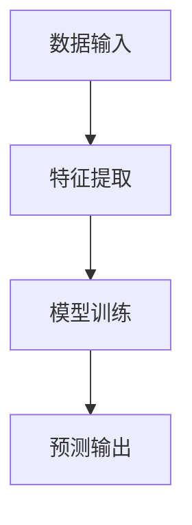
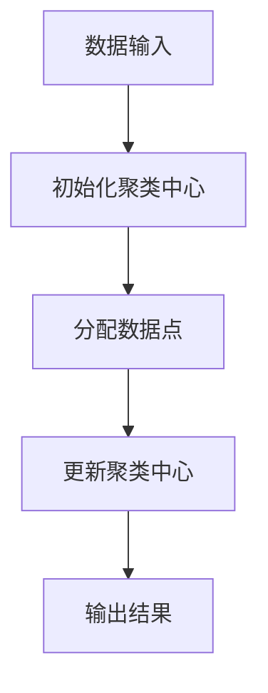
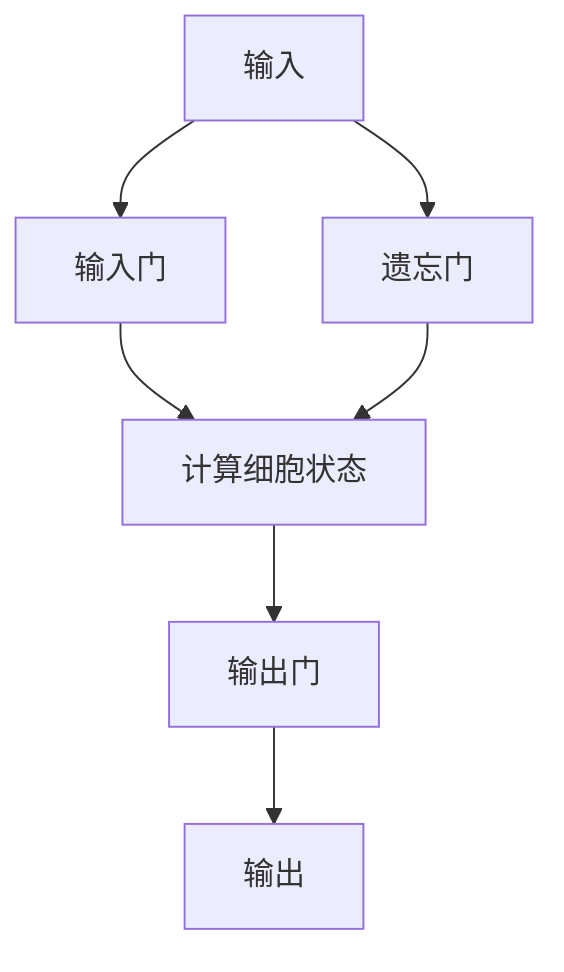

                 

# AI如何实现杰里米·格兰瑟姆的资源稀缺性投资

> 关键词：杰里米·格兰瑟姆, 资源稀缺性, AI, 投资, 深度学习, 机器学习, 时间序列分析

> 摘要：本文探讨了如何利用人工智能技术实现杰里米·格兰瑟姆提出的资源稀缺性投资策略。文章首先介绍了资源稀缺性投资的背景和AI在投资领域的应用，然后详细分析了AI的核心技术与算法原理，包括机器学习、深度学习和时间序列分析等。接着，文章构建了资源稀缺性投资的AI分析框架，并通过房地产和能源领域的具体案例展示了AI在资源稀缺性投资中的实际应用。最后，文章总结了AI在资源稀缺性投资中的优势与挑战，并展望了未来的发展方向。

---

# 第一部分: AI与资源稀缺性投资的背景与概述

## 第1章: 资源稀缺性投资的背景与概述

### 1.1 资源稀缺性投资的背景

#### 1.1.1 资源稀缺性的概念与特征
资源稀缺性是指某种资源的供应量有限，但市场需求却不断增长，导致其价格和价值持续上升的经济现象。资源稀缺性是投资的核心逻辑之一，因为它意味着资源的价值会随着时间的推移而增加。杰里米·格兰瑟姆在其投资理论中强调，资源稀缺性是长期投资的重要驱动力。

资源稀缺性的特征包括：
1. **不可再生性**：许多资源（如石油、天然气、某些金属）是不可再生的，随着时间的推移，它们的储量会逐渐减少。
2. **需求刚性**：人类对这些资源的需求往往是刚性的，尤其是在工业生产和日常生活中。
3. **价格敏感性**：由于供应有限，资源的价格往往表现出较大的波动性，且长期呈上升趋势。

#### 1.1.2 杰里米·格兰瑟姆投资理论的核心观点
杰里米·格兰瑟姆是著名的行为金融学家和投资策略师，他的资源稀缺性投资理论强调以下几点：
1. **资源稀缺性是价值的源泉**：资源的稀缺性直接决定了其市场价值，尤其是当需求超过供应时，资源的价值会显著上升。
2. **周期性与长期趋势**：资源价格虽然会受到短期市场波动的影响，但长期来看，稀缺性决定了其价格走势。
3. **投资机会的识别**：通过分析资源的供需关系、储量分布、技术进步等因素，可以识别出具有长期投资价值的资源。

#### 1.1.3 资源稀缺性与投资机会的关系
资源稀缺性与投资机会密切相关。稀缺的资源往往具有较高的市场价值和长期增长潜力，因此成为投资者关注的焦点。例如，黄金、房地产、稀有金属等都是典型的稀缺性资源，它们的投资价值往往高于非稀缺性资源。

---

### 1.2 AI在投资领域的应用

#### 1.2.1 AI的基本概念
人工智能（AI）是指计算机系统模拟人类智能的能力，包括学习、推理、问题解决和自适应等能力。AI的核心技术包括机器学习、自然语言处理、计算机视觉和强化学习等。

#### 1.2.2 AI在投资领域的应用
AI在投资领域的应用主要体现在以下几个方面：
1. **量化交易**：通过算法和模型，AI可以快速分析市场数据，识别交易机会。
2. **风险评估**：AI可以通过大数据分析，评估投资组合的风险，并提供优化建议。
3. **市场预测**：AI可以通过时间序列分析和深度学习模型，预测市场走势。
4. **资源稀缺性分析**：AI可以通过大数据和机器学习，分析资源的供需关系，识别稀缺性资源。

---

### 1.3 资源稀缺性投资中的AI优势

#### 1.3.1 数据处理能力
AI能够处理海量数据，包括历史价格、供需数据、市场情绪等，从而为投资者提供更全面的分析。

#### 1.3.2 模型预测能力
通过机器学习和深度学习模型，AI可以预测资源价格走势，识别投资机会。

#### 1.3.3 自动化交易
AI可以通过量化交易算法，自动执行交易指令，提高投资效率。

---

## 第2章: AI的核心技术与算法原理

### 2.1 机器学习的核心算法

#### 2.1.1 监督学习
监督学习是一种基于标记数据的机器学习方法，通过训练模型预测目标变量。例如，可以使用线性回归模型预测资源价格。

##### 线性回归模型
线性回归是一种简单的监督学习算法，用于预测连续型变量。其数学模型为：
$$ y = \beta_0 + \beta_1 x + \epsilon $$
其中，$y$ 是目标变量，$x$ 是输入变量，$\beta_0$ 和 $\beta_1$ 是模型参数，$\epsilon$ 是误差项。

##### 逻辑回归模型
逻辑回归用于分类问题，例如将资源价格分为“上涨”或“下跌”。其数学模型为：
$$ P(y=1|x) = \frac{e^{\beta_0 + \beta_1 x}}{1 + e^{\beta_0 + \beta_1 x}} $$

---

#### 2.1.2 无监督学习
无监督学习是一种基于未标记数据的机器学习方法，通过聚类分析发现数据中的潜在结构。例如，可以使用K-means算法将资源市场分为不同的类别。

##### K-means聚类算法
K-means是一种简单的聚类算法，其步骤如下：
1. 初始化聚类中心。
2. 计算每个数据点到聚类中心的距离。
3. 将数据点分配到最近的聚类中心。
4. 更新聚类中心。
5. 重复步骤2-4，直到聚类中心不再变化。

---

#### 2.1.3 深度学习
深度学习是一种基于人工神经网络的机器学习方法，通过多层非线性变换提取数据特征。例如，可以使用卷积神经网络（CNN）进行图像识别，或者使用循环神经网络（RNN）进行时间序列分析。

##### 卷积神经网络（CNN）
CNN用于图像识别，其核心组件包括卷积层、池化层和全连接层。

##### 循环神经网络（RNN）
RNN用于时间序列分析，其核心组件包括循环层和长短期记忆（LSTM）层。

---

### 2.2 时间序列分析

#### 2.2.1 时间序列分析的背景
时间序列分析是一种基于时间数据的分析方法，广泛应用于金融、经济和投资领域。例如，可以通过时间序列分析预测资源价格的未来走势。

#### 2.2.2 时间序列分析的核心算法
##### ARIMA模型
ARIMA（自回归积分滑动平均模型）是一种广泛应用于时间序列预测的统计模型。其数学模型为：
$$ y_t = c + \phi_1 y_{t-1} + \dots + \phi_p y_{t-p} + \theta_1 \epsilon_{t-1} + \dots + \theta_q \epsilon_{t-q} + \epsilon_t $$

##### LSTM网络
LSTM（长短期记忆网络）是一种基于深度学习的时间序列分析模型。其核心组件包括输入门、遗忘门和输出门。

---

## 第3章: 资源稀缺性投资的AI分析框架

### 3.1 数据采集与预处理

#### 3.1.1 数据来源
资源稀缺性投资的AI分析框架需要收集以下数据：
- 历史价格数据
- 供需数据
- 技术数据
- 市场情绪数据

#### 3.1.2 数据预处理
数据预处理包括数据清洗、特征提取和数据标准化。

---

### 3.2 AI模型构建与训练

#### 3.2.1 模型选择
根据数据特征和分析目标选择合适的AI模型。例如，使用线性回归模型进行价格预测，或者使用LSTM网络进行时间序列分析。

#### 3.2.2 模型训练
通过训练数据对模型进行参数优化，使其能够准确预测资源价格。

---

### 3.3 模型评估与优化

#### 3.3.1 模型评估
通过测试数据对模型进行评估，包括准确率、召回率和F1值等指标。

#### 3.3.2 模型优化
通过调整模型参数和优化算法，提高模型的预测精度。

---

## 第4章: AI在资源稀缺性投资中的应用案例

### 4.1 房地产投资中的AI应用

#### 4.1.1 房地产市场分析
通过AI分析房地产市场的供需关系，识别具有投资价值的区域。

#### 4.1.2 房地产价格预测
使用机器学习模型预测房地产价格走势。

### 4.2 能源投资中的AI应用

#### 4.2.1 能源市场分析
通过AI分析能源市场的供需关系，识别具有投资价值的能源资源。

#### 4.2.2 能源价格预测
使用时间序列分析模型预测能源价格走势。

---

## 第5章: 项目实战

### 5.1 项目环境安装

#### 5.1.1 安装Python
安装Python编程语言，版本建议为3.8或更高。

#### 5.1.2 安装机器学习库
安装Scikit-learn、TensorFlow和Keras等机器学习库。

#### 5.1.3 安装数据可视化库
安装Matplotlib和Seaborn等数据可视化库。

---

### 5.2 系统核心实现

#### 5.2.1 数据获取
从公开数据源获取资源价格数据。

#### 5.2.2 数据预处理
对数据进行清洗和特征提取。

#### 5.2.3 模型训练
使用机器学习模型对数据进行训练。

#### 5.2.4 模型预测
使用训练好的模型进行资源价格预测。

---

## 第6章: 总结与展望

### 6.1 总结
本文探讨了如何利用AI实现杰里米·格兰瑟姆提出的资源稀缺性投资策略。通过机器学习和深度学习技术，AI能够帮助投资者识别稀缺性资源，提高投资效率。

### 6.2 展望
未来，随着AI技术的不断发展，资源稀缺性投资将更加依赖于AI技术。投资者需要不断学习和应用新的AI技术，以应对市场的变化和挑战。

---

作者：AI天才研究院/AI Genius Institute & 禅与计算机程序设计艺术 /Zen And The Art of Computer Programming

