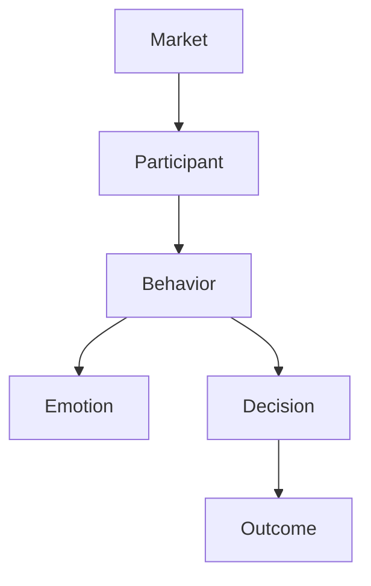
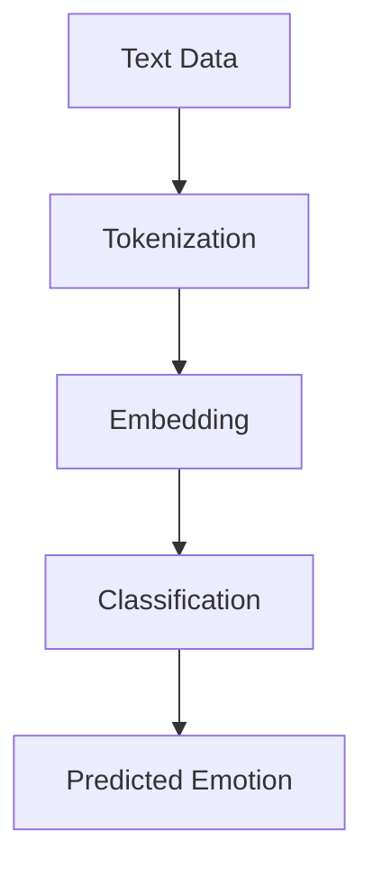
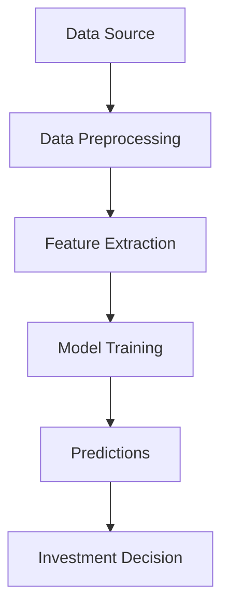

                 

# AI如何实现格雷厄姆的Mr. Market理论

## 关键词：AI, Mr. Market, 投资理论, 市场情绪分析, 机器学习, 金融预测

## 摘要：本文探讨了如何利用人工智能技术实现格雷厄姆的Mr. Market理论，分析了市场情绪对投资决策的影响，并详细介绍了AI在情绪分析、时间序列预测和强化学习中的应用。通过理论与实践结合，展示了AI如何模拟市场参与者的决策过程，为投资者提供科学的决策支持。

---

# 第1章: 背景介绍

## 1.1 Mr. Market理论概述

### 1.1.1 Mr. Market理论的核心概念

Mr. Market理论由本杰明·格雷厄姆提出，认为市场情绪波动会影响股票价格。市场情绪可以分为乐观和悲观两种状态，投资者应基于长期价值而非短期情绪波动进行投资决策。

### 1.1.2 格雷厄姆投资理论的背景与意义

格雷厄姆是价值投资的鼻祖，他的理论强调安全边际和长期投资。在现代金融学中，Mr. Market理论为投资者提供了独特的视角，帮助他们在市场波动中做出理性决策。

### 1.1.3 AI在金融投资中的潜力与应用

人工智能技术的发展为金融投资提供了新的工具。通过自然语言处理（NLP）和机器学习，AI能够分析市场情绪、预测价格走势，为投资者提供数据支持。

## 1.2 AI的基本概念与技术基础

### 1.2.1 人工智能的定义与分类

人工智能（AI）是模拟人类智能的技术，包括机器学习、自然语言处理、计算机视觉等领域。在金融投资中，AI主要用于数据处理、模式识别和决策支持。

### 1.2.2 机器学习与深度学习的核心原理

机器学习通过数据训练模型，使其能够自动识别模式。深度学习是机器学习的一种，利用多层神经网络进行特征提取，常用于复杂数据处理。

### 1.2.3 自然语言处理（NLP）在金融分析中的应用

NLP技术可以分析文本数据，提取情感倾向。在金融领域，NLP常用于社交媒体分析，预测市场情绪对股价的影响。

## 1.3 Mr. Market理论与AI的结合思路

### 1.3.1 市场情绪分析的AI实现

通过NLP技术分析新闻、社交媒体等文本数据，提取市场情绪指标，模拟Mr. Market的情绪变化。

### 1.3.2 AI如何模拟市场参与者的决策过程

利用强化学习模型模拟投资者的决策过程，训练模型在不同市场环境下做出最优选择。

### 1.3.3 AI在价值投资中的潜在应用

AI可以通过大数据分析，识别具有长期投资价值的公司，帮助投资者做出理性决策。

## 1.4 本章小结

本章介绍了Mr. Market理论和AI的基本概念，探讨了AI在投资中的潜力。通过AI技术，我们可以更精确地分析市场情绪，模拟投资者决策，为价值投资提供支持。

---

# 第2章: Mr. Market理论的核心概念与分析

## 2.1 Mr. Market模型的结构与属性

### 2.1.1 Mr. Market模型的实体关系图（ER图）

### 2.1.2 Mr. Market模型与传统金融模型的对比

| 对比维度 | Mr. Market模型 | 传统金融模型 |
|----------|----------------|--------------|
| 输入数据 | 市场情绪、行为 | 价格、交易量 |
| 输出结果 | 市场情绪预测 | 价格预测 |
| 假设基础 | 市场情绪驱动 | 理性假设驱动 |

## 2.2 市场情绪分析的AI实现

### 2.2.1 市场情绪分析的算法选择

常用的市场情绪分析算法包括情感分类、主题建模和时间序列分析。情感分类用于判断文本情绪，主题建模用于识别市场主题，时间序列分析用于预测情绪变化。

### 2.2.2 基于NLP的情绪分析流程

### 2.2.3 情感分类的数学模型

情感分类可以通过逻辑回归或支持向量机（SVM）实现。以逻辑回归为例，其损失函数为：

$$ L = -\sum_{i=1}^{n} [y_i \ln p_i + (1-y_i) \ln (1-p_i)] $$

其中，$y_i$为真实标签，$p_i$为预测概率。

## 2.3 本章小结

本章详细分析了Mr. Market模型的结构和属性，探讨了AI实现市场情绪分析的算法和流程，并通过数学模型展示了情感分类的实现方法。

---

# 第3章: AI实现Mr. Market理论的算法原理

## 3.1 情绪分析算法

### 3.1.1 基于NLP的情感分类

使用预训练模型如BERT进行情感分类，提取文本特征后进行分类。

### 3.1.2 情感分类的评估指标

准确率、精确率、召回率和F1分数是常用的评估指标。

## 3.2 时间序列分析算法

### 3.2.1 基于LSTM的时间序列预测

长短时记忆网络（LSTM）适合处理时间序列数据，用于预测市场情绪变化。

### 3.2.2 LSTM的数学模型

LSTM的细胞状态更新公式为：

$$ c_t = \beta c_{t-1} + (1-\beta)c_{t-1} $$

其中，$\beta$为遗忘门输出。

## 3.3 强化学习算法

### 3.3.1 Q-Learning在投资决策中的应用

通过Q-Learning模拟投资者决策，训练智能体在不同市场环境下做出最优选择。

### 3.3.2 Q-Learning的数学模型

Q值更新公式为：

$$ Q(s, a) = Q(s, a) + \alpha [r + \gamma \max Q(s', a')] $$

其中，$\alpha$为学习率，$\gamma$为折扣因子。

## 3.4 本章小结

本章详细讲解了实现Mr. Market理论的三种算法，包括情感分类、时间序列分析和强化学习，并通过数学模型展示了它们的工作原理。

---

# 第4章: 系统架构设计与实现

## 4.1 系统功能设计

### 4.1.1 数据采集模块

从新闻网站、社交媒体等来源获取市场相关信息。

### 4.1.2 情绪分析模块

使用NLP技术分析文本数据，提取市场情绪指标。

### 4.1.3 投资决策模块

基于情绪分析结果，生成投资策略。

## 4.2 系统架构设计

## 4.3 系统接口设计

### 4.3.1 数据接口

从API获取市场数据，如社交媒体情绪指数。

### 4.3.2 模型接口

将训练好的模型部署为API，供其他系统调用。

## 4.4 系统交互流程

### 4.4.1 用户输入市场数据

用户输入市场数据，系统进行预处理和特征提取。

### 4.4.2 模型训练与预测

系统基于训练数据生成情绪预测结果，指导投资决策。

## 4.5 本章小结

本章设计了一个完整的AI系统，用于实现Mr. Market理论，详细描述了系统的功能模块、架构设计和交互流程。

---

# 第5章: 项目实战与案例分析

## 5.1 项目实战

### 5.1.1 环境安装

安装Python、TensorFlow、Keras等必要的库。

### 5.1.2 核心代码实现

编写情感分类和时间序列预测的代码，训练模型并进行预测。

### 5.1.3 代码解读与分析

详细解读代码实现，分析模型的准确性和预测效果。

## 5.2 案例分析

### 5.2.1 案例背景

选择一个具体市场环境，如2020年新冠疫情市场。

### 5.2.2 数据分析与预测

分析社交媒体数据，预测市场情绪变化，并与实际市场数据对比。

## 5.3 项目小结

本章通过实际项目展示了AI实现Mr. Market理论的应用，验证了模型的有效性。

---

# 第6章: 最佳实践与总结

## 6.1 最佳实践

### 6.1.1 数据质量的重要性

高质量的数据是模型准确性的关键。

### 6.1.2 模型选择与调优

根据具体问题选择合适的算法，并进行参数调优。

## 6.2 总结

AI技术为实现Mr. Market理论提供了新的可能性。通过市场情绪分析和投资决策模拟，AI能够帮助投资者做出更科学的决策。

## 6.3 未来展望

随着技术进步，AI在金融投资中的应用将更加广泛，Mr. Market理论也将得到更深入的实现。

---

# 作者：AI天才研究院/AI Genius Institute & 禅与计算机程序设计艺术 /Zen And The Art of Computer Programming

---

通过以上思考，我们系统地分析了AI实现Mr. Market理论的各个方面，从理论基础到算法实现，再到系统设计和项目实战，为读者提供了全面的指导和深入的分析。

