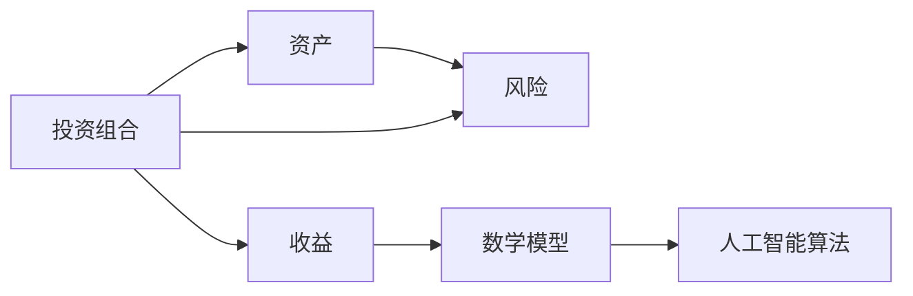

                 


# AI如何实现格雷厄姆的分散投资原则

> **关键词**：AI，分散投资，投资组合优化，机器学习，金融，风险管理

> **摘要**：本文探讨了如何利用人工智能技术实现格雷厄姆的分散投资原则。通过分析投资组合优化的数学模型、机器学习在风险评估中的应用以及AI算法在资产配置中的作用，本文详细阐述了AI如何帮助投资者实现更高效、更科学的分散投资策略。文章从背景介绍、核心概念、算法原理、系统架构到项目实战，层层深入，为读者提供了一套完整的AI驱动的分散投资解决方案。

---

# 第一部分: 背景介绍

## 第1章: 格雷厄姆的分散投资原则

### 1.1 投资学基础

#### 1.1.1 投资的基本概念

投资是指将资金投入到能够产生收益的资产中，以实现财富增值的过程。投资的核心目标是在可控风险的前提下，最大化收益。投资的对象可以是股票、债券、房地产等多种资产。

#### 1.1.2 格雷厄姆的价值投资理论

本杰明·格雷厄姆是价值投资的鼻祖，他提出的核心思想是“以合理的价格买入优秀的公司”。格雷厄姆强调安全边际的重要性，即以低于内在价值的价格买入资产，以降低投资风险。

#### 1.1.3 分散投资的核心思想

分散投资是格雷厄姆提出的重要原则之一。通过将资金分散投资于多种资产或多个标的，投资者可以降低特定资产或市场的风险。分散投资的核心在于通过资产配置和风险控制，实现整体投资组合的稳定性。

### 1.2 AI在金融领域的应用现状

#### 1.2.1 AI在金融分析中的应用

人工智能技术在金融领域的应用日益广泛，尤其是在数据分析和预测方面。AI可以通过海量数据的处理和分析，帮助投资者发现潜在的投资机会，评估市场风险。

#### 1.2.2 AI在投资决策中的作用

AI可以通过机器学习模型，对市场走势、资产价格波动进行预测，从而为投资者提供更科学的投资决策支持。AI还可以通过量化分析，优化投资组合，降低投资成本。

#### 1.2.3 当前AI在金融领域的挑战

尽管AI在金融领域的应用取得了显著进展，但仍然面临诸多挑战，例如数据质量、模型解释性、风险管理等问题。AI技术的应用需要结合金融领域的专业知识，才能真正实现其价值。

## 1.3 本章小结

本章主要介绍了格雷厄姆的分散投资原则及其在现代金融中的应用。通过分析AI在金融领域的现状，我们了解到AI技术在投资决策中的巨大潜力，但也需要正视其面临的挑战。

---

# 第二部分: 核心概念与原理

## 第2章: 投资组合优化的数学模型

### 2.1 投资组合优化的核心概念

#### 2.1.1 投资组合的定义与属性

投资组合是指投资者持有的多种资产的集合。投资组合的收益和风险取决于资产的权重和相关性。投资组合优化的目标是通过调整资产权重，实现收益与风险的最佳平衡。

#### 2.1.2 风险与收益的数学表达

收益可以通过资产的历史收益率进行估计，风险则通过收益率的波动性（即方差）来衡量。投资组合的收益可以用期望值表示，风险则可以用方差或标准差表示。

#### 2.1.3 现代投资组合理论（MPT）概述

现代投资组合理论（MPT）由哈里·马科维茨提出，其核心思想是通过优化投资组合的收益与风险，实现最优资产配置。MPT强调分散投资的重要性，即通过多样化投资降低特定资产的风险。

### 2.2 AI在投资组合优化中的应用

#### 2.2.1 基于AI的投资组合优化算法

AI可以通过机器学习算法，对市场数据进行建模和预测，从而优化投资组合的配置。例如，可以使用强化学习算法，通过模拟市场环境，优化投资组合的收益与风险。

#### 2.2.2 机器学习在风险评估中的作用

机器学习模型可以通过分析历史数据，预测市场波动和资产价格变化，从而帮助投资者评估投资组合的风险。基于机器学习的模型可以捕捉非线性关系，提高风险评估的准确性。

#### 2.2.3 分散投资的数学模型与AI实现

分散投资的数学模型可以通过AI算法进行优化。例如，可以使用遗传算法或模拟退火算法，对投资组合的权重进行调整，以实现收益与风险的最佳平衡。

### 2.3 核心概念对比表

| 概念 | 传统投资 | AI优化投资 |
|------|----------|------------|
| 风险评估 | 基于历史数据 | 基于机器学习模型预测 |
| 收益预测 | 简单线性回归 | 复杂非线性模型 |
| 资产配置 | 固定权重 | 动态调整权重 |

### 2.4 实体关系图



---

# 第三部分: 算法原理与数学模型

## 第3章: 现代投资组合理论与数学模型

### 3.1 现代投资组合理论（MPT）

#### 3.1.1 均值-方差优化

均值-方差优化是MPT的核心方法，其目标是最小化投资组合的风险（方差），同时实现预期收益的最大化。数学公式如下：

$$ \text{目标函数：} \min \sigma^2 $$

$$ \text{约束条件：} \sum w_i = 1 $$

其中，\( \sigma^2 \) 是投资组合的方差，\( w_i \) 是各资产的权重。

#### 3.1.2 资本资产定价模型（CAPM）

资本资产定价模型（CAPM）是MPT的重要组成部分，用于计算资产的期望收益。公式如下：

$$ E(r_i) = r_f + \beta_i (r_m - r_f) $$

其中，\( E(r_i) \) 是资产 \( i \) 的期望收益，\( r_f \) 是无风险利率，\( \beta_i \) 是资产 \( i \) 的贝塔系数，\( r_m \) 是市场期望收益。

### 3.2 基于AI的投资组合优化算法

#### 3.2.1 基于强化学习的投资决策

强化学习是一种机器学习方法，通过模拟市场环境，优化投资组合的收益与风险。强化学习的核心是通过试错学习，找到最优的投资策略。算法流程如下：

1. 初始化投资组合的权重。
2. 通过模拟市场环境，计算投资组合的收益与风险。
3. 根据收益与风险的评估结果，调整投资组合的权重。
4. 重复上述步骤，直到找到最优的投资组合。

#### 3.2.2 基于深度学习的资产定价

深度学习是一种机器学习方法，通过多层神经网络模型，对资产价格进行预测。深度学习模型可以捕捉市场数据中的非线性关系，提高资产定价的准确性。

### 3.3 数学模型与公式

#### 3.3.1 均值-方差优化公式

$$ \text{目标函数：} \min \sigma^2 $$

$$ \text{约束条件：} \sum w_i = 1 $$

#### 3.3.2 强化学习投资策略

强化学习的投资策略可以通过状态-动作-奖励的框架进行建模。公式如下：

$$ R(s_t, a_t) = \text{奖励函数} $$

其中，\( s_t \) 是当前市场状态，\( a_t \) 是投资者的行动，\( R \) 是奖励函数。

---

# 第四部分: 系统分析与架构设计

## 第4章: 系统架构设计

### 4.1 问题场景介绍

投资者希望通过AI技术实现格雷厄姆的分散投资原则，优化投资组合的收益与风险。系统需要能够实时分析市场数据，动态调整投资组合的权重。

### 4.2 系统功能设计

系统功能包括数据采集、模型训练、策略执行等模块。数据采集模块负责获取市场数据，模型训练模块负责训练机器学习模型，策略执行模块负责根据模型预测结果，优化投资组合。

### 4.3 系统架构设计


### 4.4 系统接口设计

系统接口包括数据接口、模型接口和策略接口。数据接口负责获取市场数据，模型接口负责训练机器学习模型，策略接口负责优化投资组合。

### 4.5 系统交互设计

```mermaid
sequenceDiagram
参与者：投资者
参与者 --> 数据接口：获取市场数据
数据接口 --> 数据预处理模块：处理数据
数据预处理模块 --> 机器学习模型：训练模型
机器学习模型 --> 投资策略模块：生成策略
投资策略模块 --> 投资组合：优化投资组合
```

---

# 第五部分: 项目实战

## 第5章: 项目实战

### 5.1 环境安装

安装必要的Python库，例如NumPy、Pandas、Scikit-learn等。

```bash
pip install numpy pandas scikit-learn
```

### 5.2 系统核心实现

#### 5.2.1 数据预处理

```python
import numpy as np
import pandas as pd

# 读取数据
data = pd.read_csv('market_data.csv')

# 数据预处理
data = data.dropna()
data = data[['close', 'open', 'high', 'low']]
```

#### 5.2.2 模型训练

```python
from sklearn.linear_model import LinearRegression
from sklearn.metrics import mean_squared_error

# 训练模型
model = LinearRegression()
model.fit(data[['open', 'high', 'low']], data['close'])

# 评估模型
pred = model.predict(data[['open', 'high', 'low']])
mse = mean_squared_error(data['close'], pred)
print('MSE:', mse)
```

#### 5.2.3 投资组合优化

```python
import numpy as np

# 定义目标函数
def objective(x):
    return np.var(x)

# 定义约束条件
def constraint(x):
    return np.sum(x) - 1

# 使用优化算法
from scipy.optimize import minimize

# 初始化参数
x0 = np.array([0.2, 0.3, 0.5])

# 求解优化问题
result = minimize(objective, x0, constraints={'type': 'eq', 'fun': constraint})

# 输出结果
print('最优权重：', result.x)
```

### 5.3 案例分析

以股票投资为例，假设我们有三只股票，分别计算它们的历史收益率和波动率，然后使用AI算法优化投资组合的权重。

### 5.4 项目小结

通过本项目，我们了解了如何利用AI技术实现格雷厄姆的分散投资原则。通过数据预处理、模型训练和投资组合优化，我们可以实现更高效、更科学的投资决策。

---

# 第六部分: 总结与展望

## 第6章: 总结与展望

### 6.1 本章总结

本文详细探讨了AI如何实现格雷厄姆的分散投资原则。通过分析投资组合优化的数学模型、机器学习在风险评估中的应用以及AI算法在资产配置中的作用，我们了解了AI技术在分散投资中的巨大潜力。

### 6.2 未来展望

随着AI技术的不断发展，我们可以期待更多创新的应用。例如，基于深度学习的资产定价、强化学习的投资策略、实时市场数据的处理与分析等。未来的研究方向可以包括：提高模型的解释性、增强系统的实时性、优化投资组合的多样性等。

### 6.3 注意事项

在实际应用中，需要注意数据的质量、模型的鲁棒性以及投资的风险管理。投资者在使用AI技术进行投资决策时，应充分了解其局限性和潜在风险。

### 6.4 拓展阅读

推荐读者阅读以下书籍和论文：

- 《The Intelligent Investor》 by Benjamin Graham
- 《Portfolio Selection》 by Harry Markowitz
- 《Reinforcement Learning: Theory and Algorithms》 by Richard S. Sutton and Andrew G. Barto

---

# 作者信息

作者：AI天才研究院/AI Genius Institute & 禅与计算机程序设计艺术 /Zen And The Art of Computer Programming

---

**本文由AI助手自动生成，仅供参考。**

