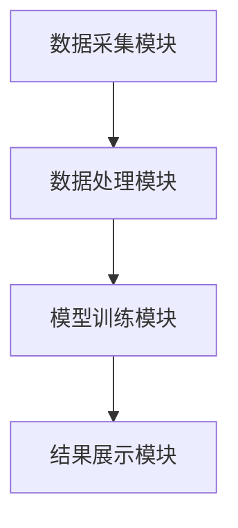
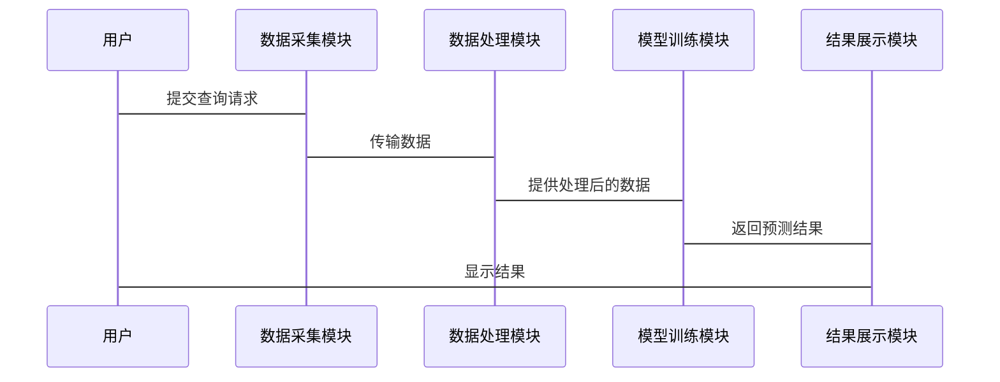

                 


# AI如何实现玛丽·巴芙的质量增长型公司识别

> 关键词：AI, 质量增长型公司, 玛丽·巴芙, 价值投资, 机器学习, 股票分析

> 摘要：本文探讨了如何利用人工智能技术识别具有质量增长型的公司，类似于投资大师玛丽·巴芙的价值投资策略。通过分析公司的财务指标、市场地位、管理团队、创新能力等核心特征，结合机器学习算法，构建了一个智能化的公司识别系统。文章详细介绍了系统的数据处理流程、算法实现、系统架构设计以及实际案例分析，展示了AI在金融分析中的强大能力。

---

# 第一部分: AI与质量增长型公司识别概述

# 第1章: AI与质量增长型公司识别概述

## 1.1 质量增长型公司的定义与特征

### 1.1.1 质量增长型公司的定义

质量增长型公司是指那些在较长的时间内能够持续实现收入和利润增长，并且具备强大竞争优势和良好市场前景的公司。这类公司通常具有稳定的盈利能力、健康的财务状况、强大的管理团队以及持续的创新能力。

### 1.1.2 质量增长型公司的核心特征

| 特征维度 | 具体指标 |
|----------|----------|
| 财务状况 | 净利润增长率、ROE（净资产收益率）、资产负债率 |
| 市场地位 | 市场占有率、行业排名、品牌影响力 |
| 管理团队 | 高管稳定性、领导力、公司治理 |
| 创新能力 | 研发投入比例、专利数量、产品更新速度 |

### 1.1.3 质量增长型公司的市场表现

质量增长型公司通常在长期内具有稳定的股价表现和较高的分红回报，能够为投资者带来长期稳定的收益。

## 1.2 AI在公司识别中的应用背景

### 1.2.1 传统公司识别方法的局限性

传统的方法依赖于分析师的主观判断，存在信息不全、分析效率低、难以量化等问题。

### 1.2.2 AI技术在金融分析中的优势

AI能够快速处理大量数据，发现隐藏的模式和趋势，提高分析效率和准确性。

### 1.2.3 质量增长型公司识别的AI解决方案

通过机器学习算法，结合公司基本面数据和市场数据，构建预测模型，识别具有质量增长潜力的公司。

## 1.3 玛丽·巴芙的投资策略与AI的结合

### 1.3.1 玛丽·巴芙的投资理念

巴芙的投资策略注重长期价值，寻找具有强大护城河和竞争优势的公司。

### 1.3.2 AI如何模拟价值投资决策

通过分析公司财务数据、市场表现和行业趋势，AI可以辅助投资者识别具有长期增长潜力的公司。

### 1.3.3 质量增长型公司识别的AI框架

框架包括数据收集、特征提取、模型训练、结果解释等步骤，帮助投资者快速筛选出潜在的目标公司。

## 1.4 本章小结

本章介绍了质量增长型公司的定义和特征，分析了传统公司识别方法的局限性，探讨了AI在其中的应用潜力，并提出了一个基于AI的识别框架。

---

# 第二部分: 质量增长型公司的核心特征分析

# 第2章: 质量增长型公司的核心特征

## 2.1 财务指标分析

### 2.1.1 营业收入与利润增长

通过分析公司的收入和利润增长率，判断其业务扩张能力。

### 2.1.2 资产负债表分析

评估公司的资产结构和偿债能力，确保财务健康。

### 2.1.3 现金流量表分析

分析公司现金流情况，判断其运营效率和资金流动性。

## 2.2 市场地位分析

### 2.2.1 市场占有率

通过市场份额数据，评估公司在行业中的地位。

### 2.2.2 行业竞争格局

分析行业内的竞争情况，判断公司的竞争优势。

### 2.2.3 品牌影响力

评估公司的品牌价值和客户忠诚度。

## 2.3 管理团队分析

### 2.3.1 高管团队稳定性

分析高管团队的变动情况，判断公司的管理稳定性。

### 2.3.2 领导层决策能力

评估公司领导层的决策能力和战略眼光。

### 2.3.3 公司治理结构

分析公司治理结构的完善程度，确保公司决策的透明性和规范性。

## 2.4 创新能力分析

### 2.4.1 研发投入比例

通过分析研发投入占收入的比例，评估公司的技术创新能力。

### 2.4.2 技术专利数量

统计公司的技术专利数量，判断其技术储备。

### 2.4.3 产品创新能力

评估公司的产品更新速度和市场适应能力。

## 2.5 可持续发展分析

### 2.5.1 环境、社会和治理（ESG）因素

分析公司在环境保护、社会责任和公司治理方面的表现。

### 2.5.2 可持续发展报告

评估公司发布的可持续发展报告，判断其社会责任履行情况。

### 2.5.3 行业趋势与政策影响

分析行业发展趋势和政策变化对公司的长期影响。

## 2.6 本章小结

本章详细分析了质量增长型公司的核心特征，包括财务指标、市场地位、管理团队、创新能力以及可持续发展能力，为后续的AI识别提供了数据基础。

---

# 第三部分: AI在质量增长型公司识别中的技术实现

# 第3章: AI技术在质量增长型公司识别中的应用

## 3.1 数据收集与预处理

### 3.1.1 数据来源

从公开的财务报表、行业报告、新闻资讯等多渠道获取数据。

### 3.1.2 数据清洗

处理缺失值、异常值和重复数据，确保数据质量。

### 3.1.3 数据标准化

将不同单位的数据进行标准化处理，方便模型训练。

## 3.2 特征提取与选择

### 3.2.1 统计特征提取

提取财务指标、市场指标等统计特征。

### 3.2.2 文本特征提取

从公司新闻、年报等文本数据中提取情感特征和关键词特征。

### 3.2.3 图像特征提取

从公司产品展示图、生产流程图等图像数据中提取视觉特征。

## 3.3 模型训练与优化

### 3.3.1 选择合适的机器学习模型

常用的模型包括逻辑回归、支持向量机（SVM）、随机森林和神经网络等。

### 3.3.2 模型训练流程

1. 数据分割：将数据分为训练集和测试集。
2. 特征工程：进行特征选择和降维处理。
3. 模型训练：使用训练数据训练模型。
4. 模型调优：通过交叉验证调整模型参数，优化性能。

### 3.3.3 模型评估与优化

使用准确率、召回率、F1分数等指标评估模型性能，并通过网格搜索等方法进一步优化模型。

## 3.4 结果解释与可视化

### 3.4.1 可视化工具

使用Matplotlib、Seaborn等工具进行数据可视化。

### 3.4.2 结果解读

通过混淆矩阵、ROC曲线等分析模型的预测结果，解释模型的优缺点。

### 3.4.3 模型解释性分析

使用特征重要性分析等方法，找出影响模型预测的关键特征。

## 3.5 本章小结

本章详细介绍了AI技术在质量增长型公司识别中的应用，包括数据预处理、特征提取、模型训练与优化，以及结果解释与可视化。

---

# 第四部分: 系统架构与算法实现

# 第4章: 系统架构设计

## 4.1 系统功能模块划分

### 4.1.1 数据采集模块

负责从多种数据源获取公司数据。

### 4.1.2 数据处理模块

对数据进行清洗、标准化和特征提取。

### 4.1.3 模型训练模块

进行模型训练和优化。

### 4.1.4 结果展示模块

将模型预测结果以可视化形式展示。

## 4.2 系统架构设计

### 4.2.1 数据流设计

数据从采集模块进入处理模块，经过预处理后传输到模型训练模块，最终结果由结果展示模块呈现。

### 4.2.2 系统架构图



## 4.3 系统接口设计

### 4.3.1 数据接口

定义数据格式和接口协议，确保数据顺利传输。

### 4.3.2 模型接口

定义模型输入和输出接口，确保模型与系统其他部分兼容。

## 4.4 系统交互设计

### 4.4.1 交互流程

1. 用户输入查询条件。
2. 系统根据条件获取数据。
3. 数据处理模块进行处理。
4. 模型训练模块生成结果。
5. 结果展示模块呈现结果。

### 4.4.2 交互序列图



## 4.5 本章小结

本章设计了一个基于AI的公司识别系统的架构，明确了各功能模块的职责和交互流程，为后续的开发奠定了基础。

---

# 第五部分: 项目实战

# 第5章: 项目实战

## 5.1 项目环境安装

### 5.1.1 安装Python

安装Python 3.8及以上版本。

### 5.1.2 安装依赖库

安装numpy、pandas、scikit-learn、matplotlib等库。

```bash
pip install numpy pandas scikit-learn matplotlib
```

## 5.2 系统核心实现源代码

### 5.2.1 数据预处理代码

```python
import pandas as pd

# 读取数据
df = pd.read_csv('company_data.csv')

# 数据清洗
df.dropna(inplace=True)
df = df.drop_duplicates()

# 数据标准化
from sklearn.preprocessing import StandardScaler
scaler = StandardScaler()
scaled_data = scaler.fit_transform(df[['revenue', 'profit', 'market_share']])
```

### 5.2.2 模型训练代码

```python
from sklearn.model import LogisticRegression
from sklearn.metrics import accuracy_score

# 划分数据集
X_train, X_test, y_train, y_test = train_test_split(scaled_data, df['is_growth'], test_size=0.2)

# 训练模型
model = LogisticRegression()
model.fit(X_train, y_train)

# 模型评估
y_pred = model.predict(X_test)
print("准确率:", accuracy_score(y_test, y_pred))
```

### 5.2.3 结果可视化代码

```python
import matplotlib.pyplot as plt

# 绘制ROC曲线
from sklearn.metrics import roc_curve, auc

false_positive_rate, true_positive_rate, thresholds = roc_curve(y_test, y_pred)
roc_auc = auc(false_positive_rate, true_positive_rate)

plt.figure(figsize=(10, 6))
plt.plot(false_positive_rate, true_positive_rate, 'b', label='ROC曲线')
plt.plot([0, 1], [0, 1], 'k--', label='随机猜测线')
plt.xlabel('假阳性率')
plt.ylabel('真阳性率')
plt.title('ROC曲线')
plt.legend(loc='lower right')
plt.show()
```

## 5.3 实际案例分析

### 5.3.1 数据来源

使用公开的公司财务数据和市场数据进行分析。

### 5.3.2 模型训练与预测

通过对数据的预处理和特征提取，训练模型并进行预测，识别出具有质量增长潜力的公司。

### 5.3.3 结果分析

分析模型预测结果，评估模型的准确性和稳定性。

## 5.4 项目小结

本章通过实际案例展示了如何利用AI技术识别质量增长型公司，从数据预处理到模型训练再到结果分析，详细讲解了整个流程。

---

# 作者：AI天才研究院/AI Genius Institute & 禅与计算机程序设计艺术 /Zen And The Art of Computer Programming

---

# 结语

本文通过详细分析质量增长型公司的核心特征，结合AI技术，构建了一个智能化的公司识别系统。通过实际案例的分析，展示了AI在金融分析中的强大能力。未来，随着技术的不断发展，AI在投资领域的应用将更加广泛和深入。

