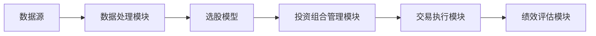
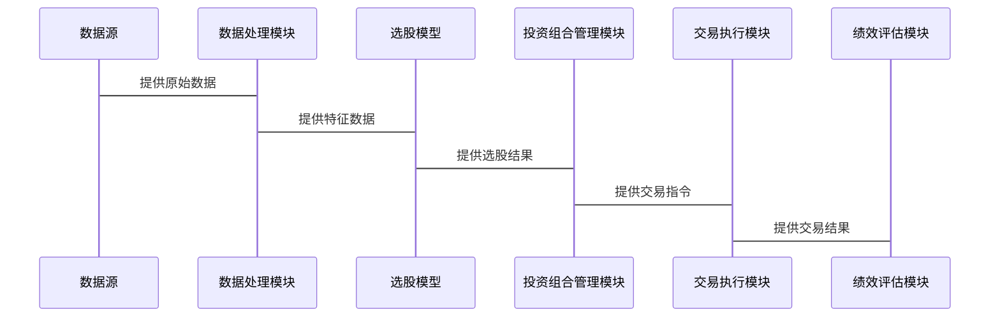

                 


# AI如何实现费雪的长期持股策略

## 关键词：AI, 费雪策略, 长期持股, 投资, 机器学习, 数据分析

## 摘要：本文详细探讨如何利用人工智能技术实现费雪的长期持股策略。通过分析费雪的投资理念，结合AI在选股、组合管理和风险控制中的应用，构建一个基于AI的长期持股投资系统。文章从AI在投资中的核心概念、费雪策略的AI实现、系统架构设计到项目实战，全面阐述了AI在实现费雪长期持股策略中的作用和方法。

---

# 第1章 AI在投资领域的应用与费雪投资理念概述

## 1.1 AI在投资中的核心作用

AI在投资中的应用主要体现在以下几个方面：

### 1.1.1 数据分析与预测
AI能够处理海量数据，利用机器学习算法进行市场趋势预测和个股分析。

### 1.1.2 自动化交易
AI可以实时监控市场动态，根据模型生成交易信号，实现自动化交易。

### 1.1.3 风险管理
AI通过分析历史数据和市场波动，帮助投资者进行风险评估和管理。

## 1.2 费雪投资理念的核心思想

菲德烈希·约翰·费雪（Philip Fisher）是价值投资的先驱，他的长期持股策略强调以下几点：

### 1.2.1 高质量的企业
投资于具有强大基本面、良好管理和持续竞争优势的企业。

### 1.2.2 长期持有
避免频繁交易，长期持有优质股票，获取复利效应。

### 1.2.3 价值发现
通过深入分析企业内在价值，寻找被市场低估的投资标的。

## 1.3 本章小结

本章介绍了AI在投资领域的核心作用，以及费雪长期持股策略的核心思想，为后续AI实现费雪策略奠定了基础。

---

# 第2章 AI在投资决策中的核心概念与原理

## 2.1 AI在投资中的核心概念

### 2.1.1 机器学习在投资中的应用
机器学习算法（如回归、分类、聚类）用于预测股价、识别市场趋势。

### 2.1.2 大数据分析
利用大数据技术分析财务数据、市场情绪、新闻资讯等信息。

### 2.1.3 自然语言处理
通过NLP技术分析财经新闻、公司财报，提取情绪和关键词。

## 2.2 AI投资决策的核心原理

### 2.2.1 数据预处理
清洗数据，提取特征，如股价、成交量、财务指标等。

### 2.2.2 模型训练
使用监督学习或无监督学习算法训练模型，预测股价走势。

### 2.2.3 模型优化
通过交叉验证、超参数调优提升模型性能。

## 2.3 AI与费雪策略的结合

### 2.3.1 费雪策略中的选股标准
AI帮助筛选符合费雪选股标准的优质企业。

### 2.3.2 AI如何辅助选股
基于AI的特征提取和模型训练，识别具有长期增长潜力的企业。

## 2.4 本章小结

本章详细讲解了AI在投资决策中的核心概念和原理，并探讨了AI如何辅助实现费雪的选股策略。

---

# 第3章 AI模拟费雪选股标准的实现原理

## 3.1 费雪选股标准的核心要素

### 3.1.1 高质量的企业基本面
包括高ROE（净资产收益率）、稳定的盈利能力等。

### 3.1.2 可持续的盈利能力
企业具备持续增长的净利润和营业收入。

### 3.1.3 合理的估值水平
市盈率、市净率等估值指标处于合理区间。

## 3.2 AI模拟选股标准的实现步骤

### 3.2.1 数据收集与预处理
从财务报表、股价数据、行业报告中提取相关特征。

### 3.2.2 特征提取与选择
使用主成分分析（PCA）等方法降维，提取关键特征。

### 3.2.3 选股模型的构建与训练
采用逻辑回归、随机森林等算法训练选股模型。

## 3.3 选股模型的优化与验证

### 3.3.1 模型优化方法
通过网格搜索（Grid Search）进行超参数调优。

### 3.3.2 模型验证与回测
使用历史数据进行回测，评估模型的准确性和稳定性。

### 3.3.3 模型的稳定性与鲁棒性
通过交叉验证和异常检测提升模型的稳定性和可靠性。

## 3.4 本章小结

本章详细讲解了AI模拟费雪选股标准的实现原理，从数据处理到模型训练，再到优化与验证，为后续投资组合管理奠定了基础。

---

# 第4章 AI在投资组合管理中的应用

## 4.1 投资组合管理的核心问题

### 4.1.1 资产配置问题
如何在不同资产之间分配资金以优化收益和风险。

### 4.1.2 风险管理问题
如何识别和控制投资组合中的风险。

### 4.1.3 绩效评估问题
如何评估投资组合的收益和风险调整后的表现。

## 4.2 AI在投资组合管理中的应用

### 4.2.1 基于AI的资产配置策略
通过机器学习算法优化资产配置，降低风险。

### 4.2.2 基于AI的风险管理模型
利用AI实时监控市场动态，动态调整投资组合。

### 4.2.3 基于AI的绩效评估方法
使用回归分析等方法评估投资组合的绩效。

## 4.3 费雪策略下的投资组合管理

### 4.3.1 资产配置
根据费雪策略，投资于优质企业，分散投资降低风险。

### 4.3.2 风险管理
通过定期评估和调整投资组合，控制风险。

### 4.3.3 绩效评估
对比投资组合的实际收益与预期收益，评估绩效。

## 4.4 本章小结

本章详细探讨了AI在投资组合管理中的应用，特别是如何结合费雪策略实现优化的资产配置和风险管理。

---

# 第5章 费雪策略的AI实现系统架构设计

## 5.1 系统功能模块设计

### 5.1.1 数据采集模块
负责收集市场数据、财务数据、新闻数据等。

### 5.1.2 数据处理模块
对数据进行清洗、特征提取和标准化处理。

## 5.2 系统架构设计



### 5.3 系统功能模块设计

#### 5.3.1 数据采集模块
- 从金融数据供应商获取实时数据。
- 整合来自多个来源的数据，如股价、财务报表、新闻等。

#### 5.3.2 数据处理模块
- 清洗数据，处理缺失值和异常值。
- 使用PCA等方法进行特征提取和降维。

#### 5.3.3 选股模型
- 基于机器学习算法训练选股模型。
- 根据费雪选股标准筛选优质企业。

#### 5.3.4 投资组合管理模块
- 根据选股结果构建投资组合。
- 动态调整投资组合，控制风险。

#### 5.3.5 交易执行模块
- 根据投资组合生成交易指令。
- 执行交易并记录交易日志。

#### 5.3.6 绩效评估模块
- 评估投资组合的收益和风险。
- 对比实际收益与预期收益，优化模型。

## 5.4 系统接口设计

### 5.4.1 数据接口
- 数据采集模块与数据源之间的接口。
- 数据处理模块与选股模型之间的接口。

### 5.4.2 交易接口
- 投资组合管理模块与交易系统之间的接口。
- 记录交易日志和交易结果。

## 5.5 系统交互设计



## 5.6 本章小结

本章详细设计了费雪策略的AI实现系统架构，包括功能模块、系统接口和交互流程。

---

# 第6章 系统实现与优化

## 6.1 系统实现

### 6.1.1 环境安装
- 安装Python、TensorFlow、Pandas、Scikit-learn等工具。
- 使用Jupyter Notebook进行开发。

### 6.1.2 核心代码实现
```python
import pandas as pd
import numpy as np
from sklearn.ensemble import RandomForestClassifier
from sklearn.metrics import accuracy_score

# 数据预处理
data = pd.read_csv('stock_data.csv')
X = data.drop('target', axis=1)
y = data['target']

# 模型训练
model = RandomForestClassifier()
model.fit(X, y)

# 模型预测
y_pred = model.predict(X)
print(f"模型准确率：{accuracy_score(y, y_pred)}")
```

### 6.1.3 模型优化
- 使用网格搜索调优模型参数。
- 通过交叉验证评估模型性能。

## 6.2 系统优化

### 6.2.1 数据预处理优化
- 使用分布式计算框架（如Spark）处理大规模数据。
- 优化特征选择算法，提高特征提取效率。

### 6.2.2 模型优化
- 使用更深的神经网络或集成学习方法提升模型性能。
- 定期更新模型，适应市场变化。

## 6.3 本章小结

本章详细讲解了系统的实现过程和优化方法，为后续的项目实战奠定了基础。

---

# 第7章 项目实战：费雪策略AI实现

## 7.1 项目背景

### 7.1.1 项目目标
基于AI实现费雪的长期持股策略，构建一个自动化投资系统。

### 7.1.2 项目需求
- 数据采集与处理
- 选股模型构建
- 投资组合管理
- 绩效评估与优化

## 7.2 核心代码实现

### 7.2.1 数据预处理
```python
import pandas as pd

# 数据加载
data = pd.read_csv('stock_data.csv')

# 数据清洗
data = data.dropna()
data = data.drop_duplicates()

# 特征提取
data['PE_ratio'] = data['市盈率']
data['ROE'] = data['ROE']
```

### 7.2.2 选股模型训练
```python
from sklearn.model_selection import train_test_split
from sklearn.ensemble import RandomForestClassifier

# 数据分割
X = data[['PE_ratio', 'ROE']]
y = data['target']
X_train, X_test, y_train, y_test = train_test_split(X, y, test_size=0.2)

# 模型训练
model = RandomForestClassifier()
model.fit(X_train, y_train)

# 模型预测
y_pred = model.predict(X_test)
print(f"模型准确率：{accuracy_score(y_test, y_pred)}")
```

### 7.2.3 投资组合管理
```python
import numpy as np

# 初始化投资组合
portfolio = np.array([1, 1, 1, 1, 1])

# 动态调整
def adjust_portfolio(portfolio, returns):
    # 简单的平均调整
    new_portfolio = portfolio * returns
    return new_portfolio

# 示例调整
returns = np.array([1.1, 1.05, 1.02, 1.01, 1.03])
new_portfolio = adjust_portfolio(portfolio, returns)
print("调整后的投资组合：", new_portfolio)
```

## 7.3 项目小结

本章通过项目实战展示了AI实现费雪策略的具体过程，从数据预处理到模型训练，再到投资组合管理，验证了AI在长期持股策略中的应用。

---

# 第8章 总结与展望

## 8.1 总结

AI技术为实现费雪的长期持股策略提供了强大支持，从选股到组合管理，AI能够提高投资效率和准确性。

## 8.2 未来展望

随着AI技术的不断发展，未来的投资策略将更加智能化和个性化，AI在投资中的应用将更加广泛和深入。

---

# 作者：AI天才研究院/AI Genius Institute & 禅与计算机程序设计艺术 /Zen And The Art of Computer Programming

---

本文通过详细分析和系统设计，展示了AI如何实现费雪的长期持股策略。从理论到实践，从选股到组合管理，AI的应用为投资者提供了新的思路和方法。希望本文能够为AI在投资领域的应用提供有价值的参考。

