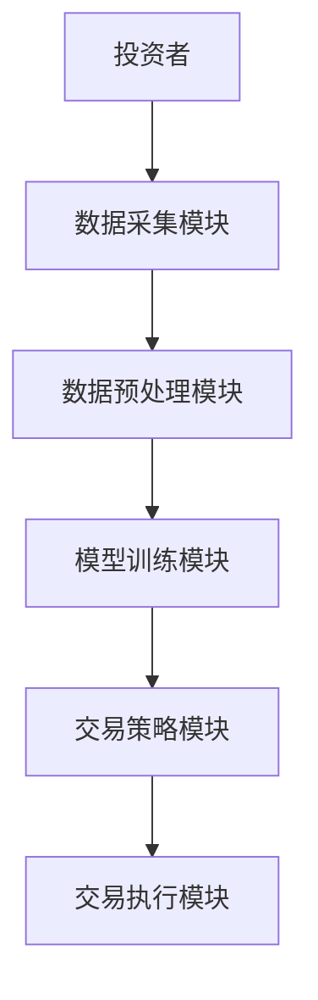

                 


# AI如何实现马克斯的逆向投资理念

> 关键词：人工智能、逆向投资、马克斯投资理念、市场预测、情绪分析

> 摘要：本文详细探讨了如何利用人工智能技术实现逆向投资策略。通过分析马克斯的逆向投资理念，结合AI算法和系统设计，展示了如何利用大数据和深度学习技术识别市场情绪、预测价格波动，并优化投资组合。文章还通过实际案例和代码实现，帮助读者理解AI在逆向投资中的应用和前景。

---

# 第一部分: 逆向投资理念与AI的结合

## 第1章: 逆向投资理念的核心概念

### 1.1 逆向投资的基本原理

逆向投资是一种投资策略，强调在市场低谷时买入，在市场高点时卖出。这种方法与传统投资策略相反，传统投资往往跟随市场趋势进行操作，而逆向投资则是在市场恐慌时寻找机会，市场狂热时保持冷静。

### 1.2 马克斯的逆向投资理念

马克斯的逆向投资理念强调市场情绪的重要性。他认为，市场的非理性波动为投资者提供了获利的机会。当市场情绪过于乐观时，资产价格会被高估，此时卖出；当市场情绪过于悲观时，资产价格会被低估，此时买入。

### 1.3 AI与逆向投资的结合

人工智能技术在金融领域的应用日益广泛，尤其是在市场预测和情绪分析方面。AI可以通过分析大量数据，识别市场情绪的变化，预测价格波动，从而辅助投资者做出更明智的决策。

---

## 第2章: AI实现逆向投资的核心算法

### 2.1 机器学习在市场预测中的应用

机器学习是一种人工智能技术，通过训练模型从数据中学习模式，从而进行预测。在逆向投资中，机器学习可以用于预测市场走势、识别市场拐点。

#### 2.1.1 线性回归模型

线性回归是一种简单的机器学习算法，用于预测变量之间的线性关系。例如，可以使用线性回归模型来预测股票价格的变化趋势。

$$ y = \beta_0 + \beta_1 x + \epsilon $$

其中，$y$ 是预测目标（如股票价格），$x$ 是自变量（如时间），$\beta_0$ 和 $\beta_1$ 是回归系数，$\epsilon$ 是误差项。

#### 2.1.2 支持向量机（SVM）

支持向量机是一种监督学习算法，适用于分类和回归问题。在金融领域，SVM可以用于股票价格的分类预测，例如预测股票价格是上涨还是下跌。

### 2.2 深度学习在情绪分析中的应用

深度学习是一种基于人工神经网络的机器学习技术，能够处理复杂的数据模式。在逆向投资中，深度学习可以用于分析新闻、社交媒体等非结构化数据，识别市场情绪的变化。

#### 2.2.1 卷积神经网络（CNN）

卷积神经网络常用于图像识别，但在文本分析中也有应用。例如，可以使用CNN分析新闻标题的情绪，判断市场情绪是积极还是消极。

#### 2.2.2 循序神经网络（RNN）

循环神经网络适用于处理序列数据，如时间序列分析。RNN可以用于分析股票价格的历史数据，预测未来的走势。

---

## 第3章: 逆向投资AI系统的架构设计

### 3.1 系统功能设计

逆向投资AI系统需要具备以下功能：

1. **数据采集**：从多个数据源获取市场数据，如股票价格、新闻、社交媒体等。
2. **数据预处理**：对数据进行清洗、标准化处理，提取有用的特征。
3. **模型训练**：使用机器学习或深度学习算法训练模型，预测市场走势。
4. **策略执行**：根据模型预测结果，生成交易信号，执行买卖操作。

### 3.2 系统架构设计

以下是一个逆向投资AI系统的架构图：



---

## 第4章: 项目实战

### 4.1 环境安装

需要安装以下库：

- Python
- Pandas
- NumPy
- Scikit-learn
- TensorFlow
- Matplotlib

### 4.2 数据预处理

以下是一个数据预处理的示例代码：

```python
import pandas as pd
import numpy as np

# 加载数据
data = pd.read_csv('stock_data.csv')

# 数据清洗
data = data.dropna()
data = data.reset_index(drop=True)

# 标准化处理
from sklearn.preprocessing import StandardScaler
scaler = StandardScaler()
scaled_data = scaler.fit_transform(data[['open', 'high', 'low', 'close']])
```

### 4.3 模型训练

以下是一个使用LSTM进行股票价格预测的示例代码：

```python
from tensorflow.keras.models import Sequential
from tensorflow.keras.layers import LSTM, Dense

# 模型构建
model = Sequential()
model.add(LSTM(64, input_shape=(timesteps, features)))
model.add(Dense(1))
model.compile(optimizer='adam', loss='mean_squared_error')

# 训练模型
model.fit(X_train, y_train, epochs=100, batch_size=32)
```

### 4.4 交易策略

根据模型预测结果，生成交易信号：

```python
# 预测价格
predicted_prices = model.predict(X_test)

# 生成交易信号
buy_signal = predicted_prices > actual_prices
sell_signal = predicted_prices < actual_prices

# 执行交易
if buy_signal:
    execute_buy()
elif sell_signal:
    execute_sell()
```

---

## 第5章: 总结与展望

### 5.1 总结

本文详细探讨了如何利用人工智能技术实现马克斯的逆向投资理念。通过分析逆向投资的核心概念，结合AI算法和系统设计，展示了如何利用大数据和深度学习技术优化投资组合，提高投资收益。

### 5.2 未来展望

未来的研究方向包括：

1. **实时交易系统**：开发实时交易系统，及时捕捉市场机会。
2. **多因子模型**：结合多个因子进行综合分析，提高预测精度。
3. **强化学习**：探索强化学习在投资决策中的应用，优化投资策略。

---

# 作者

作者：AI天才研究院 & 禅与计算机程序设计艺术

---

通过本文的详细讲解和代码实现，读者可以深入了解AI如何实现马克斯的逆向投资理念，并在实际应用中灵活运用这些技术。

