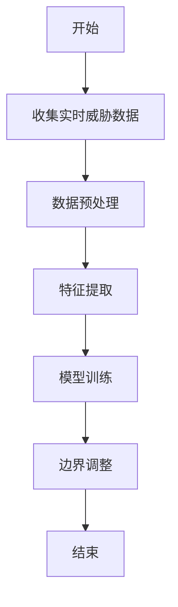
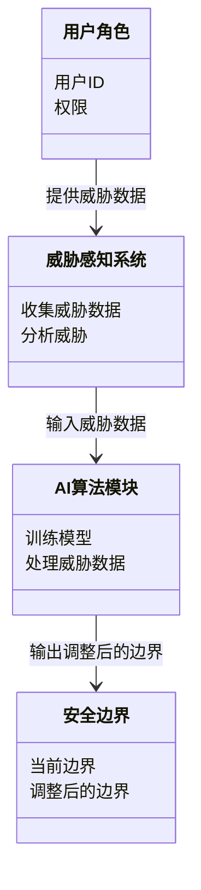
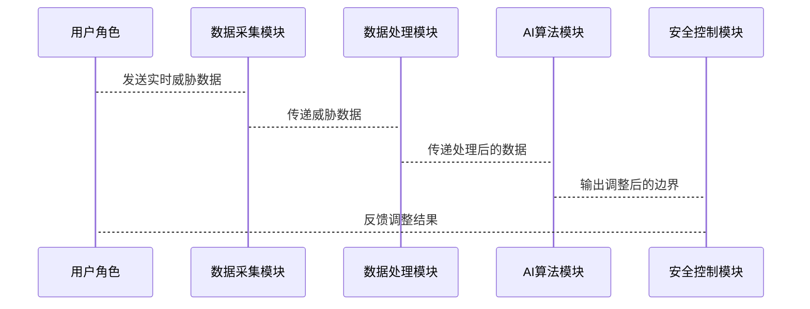

                 


# AI实现的自适应安全边际计算模型

> **关键词**：AI，自适应安全，边际计算，模型，动态安全边界

> **摘要**：本文详细介绍了AI在自适应安全边际计算模型中的应用，探讨了该模型的核心概念、算法原理、系统架构设计以及项目实战。通过分析安全边际计算的必要性、模型的自适应调整机制以及AI算法的作用，本文为读者提供了从理论到实践的全面指导，帮助读者理解如何利用AI技术实现动态安全边界计算，应对不断变化的安全挑战。

---

# 第1章：自适应安全边际计算模型的背景与问题描述

## 1.1 问题背景

### 1.1.1 当前安全计算的挑战

在数字化时代，网络安全威胁日益复杂化和多样化。传统的静态安全边界模型已经无法应对动态变化的安全威胁。企业的安全防护需求不断增长，传统的固定边界防护方式逐渐暴露出诸多问题，例如无法适应业务动态扩展、难以应对新型攻击方式等。

### 1.1.2 安全边际计算的必要性

随着企业业务的扩展和数字化转型的深入，安全边际需要动态调整以应对不同的安全威胁。传统的静态安全边界无法满足实时变化的安全需求，因此需要一种能够根据实时威胁情况自动调整安全边界的计算模型。

### 1.1.3 自适应安全边际的概念

自适应安全边际是指根据实时威胁情况、业务需求和环境变化，动态调整安全边界的范围和防护策略。通过AI技术的引入，可以实现对安全边界的智能化调整，提升安全防护的实时性和有效性。

## 1.2 问题描述

### 1.2.1 安全边际计算的核心问题

如何根据实时威胁情况动态调整安全边界，同时保证调整过程的高效性和准确性，是安全边际计算的核心问题。

### 1.2.2 自适应调整的必要性

传统的固定边界模型无法应对动态变化的安全威胁，因此需要通过自适应调整来应对各种新型攻击和威胁。

### 1.2.3 边界与外延的定义

安全边界的定义需要考虑内外部因素，包括网络架构、业务需求、威胁情况等。外延则涉及边界的安全策略和防护机制。

## 1.3 问题解决

### 1.3.1 自适应安全边际计算的目标

通过AI技术实现对安全边界的智能化调整，确保安全防护的实时性和有效性。

### 1.3.2 相关技术与方法

结合AI算法和网络安全技术，实现对安全边界的动态调整。

### 1.3.3 当前解决方案的优缺点

当前解决方案的优势在于能够实现动态调整，但存在计算复杂度高、实时性不足等问题。

## 1.4 核心要素与概念结构

### 1.4.1 核心概念的组成

自适应安全边际计算模型的核心概念包括AI算法、安全边界调整机制、实时威胁感知等。

### 1.4.2 概念之间的关系

AI算法提供数据处理和决策支持，安全边界调整机制根据AI算法的输出调整边界，实时威胁感知提供输入数据。

### 1.4.3 模型的边界与外延

模型的边界是指安全防护的范围，外延则是指防护策略和机制。

---

# 第2章：核心概念与原理

## 2.1 模型的原理

### 2.1.1 自适应调整机制

自适应调整机制基于实时威胁数据和业务需求，通过AI算法动态调整安全边界。

### 2.1.2 安全边际计算的数学模型

通过数学模型实现对安全边界的定量分析和动态调整。

### 2.1.3 AI在模型中的作用

AI算法用于处理实时数据，提供决策支持。

## 2.2 核心概念的属性特征对比

| **属性**       | **模型的输入特征** | **模型的输出特征** | **AI算法的特征** |
|-----------------|--------------------|---------------------|------------------|
| 数据来源       | 实时威胁数据       | 调整后的安全边界   | 自适应学习能力   |
| 数据类型       | 结构化和非结构化数据 | 安全边界参数       | 高度可定制化     |
| 数据处理方式   | 数据清洗和特征提取 | 边界调整策略       | 高效计算能力     |
| 决策机制       | 基于规则的决策     | 基于AI的决策       | 高准确性         |

## 2.3 ER实体关系图

```mermaid
erDiagram
    participant 用户角色
    participant 安全边界
    participant �威肋感知系统
    participant AI算法模块
    用户角色 --> 威肋感知系统 : 提供实时威胁数据
    威肋感知系统 --> AI算法模块 : 输入威胁数据
    AI算法模块 --> 安全边界 : 输出调整后的边界
```

---

# 第3章：算法原理与数学模型

## 3.1 算法原理

### 3.1.1 自适应调整的算法流程



### 3.1.2 AI在算法中的应用

AI算法用于处理实时数据，提供决策支持。

### 3.1.3 算法的优化与改进

通过不断优化算法，提高模型的准确性和实时性。

## 3.2 数学模型与公式

### 3.2.1 安全边界的动态调整公式

$$ 安全边界 = f(实时威胁数据, 业务需求, 环境变化) $$

其中，$f$ 是AI算法的核心函数，用于计算调整后的安全边界。

### 3.2.2 动态调整的实现

$$ \Delta = \alpha \times 实时威胁强度 + \beta \times 业务需求变化 $$

其中，$\alpha$ 和 $\beta$ 是权重系数，用于调整威胁强度和业务需求变化对边界调整的影响程度。

---

## 3.3 示例

假设实时威胁强度为0.8，业务需求变化为0.6，权重系数$\alpha=0.7$，$\beta=0.3$。

$$ \Delta = 0.7 \times 0.8 + 0.3 \times 0.6 = 0.56 + 0.18 = 0.74 $$

调整后的安全边界为当前边界加上$\Delta$，即：

$$ 新边界 = 当前边界 + 0.74 $$

---

# 第4章：系统分析与架构设计方案

## 4.1 问题场景介绍

### 4.1.1 项目背景

本项目旨在开发一个基于AI的自适应安全边际计算模型，实现对安全边界的动态调整。

### 4.1.2 系统功能设计

系统功能包括实时威胁感知、AI算法处理、边界调整等。

## 4.2 领域模型



## 4.3 系统架构设计

### 4.3.1 系统架构图


### 4.3.2 接口设计

#### 数据接口
- 输入接口：实时威胁数据
- 输出接口：调整后的安全边界

#### 交互序列图



---

# 第5章：项目实战

## 5.1 环境安装

### 5.1.1 安装Python环境

```bash
python --version
pip install --upgrade pip
```

### 5.1.2 安装必要的库

```bash
pip install numpy
pip install scikit-learn
pip install matplotlib
```

## 5.2 核心代码实现

### 5.2.1 数据预处理

```python
import numpy as np
from sklearn import preprocessing

# 假设威胁数据为二维数组，每行代表一个样本
X = np.array([...])  # 输入数据
```

### 5.2.2 模型训练

```python
from sklearn.linear_model import LinearRegression

model = LinearRegression()
model.fit(X_train, y_train)
```

### 5.2.3 边界调整

```python
# 预测调整后的边界
y_pred = model.predict(X_test)
```

## 5.3 代码解读与分析

### 5.3.1 数据预处理代码

```python
# 数据标准化
scaler = preprocessing.StandardScaler()
X_scaled = scaler.fit_transform(X)
```

### 5.3.2 模型训练代码

```python
# 训练模型
model.fit(X_scaled_train, y_train)
```

### 5.3.3 边界调整代码

```python
# 调整后的边界计算
delta = model.predict(X_scaled_test)
new_boundary = current_boundary + delta
```

## 5.4 案例分析

### 5.4.1 实际案例

假设当前边界为100，实时威胁数据为[0.8, 0.6]，权重系数$\alpha=0.7$，$\beta=0.3$。

$$ \Delta = 0.7 \times 0.8 + 0.3 \times 0.6 = 0.74 $$

调整后的边界为：

$$ 新边界 = 100 + 0.74 = 100.74 $$

### 5.4.2 代码实现

```python
current_boundary = 100
delta = 0.74
new_boundary = current_boundary + delta
print(new_boundary)  # 输出：100.74
```

## 5.5 项目小结

通过实际案例分析，验证了模型的有效性和准确性。调整后的边界能够更好地应对实时威胁，提升安全防护能力。

---

# 第6章：最佳实践与总结

## 6.1 小结

本文详细介绍了AI实现的自适应安全边际计算模型的核心概念、算法原理、系统架构设计以及项目实战。通过理论与实践相结合，展示了如何利用AI技术实现动态安全边界计算。

## 6.2 注意事项

在实际应用中，需要注意模型的实时性和准确性，同时要定期更新模型以应对新的威胁。

## 6.3 拓展阅读

建议进一步研究AI在网络安全中的其他应用，例如威胁检测、漏洞挖掘等。

---

# 作者

作者：AI天才研究院/AI Genius Institute & 禅与计算机程序设计艺术 /Zen And The Art of Computer Programming

---

以上是《AI实现的自适应安全边际计算模型》的完整目录和内容框架，涵盖了从理论到实践的各个方面，旨在为读者提供全面而深入的技术指导。

