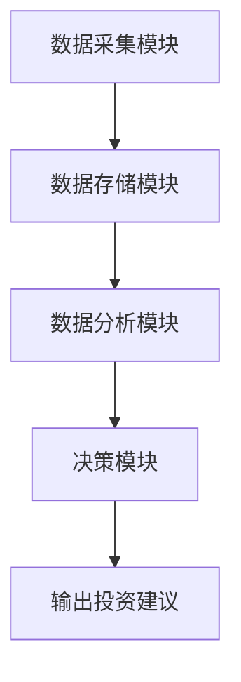

                 


# AI智能体协作优化价值投资的股东积极主义策略

> 关键词：AI智能体，价值投资，股东积极主义，协作优化，投资策略，系统架构

> 摘要：本文探讨了AI智能体在价值投资中的协作优化策略，特别是在股东积极主义中的应用。通过分析AI智能体的协作机制、算法实现、系统架构以及实际案例，本文展示了如何利用AI技术提升投资决策的效率和准确性。结合理论与实践，本文为投资者提供了优化投资策略的新思路。

---

## 第一部分：背景与概念

### 第1章：股东积极主义的背景与现状

#### 1.1 股东积极主义的定义与特点
股东积极主义是指投资者通过持有公司股份，主动参与公司治理，以实现投资收益最大化的一种投资策略。其核心特点包括：
- **主动性**：投资者不仅关注财务回报，还积极参与公司决策。
- **长期性**：注重长期价值创造，而非短期收益。
- **影响力**：通过持股影响力，推动公司改善经营和治理。

#### 1.2 价值投资的定义与策略
价值投资是一种投资策略，旨在通过识别市场低估的资产，长期持有以实现超额收益。其主要策略包括：
- **基本面分析**：通过分析公司财务状况、行业地位等因素，寻找具有长期增长潜力的企业。
- **安全边际**：买入价格低于内在价值，以降低投资风险。

#### 1.3 AI智能体在投资中的应用
AI智能体通过大数据分析、机器学习和自然语言处理技术，帮助投资者识别投资机会、评估风险，并优化投资组合。其优势在于：
- **高效性**：快速处理大量数据，提供实时决策支持。
- **精准性**：通过算法优化，提高投资决策的准确性。
- **自适应性**：能够根据市场变化动态调整策略。

---

### 第2章：AI智能体协作优化的理论基础

#### 2.1 协作优化的基本概念
协作优化是指多个智能体通过协作，共同实现目标的优化过程。其核心要素包括：
- **智能体**：具有感知和决策能力的主体。
- **协作机制**：智能体之间的通信与合作规则。
- **目标函数**：优化的目标，如最大化投资收益。

#### 2.2 价值投资中的协作优化
在价值投资中，协作优化主要体现在以下几个方面：
- **信息共享**：多个智能体共享市场数据，提高决策的全面性。
- **策略协同**：智能体之间协同制定投资策略，避免个体决策的局限性。
- **风险分担**：通过协作，降低个体风险，实现收益最大化。

#### 2.3 AI智能体协作优化的数学模型
协作优化的数学模型可以通过以下公式表示：
$$
\text{最大化} \quad \sum_{i=1}^{n} v_i
$$
其中，$v_i$ 表示第 $i$ 个智能体的收益。

---

## 第二部分：算法实现与数学模型

### 第3章：AI智能体协作优化的算法原理

#### 3.1 强化学习算法
强化学习是一种通过试错机制优化决策的算法。其核心步骤如下：
1. **状态感知**：智能体感知当前环境状态。
2. **动作选择**：基于当前状态选择最优动作。
3. **奖励反馈**：根据动作结果获得奖励或惩罚。
4. **策略更新**：根据奖励更新策略。

#### 3.2 多智能体协作算法
多智能体协作算法通过分布式计算实现协作优化。其流程如下：
1. **任务分配**：将任务分配给多个智能体。
2. **信息共享**：智能体之间共享信息，协调行动。
3. **协同决策**：基于共享信息，制定协作策略。

---

## 第三部分：系统架构与设计

### 第4章：系统架构设计

#### 4.1 系统应用场景
系统应用场景包括：
- **数据采集**：实时采集市场数据，如股价、财务报表等。
- **数据分析**：对数据进行清洗、处理和建模。
- **决策支持**：基于分析结果，提供投资建议。

#### 4.2 系统功能设计
系统功能模块包括：
- **数据采集模块**：负责数据的实时采集和存储。
- **分析模块**：对数据进行深度分析，识别投资机会。
- **决策模块**：基于分析结果，制定投资策略。

#### 4.3 系统架构图


---

## 第四部分：项目实战

### 第5章：项目实战

#### 5.1 环境安装
安装Python和相关库：
```bash
pip install numpy pandas scikit-learn
```

#### 5.2 核心代码实现
以下是核心代码示例：
```python
import numpy as np
from sklearn import linear_model

# 数据准备
X = np.array([[x1, x2], ...])
y = np.array([y1, y2, ...])

# 模型训练
model = linear_model.LinearRegression()
model.fit(X, y)

# 预测
print(model.predict(new_X))
```

#### 5.3 代码解读与分析
上述代码展示了如何使用线性回归模型进行收益预测。模型通过训练数据学习市场规律，并根据输入的新数据进行预测，帮助投资者做出决策。

---

## 第五部分：最佳实践与总结

### 第6章：最佳实践与总结

#### 6.1 应用中的注意事项
- **数据质量**：确保数据的准确性和完整性。
- **模型调优**：根据市场变化不断优化模型参数。
- **风险管理**：建立有效的风险管理机制，降低投资风险。

#### 6.2 未来展望
随着AI技术的不断发展，AI智能体在投资中的应用将更加广泛。未来，可以通过区块链技术实现智能合约的自动化执行，进一步提升投资效率。

---

## 作者

作者：AI天才研究院/AI Genius Institute & 禅与计算机程序设计艺术 /Zen And The Art of Computer Programming

---

这篇文章通过详细阐述AI智能体在价值投资中的协作优化策略，为投资者提供了全新的视角和方法。结合理论与实践，本文为优化投资策略提供了有力的支持。

