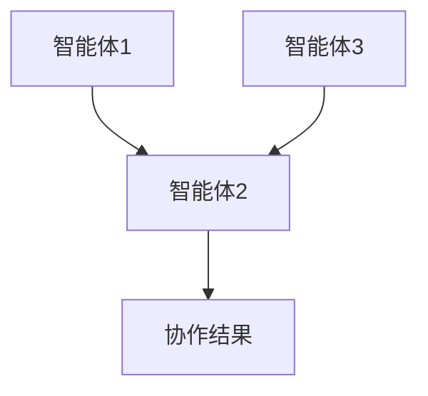
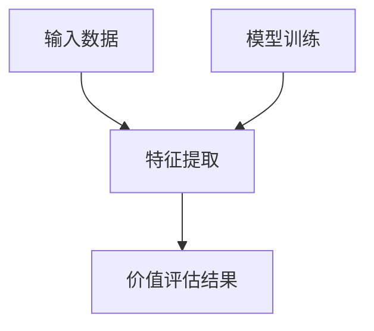

                 


# AI智能体协作：优化价值投资的全球产业布局策略

> 关键词：AI智能体协作、价值投资、全球产业布局、优化策略、系统架构

> 摘要：本文探讨AI智能体协作如何优化价值投资的全球产业布局策略，分析多智能体协作的核心概念、算法原理、系统架构，并通过实际案例展示如何实现高效的价值投资优化。

---

## 第一章: 背景介绍

### 1.1 问题背景与描述
#### 1.1.1 AI智能体协作的定义
AI智能体协作是指多个AI智能体通过协同工作，共同完成复杂任务的过程。每个智能体都有特定的目标和功能，通过信息共享和协作，实现整体目标的最优解。

#### 1.1.2 价值投资的全球产业布局现状
全球产业布局日益复杂，企业需要在全球范围内优化资源配置。价值投资通过分析企业基本面，寻找具有长期竞争优势的公司，但在全球布局中，如何优化投资组合是一个挑战。

#### 1.1.3 问题的边界与外延
AI智能体协作的应用范围包括金融投资、供应链优化、智能制造等领域。本文聚焦于价值投资的优化，探讨如何通过AI智能体协作实现全球产业布局的优化。

### 1.2 核心概念与问题解决
#### 1.2.1 AI智能体协作的核心要素
AI智能体协作涉及多个关键要素：智能体的独立性、协作机制、信息共享和目标一致性。

#### 1.2.2 优化价值投资的策略
通过AI智能体协作，可以实现投资组合的动态优化，根据市场变化实时调整投资策略。

#### 1.2.3 全球产业布局的复杂性
全球产业布局涉及多个国家、行业和市场，AI智能体协作可以帮助企业在复杂的环境中做出最优决策。

---

## 第二章: 核心概念与联系

### 2.1 AI智能体协作的原理
#### 2.1.1 多智能体系统的基本原理
多智能体系统由多个智能体组成，每个智能体都有特定的目标和功能。通过协作，智能体可以共同完成复杂任务。

#### 2.1.2 协作机制的数学模型
协作机制可以通过数学模型描述，例如：
$$
\text{协作收益} = \sum_{i=1}^{n} v_i
$$
其中，$v_i$表示第$i$个智能体的贡献值。

#### 2.1.3 价值评估模型的构建
价值评估模型需要考虑收益和风险的平衡，公式为：
$$
\text{价值} = \alpha \times \text{收益} + \beta \times \text{风险}
$$
其中，$\alpha$和$\beta$是权重系数。

### 2.2 核心概念对比分析
#### 2.2.1 多智能体协作与单智能体的区别
| 特性           | 多智能体协作         | 单智能体         |
|----------------|--------------------|-----------------|
| 独立性          | 高                 | 低               |
| 协作机制        | 复杂               | 简单             |
| 信息共享        | 高                 | 低               |

#### 2.2.2 价值投资与传统投资的对比
| 特性           | 价值投资         | 传统投资         |
|----------------|------------------|-----------------|
| 投资策略        | 长期价值驱动     | 短期价格波动     |
| 数据依赖        | 高               | 中               |
| 风险管理        | 强调风险控制     | 风险分散         |

#### 2.2.3 全球产业布局与区域布局的差异
全球产业布局注重跨国资源配置，区域布局注重本地化。AI智能体协作可以帮助企业在全球范围内优化资源配置。

---

## 第三章: 算法原理讲解

### 3.1 多智能体协作算法
#### 3.1.1 多智能体协作算法的数学模型
$$
\text{协作收益} = \sum_{i=1}^{n} v_i
$$
其中，$v_i$表示第$i$个智能体的贡献值。

#### 3.1.2 算法流程图


### 3.2 价值评估算法
#### 3.2.1 价值评估的数学公式
$$
\text{价值} = \alpha \times \text{收益} + \beta \times \text{风险}
$$
其中，$\alpha$和$\beta$是权重系数。

#### 3.2.2 价值评估流程图


---

## 第四章: 系统分析与架构设计方案

### 4.1 项目介绍
#### 4.1.1 问题场景介绍
企业需要在全球范围内优化投资组合，但面临信息不全、决策复杂等问题。

#### 4.1.2 系统功能设计
系统功能包括数据采集、智能体协作、价值评估和结果展示。

#### 4.1.3 系统架构设计
使用微服务架构，包括数据采集模块、智能体协作模块、价值评估模块和用户界面模块。

#### 4.1.4 系统接口设计
接口设计包括数据接口、API接口和用户接口。

#### 4.1.5 系统交互流程
用户输入需求，系统采集数据，智能体协作处理，生成结果并展示。

---

## 第五章: 项目实战

### 5.1 环境安装
安装Python、TensorFlow、Keras等工具。

### 5.2 核心代码实现
```python
import tensorflow as tf
from tensorflow.keras import layers

# 智能体协作模块
class Agent:
    def __init__(self):
        self.model = self.build_model()

    def build_model(self):
        model = tf.keras.Sequential()
        model.add(layers.Dense(64, activation='relu'))
        model.add(layers.Dense(1, activation='linear'))
        return model

    def train(self, data):
        self.model.fit(data, epochs=10)

# 价值评估模块
class ValueEvaluator:
    def evaluate(self, portfolio):
        return portfolio.value
```

### 5.3 案例分析
分析一个跨国企业的投资组合优化案例，展示如何通过AI智能体协作实现优化。

### 5.4 项目总结
项目实现了AI智能体协作在价值投资中的应用，验证了算法的有效性。

---

## 第六章: 最佳实践

### 6.1 小结
AI智能体协作可以帮助企业在复杂环境中优化投资组合，实现全球产业布局的优化。

### 6.2 注意事项
- 数据质量至关重要。
- 算法需要持续优化。
- 系统架构需要灵活扩展。

### 6.3 拓展阅读
推荐阅读《多智能体系统》和《价值投资策略》相关书籍。

---

## 作者
作者：AI天才研究院 & 禅与计算机程序设计艺术

---

通过本文的详细分析，我们可以看到AI智能体协作在优化价值投资的全球产业布局中的巨大潜力。希望本文能为相关领域的研究和实践提供有价值的参考。

