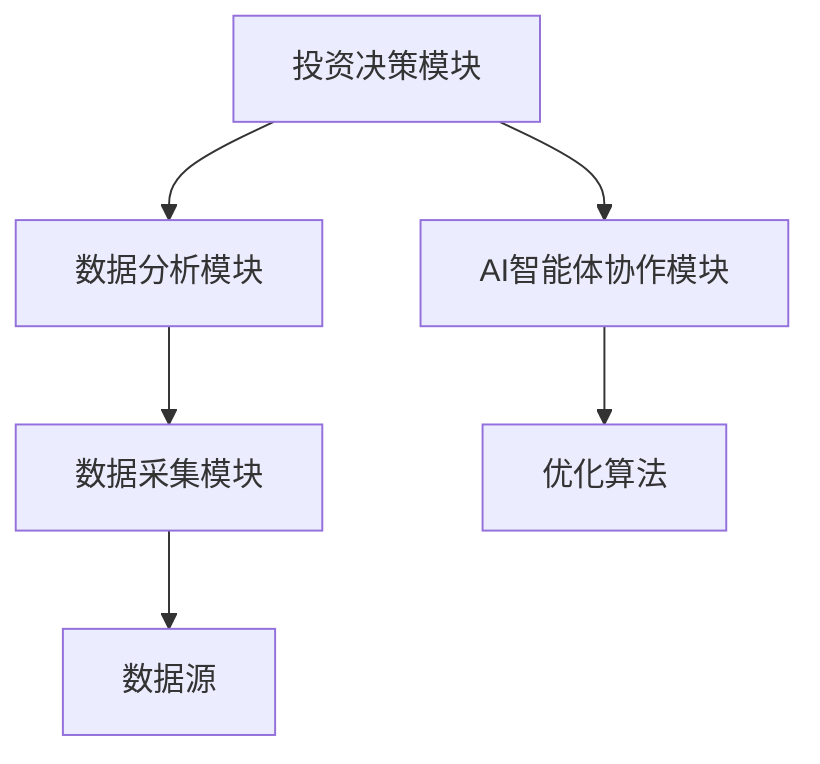
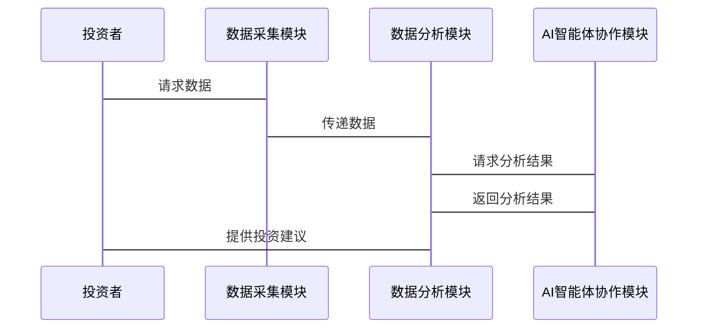

                 


# AI智能体协作：优化价值投资的全球产业链布局策略

> 关键词：AI智能体，价值投资，全球产业链，协作优化，投资策略，系统架构

> 摘要：本文探讨了AI智能体协作在优化价值投资和全球产业链布局中的应用，通过分析AI智能体的基本概念、价值投资的理论基础、全球产业链的结构，以及AI智能体在优化投资策略中的具体应用，展示了如何通过AI技术提升投资决策的效率和精准度。文章还详细介绍了AI智能体协作系统的架构设计、项目实现案例，并展望了未来的发展趋势。

---

## 第1章: AI智能体协作的背景与重要性

### 1.1 AI智能体协作的背景

#### 1.1.1 人工智能技术的发展历程

人工智能（AI）技术在过去几十年里经历了多次发展与停滞，从20世纪50年代的初步探索到现在的深度学习与强化学习的突破，AI技术已经渗透到各个领域。随着计算能力的提升和数据量的爆炸式增长，AI技术的应用范围不断扩大，特别是在投资领域，AI智能体协作展现出巨大潜力。

#### 1.1.2 智能体协作的概念与特点

智能体（Agent）是指能够感知环境并采取行动以实现目标的实体。智能体协作是指多个智能体通过信息共享和协同决策来完成复杂任务的过程。AI智能体协作的特点包括自主性、反应性、协作性和学习性。

#### 1.1.3 价值投资与全球产业链布局的结合

价值投资是一种基于公司基本面分析的投资策略，强调以低于内在价值的价格买入优质资产。然而，传统的价值投资依赖人工分析，效率低下且容易受到主观因素影响。通过AI智能体协作，投资者可以更高效地分析全球产业链布局，优化投资决策。

### 1.2 AI智能体协作的重要性

#### 1.2.1 提高投资决策的效率

AI智能体能够快速处理海量数据，帮助投资者迅速识别市场机会和风险，显著提高投资决策的效率。

#### 1.2.2 优化全球产业链布局的精准度

通过分析全球产业链的结构和各环节的协同关系，AI智能体能够提供精准的布局建议，帮助投资者在全球范围内优化资源配置。

#### 1.2.3 降低投资风险与成本

AI智能体协作能够通过数据挖掘和预测模型，提前识别潜在风险，降低投资成本，提高投资回报率。

### 1.3 本书的核心目标与结构

#### 1.3.1 本书的核心目标

本书旨在探讨AI智能体协作在优化价值投资和全球产业链布局中的应用，提供理论基础、系统设计和实战案例，帮助读者掌握AI智能体协作的核心技术与应用策略。

#### 1.3.2 本书的结构安排

- 第1章：AI智能体协作的背景与重要性
- 第2章：价值投资的理论基础
- 第3章：AI智能体协作的核心概念与原理
- 第4章：全球产业链布局分析
- 第5章：AI智能体协作在优化价值投资中的应用
- 第6章：系统架构与设计
- 第7章：项目实战与案例分析
- 第8章：总结与展望

#### 1.3.3 本书的读者群体

本书适合投资专业人士、IT技术人员、企业战略管理者以及对AI智能体协作感兴趣的研究者阅读。

---

## 第2章: 价值投资的理论基础

### 2.1 价值投资的基本概念

#### 2.1.1 价值投资的定义

价值投资是一种基于对公司内在价值的评估，以低于内在价值的价格买入优质资产的投资策略。其核心理念是寻找市场中的估值洼地。

#### 2.1.2 价值投资的核心理念

- 公司基本面分析：包括财务状况、盈利能力、竞争优势等。
- 长期投资：关注长期价值，而非短期波动。
- 安全边际：买入价格低于内在价值，以降低风险。

#### 2.1.3 价值投资的关键指标

- 市盈率（P/E）
- 市净率（P/B）
- 股息率
- 净资产收益率（ROE）

### 2.2 全球产业链布局的复杂性

#### 2.2.1 全球产业链的基本结构

全球产业链包括上游原材料供应、中游制造加工、下游产品销售等多个环节。不同国家和地区在产业链中扮演不同的角色，形成复杂的全球网络。

#### 2.2.2 产业链布局的影响因素

- 地理位置
- 成本因素
- 市场需求
- 政治经济环境

#### 2.2.3 产业链优化的挑战与机遇

- 挑战：全球化带来的复杂性和不确定性。
- 机遇：通过优化布局提高效率和降低成本。

### 2.3 价值投资与产业链布局的关系

#### 2.3.1 价值投资对产业链布局的影响

价值投资者关注产业链中具有竞争优势和长期增长潜力的企业，通过优化产业链布局，提升投资组合的回报率。

#### 2.3.2 产业链布局对投资价值的提升

优化的产业链布局能够提高企业的盈利能力和抗风险能力，进而提升其内在价值。

#### 2.3.3 价值投资与产业链布局的协同效应

通过AI智能体协作，价值投资者可以更精准地分析全球产业链布局，识别具有竞争优势的企业，优化投资组合。

---

## 第3章: AI智能体协作的核心概念与原理

### 3.1 AI智能体的定义与分类

#### 3.1.1 AI智能体的定义

AI智能体是指能够感知环境、自主决策并采取行动以实现目标的智能系统。它可以是一个独立的实体，也可以是一个虚拟的软件系统。

#### 3.1.2 AI智能体的分类

- 按智能体的智能水平：分为反应式智能体、基于模型的智能体、实用智能体等。
- 按应用场景：分为投资智能体、生产智能体、服务智能体等。

#### 3.1.3 AI智能体的主要特点

- 自主性：能够自主决策和行动。
- 反应性：能够实时感知环境并做出反应。
- 学习性：能够通过经验改进自身性能。

### 3.2 AI智能体协作的原理

#### 3.2.1 智能体协作

智能体协作是指多个智能体通过共享信息和协同决策来完成复杂任务的过程。协作机制包括信息共享、任务分配、协调同步等。

#### 3.2.2 AI智能体协作的关键技术

- 多智能体系统（MAS）
- 分布式计算
- 通信协议
- 协作学习

#### 3.2.3 AI智能体协作的优势

- 提高决策效率
- 增强系统鲁棒性
- 优化资源分配

---

## 第4章: 全球产业链布局分析

### 4.1 产业链结构分析

#### 4.1.1 产业链的基本构成

产业链包括上游、中游和下游三个部分，每个部分都有不同的企业类型和功能。

#### 4.1.2 产业链的区域分布

全球产业链的分布受地理位置、资源禀赋、劳动力成本等因素的影响，形成不同的产业集群。

#### 4.1.3 产业链的协同效应

产业链中的各个环节相互依赖，协同效应能够提高整体效率和降低成本。

### 4.2 产业链优化的策略

#### 4.2.1 优化目标

- 提高效率
- 降低成本
- 增强灵活性

#### 4.2.2 优化方法

- 重新设计生产流程
- 优化供应链管理
- 提高信息化水平

#### 4.2.3 优化工具

- 数据分析工具
- 仿真模拟
- AI智能体协作

---

## 第5章: AI智能体协作在优化价值投资中的应用

### 5.1 数据收集与分析

#### 5.1.1 数据源

- 公司财务数据
- 市场交易数据
- 宏观经济指标

#### 5.1.2 数据预处理

- 数据清洗
- 数据转换
- 数据标准化

### 5.2 特征提取与建模

#### 5.2.1 特征提取

- 关键财务指标
- 市场情绪指标
- 竞争优势指标

#### 5.2.2 模型构建

- 机器学习模型（如随机森林、支持向量机）
- 强化学习模型（如Q-learning）
- 时间序列模型（如ARIMA）

### 5.3 投资决策与优化

#### 5.3.1 投资组合优化

通过AI智能体协作，投资者可以优化投资组合，分散风险，提高收益。

#### 5.3.2 风险管理

AI智能体能够实时监控市场动态，及时发现潜在风险，制定应对策略。

---

## 第6章: 系统架构与设计

### 6.1 问题场景介绍

#### 6.1.1 投资决策问题

投资者需要在全球范围内寻找具有竞争优势的企业，优化投资组合。

#### 6.1.2 产业链布局问题

企业需要优化全球产业链布局，提高效率和降低成本。

### 6.2 系统功能设计

#### 6.2.1 数据采集模块

负责收集全球产业链相关的数据，包括公司财务数据、市场交易数据等。

#### 6.2.2 数据分析模块

利用机器学习和强化学习算法，分析数据，提取特征，构建预测模型。

#### 6.2.3 投资决策模块

根据分析结果，生成投资建议，优化投资组合。

### 6.3 系统架构设计

使用Mermaid图展示系统架构：



### 6.4 系统交互设计

使用Mermaid序列图展示系统交互流程：



---

## 第7章: 项目实战与案例分析

### 7.1 环境安装与配置

#### 7.1.1 安装Python

```bash
python --version
pip install numpy pandas scikit-learn
```

#### 7.1.2 安装机器学习库

```bash
pip install scikit-learn
pip install tensorflow
pip install pymermaid
```

### 7.2 核心功能实现

#### 7.2.1 数据采集与预处理

```python
import pandas as pd

# 读取数据
data = pd.read_csv('data.csv')

# 数据清洗
data.dropna(inplace=True)
```

#### 7.2.2 模型训练与优化

```python
from sklearn.model_selection import train_test_split
from sklearn.ensemble import RandomForestClassifier
from sklearn.metrics import accuracy_score

# 划分训练集和测试集
X_train, X_test, y_train, y_test = train_test_split(X, y, test_size=0.2)

# 训练模型
model = RandomForestClassifier()
model.fit(X_train, y_train)

# 评估模型
y_pred = model.predict(X_test)
print(accuracy_score(y_test, y_pred))
```

#### 7.2.3 投资建议生成

```python
def generate_recommendation(portfolio):
    # 使用强化学习模型生成投资建议
    pass
```

### 7.3 案例分析

#### 7.3.1 案例背景

假设某投资者希望优化其全球产业链投资组合，利用AI智能体协作进行分析。

#### 7.3.2 分析过程

- 数据采集：收集目标企业的财务数据和市场数据。
- 数据分析：使用机器学习模型预测企业价值。
- 投资建议：生成优化的投资组合，分散风险，提高回报率。

#### 7.3.3 结果解读

通过AI智能体协作，投资者能够发现具有竞争优势的企业，优化投资组合，实现更高的投资回报。

### 7.4 项目小结

通过本项目，读者可以掌握AI智能体协作的基本实现方法，了解其在价值投资中的应用。

---

## 第8章: 总结与展望

### 8.1 本书的核心内容回顾

- AI智能体协作的重要性
- 价值投资的理论基础
- 全球产业链布局分析
- AI智能体协作在优化投资中的应用

### 8.2 未来发展趋势

#### 8.2.1 技术进步

- 更先进的算法（如深度强化学习）
- 更强大的计算能力

#### 8.2.2 应用拓展

- 更多领域的应用（如供应链管理、风险管理）
- 更多行业的实践案例

#### 8.2.3 行业合作

- 产业链上下游的合作
- 跨界合作，推动技术与应用的结合

### 8.3 最佳实践与注意事项

- 数据质量的重要性
- 模型的可解释性
- 风险管理的必要性

---

## 作者：AI天才研究院 & 禅与计算机程序设计艺术

