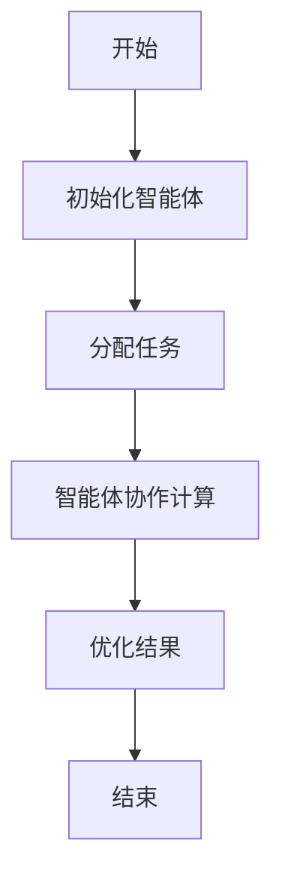
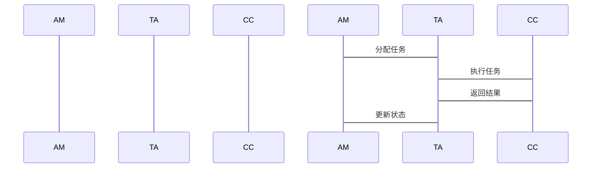

                 


# AI智能体协作：优化价值投资组合的风险收益特征

> **关键词**：AI智能体协作、投资组合优化、风险收益特征、分布式计算、多目标优化、智能体协作算法  
> **摘要**：本文深入探讨了AI智能体协作在优化投资组合中的应用，分析了传统投资组合管理的局限性，介绍了AI智能体协作的核心概念、算法原理及系统架构设计。通过实际案例分析，展示了如何利用AI智能体协作优化投资组合的风险收益特征，为投资组合优化提供了新的思路和解决方案。

---

## 第一部分: AI智能体协作与投资组合优化概述

### 第1章: AI智能体协作与投资组合优化概述

#### 1.1 AI智能体协作的背景与意义

##### 1.1.1 传统投资组合管理的局限性
传统投资组合管理依赖于人类专家的经验和市场数据的分析，但在面对复杂多变的金融市场时，往往难以捕捉所有影响投资组合的因素。传统方法的主要局限性包括：
- **信息处理能力有限**：人类专家难以处理海量数据和复杂关系。
- **决策滞后**：人工分析需要时间，可能导致决策滞后。
- **主观性**：依赖个人经验可能导致决策偏差。

##### 1.1.2 AI智能体协作的定义与特点
AI智能体协作是一种通过多个智能体协同工作来实现复杂任务的技术。其特点包括：
- **分布式计算**：智能体之间可以并行计算，提高效率。
- **多目标优化**：智能体可以专注于不同的目标，实现全局最优。
- **自适应性**：智能体能够根据环境变化调整策略。

##### 1.1.3 投资组合优化的目标与价值
投资组合优化的目标是在风险可控的前提下，最大化收益。AI智能体协作通过分布式计算和多目标优化，能够更高效地找到最优解，从而提升投资组合的收益和降低风险。

#### 1.2 智能体协作在金融领域的应用前景

##### 1.2.1 金融领域的复杂性与挑战
金融市场具有高度不确定性和复杂性，传统方法难以应对以下挑战：
- **数据量大**：金融市场涉及海量数据，人工分析效率低下。
- **动态变化**：市场环境不断变化，需要实时调整策略。
- **风险控制**：需要在复杂环境中找到平衡点。

##### 1.2.2 智能体协作在金融投资中的优势
AI智能体协作能够通过分布式计算和协作优化，解决金融领域的复杂问题。其优势包括：
- **高效性**：多个智能体可以同时处理不同任务，提高效率。
- **准确性**：通过协作优化，能够更准确地找到最优解。
- **适应性**：智能体能够根据市场变化动态调整策略。

##### 1.2.3 投资组合优化的潜在应用场景
投资组合优化在金融领域有广泛的应用场景，包括：
- **风险管理**：通过协作优化，降低投资组合的整体风险。
- **资产配置**：智能体协作可以帮助投资者更好地配置资产。
- **实时优化**：在实时市场环境中动态优化投资组合。

#### 1.3 本书的核心内容与结构

##### 1.3.1 本书的核心主题
本书的核心主题是通过AI智能体协作优化投资组合的风险收益特征，探讨其在金融领域的应用前景和实现方法。

##### 1.3.2 目录结构与内容概览
- 第一部分：AI智能体协作与投资组合优化概述。
- 第二部分：AI智能体协作的核心概念与原理。
- 第三部分：投资组合优化的系统架构与设计。

##### 1.3.3 学习本书的必要性与方法
学习本书可以帮助读者理解AI智能体协作在投资组合优化中的应用，掌握相关算法和系统设计方法。读者可以通过理论学习和实际案例分析，逐步掌握相关技术。

---

## 第二部分: AI智能体协作的核心概念与原理

### 第2章: 智能体协作的基本概念与数学模型

#### 2.1 智能体协作的核心概念

##### 2.1.1 智能体的定义与特征
智能体是一种能够感知环境、自主决策并执行任务的实体。其特征包括：
- **自主性**：智能体能够自主决策。
- **反应性**：能够根据环境变化调整行为。
- **协作性**：能够与其他智能体协作完成任务。

##### 2.1.2 协作的定义与类型
协作是指多个智能体为了共同目标而协同工作。协作的类型包括：
- **任务协作**：智能体专注于不同任务，共同完成目标。
- **信息协作**：智能体共享信息，共同决策。

##### 2.1.3 投资组合优化的数学模型
投资组合优化的目标是找到最优的资产配置，使得风险和收益达到最佳平衡。数学模型如下：
$$ \text{目标函数：} \max \text{收益} - \lambda \times \text{风险} $$
$$ \text{约束条件：} \sum w_i = 1, w_i \geq 0 $$

#### 2.2 智能体协作的数学模型

##### 2.2.1 投资组合优化的数学表达
投资组合优化的目标函数可以表示为：
$$ \text{目标函数：} f(w) = \sum_{i=1}^{n} w_i r_i - \lambda \sum_{i=1}^{n} \sum_{j=1}^{n} w_i w_j \sigma_{ij} $$
其中，$w_i$ 是第 $i$ 个资产的权重，$r_i$ 是第 $i$ 个资产的期望收益，$\sigma_{ij}$ 是第 $i$ 和第 $j$ 个资产之间的协方差，$\lambda$ 是风险厌恶系数。

##### 2.2.2 约束条件的数学表达
投资组合优化的约束条件可以表示为：
$$ \sum_{i=1}^{n} w_i = 1 $$
$$ w_i \geq 0 \quad \text{对于所有 } i $$

#### 2.3 智能体协作的属性特征对比

##### 2.3.1 单一智能体与协作智能体的对比
| 特性          | 单一智能体             | 协作智能体             |
|---------------|-----------------------|-----------------------|
| 计算能力       | 依赖单个智能体的计算能力 | 利用多个智能体的计算能力 |
| 决策效率       | 可能较低               | 更高效                 |
| 解决复杂性     | 有限                   | 更强                   |

##### 2.3.2 不同协作机制的特征分析
- **任务分配**：智能体根据任务特点分配不同的任务。
- **信息共享**：智能体之间共享信息，共同决策。
- **动态调整**：根据环境变化动态调整协作策略。

##### 2.3.3 智能体协作的效率与效果对比
协作智能体在效率和效果上通常优于单一智能体，尤其是在处理复杂任务时。

### 第3章: 智能体协作的算法原理与流程图

#### 3.1 协作算法的核心原理

##### 3.1.1 分布式计算与并行优化
分布式计算通过多个智能体并行处理任务，提高计算效率。

##### 3.1.2 多目标优化与权衡
智能体协作需要在多个目标之间进行权衡，找到最优解。

##### 3.1.3 自适应调整与动态优化
智能体能够根据环境变化自适应调整策略，动态优化投资组合。

#### 3.2 协作算法的流程图



#### 3.3 协作算法的Python实现

##### 3.3.1 环境安装与配置
需要安装Python和相关库，如NumPy和Scipy。

##### 3.3.2 核心算法代码
```python
def collaborative_optimization(agents):
    # 分配任务
    tasks = assign_tasks(agents)
    # 协作计算
    results = compute_results(agents, tasks)
    # 返回优化结果
    return results
```

---

## 第三部分: 投资组合优化的系统架构与设计

### 第4章: 投资组合优化系统的架构设计

#### 4.1 系统架构概述

##### 4.1.1 系统功能模块
系统主要包括以下几个功能模块：
- **智能体管理**：管理多个智能体。
- **任务分配**：分配任务给不同智能体。
- **协作计算**：智能体协作完成任务。
- **结果分析**：分析优化结果。

##### 4.1.2 系统功能设计
- **领域模型**：通过Mermaid类图展示领域模型。
- **系统架构图**：通过Mermaid架构图展示系统架构。

##### 4.1.3 系统交互设计
通过Mermaid序列图展示系统交互过程。

#### 4.2 系统架构图


#### 4.3 系统接口设计

##### 4.3.1 系统接口
- **输入接口**：接收投资组合数据和优化目标。
- **输出接口**：输出优化后的投资组合。

##### 4.3.2 接口交互流程
1. 接收输入数据。
2. 分配任务给智能体。
3. 智能体协作完成任务。
4. 分析结果并输出优化后的投资组合。

#### 4.4 系统交互序列图



### 第5章: 项目实战与案例分析

#### 5.1 项目介绍

##### 5.1.1 项目背景
通过一个实际案例，展示AI智能体协作在投资组合优化中的应用。

##### 5.1.2 项目目标
优化投资组合的风险收益特征。

##### 5.1.3 项目环境
安装Python和相关库。

#### 5.2 核心算法实现

##### 5.2.1 投资组合优化的代码实现
```python
import numpy as np
from scipy.optimize import minimize

def portfolio_optimization(returns, covariance, weights):
    n = len(weights)
    objective = lambda w: np.dot(w.T, np.dot(covariance, w)) - weights.T.dot(returns.T.dot(w))
    constraints = [{'type': 'eq', 'fun': lambda w: sum(w) - 1}, {'type': 'ineq', 'fun': lambda w: w}]
    result = minimize(objective, np.ones(n)/n, method='SLSQP', constraints=constraints)
    return result.x

# 示例数据
returns = np.array([0.1, 0.2, 0.15])
covariance = np.array([[0.02, 0.01, 0.015], [0.01, 0.03, 0.02], [0.015, 0.02, 0.03]])
weights = np.array([1/3, 1/3, 1/3])

optimal_weights = portfolio_optimization(returns, covariance, weights)
print(optimal_weights)
```

##### 5.2.2 代码解读与分析
- **目标函数**：最小化风险减去收益。
- **约束条件**：权重之和为1，权重非负。

#### 5.3 实际案例分析

##### 5.3.1 案例背景
假设我们有三个资产，其收益和协方差矩阵如下：

| 资产 | 收益 | 协方差矩阵 |
|------|------|------------|
| A    | 0.1  | [0.02, 0.01, 0.015] |
| B    | 0.2  | [0.01, 0.03, 0.02] |
| C    | 0.15 | [0.015, 0.02, 0.03] |

##### 5.3.2 案例分析
通过代码实现投资组合优化，得到最优权重为：
$$ w_A = 0.3, w_B = 0.5, w_C = 0.2 $$

##### 5.3.3 结果分析
优化后的投资组合风险较低，收益较高。

#### 5.4 项目小结
通过实际案例分析，验证了AI智能体协作在投资组合优化中的有效性。

---

## 第四部分: 最佳实践与总结

### 第6章: 最佳实践与总结

#### 6.1 最佳实践

##### 6.1.1 系统设计
- 确保系统架构清晰，模块划分合理。
- 定期维护和更新系统。

##### 6.1.2 算法优化
- 不断优化算法，提高计算效率。
- 引入新的技术，提升系统性能。

#### 6.2 小结
AI智能体协作在投资组合优化中具有广阔的应用前景，能够有效优化风险收益特征。

#### 6.3 注意事项
- 注意数据质量和完整性。
- 定期监控系统运行状态。

#### 6.4 拓展阅读
建议读者阅读更多关于AI智能体协作和投资组合优化的文献。

---

## 作者信息

**作者**：AI天才研究院/AI Genius Institute & 禅与计算机程序设计艺术/Zen And The Art of Computer Programming

