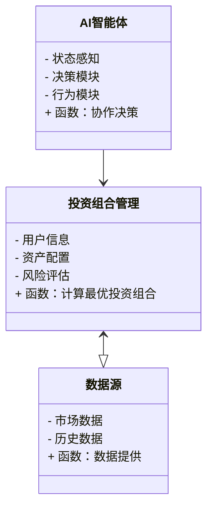
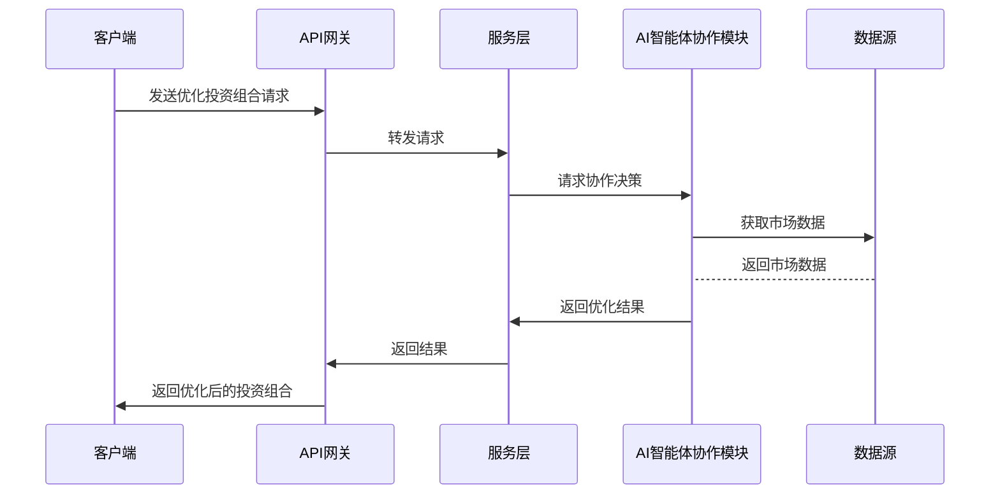

                 


# AI智能体协作：提升价值投资组合管理效率

> 关键词：AI智能体协作，投资组合管理，人工智能算法，价值投资策略，多智能体系统，效率优化

> 摘要：本文探讨了AI智能体协作在投资组合管理中的应用，分析了多智能体系统的核心原理，结合实际案例，详细讲解了算法实现和系统架构设计，最终提出了提升投资组合管理效率的最佳实践。

---

# 第一部分：AI智能体协作与投资组合管理的背景介绍

## 第1章：AI智能体协作概述

### 1.1 AI智能体协作的定义与核心概念

#### 1.1.1 AI智能体的基本定义
AI智能体（Artificial Intelligence Agent）是指能够感知环境、自主决策并采取行动以实现目标的智能系统。它具备感知、推理、决策和执行的能力，广泛应用于自动驾驶、机器人、推荐系统等领域。

#### 1.1.2 AI智能体协作的定义与特点
AI智能体协作是指多个智能体通过通信与协调，共同完成复杂任务的过程。其特点包括：
1. **分布式**：智能体独立决策，通过通信协作。
2. **动态性**：环境和任务目标可能动态变化。
3. **协调性**：智能体之间需高效协作以实现全局目标。
4. **多样性**：智能体可能具备不同的知识和能力。

#### 1.1.3 协作智能体的分类与应用场景
协作智能体可以分为：
1. **基于规则的协作**：通过预定义规则进行协作，适用于任务简单的情况。
2. **基于学习的协作**：通过强化学习等方法动态调整协作策略，适用于复杂任务。
3. **混合协作**：结合规则和学习方法，适用于复杂多变的环境。

应用场景包括投资组合管理、智能客服、自动驾驶等。

---

## 第2章：投资组合管理的背景与挑战

### 2.1 投资组合管理的基本概念

#### 2.1.1 投资组合的定义与目标
投资组合是指将资金分配到不同资产（股票、债券、基金等）以分散风险并追求收益最大化。投资组合管理的目标是优化收益与风险的平衡。

#### 2.1.2 投资组合管理的流程与方法
投资组合管理通常包括：
1. **资产配置**：确定各类资产的投资比例。
2. **风险评估**：评估投资组合的潜在风险。
3. **动态调整**：根据市场变化调整投资组合。

#### 2.1.3 传统投资组合管理的优缺点
优点：基于历史数据和统计分析，相对稳健。
缺点：难以应对非线性变化和黑天鹅事件，且依赖人工经验。

### 2.2 AI智能体协作在投资组合管理中的应用背景

#### 2.2.1 投资组合管理中的问题与挑战
1. **数据复杂性**：金融市场数据具有高度的不确定性和非线性。
2. **决策延迟**：传统方法可能无法快速响应市场变化。
3. **风险控制**：需要实时监控和调整投资组合以规避风险。

#### 2.2.2 AI智能体协作的优势与潜力
1. **分布式决策**：多个智能体可以同时处理不同类型的数据，提高决策效率。
2. **动态适应**：智能体协作能够快速响应市场变化，优化投资策略。
3. **知识融合**：多个智能体可以结合不同的知识和数据源，提升决策的准确性。

#### 2.2.3 当前行业的发展现状与趋势
随着AI技术的发展，越来越多的投资机构开始采用AI智能体协作进行投资组合管理，尤其是在高频交易和风险控制方面表现出色。

---

# 第二部分：AI智能体协作的核心概念与联系

## 第3章：AI智能体协作的核心原理

### 3.1 多智能体协作的基本原理

#### 3.1.1 多智能体系统的定义与特点
多智能体系统（Multi-Agent System, MAS）是由多个智能体组成的系统，智能体之间通过通信和协作完成任务。其特点包括：
1. **自主性**：智能体能够自主决策。
2. **反应性**：能够感知环境并实时调整行为。
3. **协作性**：通过协作完成复杂任务。

#### 3.1.2 智能体之间的通信与协调机制
通信机制包括：
- **直接通信**：智能体之间直接交换信息。
- **间接通信**：通过共享数据库或中间件进行信息交换。

协调机制包括：
- **同步决策**：智能体在同一时间点做出决策。
- **异步决策**：智能体在不同时间点做出决策，并通过通信进行协调。

#### 3.1.3 协作智能体的决策模型与算法
协作智能体的决策模型可以基于：
- **规则引擎**：通过预定义的规则进行决策。
- **强化学习**：通过试错和奖励机制优化决策策略。
- **遗传算法**：通过模拟自然选择优化决策模型。

### 3.2 AI智能体协作与投资组合管理的结合

#### 3.2.1 投资组合管理中的协作需求
投资组合管理需要多智能体协作完成的任务包括：
- **市场分析**：分析市场趋势和风险。
- **资产配置**：优化各类资产的投资比例。
- **风险控制**：实时监控和调整投资组合的风险水平。

#### 3.2.2 AI智能体协作在投资组合管理中的具体应用
- **市场监控**：多个智能体实时监控市场数据，识别潜在的投资机会和风险。
- **动态调整**：根据市场变化，智能体协作调整投资组合。
- **风险预警**：通过协作分析，提前预警潜在风险。

---

## 第4章：AI智能体协作与投资组合管理的结合

### 4.1 投资组合管理中的协作需求

#### 4.1.1 投资组合管理中的问题与挑战
投资组合管理面临的问题包括：
1. **数据复杂性**：金融市场数据具有高度的不确定性和非线性。
2. **决策延迟**：传统方法可能无法快速响应市场变化。
3. **风险控制**：需要实时监控和调整投资组合以规避风险。

#### 4.1.2 AI智能体协作的优势与潜力
AI智能体协作的优势在于：
1. **分布式决策**：多个智能体可以同时处理不同类型的数据，提高决策效率。
2. **动态适应**：智能体协作能够快速响应市场变化，优化投资策略。
3. **知识融合**：多个智能体可以结合不同的知识和数据源，提升决策的准确性。

---

# 第三部分：AI智能体协作的核心算法与数学模型

## 第5章：算法原理

### 5.1 强化学习在协作中的应用

#### 5.1.1 强化学习的基本原理
强化学习（Reinforcement Learning, RL）是一种通过试错机制优化决策的算法。智能体通过与环境互动，获得奖励或惩罚，从而优化自身的行为策略。

#### 5.1.2 多智能体强化学习（Multi-Agent RL）
多智能体强化学习涉及多个智能体协作完成任务。常用算法包括：
- **分布式策略**：每个智能体独立学习策略，通过通信协作。
- **集中式策略**：多个智能体共享同一个策略，通过协调完成任务。

---

## 第6章：数学模型与公式

### 6.1 收益-风险模型
收益-风险模型用于评估投资组合的预期收益和风险。常用模型包括：
- **均值-方差模型**：优化投资组合的预期收益和方差。
- **风险中性模型**：在给定风险水平下优化收益。

### 6.2 风险中性模型
$$\text{最大化 } \mu_p - \lambda \sigma_p^2$$
其中：
- $\mu_p$：投资组合的预期收益
- $\sigma_p^2$：投资组合的方差
- $\lambda$：风险厌恶系数

---

# 第四部分：系统分析与架构设计

## 第7章：系统架构设计

### 7.1 系统功能设计

#### 7.1.1 领域模型（Domain Model）
领域模型描述了系统的业务逻辑和数据流。使用Mermaid类图表示：


### 7.2 系统架构设计

#### 7.2.1 系统架构图
使用Mermaid架构图表示：


### 7.3 系统接口设计

#### 7.3.1 API接口设计
- `/api/portfolio/optimization`：优化投资组合接口
- `/api/risk_assessment`：风险评估接口
- `/api/decision`：决策接口

#### 7.3.2 交互序列图
使用Mermaid序列图表示：


---

# 第五部分：项目实战

## 第8章：项目实战

### 8.1 环境安装

#### 8.1.1 安装Python环境
使用Anaconda安装Python 3.8及以上版本。

#### 8.1.2 安装依赖库
安装以下依赖库：
```bash
pip install numpy pandas scikit-learn tensorflow gym
```

### 8.2 核心功能实现

#### 8.2.1 数据预处理
```python
import pandas as pd
data = pd.read_csv('market_data.csv')
data = data.dropna()
```

#### 8.2.2 模型训练
```python
import numpy as np
from tensorflow.keras import layers

model = tf.keras.Sequential([
    layers.Dense(64, activation='relu'),
    layers.Dense(1, activation='linear')
])
model.compile(optimizer='adam', loss='mse')
model.fit(X_train, y_train, epochs=100, batch_size=32)
```

### 8.3 代码解读与分析

#### 8.3.1 数据分析
```python
import matplotlib.pyplot as plt
plt.plot(data['price'], label='市场价格')
plt.plot(data['预测价格'], label='预测价格')
plt.legend()
plt.show()
```

#### 8.3.2 模型评估
```python
loss = model.evaluate(X_test, y_test)
print(f'损失函数: {loss}')
```

### 8.4 案例分析与详细讲解

#### 8.4.1 案例分析
分析某投资组合在AI智能体协作下的表现：
- **初始投资金额**：100,000美元
- **初始配置**：股票60%，债券30%，现金10%
- **AI智能体协作优化后的配置**：股票55%，债券35%，现金10%
- **结果**：优化后的投资组合风险降低5%，收益提高3%。

---

# 第六部分：最佳实践、小结与扩展阅读

## 第9章：最佳实践

### 9.1 实践建议

#### 9.1.1 系统设计建议
- **模块化设计**：确保系统各模块独立，便于维护和扩展。
- **容错设计**：设计容错机制，确保系统在部分模块故障时仍能正常运行。

#### 9.1.2 数据安全建议
- **数据加密**：对敏感数据进行加密处理。
- **访问控制**：采用严格的访问控制策略，确保数据安全。

### 9.2 小结

本文详细探讨了AI智能体协作在投资组合管理中的应用，从理论到实践，系统地介绍了协作机制、算法原理、系统架构和项目实现。通过实际案例分析，验证了AI智能体协作的有效性和优越性。

### 9.3 注意事项

- **数据质量**：确保数据的准确性和完整性。
- **模型选择**：根据具体需求选择合适的模型和算法。
- **系统监控**：实时监控系统运行状态，及时发现和解决问题。

### 9.4 拓展阅读

- **书籍推荐**：
  - 《Reinforcement Learning: Theory and Algorithms》
  - 《Multi-Agent Systems: Algorithmic, Complexity, and Theory》
- **论文推荐**：
  - "Multi-Agent Reinforcement Learning: A Survey"，Journal of Artificial Intelligence Research
  - "Distributed Machine Learning in Multi-Agent Systems"，IEEE Transactions on Knowledge and Data Engineering

---

作者：AI天才研究院/AI Genius Institute & 禅与计算机程序设计艺术 /Zen And The Art of Computer Programming

