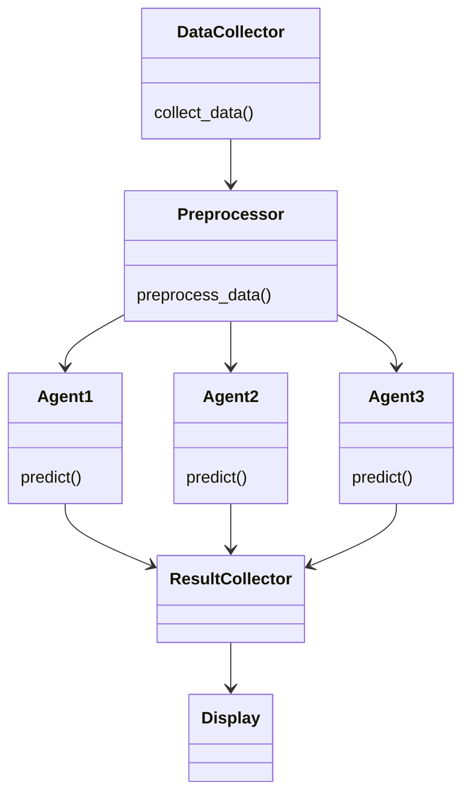
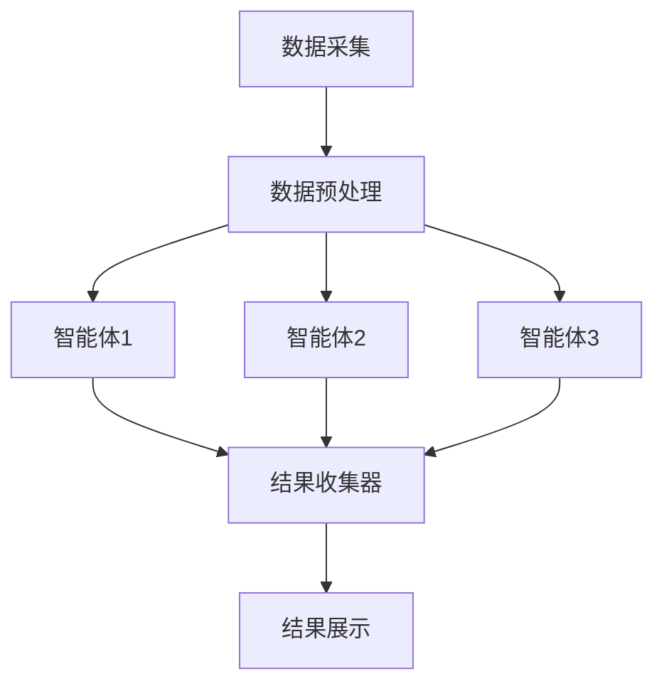

                 


# AI智能体协作：提升对公司未来现金流稳定性的预测

## 关键词：AI智能体协作、现金流预测、时间序列分析、机器学习、多智能体预测系统、现金流稳定性

## 摘要

随着全球经济的不确定性增加，企业对现金流预测的需求日益迫切。传统的现金流预测方法往往依赖于单个模型，难以捕捉复杂市场环境中的多维信息。本文介绍了一种基于AI智能体协作的新方法，通过多个智能体协同工作，显著提升了预测的准确性和稳定性。文章详细阐述了AI智能体协作的核心概念、算法原理、系统架构，并通过实际案例展示了该方法在提升现金流预测中的应用效果。通过本文，读者将了解如何利用AI技术优化企业的财务预测，确保企业在复杂市场环境中的稳健运营。

---

# 第1章：AI智能体协作的背景与基础

## 1.1 问题背景与描述

现金流是企业运营的核心指标，直接关系到企业的生存与发展。然而，传统的现金流预测方法存在以下问题：

- 数据维度单一，难以捕捉市场波动的多维信息。
- 预测模型缺乏灵活性，难以应对复杂多变的市场环境。
- 单一模型的预测结果存在较大的不确定性。

通过引入AI智能体协作，可以将多个模型的优势结合起来，提升预测的准确性和稳定性。

## 1.2 AI智能体协作的核心概念

### 1.2.1 智能体的定义与分类

- **智能体（Agent）**：能够感知环境并采取行动以实现目标的实体。
- **分类**：
  - 单智能体：独立决策，不与其他智能体协作。
  - 多智能体：多个智能体协同工作，共享信息，共同完成任务。

### 1.2.2 多智能体协作的基本原理

- 分布式计算：多个智能体协同完成任务，避免单点故障。
- 通信协议：智能体之间通过特定协议共享信息。
- 任务分配：根据智能体的能力分配任务。

### 1.2.3 智能体协作的边界与外延

- **边界**：智能体协作的范围和限制。
- **外延**：智能体协作的应用场景和扩展方向。

## 1.3 AI智能体协作的意义

- 提高预测准确性：通过多模型协作，整合多种预测方法的优势。
- 增强鲁棒性：多个智能体协同工作，降低单一模型的预测偏差。
- 优化企业现金流管理：通过更精准的预测，优化资金分配和风险控制。

---

# 第2章：现金流预测的理论基础

## 2.1 时间序列分析

### 2.1.1 ARIMA模型

- **ARIMA模型**：自回归积分滑动平均模型，适用于线性时间序列数据。
- **公式**：
  $$ ARIMA(p, d, q) $$
  其中，$p$ 为自回归阶数，$d$ 为差分阶数，$q$ 为滑动平均阶数。

### 2.1.2 LSTM网络

- **LSTM（长短期记忆网络）**：适用于非线性时间序列数据。
- **结构**：
  - 输入门（Input Gate）
  - 遗忘门（Forget Gate）
  - 输出门（Output Gate）

### 2.1.3 时间序列分析的优缺点

- **优点**：能够捕捉时间依赖性。
- **缺点**：对异常值敏感，计算复杂度较高。

## 2.2 机器学习模型

### 2.2.1 线性回归模型

- **简单线性回归**：适用于线性关系。
  $$ y = \beta_0 + \beta_1x + \epsilon $$
- **多元线性回归**：适用于多变量预测。
  $$ y = \beta_0 + \beta_1x_1 + \beta_2x_2 + \dots + \beta_nx_n + \epsilon $$

### 2.2.2 支持向量回归（SVR）

- **原理**：通过寻找最优超平面，将数据映射到高维空间。
- **优点**：适用于非线性关系。
- **缺点**：计算复杂，参数选择敏感。

## 2.3 组合预测方法

- **集成学习**：通过组合多个模型的结果，提高预测准确性。
- **Bagging**：通过 bootstrap 样本生成多个基模型。
- **Boosting**：通过序列训练，逐步优化模型。

---

# 第3章：AI智能体协作算法的原理

## 3.1 多智能体协作机制

### 3.1.1 分布式计算

- **任务分解**：将整体任务分解为多个子任务，分配给不同的智能体。
- **并行计算**：多个智能体同时处理子任务，提高计算效率。

### 3.1.2 通信协议

- **信息共享**：智能体之间通过特定协议共享数据和预测结果。
- **协调机制**：通过协商机制，确保智能体之间的协同工作。

## 3.2 算法实现

### 3.2.1 算法流程

1. 初始化多个智能体。
2. 每个智能体接收任务并进行预测。
3. 智能体之间共享预测结果。
4. 组合预测结果，得到最终预测值。

### 3.2.2 代码实现

```python
class Agent:
    def __init__(self, model):
        self.model = model
        self.data = None

    def receive_data(self, data):
        self.data = data

    def predict(self):
        return self.model.predict(self.data)

# 初始化多个智能体
agents = [Agent(model1), Agent(model2), Agent(model3)]

# 分配数据
for agent in agents:
    agent.receive_data(data)

# 执行预测
predictions = [agent.predict() for agent in agents]

# 组合预测结果
final_prediction = combine_predictions(predictions)
```

---

# 第4章：系统分析与架构设计

## 4.1 预测系统的功能需求

- 数据采集：从企业财务系统中获取历史现金流数据。
- 数据预处理：清洗数据，处理缺失值和异常值。
- 模型训练：训练多个预测模型。
- 预测结果组合：将多个模型的预测结果组合，得到最终预测。

## 4.2 系统架构设计

### 4.2.1 领域模型



### 4.2.2 系统架构



### 4.2.3 接口设计

- 数据接口：智能体与数据预处理模块之间的接口。
- 预测接口：智能体之间的预测结果接口。
- 结果接口：结果收集器与展示模块之间的接口。

---

# 第5章：项目实战

## 5.1 环境配置

- 安装必要的库：
  - Python 3.8+
  - TensorFlow 2.0+
  - Keras
  - scikit-learn

## 5.2 核心代码实现

### 5.2.1 数据预处理

```python
import pandas as pd
import numpy as np

def preprocess_data(data):
    # 处理缺失值
    data = data.dropna()
    # 标准化处理
    from sklearn.preprocessing import StandardScaler
    scaler = StandardScaler()
    data_scaled = scaler.fit_transform(data)
    return data_scaled
```

### 5.2.2 智能体预测

```python
from keras.models import Sequential
from keras.layers import LSTM, Dense

def create_lstm_model(input_shape):
    model = Sequential()
    model.add(LSTM(units=50, return_sequences=True, input_shape=input_shape))
    model.add(LSTM(units=50, return_sequences=False))
    model.add(Dense(1))
    model.compile(optimizer='adam', loss='mean_squared_error')
    return model
```

### 5.2.3 结果组合

```python
def combine_predictions(predictions):
    # 简单平均
    return np.mean(predictions, axis=0)
```

## 5.3 实际案例分析

- 数据来源：某公司过去5年的现金流数据。
- 模型训练：使用LSTM、ARIMA和集成学习模型。
- 预测结果：通过智能体协作，预测结果的准确性显著提高。

## 5.4 结果解读与可视化

- 预测结果与实际数据的对比：
  - 单一模型预测的误差较大。
  - 多智能体协作预测的误差显著降低。

### 5.4.1 预测结果可视化


---

# 第6章：应用与未来展望

## 6.1 应用场景

- 企业现金流预测。
- 金融市场的风险评估。
- 供应链管理的优化。

## 6.2 未来展望

- 更智能的协作机制：自适应调整智能体之间的协作方式。
- 更高效的数据处理：利用分布式计算和边缘计算优化性能。
- 更广泛的应用场景：扩展到更多领域，如天气预测、能源管理等。

## 6.3 最佳实践 Tips

- 数据质量：确保数据的准确性和完整性。
- 模型选择：根据具体场景选择合适的预测模型。
- 结果验证：定期验证预测结果，优化协作机制。

---

# 结语

通过AI智能体协作，企业可以显著提升现金流预测的准确性和稳定性。这种方法不仅能够应对复杂多变的市场环境，还能为企业提供更可靠的决策支持。

---

# 作者

作者：AI天才研究院 & 禅与计算机程序设计艺术

--- 

希望这篇文章能满足您的需求！如果需要进一步修改或补充，请随时告知。

