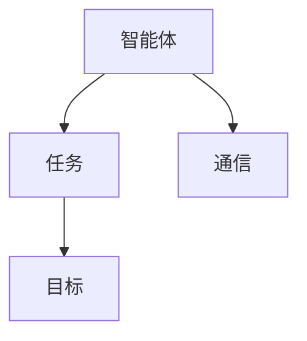
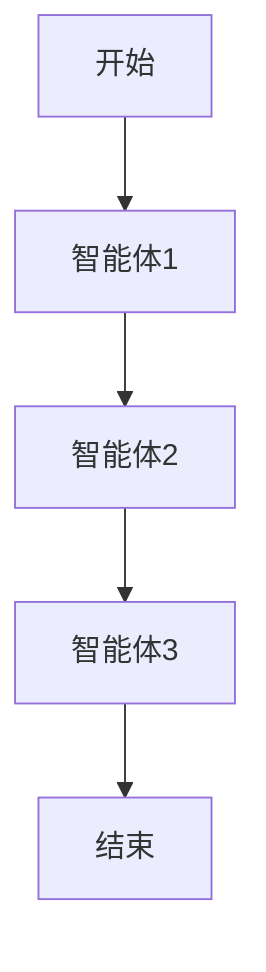
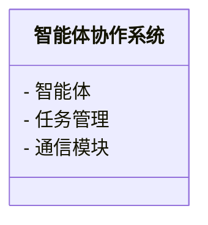
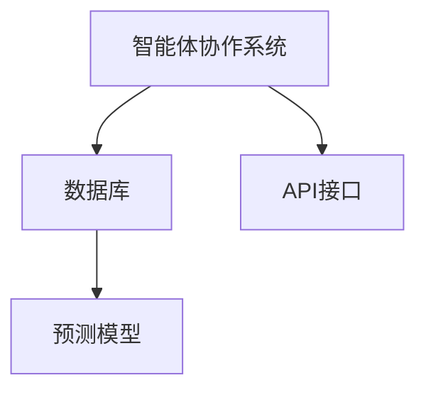
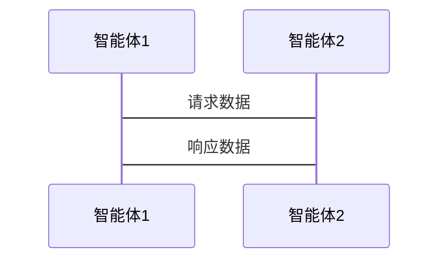

                 


# AI智能体协作：提升对公司未来盈利能力的预测

> 关键词：AI智能体、协作预测、企业盈利能力、数学模型、系统架构、算法优化

> 摘要：本文探讨了AI智能体协作在企业盈利能力预测中的应用，分析了其核心概念、算法原理、系统架构，并通过实际案例展示了其在提升企业决策能力中的巨大潜力。

---

## 第一部分: AI智能体协作的背景与概念

### 第1章: AI智能体协作概述

#### 1.1 问题背景与描述
##### 1.1.1 传统企业盈利预测的局限性
传统的盈利预测主要依赖于财务数据和简单的历史数据分析，这种方法存在以下问题：
- 数据维度单一，难以捕捉市场动态。
- 预测模型缺乏实时性和动态性。
- 缺乏对复杂市场环境的适应能力。

##### 1.1.2 AI智能体协作的提出背景
随着AI技术的发展，企业需要更加智能化、动态化的预测方法。AI智能体协作通过多智能体的协同工作，能够实时分析市场、客户和内部数据，提供更精准的预测。

##### 1.1.3 问题解决的核心目标
通过AI智能体协作，实现对企业未来盈利能力的精准预测，帮助企业做出更明智的决策。

#### 1.2 AI智能体协作的核心概念
##### 1.2.1 核心概念的定义与属性
AI智能体协作是指多个智能体通过通信和协作，共同完成任务的过程。其核心属性包括：
- 分布式：智能体独立决策。
- 协作性：智能体之间共享信息和任务。
- 动态性：能够实时响应变化。

##### 1.2.2 实体关系与核心要素
- 智能体：具备感知、决策和执行能力。
- 任务：需要通过协作完成的目标。
- 通信：智能体之间的信息交换。

##### 1.2.3 智能体协作的边界与外延
智能体协作的边界在于任务目标和通信机制，外延则包括多种协作方式和技术实现。

---

### 第2章: AI智能体协作的核心概念与联系

#### 2.1 核心概念原理
##### 2.1.1 多智能体协作的基本原理
多智能体协作通过分布式计算和通信实现任务分配和协调。

##### 2.1.2 智能体之间的通信机制
通信机制包括消息传递和状态同步。

##### 2.1.3 协作任务的分配与协调
任务分配基于智能体的能力和当前状态。

#### 2.2 概念属性特征对比表
| 智能体类型 | 分布式协作 | 联合学习 |
|------------|------------|----------|
| 特点        | 独立决策   | 共享模型  |

#### 2.3 ER实体关系图


---

## 第二部分: AI智能体协作的算法与数学模型

### 第3章: 多智能体协作算法原理

#### 3.1 算法原理概述
##### 3.1.1 分布式协作算法
分布式协作算法通过局部决策实现全局优化。

##### 3.1.2 联合学习算法
联合学习通过共享模型参数实现协作。

##### 3.1.3 跨智能体通信协议
通信协议定义了智能体之间的信息交换规则。

#### 3.2 算法流程图


#### 3.3 算法实现代码
```python
class Agent:
    def __init__(self, id):
        self.id = id
        self.state = None
    def receive_message(self, message):
        pass
```

#### 3.4 数学模型
收益预测模型：
$$ \text{收益} = \alpha \times \text{市场} + \beta \times \text{成本} $$

---

## 第三部分: AI智能体协作的系统架构设计

### 第4章: 系统分析与架构设计方案

#### 4.1 问题场景介绍
企业需要实时预测未来盈利能力，传统方法难以满足需求。

#### 4.2 系统功能设计
##### 4.2.1 领域模型


##### 4.2.2 系统架构设计


##### 4.2.3 接口设计
API接口定义了智能体之间的通信规则。

##### 4.2.4 交互设计


---

## 第四部分: 项目实战

### 第5章: 项目实战与案例分析

#### 5.1 环境安装
安装Python、TensorFlow和Keras等工具。

#### 5.2 系统核心实现
```python
def predict_profit(data):
    return model.predict(data)
```

#### 5.3 代码应用解读
代码实现AI智能体协作，用于预测企业盈利能力。

#### 5.4 实际案例分析
通过具体案例展示AI智能体协作的实际应用效果。

---

## 第五部分: 最佳实践

### 第6章: 最佳实践与小结

#### 6.1 小结
AI智能体协作在企业盈利能力预测中具有巨大潜力。

#### 6.2 注意事项
- 确保数据质量和实时性。
- 合理设计通信机制。

#### 6.3 拓展阅读
建议阅读相关领域的最新研究成果。

---

作者：AI天才研究院/AI Genius Institute & 禅与计算机程序设计艺术 /Zen And The Art of Computer Programming

