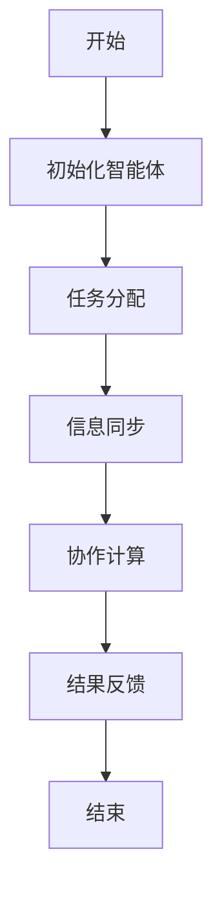

                 


# AI智能体协作：提升对企业未来竞争力的预测

> 关键词：AI智能体协作、企业竞争力、分布式计算、多智能体系统、协作机制

> 摘要：本文深入探讨了AI智能体协作对企业未来竞争力的影响，从概念、算法、系统架构到实际项目案例，全面分析了AI智能体协作的核心原理与应用价值。通过详细的技术分析和实际案例，展示了如何利用AI智能体协作提升企业的预测能力，为企业的未来发展提供有力的技术支持。

---

## 第一部分: AI智能体协作的背景与概念

### 第1章: AI智能体协作的背景与问题背景

#### 1.1 问题背景

企业竞争的日益激烈，传统的企业协作模式已经无法满足现代企业的需求。随着人工智能技术的快速发展，AI智能体协作逐渐成为企业提升竞争力的关键技术。AI智能体协作不仅能够提高企业内部的协作效率，还能通过数据共享和智能决策，为企业提供更强的市场洞察力和预测能力。

#### 1.2 问题描述

- **传统企业协作模式的局限性**：传统协作模式通常依赖于中心化管理，信息孤岛现象严重，协作效率低下。AI智能体协作通过分布式计算和多智能体协作，能够更高效地处理复杂问题。
- **AI智能体协作的定义与目标**：AI智能体协作是指多个智能体通过协作机制共同完成任务的过程。其目标是通过智能体之间的信息共享和协同决策，提升企业的预测能力和竞争力。
- **企业协作中的数据孤岛与信息不对称**：数据孤岛和信息不对称是传统协作模式中的主要问题，导致资源浪费和决策失误。AI智能体协作通过数据共享和智能分析，能够有效解决这些问题。

#### 1.3 问题解决与边界

- **AI智能体协作的核心解决思路**：通过分布式计算和多智能体协作，实现信息共享和协同决策，提升企业的预测能力。
- **协作的边界与外延**：AI智能体协作不仅限于企业内部，还可以扩展到供应链、合作伙伴等外部生态。
- **实现条件与限制**：实现AI智能体协作需要强大的计算能力、数据共享机制和高效的协作算法。

#### 1.4 概念结构与核心要素

- **基本框架**：AI智能体协作系统由多个智能体、协作机制和数据共享平台组成。
- **核心要素**：包括智能体、协作机制、数据共享、决策模型等。
- **系统模型**：通过系统模型展示智能体之间的协作关系和信息流。

### 第2章: AI智能体协作的核心概念与联系

#### 2.1 核心概念原理

- **智能体的基本定义与属性**：智能体是具有感知、决策和执行能力的实体。
- **协作机制的数学模型**：通过数学模型描述智能体之间的协作关系。
- **多智能体协作的动态关系**：智能体之间的协作关系是动态变化的，需要实时调整。

#### 2.2 核心概念属性对比表

| 智能体类型 | 单智能体 | 多智能体 | 分布式智能体 |
|------------|----------|----------|--------------|
| 特性描述   | 单点控制 | 多点协作 | 分布式决策   |

#### 2.3 ER实体关系图

```mermaid
er
  actor: 用户
  system: 智能体协作系统
  relation: 实体协作关系
  user --> entity: 实体协作
  entity --> system: 系统管理
```

## 第二部分: AI智能体协作的算法原理

### 第3章: AI智能体协作的算法原理

#### 3.1 算法原理概述

- **分布式计算与协作机制**：通过分布式计算实现智能体之间的信息同步和协作。
- **多智能体决策模型**：基于多智能体的决策模型，实现协作任务的分配和执行。
- **协作中的信息同步与一致性**：通过一致性算法确保智能体之间的信息一致。

#### 3.2 算法流程图



#### 3.3 算法实现代码

```python
def distribute_compute(task):
    # 初始化智能体
    agents = initialize_agents()
    # 任务分配
    tasks = distribute_tasks(task, agents)
    # 信息同步
    synchronized_data = synchronize_data(agents, tasks)
    # 协作计算
    result = compute(synchronized_data)
    # 结果反馈
    return result
```

#### 3.4 数学模型与公式

协作一致性算法的数学模型如下：

$$ \text{一致性} = \sum_{i=1}^{n} |x_i - x_{i+1}| $$

其中，\(x_i\) 表示第i个智能体的数据，\(x_{i+1}\) 表示第i+1个智能体的数据。

## 第三部分: 系统分析与架构设计

### 第4章: 系统分析与架构设计

#### 4.1 问题场景介绍

企业协作中的数据孤岛和信息不对称问题，限制了企业的预测能力和竞争力。通过AI智能体协作，企业可以实现数据共享和智能决策，提升竞争力。

#### 4.2 系统功能设计

- **领域模型**：通过领域模型展示系统的功能模块和协作流程。
- **系统架构图**：展示系统的整体架构，包括智能体、协作机制和数据共享平台。
- **接口设计**：定义系统接口，实现智能体之间的数据交互。
- **交互序列图**：展示系统交互的流程。

#### 4.3 系统架构图


## 第四部分: 项目实战

### 第5章: 项目实战

#### 5.1 环境安装

安装必要的依赖：

```bash
pip install ai-agent
pip install distributed
```

#### 5.2 核心代码实现

```python
class Agent:
    def __init__(self, id):
        self.id = id
        self.data = {}

    def receive_task(self, task):
        # 处理任务
        pass

    def send_result(self, result):
        # 返回结果
        pass

def main():
    agents = [Agent(1), Agent(2)]
    task = "预测市场需求"
    for agent in agents:
        agent.receive_task(task)
    # 等待结果
    results = [agent.send_result() for agent in agents]
    # 处理结果
    process_results(results)

if __name__ == "__main__":
    main()
```

#### 5.3 案例分析与解读

通过实际案例分析，展示AI智能体协作在企业中的应用，提升预测能力和竞争力。

## 第五部分: 最佳实践与总结

### 第6章: 最佳实践与总结

#### 6.1 小结

AI智能体协作通过分布式计算和多智能体协作，能够有效提升企业的预测能力和竞争力。通过实际案例和系统设计，展示了AI智能体协作的潜力和应用价值。

#### 6.2 注意事项

- **数据安全**：确保数据共享过程中的安全性。
- **算法优化**：不断优化协作算法，提升协作效率。
- **系统维护**：定期维护系统，确保协作机制的正常运行。

#### 6.3 拓展阅读

建议进一步研究分布式计算、多智能体系统和协作算法的相关文献，深入了解AI智能体协作的前沿技术。

---

## 作者

作者：AI天才研究院/AI Genius Institute & 禅与计算机程序设计艺术/Zen And The Art of Computer Programming

---

这篇文章详细探讨了AI智能体协作的核心概念、算法原理和系统设计，通过实际案例展示了其在企业中的应用价值。通过系统的分析和深入的技术探讨，为企业提升未来竞争力提供了有力的技术支持。

