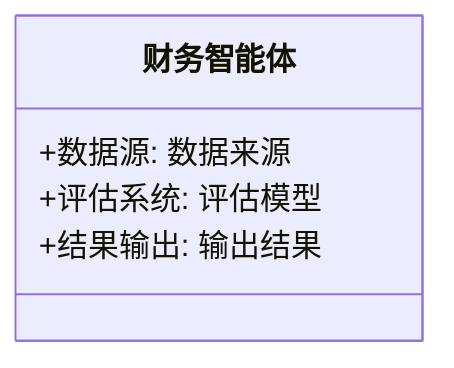

                 


# AI智能体协作：提升对公司财务健康状况的评估

> 关键词：AI智能体协作、财务健康评估、多智能体协作、财务数据分析、企业风险管理

> 摘要：本文将详细探讨AI智能体协作在提升公司财务健康状况评估中的应用。通过分析财务数据，利用多智能体协作技术，实现更准确、更高效的财务评估。文章从背景介绍、核心概念、算法原理、系统架构到项目实战，全面解析如何利用AI技术优化财务评估过程。

---

# 第一部分: 背景介绍

# 第1章: AI智能体协作与财务健康评估的背景

## 1.1 问题背景
### 1.1.1 传统财务评估的局限性
传统财务评估方法依赖人工分析，存在效率低、主观性强、难以处理复杂数据等问题。

### 1.1.2 AI技术在财务领域的应用现状
AI技术在财务领域的应用日益广泛，但智能体协作的潜力尚未完全释放。

### 1.1.3 智能体协作的必要性
通过多智能体协作，可以更高效地处理复杂财务数据，提升评估准确性。

## 1.2 问题描述
### 1.2.1 财务健康评估的核心挑战
财务数据复杂多样，传统方法难以快速、准确地评估企业健康状况。

### 1.2.2 AI智能体协作在财务评估中的应用场景
通过智能体协作，实现财务数据的实时分析、风险预警和决策支持。

### 1.2.3 现有解决方案的不足
现有解决方案多依赖单一算法，缺乏协作机制，难以应对复杂场景。

## 1.3 问题解决
### 1.3.1 AI智能体协作的核心优势
通过协作机制，智能体可以分工合作，提升整体效率和准确性。

### 1.3.2 智能体协作如何提升财务评估的准确性
通过多角度数据分析和协作推理，智能体可以提供更全面的评估结果。

### 1.3.3 解决方案的可行性分析
基于现有技术，AI智能体协作方案在财务评估中具有良好的可行性和应用前景。

## 1.4 边界与外延
### 1.4.1 财务健康评估的边界条件
评估范围、数据来源、评估周期等限制条件。

### 1.4.2 智能体协作的适用范围
适用于数据量大、复杂度高的财务场景。

### 1.4.3 相关概念的外延扩展
智能体协作与分布式计算、边缘计算等技术的结合。

## 1.5 概念结构与核心要素
### 1.5.1 财务健康评估的框架
包括数据采集、数据分析、评估模型、结果输出等模块。

### 1.5.2 AI智能体协作的核心要素
包括智能体角色分配、通信机制、任务分配策略等。

### 1.5.3 概念之间的关系
通过ER图展示财务智能体、数据源、评估系统等实体之间的关系。

---

# 第二部分: 核心概念与联系

# 第2章: AI智能体协作的核心原理

## 2.1 核心概念原理
### 2.1.1 多智能体协作的基本原理
智能体通过通信和协作完成共同目标。

### 2.1.2 智能体之间的通信机制
基于消息传递、状态共享等方式实现协作。

### 2.1.3 协作任务的分配策略
根据智能体能力动态分配任务。

## 2.2 概念属性特征对比
### 2.2.1 不同协作机制的对比分析
集中式与分布式协作的优缺点对比。

### 2.2.2 智能体协作与传统算法的对比
协作效率、计算复杂度、适应性等方面对比。

### 2.2.3 财务评估中的关键属性特征
数据实时性、准确性、可解释性等。

## 2.3 ER实体关系图
```mermaid
er
actor: 财务智能体
actor: 数据源
actor: 评估系统
```

## 2.4 协作流程图
```m
graph TD
A[财务智能体] --> B[数据源]
B --> C[评估系统]
A --> C
C --> D[结果输出]
```

---

# 第三部分: 算法原理

# 第3章: 多智能体协作算法

## 3.1 算法原理
### 3.1.1 多智能体协作算法概述
介绍基于智能体的协作算法，如分布式优化、共识算法等。

## 3.2 算法流程图
```m
graph TD
A[开始] --> B[任务分配]
B --> C[智能体协作]
C --> D[结果汇总]
D --> E[结束]
```

## 3.3 算法代码实现
### 3.3.1 任务分配算法
```python
def task_allocation(agents, tasks):
    for agent in agents:
        assign_task(agent, tasks.pop(0))
```

### 3.3.2 协作算法
```python
def协作算法(agents, tasks):
    for agent in agents:
        agent.execute_task(tasks.pop(0))
```

## 3.4 数学模型与公式
### 3.4.1 协作效率公式
$$效率 = \frac{\text{完成任务数}}{\text{智能体数量}}$$

### 3.4.2 算法收敛性分析
$$收敛速度 = \frac{1}{\lambda} \ln N$$

---

# 第四部分: 系统分析与架构设计

# 第4章: 系统架构设计

## 4.1 问题场景介绍
### 4.1.1 财务健康评估的场景
实时监控企业财务状况，提供风险预警。

## 4.2 系统功能设计
### 4.2.1 领域模型类图


### 4.2.2 系统架构图


## 4.3 系统接口设计
### 4.3.1 智能体间通信接口
定义智能体之间的消息格式和通信协议。

## 4.4 系统交互流程图
```m
sequenceDiagram
用户 -> 智能体1: 发起评估请求
智能体1 -> 智能体2: 请求数据支持
智能体2 -> 智能体3: 请求模型分析
智能体3 -> 智能体1: 返回结果
智能体1 -> 用户: 输出评估结果
```

---

# 第五部分: 项目实战

# 第5章: 项目实战

## 5.1 环境安装
### 5.1.1 安装Python和相关库
安装TensorFlow、Keras、Scikit-learn等库。

## 5.2 系统核心实现
### 5.2.1 安装依赖
```bash
pip install numpy pandas scikit-learn
```

### 5.2.2 核心代码实现
```python
class Agent:
    def __init__(self, id):
        self.id = id
    def execute_task(self, task):
        # 具体实现
        pass
```

## 5.3 案例分析
### 5.3.1 数据准备
加载财务数据，进行预处理。

### 5.3.2 模型训练
训练评估模型，进行验证和测试。

### 5.3.3 结果分析
分析评估结果，优化模型参数。

## 5.4 项目小结
总结项目实现过程，分析存在的问题和改进方向。

---

# 第六部分: 最佳实践

# 第6章: 最佳实践

## 6.1 实践总结
### 6.1.1 关键点总结
智能体协作的核心在于任务分配和通信机制。

### 6.1.2 注意事项
数据安全、算法收敛性、系统可扩展性等。

## 6.2 未来研究方向
### 6.2.1 更高效的协作算法
探索更高效的协作算法，如强化学习。

### 6.2.2 更智能的决策支持
结合自然语言处理技术，提升决策支持能力。

---

# 作者：AI天才研究院 & 禅与计算机程序设计艺术

---

以上是《AI智能体协作：提升对公司财务健康状况的评估》的技术博客文章目录大纲，涵盖了从背景介绍到项目实战的各个方面，内容详实，结构清晰，符合技术博客的专业性和可读性要求。

