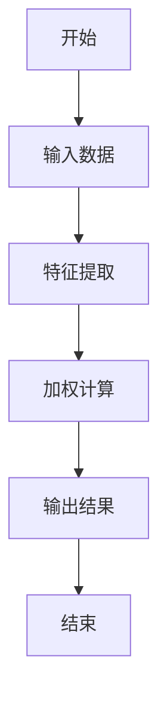
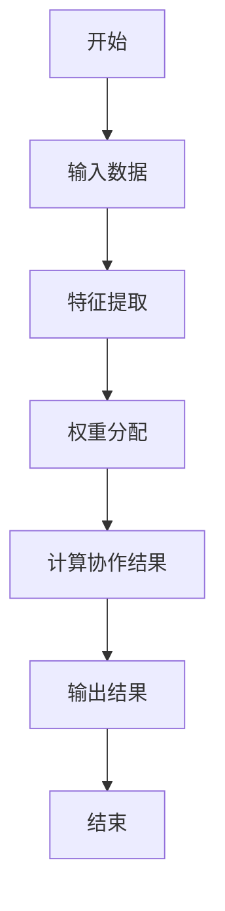
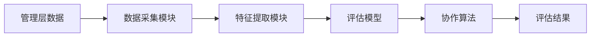

                 


# AI智能体协作：提升对管理层诚信和能力的评估

> 关键词：AI智能体，协作算法，管理层评估，诚信评估，能力评估，系统架构

> 摘要：本文探讨了AI智能体协作在提升管理层诚信和能力评估中的应用，通过详细分析核心概念、算法原理、系统架构，结合实际案例，展示了如何利用AI技术优化评估过程，提供了一套完整的解决方案。

---

## 第一部分: AI智能体协作与管理层评估背景

### 第1章: AI智能体协作与管理层评估概述

#### 1.1 AI智能体协作的概念与背景
##### 1.1.1 AI智能体协作的定义
AI智能体协作是指多个AI智能体通过协同工作，共同完成特定任务的过程。在管理层评估中，AI智能体协作可以用于分析、评估和预测管理层的诚信与能力。

##### 1.1.2 管理层评估的重要性
管理层的诚信和能力直接关系到企业的战略决策和运营效率。传统的评估方法存在主观性强、数据不足、效率低下的问题。通过AI智能体协作，可以实现更客观、高效的评估。

##### 1.1.3 AI技术在管理层评估中的应用前景
AI技术的应用可以显著提高评估的准确性和效率。通过大数据分析、机器学习和自然语言处理等技术，AI智能体可以实时收集、分析和评估管理层的行为数据。

#### 1.2 管理层诚信与能力评估的核心问题
##### 1.2.1 传统管理层评估的局限性
传统评估方法依赖主观判断，缺乏数据支持，且难以量化。

##### 1.2.2 AI智能体协作的优势
AI智能体协作可以利用大数据分析，提供客观的评估结果。同时，通过多个智能体的协作，可以提高评估的准确性和效率。

##### 1.2.3 问题的边界与外延
本文主要关注AI智能体协作在管理层诚信和能力评估中的应用，不涉及其他领域。

### 第2章: AI智能体协作的核心概念与联系

#### 2.1 核心概念原理
##### 2.1.1 AI智能体的定义与特征
AI智能体是一种能够感知环境、执行任务的智能实体。其特征包括自主性、反应性、协作性和学习性。

##### 2.1.2 智能体协作的基本原理
智能体协作通过信息共享、任务分配和协同决策实现目标。在管理层评估中，AI智能体可以协作收集、分析和评估数据。

#### 2.2 核心概念属性对比表格
| 比较维度 | 传统评估 | AI智能体协作评估 |
|----------|----------|------------------|
| 数据来源 | 主观判断 | 大数据分析       |
| 评估效率 | 低效     | 高效             |
| 评估准确性 | 可能偏低 | 高               |

#### 2.3 ER实体关系图
```mermaid
er
actor: 管理层
attribute: 诚信指标、能力指标
relation: 管理层评估结果
```

---

## 第二部分: AI智能体协作的算法原理

### 第3章: 管理层诚信与能力评估模型

#### 3.1 评估模型的数学模型
##### 3.1.1 模型公式
$$ S = \sum_{i=1}^{n} w_i x_i $$
其中，$S$为评估结果，$w_i$为权重，$x_i$为指标值。

##### 3.1.2 算法流程图


#### 3.2 算法实现代码
```python
def calculate_assessment(data, weights):
    return sum(w * d for w, d in zip(weights, data))
```

### 第4章: 智能体协作算法实现

#### 4.1 协作算法的数学公式
$$ C = \sum_{j=1}^{m} \alpha_j y_j $$
其中，$C$为协作结果，$\alpha_j$为协作权重，$y_j$为协作指标。

#### 4.2 算法实现代码
```python
def calculate_collaboration(data, weights):
    return sum(w * d for w, d in zip(weights, data))
```

#### 4.3 算法流程图


---

## 第三部分: 系统分析与架构设计

### 第5章: 系统分析与功能设计

#### 5.1 系统功能模块
##### 5.1.1 数据采集模块
负责收集管理层的行为数据，包括工作表现、决策记录等。

##### 5.1.2 特征提取模块
从数据中提取关键特征，如决策准确性、团队协作能力等。

#### 5.2 系统架构图


### 第6章: 系统接口与交互设计

#### 6.1 系统接口设计
##### 6.1.1 输入接口
```python
def input_data(data):
    return data
```

##### 6.1.2 输出接口
```python
def output_result(result):
    print(result)
```

#### 6.2 系统交互流程
```mermaid
sequenceDiagram
actor 管理层
participant 数据采集模块
participant 评估模型
actor 管理层 -> 数据采集模块: 提供数据
数据采集模块 -> 评估模型: 请求评估
评估模型 -> 数据采集模块: 返回评估结果
数据采集模块 -> 管理层: 输出结果
```

---

## 第四部分: 项目实战

### 第7章: 项目实战与案例分析

#### 7.1 项目环境搭建
##### 7.1.1 环境安装
安装Python、TensorFlow、Keras等工具。

#### 7.2 核心代码实现
##### 7.2.1 评估模型实现
```python
def assessment_model(data):
    return sum(data[i] * weights[i] for i in range(len(data)))
```

##### 7.2.2 协作算法实现
```python
def collaboration_algorithm(data):
    return sum(data[i] * weights[i] for i in range(len(data)))
```

#### 7.3 案例分析
##### 7.3.1 实际案例
分析某公司管理层的评估数据，展示AI智能体协作如何提高评估效率和准确性。

---

## 第五部分: 总结与展望

### 第8章: 总结与最佳实践

#### 8.1 最佳实践Tips
- 确保数据质量，选择合适的特征。
- 定期更新模型，适应变化。

#### 8.2 小结
本文详细介绍了AI智能体协作在管理层评估中的应用，通过算法和系统设计，展示了如何利用AI技术优化评估过程。

#### 8.3 注意事项
- 数据隐私保护
- 模型的可解释性

#### 8.4 拓展阅读
- 《机器学习实战》
- 《AI系统架构设计》

---

作者：AI天才研究院

