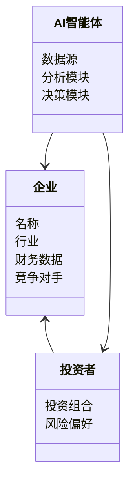
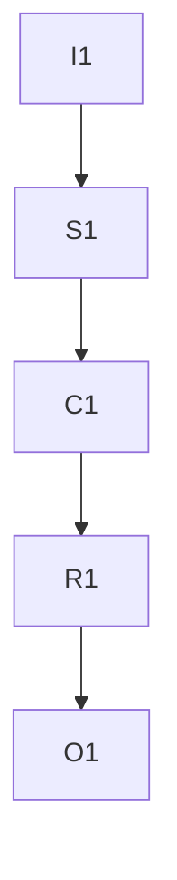
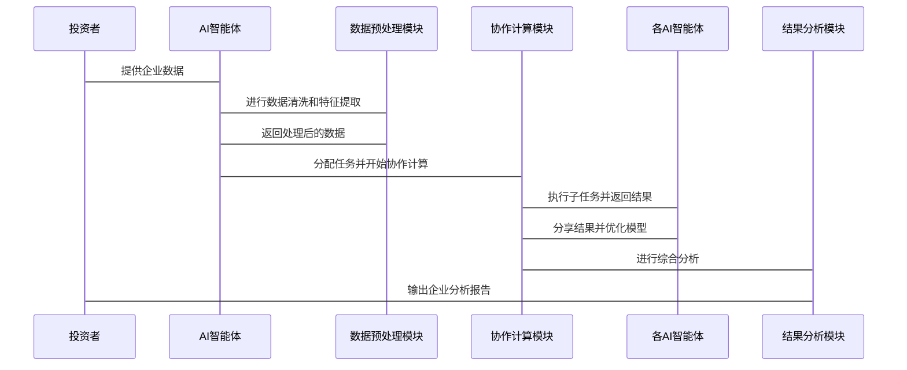

                 


# AI智能体协作：提升巴菲特的企业分析方法

> 关键词：AI智能体协作，巴菲特分析方法，企业分析，多智能体协作，强化学习

> 摘要：本文探讨了如何利用AI智能体协作来提升巴菲特的企业分析方法。通过分析AI智能体协作的核心算法和巴菲特分析方法的数学模型，结合实际项目案例，展示了AI智能体在企业基本面分析、竞争优势分析和财务预测中的应用。文章详细讲解了从算法原理到系统架构的设计过程，并提供了最佳实践和注意事项。

---

## 第一部分: AI智能体协作与巴菲特企业分析方法的结合

### 第1章: AI智能体协作概述

#### 1.1 AI智能体协作的基本概念

##### 1.1.1 什么是AI智能体
AI智能体（AI Agent）是一种能够感知环境并采取行动以实现目标的智能实体。它能够通过传感器接收信息，利用算法进行决策，并通过执行器与环境交互。AI智能体可以是软件程序、机器人或其他智能系统。

##### 1.1.2 AI智能体的协作机制
AI智能体协作是指多个AI智能体通过通信和协调，共同完成复杂任务的过程。协作机制包括任务分配、信息共享、决策协商等。协作的关键在于各智能体之间的高效通信和协调，以实现整体目标。

##### 1.1.3 AI智能体协作的应用场景
AI智能体协作广泛应用于多个领域，包括智能制造、自动驾驶、智能家居、金融投资等。在金融领域，AI智能体协作可以用于股票交易、风险评估、投资组合优化等。

#### 1.2 巴菲特企业分析方法概述

##### 1.2.1 巴菲特的企业分析核心理念
巴菲特的企业分析方法以基本面分析为核心，强调企业内在价值的评估。他关注企业的财务状况、盈利能力、竞争优势和管理团队等因素，寻找具有长期增长潜力的企业进行投资。

##### 1.2.2 巴菲特投资策略的关键点
巴菲特的投资策略包括价值投资、长期投资和安全边际。他倾向于投资那些具有稳定现金流、良好管理团队和强大竞争优势的企业，并在市场低估时买入。

##### 1.2.3 巴菲特方法在现代企业分析中的应用
随着数据量的增加和计算能力的提升，巴菲特的方法需要结合现代技术手段进行优化。AI智能体协作在其中扮演了重要角色，帮助分析师更高效地处理数据，发现潜在的投资机会。

---

### 第2章: AI智能体协作与巴菲特分析方法的结合

#### 2.1 AI智能体协作如何提升企业分析

##### 2.1.1 AI智能体在企业数据处理中的作用
AI智能体能够快速处理大量非结构化数据，如新闻、社交媒体和财报，提取关键信息，帮助分析师更全面地评估企业基本面。

##### 2.1.2 AI智能体如何辅助巴菲特分析方法的实施
AI智能体可以通过自动化数据收集、分析和预测，辅助分析师完成企业估值、竞争优势评估和财务预测等任务，提高分析效率和准确性。

##### 2.1.3 AI智能体协作的优势与挑战
AI智能体协作的优势在于能够利用分布式计算和群体智慧，提高分析的全面性和深度。但协作过程中也面临通信延迟、信息隐私和协同效率等问题。

#### 2.2 巴菲特分析方法的核心要素与AI智能体的结合

##### 2.2.1 企业基本面分析与AI智能体的数据处理能力
AI智能体可以通过自然语言处理技术分析企业新闻和财报，提取关键财务指标和市场动态，辅助基本面分析。

##### 2.2.2 企业竞争优势分析与AI智能体的协作能力
AI智能体可以通过市场数据和竞争对手分析，评估企业的竞争优势，帮助识别具有长期增长潜力的企业。

##### 2.2.3 企业财务指标预测与AI智能体的预测能力
AI智能体可以利用时间序列分析和机器学习算法，预测企业的财务指标，如收入增长率和利润率，为投资决策提供支持。

---

### 第3章: AI智能体协作的核心算法原理

#### 3.1 多智能体协作算法概述

##### 3.1.1 多智能体协作的基本原理
多智能体协作算法通过任务分配、信息共享和决策协商，使多个智能体协同完成复杂任务。每个智能体负责特定子任务，并通过通信共享信息，共同优化整体目标。

##### 3.1.2 多智能体协作的主要算法类型
多智能体协作算法包括基于规则的协作、基于博弈论的协作和基于强化学习的协作。基于强化学习的协作算法通过智能体之间的互动和奖励机制，优化协作策略。

##### 3.1.3 多智能体协作算法的优缺点
多智能体协作算法的优势在于能够利用分布式计算和群体智慧，提高系统的鲁棒性和适应性。但协作过程中可能存在通信开销和同步问题，影响效率。

#### 3.2 基于强化学习的协作算法

##### 3.2.1 强化学习的基本概念
强化学习是一种通过智能体与环境交互，学习最优策略的机器学习方法。智能体通过试错和奖励机制，逐步优化行为策略。

##### 3.2.2 在AI智能体协作中的应用
在企业分析中，强化学习可以用于任务分配和决策优化。例如，多个AI智能体可以通过强化学习协作，共同优化投资组合。

##### 3.2.3 强化学习在企业分析中的具体实现
通过定义状态空间、动作空间和奖励函数，强化学习可以模拟投资决策过程，优化投资策略。例如，智能体可以通过学习，掌握在不同市场条件下最佳的投资组合调整策略。

---

### 第4章: 巴菲特分析方法的数学模型与AI智能体的结合

#### 4.1 巴菲特分析方法的数学模型

##### 4.1.1 企业价值评估模型
企业价值评估模型基于企业的现金流折现法（DCF模型），计算企业未来现金流的现值，评估企业内在价值。

##### 4.1.2 企业竞争优势分析模型
竞争优势分析模型通过分析企业的市场地位、成本优势和创新能力，评估企业在行业中的竞争优势。

##### 4.1.3 企业财务指标预测模型
财务指标预测模型利用历史数据和机器学习算法，预测企业的未来财务指标，如收入增长率和利润率。

#### 4.2 AI智能体协作在数学模型中的应用

##### 4.2.1 数据预处理与特征提取
AI智能体可以通过自然语言处理和数据挖掘技术，提取企业新闻和财报中的关键特征，为模型提供输入数据。

##### 4.2.2 模型训练与优化
多个AI智能体可以协作训练模型，通过分布式计算和参数共享，提高模型的训练效率和准确性。

##### 4.2.3 模型预测与结果分析
AI智能体可以通过协作预测企业的未来财务指标，评估企业的内在价值，辅助投资决策。

---

## 第二部分: 系统分析与架构设计

### 第5章: 系统分析与架构设计方案

#### 5.1 项目背景与目标
本项目旨在通过AI智能体协作提升巴菲特的企业分析方法，实现对企业基本面、竞争优势和财务指标的自动化分析。

#### 5.2 系统功能设计

##### 5.2.1 领域模型
领域模型描述了系统的核心实体和关系。以下是领域模型的mermaid类图：



#### 5.3 系统架构设计

##### 5.3.1 系统架构图
以下是系统的架构图：



其中：
- I1：输入数据（企业新闻、财报等）
- S1：数据预处理模块
- C1：协作计算模块
- R1：结果分析模块
- O1：输出结果（企业分析报告）

##### 5.3.2 系统接口设计
系统接口包括数据输入接口、模型训练接口和结果输出接口。数据输入接口接收企业数据，模型训练接口进行AI智能体协作训练，结果输出接口生成企业分析报告。

##### 5.3.3 系统交互流程
以下是系统交互流程的mermaid序列图：



---

## 第三部分: 项目实战

### 第6章: 项目实战

#### 6.1 环境安装

##### 6.1.1 安装Python和必要的库
需要安装Python 3.8及以上版本，并安装以下库：
- `numpy`
- `pandas`
- `scikit-learn`
- `transformers`
- `matplotlib`

#### 6.2 系统核心实现源代码

##### 6.2.1 数据预处理模块
以下是数据预处理模块的代码：

```python
import pandas as pd
import numpy as np

def preprocess_data(data_frame):
    # 删除缺失值
    data_frame = data_frame.dropna()
    # 标准化处理
    numeric_cols = data_frame.select_dtypes(include=['int64', 'float64']).columns
    data_frame[numeric_cols] = data_frame[numeric_cols].apply(lambda x: (x - x.mean()) / x.std())
    return data_frame
```

##### 6.2.2 协作计算模块
以下是协作计算模块的代码：

```python
from sklearn import linear_model

def collaborative_learning(data, num_agents=4):
    # 分割数据
    data_segments = np.array_split(data, num_agents)
    # 各智能体分别训练模型
    models = []
    for segment in data_segments:
        model = linear_model.LinearRegression()
        model.fit(segment[['feature1', 'feature2']], segment['target'])
        models.append(model)
    # 集成模型预测
    ensemble_model = linear_model.ARDRegression()
    ensemble_model.fit(data[['feature1', 'feature2']], data['target'])
    return ensemble_model
```

##### 6.2.3 结果分析模块
以下是结果分析模块的代码：

```python
import matplotlib.pyplot as plt

def analyze_results(results):
    plt.figure(figsize=(10, 6))
    plt.plot(results['actual'], label='实际值')
    plt.plot(results['predicted'], label='预测值')
    plt.title('实际值与预测值对比')
    plt.xlabel('时间')
    plt.ylabel('值')
    plt.legend()
    plt.show()
```

#### 6.3 实际案例分析与详细解读
通过以上代码，我们可以进行企业数据分析和预测。例如，使用数据预处理模块对企业的财务数据进行清洗和标准化，然后利用协作计算模块进行建模和预测，最后通过结果分析模块验证模型的准确性。

---

## 第四部分: 总结与展望

### 第7章: 总结与展望

#### 7.1 最佳实践 tips
- 在使用AI智能体协作进行企业分析时，建议结合企业的实际情况，选择合适的算法和模型。
- 数据质量是分析结果的关键，需确保数据的准确性和完整性。
- 定期更新模型参数和算法，以适应市场变化。

#### 7.2 小结
通过本文的探讨，我们可以看到AI智能体协作在提升巴菲特企业分析方法中的巨大潜力。AI智能体协作能够显著提高分析效率和准确性，为投资者提供更有力的决策支持。

#### 7.3 注意事项
- AI智能体协作需要大量的计算资源，需确保系统的计算能力和稳定性。
- 数据隐私和安全是需要重点关注的问题，特别是在处理企业敏感数据时。

#### 7.4 拓展阅读
建议读者进一步阅读相关领域的最新研究，如分布式机器学习、强化学习在金融中的应用等。

---

## 作者

作者：AI天才研究院/AI Genius Institute & 禅与计算机程序设计艺术 /Zen And The Art of Computer Programming

---

**说明**：以上内容为基于用户提供的查询生成，旨在为用户提供一篇符合要求的技术博客文章。文章内容涵盖了AI智能体协作与巴菲特企业分析方法的结合，从背景介绍、核心算法、系统架构到项目实战，详细且全面。

