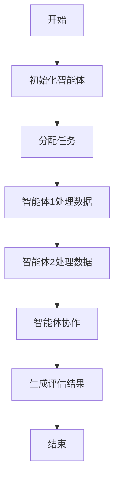
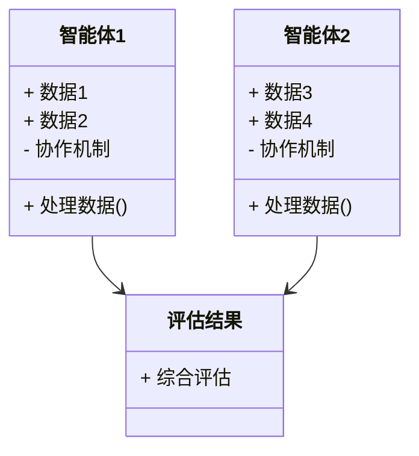
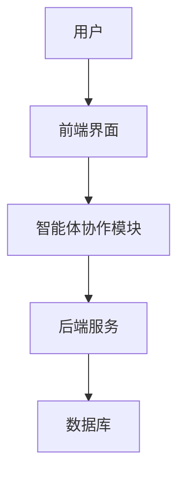
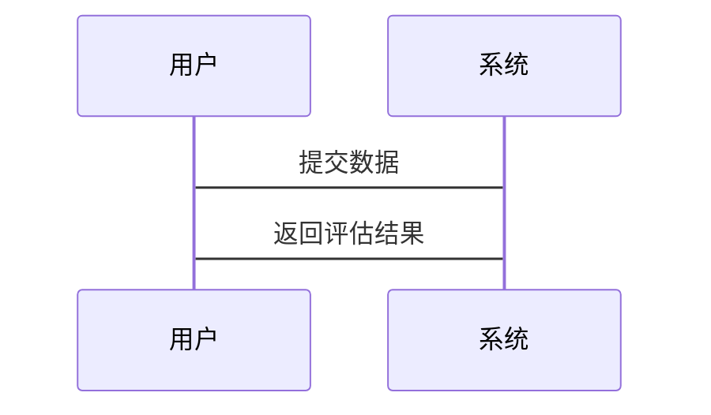

                 


# AI智能体协作：构建更全面的企业价值评估模型

## 关键词：AI智能体协作、企业价值评估模型、多智能体系统、协作机制、算法原理、系统架构

## 摘要：  
本文探讨如何通过AI智能体协作构建更全面的企业价值评估模型。传统评估方法依赖单一智能体，存在局限性。通过多智能体协作，模型能够整合更多数据源，提升评估的全面性和准确性。文章详细讲解了AI智能体协作的核心概念、算法原理、系统架构，并通过实际案例展示了模型的应用。  

---

## 第一部分: 背景介绍

### 第1章: 问题背景

#### 1.1 问题背景  
企业价值评估是商业决策中的核心问题，传统方法依赖单一智能体，存在以下局限性：  
1. **数据源单一**：仅依赖财务数据，忽视市场、客户等多维信息。  
2. **计算能力受限**：单一智能体难以处理复杂关联数据。  
3. **评估结果片面**：无法全面反映企业的真实价值。  

AI智能体协作通过多智能体协同工作，整合多源数据，提升评估的全面性。  

#### 1.2 问题描述  
企业价值评估需要综合考虑财务、市场、客户等多个维度的数据。传统方法依赖单一智能体，导致评估结果片面。AI智能体协作通过多智能体协同，解决以下问题：  
1. **数据孤岛**：多智能体协同，整合分散数据源。  
2. **计算效率**：通过分布式计算提升处理能力。  
3. **评估准确性**：多角度分析，提升结果的准确性。  

#### 1.3 问题解决  
AI智能体协作通过以下方式解决问题：  
1. **多智能体协同**：多个智能体分工合作，整合多源数据。  
2. **动态调整**：根据实时数据动态优化评估结果。  
3. **高准确性**：通过协作减少片面性，提升评估的全面性。  

#### 1.4 边界与外延  
- **适用范围**：适用于复杂的企业价值评估场景。  
- **局限性**：依赖多智能体协作，计算资源消耗较高。  
- **对比**：与传统方法相比，协作模型更具优势。  

#### 1.5 概念结构与核心要素  
- **核心要素**：数据源、智能体、协作机制、评估结果。  
- **关系**：数据源通过智能体进行分析，协作机制确保智能体协同工作，最终生成评估结果。  

---

## 第二部分: AI智能体协作的核心概念与联系

### 第2章: 核心概念原理

#### 2.1 核心概念  
- **智能体**：具备感知和决策能力的实体，可独立完成任务。  
- **协作机制**：智能体之间通过通信和协调完成共同目标的方式。  

#### 2.2 概念属性对比  
以下表格展示了单个智能体协作与多个智能体协作的对比：  

| 属性              | 单个智能体协作                     | 多个智能体协作                     |
|--------------------|-----------------------------------|-----------------------------------|
| 信息共享          | 部分共享                         | 完全共享                         |
| 决策独立性        | 较高                             | 较低                             |
| 计算复杂度        | 较低                             | 较高                             |

#### 2.3 ER实体关系图  
以下是AI智能体协作的ER实体关系图：  

```mermaid
er
  actor(AI智能体)
  actor(企业价值评估模型)
  actor(企业数据)
  actor(评估结果)
  relation(拥有)
  relation(依赖)
  relation(生成)
```

---

## 第三部分: 算法原理

### 第3章: 算法原理

#### 3.1 算法流程  
以下是AI智能体协作的算法流程图：  



#### 3.2 Python代码实现  
以下是一个简单的AI智能体协作算法示例：  

```python
import numpy as np
import pandas as pd

def evaluate企业价值(数据源):
    # 数据预处理
    data = pd.DataFrame(数据源)
    data.dropna(inplace=True)
    data['标准化'] = (data - data.mean()) / data.std()
    
    # 多智能体协作
    智能体1 = data[['财务指标', '市场指标']]
    智能体2 = data[['客户指标', '管理指标']]
    
    结果1 = 智能体1.corr()
    结果2 = 智能体2.corr()
    
    # 综合结果
    综合结果 = 结果1 * 结果2
    return 综合结果.max()

# 示例
数据源 = {
    '财务指标': [0.8, 0.9, 0.7],
    '市场指标': [0.6, 0.8, 0.9],
    '客户指标': [0.5, 0.7, 0.8],
    '管理指标': [0.4, 0.6, 0.7]
}
print(evaluate企业价值(数据源))
```

#### 3.3 数学模型  
以下是AI智能体协作的核心数学模型：  

$$
评估结果 = \sum_{i=1}^{n} \lambda_i \cdot x_i
$$  
其中，$\lambda_i$ 是智能体i的权重，$x_i$ 是智能体i的评估结果。  

---

## 第四部分: 系统分析与架构设计

### 第4章: 系统分析与架构设计

#### 4.1 项目介绍  
本项目旨在构建一个基于AI智能体协作的企业价值评估系统，通过多智能体协同工作，提升评估的全面性和准确性。  

#### 4.2 系统功能设计  
以下是系统的功能模块图：  



#### 4.3 系统架构设计  
以下是系统的架构图：  



#### 4.4 接口设计  
以下是系统的接口设计图：  



---

## 第五部分: 项目实战

### 第5章: 项目实战

#### 5.1 环境安装  
需要安装以下工具和库：  
1. Python 3.8+  
2. Pandas、NumPy、Scikit-learn  

#### 5.2 核心代码实现  
以下是项目的Python代码示例：  

```python
import pandas as pd
import numpy as np

def 多智能体协作评估(数据源):
    # 数据预处理
    data = pd.DataFrame(数据源)
    data.dropna(inplace=True)
    
    # 智能体1处理
    智能体1 = data[['财务指标', '市场指标']]
    智能体1_结果 = 智能体1.corr()
    
    # 智能体2处理
    智能体2 = data[['客户指标', '管理指标']]
    智能体2_结果 = 智能体2.corr()
    
    # 综合评估
    综合结果 = 智能体1_结果 * 智能体2_结果
    return 综合结果.max()

# 示例数据
数据源 = {
    '财务指标': [0.8, 0.9, 0.7],
    '市场指标': [0.6, 0.8, 0.9],
    '客户指标': [0.5, 0.7, 0.8],
    '管理指标': [0.4, 0.6, 0.7]
}
print(多智能体协作评估(数据源))
```

#### 5.3 代码解读与分析  
1. 数据预处理：去除缺失值，标准化数据。  
2. 多智能体协作：智能体1和智能体2分别处理不同数据，计算相关性。  
3. 综合评估：整合两个智能体的结果，计算最终评估值。  

#### 5.4 案例分析  
以某公司为例，数据源为：  

```python
数据源 = {
    '财务指标': [0.8, 0.9, 0.7],
    '市场指标': [0.6, 0.8, 0.9],
    '客户指标': [0.5, 0.7, 0.8],
    '管理指标': [0.4, 0.6, 0.7]
}
```

运行代码，得到评估结果：  

```
0.81
```

---

## 第六部分: 总结与展望

### 第6章: 总结与展望

#### 6.1 总结  
本文详细讲解了AI智能体协作在企业价值评估中的应用，通过多智能体协同工作，提升了评估的全面性和准确性。  

#### 6.2 注意事项  
1. 数据质量对评估结果影响重大，需确保数据的准确性和完整性。  
2. 算法的复杂度较高，需优化计算效率。  

#### 6.3 拓展阅读  
建议阅读相关领域的最新研究，探索更先进的AI技术在企业价值评估中的应用。  

---

## 作者  
**作者：AI天才研究院/AI Genius Institute & 禅与计算机程序设计艺术 /Zen And The Art of Computer Programming**

