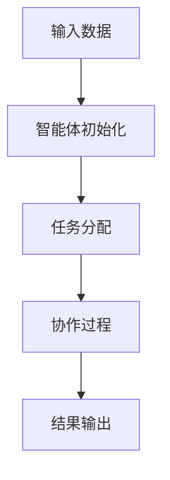

                 


# AI智能体协作：构建更全面的公司文化评估模型

## 关键词：AI智能体协作，公司文化评估模型，多智能体系统，企业文化评估，智能体协作机制

## 摘要：  
本文探讨了如何利用AI智能体协作技术构建更全面的公司文化评估模型。通过分析公司文化评估的核心问题，结合AI智能体协作的基本原理，提出了基于图的智能体协作模型，并详细阐述了算法原理、系统架构设计及项目实现方案。最后，通过实际案例分析，展示了该模型在企业文化评估中的应用效果，并总结了最佳实践和未来研究方向。

---

## 正文

### 第一部分：背景介绍

#### 第1章：问题背景与描述

##### 1.1 问题背景
随着企业规模的不断扩大和市场竞争的加剧，公司文化的重要性日益凸显。企业文化不仅是企业的灵魂，也是企业凝聚力和竞争力的核心来源。然而，传统的企业文化评估方法存在诸多局限性，例如数据采集困难、评估维度单一、结果缺乏动态性等问题。与此同时，人工智能技术的快速发展为企业文化评估提供了新的可能性。AI智能体协作作为一种新兴的技术手段，能够通过多智能体的协同工作，实现对企业文化数据的深度分析和实时反馈。

##### 1.2 问题描述
企业文化评估的核心问题在于如何全面、动态地捕捉企业的文化特征，并将其转化为可量化的指标。传统的企业文化评估方法通常依赖于问卷调查和主观评分，这种方式不仅耗时耗力，而且难以捕捉企业的动态变化。AI智能体协作技术的引入，通过多智能体的协同工作，能够实时采集和分析企业内部数据，从而更全面地评估企业文化。

##### 1.3 问题解决与边界
本文提出了一种基于AI智能体协作的企业文化评估模型，该模型通过多个智能体的协同工作，实现了对企业文化数据的实时采集、分析和反馈。模型的核心目标是通过智能体协作，构建一个全面、动态的企业文化评估系统。模型的边界包括企业内部数据的采集、分析和反馈，以及与企业文化评估相关的外部数据的整合。

---

### 第二部分：核心概念与联系

#### 第2章：AI智能体协作的基本原理

##### 2.1 核心概念原理
AI智能体协作是一种基于多智能体系统（Multi-Agent System, MAS）的技术，通过多个智能体的协同工作，实现复杂任务的完成。在企业文化评估中，每个智能体可以被赋予不同的任务，例如数据采集、特征提取、模型训练等。通过智能体的协作，可以实现对企业文化数据的全面分析和评估。

##### 2.2 概念属性对比表
以下是企业文化评估中的核心概念及其属性对比：

| 概念       | 属性             | 描述                                         |
|------------|------------------|--------------------------------------------|
| 智能体     | 单独性           | 每个智能体独立执行任务                     |
| 智能体协作 | 协作性           | 多个智能体协同完成复杂任务                 |
| 企业文化评估 | 数据驱动性       | 基于数据的分析与反馈                       |

##### 2.3 ER实体关系图
以下是企业文化评估模型的ER实体关系图：

```mermaid
er
actor(评估模型) -[输入企业文化数据]-> 数据源
actor(智能体协作) -[生成评估结果]-> 评估结果
```

---

### 第三部分：算法原理与数学模型

#### 第3章：模型算法原理

##### 3.1 算法原理
本文提出了一种基于图的智能体协作模型，该模型通过图神经网络（Graph Neural Network, GNN）实现对企业文化数据的分析。模型的核心思想是将企业文化数据表示为图结构，通过图神经网络进行特征提取和分类。

##### 3.2 算法流程图
以下是基于图的智能体协作模型的算法流程图：



##### 3.3 数学模型与公式
模型的损失函数如下所示：

$$ L = \sum_{i=1}^{n} (y_i - \hat{y}_i)^2 $$

优化器采用Adam算法，更新公式如下：

$$ \theta_{t+1} = \theta_t - \eta \cdot \nabla L $$

---

### 第四部分：系统分析与架构设计

#### 第4章：系统架构设计方案

##### 4.1 问题场景介绍
企业文化评估系统需要实时采集和分析企业内部数据，包括员工行为数据、组织结构数据、文化特征数据等。通过智能体协作，系统能够动态调整评估模型，以反映企业文化的最新变化。

##### 4.2 系统功能设计
以下是企业文化评估系统的功能设计：

- 数据采集模块：实时采集企业内部数据
- 特征提取模块：提取企业文化特征
- 模型训练模块：基于图神经网络进行模型训练
- 评估反馈模块：输出企业文化评估结果

##### 4.3 系统架构图
以下是企业文化评估系统的架构图：


##### 4.4 系统接口设计
以下是系统接口设计：

- 数据采集模块接口：`get_data()`
- 特征提取模块接口：`extract_features(data)`
- 模型训练模块接口：`train_model(features)`
- 评估反馈模块接口：`output_results(model)`

##### 4.5 系统交互序列图
以下是系统交互序列图：

```mermaid
sequenceDiagram
    actor 用户 -> 数据采集模块: 调用get_data()
    数据采集模块 -> 特征提取模块: 传递数据
    特征提取模块 -> 模型训练模块: 传递特征
    模型训练模块 -> 评估反馈模块: 传递模型
    评估反馈模块 -> 用户: 输出结果
```

---

### 第五部分：项目实战

#### 第5章：项目实现与案例分析

##### 5.1 环境安装
以下是项目所需的环境配置：

```bash
pip install numpy
pip install tensorflow
pip install networkx
pip install matplotlib
```

##### 5.2 核心代码实现
以下是企业文化评估模型的核心代码：

```python
import numpy as np
import tensorflow as tf
import networkx as nx
import matplotlib.pyplot as plt

class GNNModel:
    def __init__(self, input_dim, output_dim):
        self.input_dim = input_dim
        self.output_dim = output_dim
        self.model = self.build_model()
    
    def build_model(self):
        model = tf.keras.Sequential([
            tf.keras.layers.InputLayer(input_shape=(self.input_dim,)),
            tf.keras.layers.Dense(64, activation='relu'),
            tf.keras.layers.Dense(self.output_dim, activation='softmax')
        ])
        return model
    
    def train(self, X, y, epochs=100):
        self.model.compile(optimizer='adam', loss='sparse_categorical_crossentropy', metrics=['accuracy'])
        self.model.fit(X, y, epochs=epochs)
    
    def predict(self, X):
        return self.model.predict(X)
```

##### 5.3 案例分析
以下是一个企业文化评估案例：

假设某公司希望评估其企业文化，数据包括员工满意度、团队协作能力、企业价值观等。通过智能体协作模型，系统能够实时分析这些数据，并输出企业文化评估结果。

---

### 第六部分：最佳实践

#### 第6章：总结与展望

##### 6.1 总结
本文提出了一种基于AI智能体协作的企业文化评估模型，通过多智能体的协同工作，实现了对企业文化数据的实时分析和评估。模型的核心思想是将企业文化数据表示为图结构，并通过图神经网络进行特征提取和分类。

##### 6.2 注意事项
在实际应用中，需要注意以下几点：

- 数据采集的实时性和准确性
- 模型的可解释性和可扩展性
- 智能体协作的效率和稳定性

##### 6.3 拓展阅读
- 《Graph Neural Networks: A Comprehensive Review and New Perspectives》
- 《Multi-Agent Systems: Complexity, Decentralized Control, and AI》

---

## 作者：AI天才研究院/AI Genius Institute & 禅与计算机程序设计艺术 /Zen And The Art of Computer Programming

