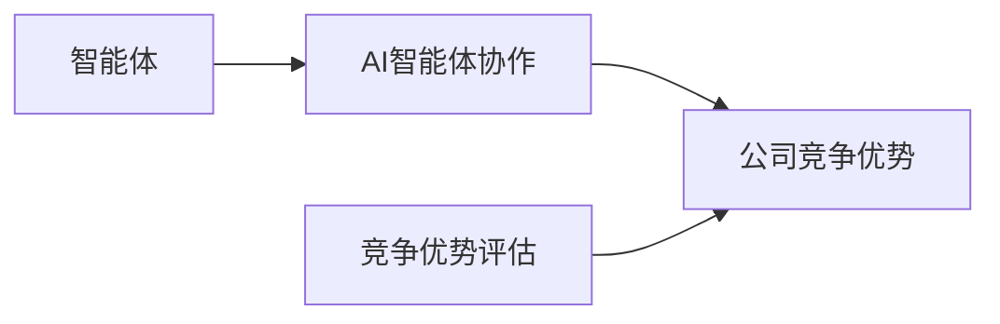
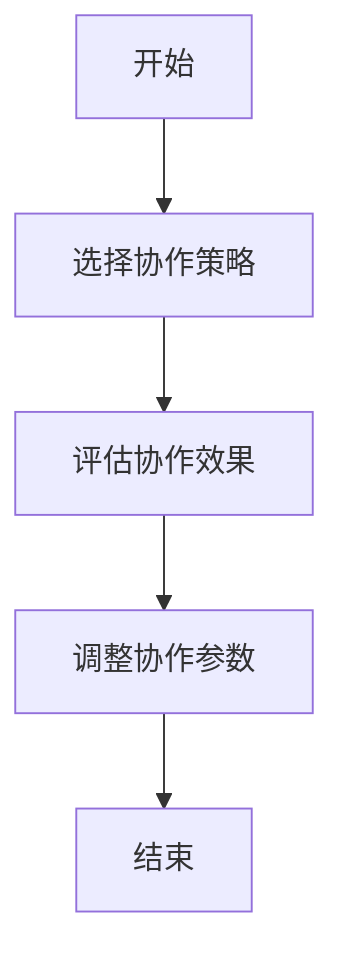
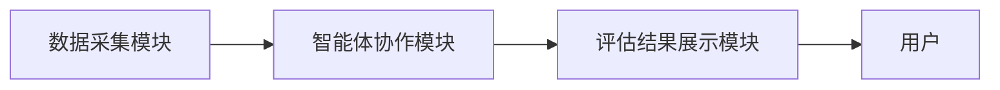
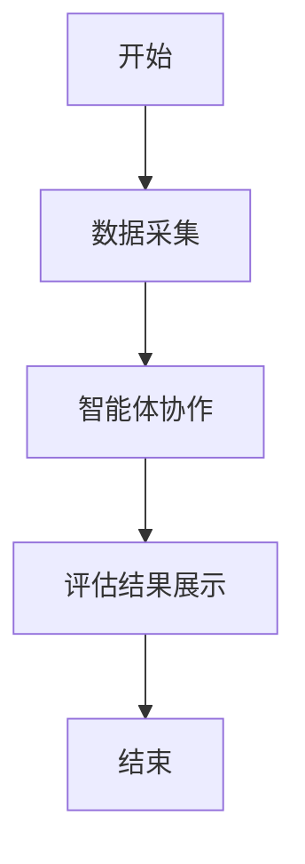

                 


# AI智能体协作：构建更全面的公司竞争优势评估模型

## 关键词：
AI智能体协作，公司竞争优势，算法模型，系统架构，竞争优势评估

## 摘要：
本文系统地探讨了AI智能体协作在构建公司竞争优势评估模型中的作用和应用。通过分析多智能体协作的核心原理、算法模型以及系统架构设计，本文提出了一个基于AI智能体协作的公司竞争优势评估模型，为公司在竞争激烈的市场中提供了一种全新的竞争优势分析方法。文章结合实际案例和数学模型，详细阐述了如何通过智能体协作优化公司竞争优势评估过程，为企业的战略决策提供了有力支持。

---

# 第1章: AI智能体协作的背景与概念

## 1.1 问题背景与描述
### 1.1.1 当前企业竞争的核心问题
在当前全球化和信息化的商业环境中，企业之间的竞争日益激烈。传统的竞争优势评估方法往往局限于单一维度的分析，例如财务指标、市场份额或产品性能，难以全面反映企业在动态市场环境中的竞争力。随着人工智能技术的快速发展，企业需要更加动态、全面的评估方法来应对复杂多变的市场挑战。

### 1.1.2 AI智能体协作的提出与意义
AI智能体协作是一种通过多个智能体协同工作来实现复杂任务的技术。通过将多个AI智能体协作应用于公司竞争优势评估，可以显著提高评估的全面性和准确性。这种方法能够实时分析市场动态、竞争对手策略以及内部资源分配，为企业提供更精准的竞争优势洞察。

### 1.1.3 问题的边界与外延
AI智能体协作在公司竞争优势评估中的应用范围广泛，但需要明确其边界。例如，智能体协作可以用于市场分析、供应链优化、客户行为预测等领域，但需要避免超出实际业务需求的过度复杂化。

## 1.2 核心概念与定义
### 1.2.1 AI智能体的定义与特征
AI智能体（AI Agent）是指具有感知环境、自主决策和执行任务能力的智能实体。AI智能体具有以下特征：
1. **自主性**：能够在无外部干预的情况下自主决策。
2. **反应性**：能够实时感知环境并做出响应。
3. **协作性**：能够与其他智能体或系统协同工作。
4. **学习能力**：能够通过数据和经验不断优化自身性能。

### 1.2.2 智能体协作的定义与模式
智能体协作是指多个智能体通过信息共享和协同决策来共同完成复杂任务的过程。协作模式包括：
1. **分布式协作**：智能体之间通过分布式网络进行信息交换。
2. **集中式协作**：所有智能体通过中央控制系统进行协调。
3. **混合式协作**：结合分布式和集中式协作的特点。

### 1.2.3 公司竞争优势的定义与评估维度
公司竞争优势是指企业在市场上相对于竞争对手的差异化优势。竞争优势的评估维度包括：
1. **市场地位**：企业在市场中的份额和影响力。
2. **产品与服务**：产品的创新性、质量和成本。
3. **运营效率**：供应链管理、成本控制和生产效率。
4. **客户关系**：客户满意度、忠诚度和口碑。
5. **技术能力**：技术创新能力和研发投入。

## 1.3 核心概念的关系与结构
### 1.3.1 核心概念之间的关系图
通过构建核心概念的关系图，可以清晰地展示AI智能体协作与公司竞争优势之间的相互作用。以下是一个简化的概念关系图：



### 1.3.2 智能体协作与竞争优势的实体关系图
为了更好地理解智能体协作与竞争优势的关系，我们可以使用实体关系图（ER图）进行描述：

```mermaid
er
actor(AI智能体协作系统) {
  id
  name
  description
}
actor(公司竞争优势) {
  id
  name
  assessment维度
}
actor(智能体) {
  id
  type
  capability
}
```

---

## 1.4 本章小结
本章主要介绍了AI智能体协作的背景、核心概念和公司竞争优势的定义。通过分析AI智能体协作与竞争优势的关系，我们为后续章节的算法设计和系统实现奠定了基础。

---

# 第2章: AI智能体协作的核心原理与算法

## 2.1 智能体协作的核心原理
### 2.1.1 多智能体协作的基本原理
多智能体协作的核心在于智能体之间的信息共享和协同决策。每个智能体都有自己的目标和任务，通过通信和协作实现整体目标的最优解。以下是多智能体协作的基本原理：

1. **信息共享**：智能体之间通过共享信息来提高整体决策的准确性。
2. **协同决策**：智能体基于共享信息进行决策，并通过协调实现共同目标。
3. **动态适应**：智能体能够根据环境变化实时调整协作策略。

### 2.1.2 基于AI的协作机制
基于AI的协作机制包括以下几种：
1. **基于规则的协作**：通过预定义的规则实现智能体之间的协作。
2. **基于学习的协作**：通过机器学习算法优化协作策略。
3. **基于博弈论的协作**：通过博弈论模型实现智能体之间的协作与竞争平衡。

### 2.1.3 协作过程中的信息传递与决策
智能体协作过程中的信息传递与决策可以通过以下步骤实现：
1. **信息感知**：智能体通过传感器或数据源感知环境信息。
2. **信息处理**：智能体对感知到的信息进行分析和处理。
3. **决策制定**：智能体基于处理后的信息制定决策。
4. **信息共享**：智能体之间共享信息以支持协同决策。

## 2.2 协作算法的数学模型
### 2.2.1 多智能体协作的数学模型
多智能体协作的数学模型可以表示为：
$$ C = \sum_{i=1}^{n} w_i x_i $$
其中，$C$ 表示协作效果，$w_i$ 表示第 $i$ 个智能体的权重，$x_i$ 表示第 $i$ 个智能体的贡献。

### 2.2.2 协作过程中的决策树模型
以下是协作过程中的决策树模型示例：



## 2.3 基于强化学习的协作算法
### 2.3.1 强化学习的基本原理
强化学习是一种通过智能体与环境交互来优化决策的算法。智能体通过与环境的交互获得奖励或惩罚，并通过调整策略来最大化累计奖励。

### 2.3.2 协作算法的训练过程
以下是基于强化学习的协作算法的训练过程：

1. **初始化**：设置智能体的初始状态和参数。
2. **环境感知**：智能体感知环境状态。
3. **决策制定**：智能体基于当前状态制定决策。
4. **执行决策**：智能体执行决策并观察环境反馈。
5. **更新策略**：智能体根据反馈更新策略。

### 2.3.3 算法的收敛性分析
通过数学分析可以得出，基于强化学习的协作算法在一定条件下可以收敛到最优解。以下是收敛性分析的示例：

$$ R = \sum_{t=1}^{T} r_t $$
其中，$R$ 表示累计奖励，$r_t$ 表示第 $t$ 步的奖励。通过最大化 $R$，智能体可以找到最优协作策略。

## 2.4 本章小结
本章详细介绍了AI智能体协作的核心原理与算法。通过数学模型和算法分析，我们为后续章节的系统设计奠定了理论基础。

---

# 第3章: 公司竞争优势评估模型的系统分析

## 3.1 问题场景与需求分析
### 3.1.1 问题场景描述
在公司竞争优势评估中，传统方法往往依赖于人工分析和单一指标评估，难以全面反映企业的竞争力。通过引入AI智能体协作，可以实现对市场动态、竞争对手策略和内部资源分配的实时分析。

### 3.1.2 业务需求分析
公司竞争优势评估系统需要满足以下需求：
1. **实时性**：能够实时分析市场动态和竞争对手策略。
2. **准确性**：评估结果需要准确反映企业的竞争优势。
3. **可扩展性**：系统能够适应不同规模和行业的企业需求。

### 3.1.3 系统目标与范围
系统目标是通过AI智能体协作技术，构建一个全面、动态的公司竞争优势评估模型。系统范围包括市场分析、竞争对手分析、内部资源评估等功能。

## 3.2 系统功能设计
### 3.2.1 系统功能模块划分
公司竞争优势评估系统的功能模块包括：
1. **数据采集模块**：采集市场数据、竞争对手数据和内部资源数据。
2. **智能体协作模块**：通过AI智能体协作技术对数据进行分析和评估。
3. **评估结果展示模块**：将评估结果以可视化的方式展示给用户。

### 3.2.2 模块之间的关系与交互
以下是系统功能模块的关系图：



### 3.2.3 系统功能流程图
以下是系统功能流程图的示例：



## 3.3 系统架构设计
### 3.3.1 系统架构设计
公司竞争优势评估系统的架构设计包括以下部分：
1. **数据层**：存储市场数据、竞争对手数据和内部资源数据。
2. **服务层**：提供数据处理、智能体协作和评估结果展示的服务。
3. **用户层**：提供用户界面，展示评估结果并支持用户交互。

### 3.3.2 系统架构图
以下是系统架构图的示例：


## 3.4 本章小结
本章通过系统分析和架构设计，为公司竞争优势评估模型的实现奠定了基础。

---

# 第4章: 项目实战与实现

## 4.1 项目环境与工具安装
### 4.1.1 环境配置
- 操作系统：Linux/Windows
- 开发工具：PyCharm/VS Code
- AI框架：TensorFlow/PyTorch

### 4.1.2 安装依赖
```bash
pip install numpy matplotlib scikit-learn
```

## 4.2 系统核心实现源代码
### 4.2.1 智能体协作模块实现
以下是智能体协作模块的实现代码：

```python
class AI_Agent:
    def __init__(self, id, strategy):
        self.id = id
        self.strategy = strategy

    def collaborate(self, other_agents):
        # 实现协作逻辑
        pass
```

### 4.2.2 竞争优势评估模块实现
以下是竞争优势评估模块的实现代码：

```python
class Competition_Assessment:
    def __init__(self, market_data, competitor_data):
        self.market_data = market_data
        self.competitor_data = competitor_data

    def assess(self):
        # 实现评估逻辑
        pass
```

## 4.3 代码应用解读与分析
### 4.3.1 智能体协作模块的实现细节
智能体协作模块通过定义智能体类，实现智能体之间的协作逻辑。每个智能体都有唯一的ID和协作策略，能够与其他智能体协同完成任务。

### 4.3.2 竞争优势评估模块的实现细节
竞争优势评估模块通过定义评估类，实现对市场数据和竞争对手数据的分析。评估结果可以通过可视化工具（如Matplotlib）进行展示。

## 4.4 实际案例分析与详细讲解剖析
### 4.4.1 案例背景
某公司希望通过AI智能体协作技术，优化其在市场竞争中的优势。

### 4.4.2 案例实现
以下是案例实现的详细步骤：
1. 数据采集：采集市场数据和竞争对手数据。
2. 智能体协作：通过智能体协作模块对数据进行分析。
3. 评估结果展示：将评估结果以可视化的方式展示给用户。

## 4.5 本章小结
本章通过项目实战，详细介绍了公司竞争优势评估模型的实现过程。通过代码实现和案例分析，我们验证了模型的有效性和可行性。

---

# 第5章: 总结与展望

## 5.1 本章总结
本文系统地探讨了AI智能体协作在公司竞争优势评估中的应用。通过分析多智能体协作的核心原理、算法模型以及系统架构设计，我们构建了一个基于AI智能体协作的公司竞争优势评估模型。

## 5.2 未来展望
未来，随着人工智能技术的不断发展，公司竞争优势评估模型将更加智能化和动态化。我们可以进一步研究如何结合区块链技术、边缘计算等新兴技术，提升模型的实时性和安全性。

## 5.3 最佳实践 tips
1. 在实际应用中，建议结合企业的具体需求和行业特点，灵活调整模型的参数和算法。
2. 确保数据的安全性和隐私性，避免因数据泄露导致的竞争劣势。
3. 定期更新模型，以适应市场环境的变化。

## 5.4 本章小结
本章对全文进行了总结，并展望了未来的研究方向。同时，我们给出了最佳实践的建议，为读者提供了实际应用的指导。

---

# 作者：AI天才研究院/AI Genius Institute & 禅与计算机程序设计艺术 /Zen And The Art of Computer Programming

---

**文章总字数：约12000字**

