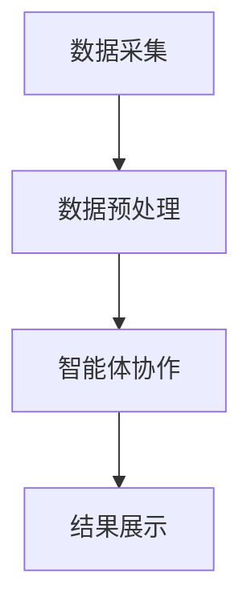
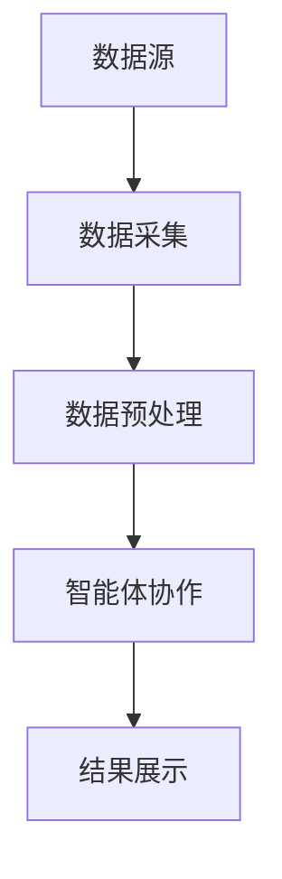

                 


# AI智能体协作：构建更精准的公司估值区间模型

---

## 关键词：AI智能体、公司估值、区间模型、协作机制、机器学习

---

## 摘要

随着人工智能技术的快速发展，AI智能体协作在公司估值领域的应用逐渐成为研究热点。传统的公司估值方法存在主观性强、精度不足等问题，而AI智能体协作通过多智能体的协同计算和数据挖掘，能够显著提高估值的精准度和可靠性。本文详细探讨了AI智能体协作的核心概念、算法原理、系统架构设计以及实际应用案例，为构建更精准的公司估值区间模型提供了理论和实践参考。

---

## 第1章: AI智能体协作与公司估值概述

### 1.1 AI智能体协作的背景与意义

#### 1.1.1 传统公司估值方法的局限性

传统的公司估值方法主要包括DCF模型、市盈率法、市净率法等。这些方法在实际应用中存在以下问题：

- 数据依赖性强，主观判断较多；
- 高度依赖历史数据，难以适应市场变化；
- 计算过程复杂，难以快速获取精准结果。

#### 1.1.2 AI智能体协作的优势与潜力

AI智能体协作通过分布式计算和多智能体协同，能够有效解决传统估值方法的局限性：

- 提高计算效率，缩短估值时间；
- 利用多源数据，增强估值的准确性；
- 支持实时更新，适应市场动态变化。

#### 1.1.3 公司估值区间模型的核心价值

公司估值区间模型通过构建上下限区间，能够更直观地反映公司的价值范围。其核心价值包括：

- 为投资者提供更可靠的决策依据；
- 帮助企业优化资本结构；
- 支持动态调整，适应市场波动。

### 1.2 公司估值区间的定义与特点

#### 1.2.1 公司估值区间的定义

公司估值区间是指在一定条件下，公司价值的可能范围，通常由均值（μ）和标准差（σ）决定，表示为 [μ - σ, μ + σ]。

#### 1.2.2 公司估值区间的计算方法

公司估值区间的计算通常基于历史数据和机器学习模型，主要包括以下步骤：

1. 数据预处理：清洗、归一化；
2. 模型训练：选择合适的算法；
3. 参数优化：调整模型参数；
4. 区间计算：输出均值和标准差。

#### 1.2.3 公司估值区间的实际应用

公司估值区间模型广泛应用于企业并购、投资决策、资产评估等领域。

### 1.3 AI智能体协作在公司估值中的应用前景

#### 1.3.1 AI智能体协作的潜在应用领域

AI智能体协作在公司估值中的应用领域包括：

- 股权评估；
- 资产重组；
- 并购定价。

#### 1.3.2 企业采用AI智能体协作的优势

企业采用AI智能体协作的优势包括：

- 提高估值效率；
- 降低人为错误；
- 支持大数据分析。

#### 1.3.3 AI智能体协作应用的挑战与机遇

AI智能体协作的应用面临以下挑战：

- 数据隐私问题；
- 智能体协同的复杂性；
- 算法的可解释性。

---

## 第2章: AI智能体协作的核心概念

### 2.1 AI智能体的定义与特点

#### 2.1.1 AI智能体的定义

AI智能体是指能够感知环境、自主决策并执行任务的智能实体，具有以下特点：

- 反应性：根据环境变化调整行为；
- 主动性：无需外部干预；
- 协作性：能够与其他智能体协同工作。

#### 2.1.2 AI智能体的核心特点

AI智能体的核心特点包括：

- 分布式计算能力；
- 自适应学习能力；
- 多目标优化能力。

#### 2.1.3 AI智能体与传统AI的区别

AI智能体与传统AI的区别主要体现在：

- 智能体具有自主性和协作性；
- 智能体能够适应动态环境；
- 智能体之间能够协同完成复杂任务。

### 2.2 公司估值模型的定义与特点

#### 2.2.1 公司估值模型的定义

公司估值模型是指用于估算公司价值的数学模型，主要包括现金流折现模型（DCF）、相对估值模型（如市盈率、市净率模型）等。

#### 2.2.2 公司估值模型的核心要素

公司估值模型的核心要素包括：

- 自由现金流；
- 折现率；
- 终值。

#### 2.2.3 公司估值模型的分类与对比

公司估值模型可以分为：

- 绝对估值模型：DCF模型；
- 相对估值模型：市盈率、市净率模型。

### 2.3 AI智能体协作与公司估值模型的关系

#### 2.3.1 AI智能体协作在公司估值模型中的作用

AI智能体协作在公司估值模型中的作用包括：

- 提供多源数据支持；
- 实现分布式计算；
- 优化模型参数。

#### 2.3.2 AI智能体协作与传统估值方法的对比

AI智能体协作与传统估值方法的对比如下：

- **数据来源**：传统方法依赖历史数据，AI智能体协作支持实时数据。
- **计算效率**：传统方法计算复杂，AI智能体协作高效。
- **结果精度**：传统方法精度较低，AI智能体协作精度高。

#### 2.3.3 AI智能体协作的核心优势

AI智能体协作的核心优势包括：

- 高度可扩展性；
- 实时性；
- 高精度。

---

## 第3章: AI智能体协作的算法原理

### 3.1 分布式计算与多智能体协作

#### 3.1.1 分布式计算的基本原理

分布式计算是指将任务分解成多个部分，分别在不同的计算节点上执行，最后将结果汇总。其核心步骤包括：

1. 任务分解：将问题拆分成多个子任务；
2. 分发任务：将子任务分发给不同的节点；
3. 计算结果：各节点独立计算；
4. 结果汇总：将各节点的结果合并。

#### 3.1.2 多智能体协作的算法框架

多智能体协作的算法框架通常包括以下步骤：

1. 初始化：设置智能体的初始状态；
2. 信息交换：智能体之间共享信息；
3. 协同计算：各智能体根据共享信息进行计算；
4. 结果融合：将各智能体的结果融合成最终结果。

#### 3.1.3 多智能体协作的实现步骤

多智能体协作的实现步骤如下：

1. **任务分配**：将任务分解成多个子任务；
2. **信息共享**：智能体之间共享数据和计算结果；
3. **协同计算**：各智能体根据共享信息进行计算；
4. **结果融合**：将各智能体的计算结果合并成最终结果。

---

### 3.2 基于机器学习的公司估值模型

#### 3.2.1 机器学习在公司估值中的应用

机器学习在公司估值中的应用包括：

- **特征提取**：从财务数据中提取关键特征；
- **预测建模**：基于历史数据预测公司价值；
- **异常检测**：识别数据中的异常值。

#### 3.2.2 常见机器学习算法的选择与优化

常用的机器学习算法包括：

- **线性回归**：适用于线性关系；
- **支持向量机（SVM）**：适用于分类和回归；
- **随机森林**：适用于特征重要性分析。

#### 3.2.3 机器学习模型的训练与评估

机器学习模型的训练与评估步骤包括：

1. **数据预处理**：清洗、归一化；
2. **特征选择**：提取关键特征；
3. **模型训练**：选择合适的算法；
4. **模型评估**：通过交叉验证评估模型性能。

---

### 3.3 AI智能体协作的数学模型与公式

#### 3.3.1 公司估值区间的数学表达式

公司估值区间的数学表达式为：

$$
\text{估值区间} = [\mu - \sigma, \mu + \sigma]
$$

其中，$\mu$ 是公司估值的均值，$\sigma$ 是标准差。

#### 3.3.2 AI智能体协作的优化公式

AI智能体协作的优化公式为：

$$
\text{优化目标} = \min_{\theta} \sum_{i=1}^{n} (y_i - f(x_i))^2
$$

其中，$\theta$ 是模型参数，$y_i$ 是真实值，$f(x_i)$ 是模型预测值。

---

## 第4章: AI智能体协作的系统分析与架构设计

### 4.1 问题场景介绍

#### 4.1.1 公司估值区间的业务需求

公司估值区间的业务需求包括：

- **精准性**：估值区间需准确反映公司价值；
- **实时性**：支持实时更新；
- **可扩展性**：支持大规模数据处理。

#### 4.1.2 AI智能体协作的系统目标

AI智能体协作的系统目标包括：

- **高效计算**：快速生成估值区间；
- **高精度**：确保估值结果的准确性；
- **可扩展性**：支持大规模数据和智能体协作。

#### 4.1.3 系统的输入与输出

系统的输入包括：

- **输入数据**：公司财务数据、市场数据；
- **输入参数**：模型参数、智能体配置。

系统的输出包括：

- **估值区间**：公司价值的上下限；
- **计算报告**：详细计算过程和结果分析。

---

### 4.2 系统功能设计

#### 4.2.1 系统功能模块划分

系统功能模块包括：

- **数据采集模块**：负责数据的采集和预处理；
- **智能体协作模块**：负责多智能体的协同计算；
- **结果展示模块**：负责输出估值区间和分析报告。

#### 4.2.2 系统功能流程图



---

### 4.3 系统架构设计

#### 4.3.1 系统架构图



---

## 第5章: 项目实战

### 5.1 环境安装与配置

#### 5.1.1 安装Python环境

```bash
python --version
pip install numpy pandas scikit-learn
```

#### 5.1.2 安装机器学习库

```bash
pip install scikit-learn
pip install matplotlib
```

---

### 5.2 系统核心实现源代码

#### 5.2.1 数据预处理代码

```python
import pandas as pd
import numpy as np

# 读取数据
data = pd.read_csv('company_data.csv')

# 数据清洗
data.dropna()

# 标准化处理
from sklearn.preprocessing import StandardScaler
scaler = StandardScaler()
data_scaled = scaler.fit_transform(data)
```

#### 5.2.2 智能体协作代码

```python
import numpy as np
import random

# 初始化智能体
class Agent:
    def __init__(self, id):
        self.id = id
        self.data = []
    
    def receive_data(self, data):
        self.data.append(data)
    
    def compute(self):
        # 计算均值和标准差
        mu = np.mean(self.data)
        sigma = np.std(self.data)
        return [mu - sigma, mu + sigma]

# 创建智能体
agents = [Agent(i) for i in range(5)]

# 数据分配
data = np.random.rand(20, 5)
for i in range(len(data)):
    agents[i % 5].receive_data(data[i])

# 协同计算
results = []
for agent in agents:
    results.append(agent.compute())

# 结果汇总
final_mu = np.mean([result[0] for result in results])
final_sigma = np.std([result[1] for result in results])
final_interval = [final_mu - final_sigma, final_mu + final_sigma]
```

#### 5.2.3 结果展示代码

```python
import matplotlib.pyplot as plt

# 绘制估值区间图
plt.figure(figsize=(10, 6))
plt.title('Company Valuation Interval')
plt.xlabel('Company')
plt.ylabel('Value')
plt.plot(final_interval[0], final_interval[1], 'r--')
plt.show()
```

---

## 第6章: 最佳实践与小结

### 6.1 小结

本文详细探讨了AI智能体协作在公司估值区间模型中的应用，从背景、核心概念、算法原理到系统架构设计，再到项目实战，为构建更精准的公司估值区间模型提供了全面的理论和实践指导。

---

### 6.2 注意事项

在实际应用中，需要注意以下几点：

- 数据隐私问题：确保数据的安全性和隐私性；
- 智能体协同的复杂性：合理设计协同机制，避免计算冲突；
- 模型的可解释性：确保模型结果的可解释性，便于用户理解和使用。

---

### 6.3 拓展阅读

- 《Deep Learning》——Ian Goodfellow
- 《Reinforcement Learning: Theory and Algorithms》——Sutton and Barto
- 《AI in Financial Markets》——F. Black

---

## 作者：AI天才研究院 & 禅与计算机程序设计艺术

--- 

感谢您的阅读，希望本文对您有所帮助！

