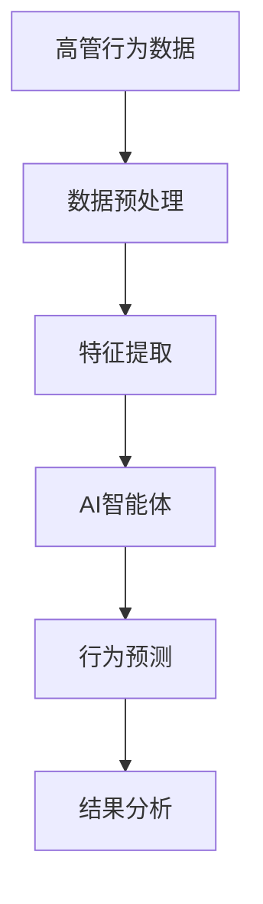
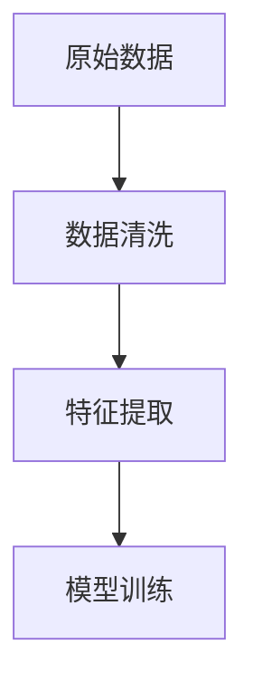
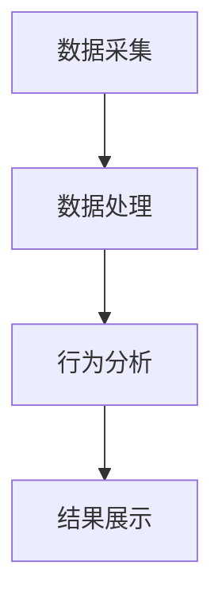

                 


# AI智能体在分析公司高管言行不一致性中的应用

> 关键词：AI智能体，高管行为分析，多模态数据，自然语言处理，行为预测，企业治理

> 摘要：本文详细探讨了AI智能体在分析公司高管言行不一致性中的应用，结合实际案例，从问题背景、核心概念、算法原理、系统架构到项目实战，系统性地阐述了AI技术在企业治理中的潜在价值和实现路径。文章旨在为企业高管行为分析提供理论支持和实践指导。

---

# 第一部分: 背景介绍

## 第1章: 问题背景

### 1.1 高管言行不一致对企业的影响

高管作为企业的核心领导者，其言行往往直接影响企业的战略方向和员工 morale。如果高管的言论与实际行为出现不一致，可能会导致以下问题：

- **战略执行偏差**：高管的决策与实际操作不一致可能导致企业战略执行受阻。
- **员工信任缺失**：员工对高管不一致的行为会产生不信任，影响团队凝聚力。
- **企业声誉受损**：高管言行不一致可能会损害企业的外部形象。

### 1.2 AI智能体在企业治理中的潜在价值

AI智能体通过实时数据采集、分析和反馈，能够帮助企业识别高管行为中的潜在问题，并提供实时建议。其优势包括：

- **实时监测**：通过传感器和自然语言处理技术，实时采集高管行为数据。
- **智能分析**：利用机器学习算法，快速识别行为中的不一致性。
- **决策支持**：为企业提供行为优化建议，提升企业治理效率。

### 1.3 当前企业高管行为分析的痛点与挑战

- **数据多样性**：高管行为数据包括文本、语音、视频等多种形式，数据处理难度大。
- **行为复杂性**：高管行为受多种因素影响，分析难度较高。
- **隐私保护**：高管行为分析涉及个人隐私，数据处理需符合相关法规。

## 第2章: 问题描述

### 2.1 高管言行不一致的具体表现形式

- **言论与行动不一致**：高管在会议中发表的言论与实际操作不符。
- **决策与执行不一致**：制定的策略与实际执行存在偏差。
- **态度与行为不一致**：表面支持某项政策，实际操作中却未落实。

### 2.2 行为数据的多样性与复杂性

- **数据来源**：包括会议记录、邮件、社交媒体等多种数据。
- **数据类型**：文本、语音、图像等多种形式。
- **数据量**：高管行为数据量大，处理需高效算法支持。

### 2.3 数据采集与分析的技术难点

- **数据清洗**：处理 noisy 数据，确保数据质量。
- **特征提取**：从多模态数据中提取有效特征。
- **模型训练**：训练高精度的行为预测模型。

## 第3章: 问题解决思路

### 3.1 AI智能体的核心作用

- **数据采集**：通过传感器和 API 实时采集高管行为数据。
- **行为分析**：利用机器学习算法识别不一致行为。
- **决策支持**：为企业提供行为优化建议。

### 3.2 多模态数据分析的关键技术

- **文本分析**：利用自然语言处理技术分析高管的言论。
- **语音识别**：通过语音识别技术分析高管的口头表达。
- **图像分析**：利用计算机视觉技术分析高管的肢体语言。

### 3.3 行为预测与干预的实现路径

- **数据预处理**：清洗和标准化数据。
- **特征提取**：提取行为特征。
- **模型训练**：训练行为预测模型。
- **结果分析**：识别不一致行为并提供干预建议。

---

# 第二部分: 核心概念与联系

## 第4章: 核心概念

### 4.1 AI智能体的核心概念

- **智能体**：能够感知环境并采取行动的实体。
- **AI智能体**：基于人工智能技术构建的智能体，具备学习和推理能力。

### 4.2 高管行为分析模型

- **行为数据**：包括高管的言论、决策和行动。
- **行为特征**：通过数据挖掘提取的行为特征，用于行为分析。
- **行为预测模型**：基于机器学习算法构建的行为预测模型。

### 4.3 AI智能体与高管行为分析的关系



---

# 第三部分: 算法原理讲解

## 第5章: 算法原理

### 5.1 数据预处理与特征提取

- **数据清洗**：去除 noisy 数据，确保数据质量。
- **特征提取**：从多模态数据中提取有效特征，如文本情感特征、语音特征等。



### 5.2 模型训练与结果分析

- **模型选择**：选择适合的行为预测模型，如序列模型。
- **模型训练**：利用训练数据训练行为预测模型。
- **结果分析**：分析模型预测结果，识别不一致行为。

---

# 第四部分: 系统分析与架构设计方案

## 第6章: 系统架构设计

### 6.1 系统模块划分

- **数据采集模块**：负责采集高管行为数据。
- **数据处理模块**：对数据进行预处理和特征提取。
- **行为分析模块**：利用机器学习算法分析高管行为。
- **结果展示模块**：展示分析结果并提供决策支持。

### 6.2 系统架构图



---

# 第五部分: 项目实战

## 第7章: 项目实战

### 7.1 环境安装

- **安装Python**：安装 Python 3.8 或更高版本。
- **安装依赖库**：安装 numpy、pandas、scikit-learn 等库。

### 7.2 核心实现

```python
import numpy as np
from sklearn.feature_extraction.text import TfidfVectorizer
from sklearn.model_selection import train_test_split
from sklearn.metrics import accuracy_score

# 数据预处理
def preprocess(data):
    # 文本分词
    vectorizer = TfidfVectorizer()
    X = vectorizer.fit_transform(data['text'])
    y = data['label']
    return X, y

# 模型训练
def train_model(X_train, y_train):
    # 选择模型
    model = LogisticRegression()
    model.fit(X_train, y_train)
    return model

# 模型评估
def evaluate_model(model, X_test, y_test):
    y_pred = model.predict(X_test)
    print("Accuracy:", accuracy_score(y_test, y_pred))

# 主函数
def main():
    data = pd.read_csv('executive_data.csv')
    X, y = preprocess(data)
    X_train, X_test, y_train, y_test = train_test_split(X, y, test_size=0.2)
    model = train_model(X_train, y_train)
    evaluate_model(model, X_test, y_test)

if __name__ == "__main__":
    main()
```

---

# 第六部分: 最佳实践与总结

## 第8章: 最佳实践

### 8.1 经验总结

- **数据质量**：确保数据的完整性和准确性。
- **模型优化**：不断优化模型，提升预测精度。
- **隐私保护**：严格遵守数据隐私保护法规。

### 8.2 注意事项

- **数据安全**：确保数据处理过程中的安全性。
- **模型解释性**：确保模型结果的可解释性。
- **持续学习**：定期更新模型，适应新的数据和需求。

### 8.3 拓展阅读

- 推荐阅读《机器学习实战》和《深度学习》等书籍，深入理解相关技术。

---

# 结语

通过本文的系统性阐述，我们可以看到 AI 智能体在分析公司高管言行不一致性中的巨大潜力。结合多模态数据和先进算法，AI 技术能够帮助企业识别高管行为中的潜在问题，优化企业治理效率。未来，随着技术的不断进步，AI 在企业治理中的应用将更加广泛和深入。

---

# 作者：AI天才研究院 & 禅与计算机程序设计艺术

---

**感谢您的耐心阅读，希望本文能为您提供有价值的见解和启发！**

