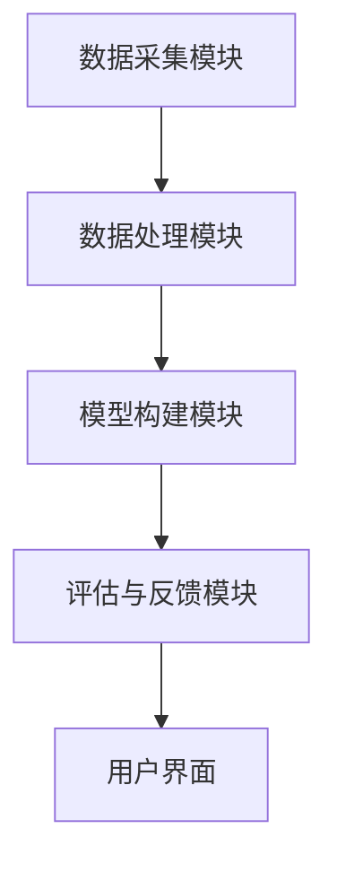

                 


# AI智能体在评估公司创新文化和创新能力中的应用

## 关键词：AI智能体，创新文化，创新能力，企业评估，数据分析，机器学习

## 摘要：  
随着企业竞争的加剧，创新文化与创新能力成为企业成功的关键因素。本文探讨如何利用AI智能体来评估公司创新文化和创新能力。通过分析AI智能体的核心概念、算法原理、系统架构以及实际项目案例，我们展示了AI技术如何帮助企业优化创新管理，提升创新能力。

---

# 第一部分: AI智能体与创新文化评估的背景介绍

## 第1章: AI智能体与创新文化概述

### 1.1 AI智能体的基本概念

#### 1.1.1 AI智能体的定义与特点  
AI智能体（AI Agent）是指能够感知环境、自主决策并执行任务的智能系统。其特点包括：  
- **自主性**：无需外部干预，自主完成任务。  
- **反应性**：能够实时感知环境变化并做出反应。  
- **目标导向**：基于目标驱动行为，优化决策过程。  

#### 1.1.2 AI智能体的核心要素与组成  
AI智能体的核心组成包括：  
1. **感知模块**：负责数据采集与分析。  
2. **决策模块**：基于数据进行推理与决策。  
3. **执行模块**：将决策转化为具体行动。  
4. **学习模块**：通过反馈不断优化自身能力。  

#### 1.1.3 AI智能体与传统评估方法的对比  
AI智能体的优势在于其数据处理能力、实时性和动态适应性。与传统评估方法相比，AI智能体能够通过海量数据挖掘潜在规律，提供更精准的评估结果。

---

### 1.2 创新文化与创新能力的定义

#### 1.2.1 创新文化的内涵与外延  
创新文化是指企业在创新意识、创新行为和创新成果等方面的综合表现。其外延包括企业内部的创新氛围、创新机制和创新价值观。

#### 1.2.2 创新能力的构成与评估维度  
创新能力由技术创新能力、组织创新能力和市场创新能力构成。评估维度包括：  
1. **技术能力**：技术创新的速度和质量。  
2. **组织能力**：组织结构对创新的支持程度。  
3. **市场能力**：产品市场化的能力。  

#### 1.2.3 创新文化与创新能力的关系  
创新文化是创新能力的土壤，良好的创新文化能够激发员工的创新潜能，从而提升企业的创新能力。

---

### 1.3 企业创新评估的背景与挑战

#### 1.3.1 传统企业创新评估的局限性  
传统评估方法通常依赖主观判断，缺乏数据支持，且难以动态调整。

#### 1.3.2 数字化评估的必要性与优势  
数字化评估通过大数据分析，能够提供客观、实时的评估结果，帮助企业更好地优化创新管理。

#### 1.3.3 AI智能体在创新评估中的应用前景  
AI智能体能够通过数据挖掘、机器学习等技术，为企业提供精准、动态的创新评估服务。

---

## 第2章: AI智能体在企业创新评估中的应用价值

### 2.1 AI智能体在创新文化评估中的优势

#### 2.1.1 数据驱动的精准评估  
AI智能体通过分析海量数据，能够精准识别创新文化的关键指标。

#### 2.1.2 实时动态评估的可能性  
AI智能体能够实时监测企业的创新动态，提供动态评估结果。

#### 2.1.3 多维度综合评估的能力  
AI智能体可以从多个维度（如员工行为、产品创新、市场表现）综合评估企业的创新文化。

---

### 2.2 AI智能体在创新能力评估中的作用

#### 2.2.1 技术创新能力的评估  
AI智能体可以通过专利分析、技术趋势预测等方式，评估企业的技术创新能力。

#### 2.2.2 商业创新能力的评估  
AI智能体可以通过市场数据分析，评估企业将技术创新转化为商业成功的能力。

#### 2.2.3 组织创新能力的评估  
AI智能体可以通过组织结构分析和员工行为数据，评估企业的组织创新能力。

---

### 2.3 AI智能体对企业创新管理的启示

#### 2.3.1 数据驱动的决策支持  
AI智能体为企业创新管理提供数据支持，帮助管理者做出更明智的决策。

#### 2.3.2 创新文化的塑造与优化  
AI智能体可以通过反馈机制，帮助企业优化创新文化，激发员工创新潜能。

#### 2.3.3 创新能力的持续提升  
AI智能体通过动态评估和反馈，帮助企业不断提升创新能力。

---

# 第二部分: AI智能体的核心概念与联系

## 第3章: AI智能体的核心概念与原理

### 3.1 AI智能体的核心要素

#### 3.1.1 数据采集与处理  
AI智能体通过多种渠道（如企业内部数据、公开数据）采集数据，并进行清洗、预处理和特征提取。

#### 3.1.2 模型构建与训练  
基于机器学习算法（如深度学习、自然语言处理）构建模型，并通过大量数据进行训练。

#### 3.1.3 评估与反馈机制  
AI智能体根据模型预测结果，结合实际数据进行评估，并通过反馈机制优化模型。

---

### 3.2 创新文化与创新能力的关系

#### 3.2.1 创新文化对创新能力的支撑作用  
良好的创新文化能够激发员工的创新意识，促进技术创新和产品创新。

#### 3.2.2 创新能力对创新文化的反哺作用  
强大的创新能力能够增强企业的创新声誉，进一步推动创新文化的建设。

---

### 3.3 AI智能体的核心算法与技术

#### 3.3.1 机器学习算法  
常用算法包括支持向量机（SVM）、随机森林（Random Forest）、神经网络（Neural Networks）等。

#### 3.3.2 自然语言处理技术  
用于分析文本数据（如企业文档、员工反馈）中的情感倾向和关键词提取。

#### 3.3.3 数据挖掘技术  
用于发现数据中的潜在规律和模式。

---

# 第三部分: AI智能体的系统架构与实现

## 第4章: 系统架构设计

### 4.1 系统功能模块设计

#### 4.1.1 数据采集模块  
负责采集企业内部数据（如员工行为数据、项目数据）和外部数据（如市场数据、行业趋势）。

#### 4.1.2 数据处理模块  
对采集到的数据进行清洗、预处理和特征提取。

#### 4.1.3 模型构建模块  
基于机器学习算法构建评估模型，并进行训练和优化。

#### 4.1.4 评估与反馈模块  
根据模型预测结果，生成创新文化与能力评估报告，并提供反馈建议。

---

### 4.2 系统架构图



---

### 4.3 接口设计与交互流程

#### 4.3.1 数据接口设计  
定义数据输入格式和接口调用方式，确保数据能够顺利传输和处理。

#### 4.3.2 交互流程设计  
用户通过界面对系统进行操作，系统根据用户输入生成评估结果并反馈给用户。

---

# 第四部分: 项目实战与案例分析

## 第5章: 项目实战

### 5.1 环境安装与配置

#### 5.1.1 安装Python环境  
安装Python 3.8以上版本，并安装必要的库（如scikit-learn、TensorFlow、NLTK）。

#### 5.1.2 数据集准备  
收集企业内部数据（如员工绩效数据、项目数据）和外部数据（如行业趋势、市场数据）。

---

### 5.2 核心代码实现

#### 5.2.1 数据预处理代码

```python
import pandas as pd
import numpy as np

# 加载数据
data = pd.read_csv('innovation_data.csv')

# 数据清洗
data.dropna(inplace=True)
data = pd.get_dummies(data)
```

#### 5.2.2 模型训练代码

```python
from sklearn.model

