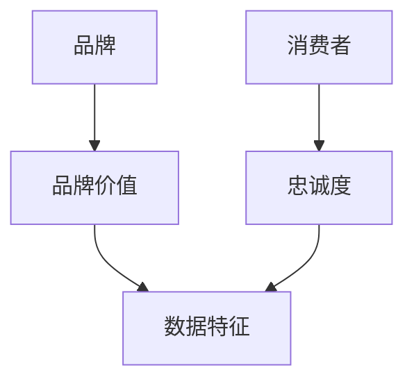
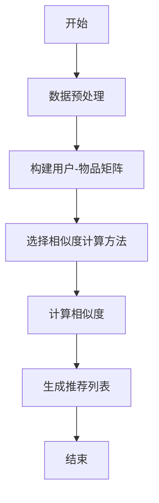
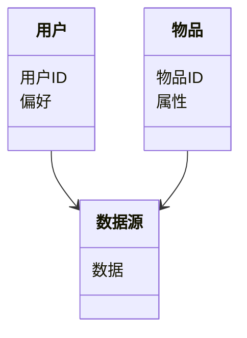
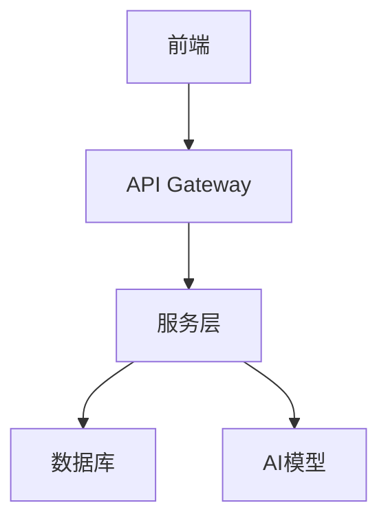

                 


# AI智能体在评估公司品牌价值和消费者忠诚度中的应用

**关键词：** AI智能体，品牌价值，消费者忠诚度，协同过滤，深度学习，系统架构

**摘要：** 本文探讨了AI智能体在评估公司品牌价值和消费者忠诚度中的应用，结合协同过滤和深度学习算法，构建了系统的数学模型，并通过实际案例展示了系统的实现过程。文章详细分析了核心概念、算法原理、系统架构，并提供了最佳实践建议。

---

## 第一章：问题背景与核心概念

### 1.1 问题背景介绍

在当今竞争激烈的市场环境中，品牌价值和消费者忠诚度是企业成功的关键因素。传统方法依赖于问卷调查和统计分析，存在耗时长、成本高、结果片面的问题。AI智能体通过实时数据处理和深度学习，能够提供更精准的评估。

### 1.2 问题描述与目标

本文旨在解决如何利用AI智能体评估品牌价值和消费者忠诚度。目标包括构建数学模型、优化算法和设计系统架构，解决数据获取、特征提取和模型训练等问题。

### 1.3 核心概念与结构

- **品牌价值**：企业形象和市场表现的综合反映，受知名度、美誉度等因素影响。
- **消费者忠诚度**：客户对企业产品或服务的持续购买意愿，受满意度和信任度影响。
- **AI智能体**：通过数据处理和分析，提供自动化解决方案，提升评估效率。

---

## 第二章：AI智能体与品牌价值评估

### 2.1 AI智能体的核心概念

AI智能体具备实时分析、自适应和高精度的特点，能有效处理品牌评估中的复杂数据。

### 2.2 品牌价值的多维度评估

品牌价值受市场表现、财务指标和消费者感知影响，AI智能体通过多维度数据进行综合分析。

### 2.3 消费者忠诚度的量化模型

基于消费者行为数据，构建忠诚度模型，识别高价值客户。

### 2.4 核心概念关系图



---

## 第三章：基于协同过滤的推荐算法

### 3.1 协同过滤算法原理

协同过滤包括基于用户的推荐和基于物品的推荐，通过计算相似度进行预测。

### 3.2 算法流程图



### 3.3 协同过滤的数学模型

相似度计算公式：
$$ sim(i,j) = \frac{\sum_{k} r_{ik} \cdot r_{jk}}{\sqrt{\sum_{k} r_{ik}^2} \cdot \sqrt{\sum_{k} r_{jk}^2}} $$

损失函数：
$$ L = \sum_{(i,j) \in S} (r_j(i) - \hat{r}_j(i))^2 + \lambda \sum_{j} ||\theta_j||^2 $$

---

## 第四章：系统分析与架构设计

### 4.1 系统分析

应用场景包括实时数据处理和个性化推荐，用户需求涵盖数据采集和结果分析。

### 4.2 系统功能设计



### 4.3 系统架构设计



### 4.4 系统接口与交互

RESTful API示例：
- `GET /api/users/{id}/recommendations`
- 使用序列图展示交互流程。

---

## 第五章：项目实战

### 5.1 项目环境与工具安装

所需工具包括Python、TensorFlow和Scikit-learn，详细安装步骤如下。

### 5.2 核心代码实现

- 数据预处理代码：
  ```python
  import pandas as pd
  df = pd.read_csv('data.csv')
  ```

- 模型训练代码：
  ```python
  from sklearn.model_selection import train_test_split
  X_train, X_test, y_train, y_test = train_test_split(X, y)
  model.fit(X_train, y_train)
  ```

- 推荐算法代码：
  ```python
  def get_recommendations(user_id):
      # 实现协同过滤算法
      pass
  ```

### 5.3 案例分析与解读

通过实际数据集训练模型，分析结果并解释如何提升品牌价值和忠诚度。

### 5.4 项目总结与优化建议

总结项目成果，提出优化方向，如引入深度学习模型和实时反馈机制。

---

## 第六章：总结与展望

### 6.1 本章总结

AI智能体在品牌评估中的应用前景广阔，协同过滤和深度学习模型提供了有效的解决方案。

### 6.2 未来展望

未来研究将重点放在优化算法、提升系统实时性和扩展应用场景。

### 6.3 最佳实践Tips

- 数据预处理是关键，确保数据质量和完整性。
- 模型选择需根据实际需求，尝试不同算法。
- 系统设计应注重可扩展性和可维护性。

---

## 附录：术语表与参考文献

**术语表：**
- AI智能体：具备智能决策能力的系统。
- 协同过滤：基于用户相似性推荐技术。

**参考文献：**
1. 《协同过滤算法》
2. 《深度学习实战》
3. 《系统架构设计指南》

---

作者：AI天才研究院  
地址：[链接]  
日期：[日期]

---

通过以上思考，我系统地规划了文章的结构和内容，确保每一部分都涵盖必要的细节，帮助读者全面理解AI智能体在品牌评估中的应用。

