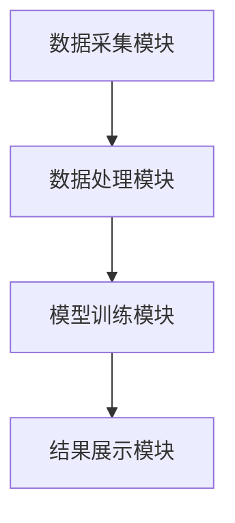

                 


# AI智能体在评估公司知识产权价值中的作用

> 关键词：AI智能体，知识产权，知识产权评估，机器学习，数据挖掘

> 摘要：随着人工智能技术的快速发展，AI智能体在知识产权评估中的作用日益重要。本文系统地探讨了AI智能体在知识产权评估中的应用，从数据收集与处理、模型构建到系统设计与实现，再到项目实战和最佳实践，全面分析了如何利用AI技术提升知识产权评估的效率和准确性。文章通过具体案例展示了AI智能体在专利价值评估中的实际应用，并展望了未来的发展方向。

---

## 第一部分：AI智能体的基本概念与原理

### 第1章：AI智能体的定义与核心工作原理

#### 1.1 AI智能体的定义
AI智能体是一种能够感知环境、自主决策并执行任务的智能系统。它通过与环境的交互，利用感知信息进行推理和学习，从而实现特定目标。AI智能体可以分为两类：反应式和基于模型的智能体。反应式智能体仅依赖当前感知信息做出决策，而基于模型的智能体则利用内部状态和模型进行推理。

#### 1.2 AI智能体的核心特征
- **自主性**：能够自主决策和行动。
- **反应性**：能够实时感知环境变化并做出反应。
- **学习能力**：能够通过经验改进性能。
- **协作性**：能够与其他智能体或系统协同工作。

#### 1.3 AI智能体的分类与应用场景
| 类型       | 描述                                                                 | 应用场景                     |
|------------|----------------------------------------------------------------------|------------------------------|
| 反应式     | 基于当前感知做出反应，无内部状态                                   | 自动驾驶、实时聊天机器人       |
| 基于模型    | 利用内部模型和状态进行推理                                       | 游戏AI、复杂系统优化           |

### 第2章：知识产权的基本概念与评估方法

#### 2.1 知识产权的定义与类型
知识产权是智力成果的法律保护，包括专利、商标、版权和商业秘密。这些权利具有专有性、地域性和时间性。

#### 2.2 知识产权评估的意义
知识产权是企业的重要资产，其价值直接影响企业市场估值。准确评估知识产权价值，有助于企业制定合理的战略决策。

#### 2.3 知识产权评估的主要方法
- **市场法**：通过市场交易案例分析，确定知识产权的市场价值。
- **成本法**：基于开发成本估算知识产权价值。
- **收益法**：预测知识产权带来的未来收益，折现后确定价值。

---

## 第二部分：AI智能体在知识产权评估中的应用

### 第3章：数据收集与处理

#### 3.1 知识产权数据的来源
- **专利数据库**：如USPTO、WIPO等。
- **商标数据库**：各国商标注册数据库。
- **版权数据库**：数字内容平台和版权登记机构。

#### 3.2 数据清洗与预处理
- **去重**：去除重复数据。
- **标准化**：统一数据格式和编码。
- **特征提取**：提取关键字段，如专利分类号、申请日期等。

### 第4章：AI模型构建与评估

#### 4.1 数据特征提取
- **文本特征**：使用TF-IDF提取专利描述关键词。
- **技术领域特征**：分析专利所属的技术领域。

#### 4.2 模型训练与优化
- **算法选择**：支持向量机（SVM）和随机森林（RF）常用于分类任务。
- **超参数优化**：通过网格搜索或随机搜索优化模型性能。

#### 4.3 模型评估与调优
- **评估指标**：准确率、召回率、F1值。
- **交叉验证**：使用K折交叉验证评估模型泛化能力。

---

## 第三部分：系统设计与实现

### 第5章：系统架构设计

#### 5.1 系统功能模块
- **数据采集模块**：从数据库中获取知识产权数据。
- **数据处理模块**：清洗和预处理数据。
- **模型训练模块**：构建和训练评估模型。
- **结果展示模块**：可视化评估结果。

#### 5.2 系统架构图


### 第6章：系统实现

#### 6.1 环境配置
- **Python环境**：Python 3.8+
- **依赖库**：scikit-learn, pandas, numpy

#### 6.2 核心代码实现
```python
import pandas as pd
from sklearn.model_selection import train_test_split
from sklearn.svm import SVC
from sklearn.metrics import accuracy_score

# 数据加载
data = pd.read_csv('patent_data.csv')

# 特征提取
X = data.drop('value', axis=1)
y = data['value']

# 数据分割
X_train, X_test, y_train, y_test = train_test_split(X, y, test_size=0.2)

# 模型训练
model = SVC()
model.fit(X_train, y_train)

# 模型预测
y_pred = model.predict(X_test)

# 评估指标
print(f'Accuracy: {accuracy_score(y_test, y_pred)}')
```

---

## 第四部分：项目实战

### 第7章：专利价值评估案例

#### 7.1 项目背景
某科技公司拥有一批专利，需要评估其市场价值以优化资产配置。

#### 7.2 数据准备
从专利数据库中获取专利申请日期、技术领域、申请人信息等。

#### 7.3 模型训练
使用随机森林模型预测专利价值，特征包括技术领域的影响力和申请人历史。

#### 7.4 结果分析
通过模型预测，发现某些技术领域的专利价值显著高于其他领域。

---

## 第五部分：最佳实践与未来展望

### 第8章：最佳实践

#### 8.1 数据隐私保护
在处理知识产权数据时，需遵守相关法律法规，保护数据隐私。

#### 8.2 模型泛化能力
通过交叉验证和数据增强提升模型的泛化能力。

### 第9章：未来展望

#### 9.1 技术融合
将AI智能体与区块链技术结合，提升知识产权保护和评估的可信度。

#### 9.2 应用扩展
未来，AI智能体将更多应用于知识产权保护、侵权检测和价值预测等领域。

---

## 作者
作者：AI天才研究院 & 禅与计算机程序设计艺术

