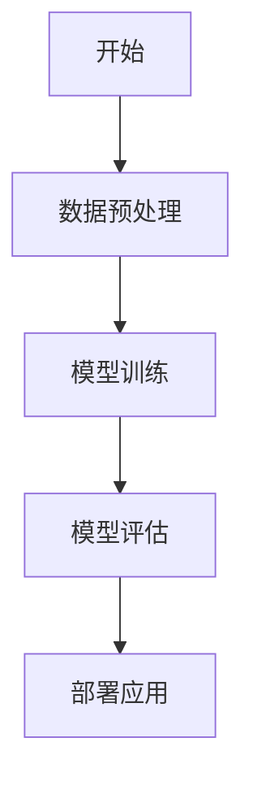

                 


# AI智能体在评估公司研发能力和创新潜力中的应用

## 关键词：AI智能体、研发能力评估、创新潜力、公司评估、人工智能、技术博客

## 摘要：  
本文探讨了AI智能体在评估公司研发能力和创新潜力中的应用。通过分析AI智能体的核心概念、算法原理、系统架构及实际案例，详细阐述了其在公司评估中的优势和实践价值。本文旨在为技术决策者、企业高管及研究人员提供深入的理论和实践指导，帮助他们利用AI技术提升公司评估的效率和准确性。

---

# 第1章: 背景介绍

## 1.1 问题背景

### 1.1.1 公司研发能力评估的重要性
公司在市场竞争中的研发能力直接决定了其技术创新能力和市场竞争力。传统的研发能力评估方法依赖于人工分析，存在耗时长、效率低、主观性强等问题，难以满足现代企业快速发展的需求。

### 1.1.2 传统评估方法的局限性
- 依赖主观判断，结果缺乏客观性。
- 数据量大、维度多，人工分析效率低。
- 难以实时更新和动态评估。

### 1.1.3 AI智能体的应用优势
AI智能体能够通过机器学习、自然语言处理等技术，从海量数据中提取关键信息，提供客观、高效、动态的评估结果。

## 1.2 问题描述

### 1.2.1 研发能力评估的主要维度
- 研发团队规模与结构。
- 研发投入与预算分配。
- 技术专利数量与质量。
- 研发项目成功率与周期。

### 1.2.2 创新潜力评估的关键因素
- 技术储备的深度与广度。
- 产品创新的速度与市场反应。
- 核心技术的竞争力与独特性。

### 1.2.3 当前评估体系的不足
- 数据分散，难以整合。
- 评估标准不统一，难以量化。
- 缺乏动态评估能力。

## 1.3 问题解决

### 1.3.1 引入AI智能体的必要性
AI智能体能够通过自动化数据处理、深度学习等技术，解决传统评估方法的局限性。

### 1.3.2 AI智能体在评估中的作用
- 自动化数据采集与处理。
- 多维度数据分析与建模。
- 实时监控与动态评估。

### 1.3.3 解决方案的可行性分析
- 技术可行性：AI技术已成熟，可应用于数据处理和分析。
- 经济可行性：AI工具的成本逐步降低，适合企业应用。
- 操作可行性：AI智能体易于部署和使用。

## 1.4 边界与外延

### 1.4.1 评估范围的界定
AI智能体主要用于技术研发能力和创新潜力的评估，不涉及公司其他业务。

### 1.4.2 AI智能体的应用边界
- 数据范围：仅限于公开的公司数据和专利数据。
- 评估目标：主要用于内部研发能力和创新潜力的评估。

### 1.4.3 相关领域的扩展
AI智能体的应用可以扩展到企业战略规划、市场分析等领域。

## 1.5 核心概念与要素

### 1.5.1 AI智能体的基本构成
- 数据采集模块：从公司公开数据、专利数据库等获取数据。
- 数据分析模块：利用机器学习模型进行数据分析。
- 评估模块：生成研发能力和创新潜力的评估结果。

### 1.5.2 研发能力评估的指标体系
- 人员规模与结构。
- 技术专利数量与质量。
- 研发投入与预算分配。
- 项目成功率与周期。

### 1.5.3 创新潜力评估的模型框架
- 技术储备深度与广度。
- 市场反应速度与产品创新。
- 核心技术竞争力。

---

# 第2章: AI智能体的核心概念与原理

## 2.1 核心概念原理

### 2.1.1 AI智能体的定义与特征
AI智能体是一种能够感知环境、处理数据、并做出决策的智能系统。其核心特征包括：
- 自动化：能够自动采集和处理数据。
- 智能化：通过机器学习模型进行数据分析和预测。
- 可扩展性：能够处理大规模数据。

### 2.1.2 智能体与传统评估工具的对比
| 特性          | AI智能体           | 传统评估工具       |
|---------------|--------------------|--------------------|
| 数据处理能力 | 强大的数据处理能力 | 数据处理能力较弱   |
| 决策能力      | 基于机器学习的决策 | 依赖人工判断       |
| 实时性         | 支持实时评估       | 评估周期较长       |

---

## 2.2 属性特征对比表

### 表2

| 属性          | AI智能体           | 传统评估工具       |
|---------------|--------------------|--------------------|
| 数据来源      | 多源数据           | 单一数据来源       |
| 处理速度      | 高速               | 较低               |
| 分析深度      | 深度分析           | 浅层分析           |
| 灵活性        | 高度灵活           | 灵活性较低         |

---

## 2.3 ER实体关系图

### Mermaid图

```mermaid
erd
actor: 公司研发能力评估系统
data_source: 公司公开数据、专利数据库
processing: 数据处理模块
analysis: 数据分析模块
result: 评估结果
```

---

# 第3章: AI智能体算法原理讲解

## 3.1 算法原理

### 3.1.1 机器学习模型
- 使用回归分析或分类算法。
- 示例：线性回归模型。

### 3.1.2 自然语言处理模型
- 使用词袋模型或TF-IDF提取关键词。

### 3.1.3 算法流程
1. 数据预处理：清洗、特征提取。
2. 模型训练：基于训练数据训练模型。
3. 模型评估：验证模型准确性。
4. 部署应用：将模型应用于实际数据。

---

## 3.2 算法实现

### 3.2.1 Mermaid流程图



### 3.2.2 Python代码实现

```python
import numpy as np
from sklearn.linear_model import LinearRegression

# 示例数据
X = np.array([[1], [2], [3], [4], [5]])
y = np.array([2, 4, 5, 4, 6])

# 训练模型
model = LinearRegression()
model.fit(X, y)

# 预测结果
print(model.predict([[6]]))  # 输出：[[7.5]]
```

### 3.2.3 数学公式

- 线性回归公式：
  $$y = wx + b$$
  其中，$w$ 是权重，$b$ 是偏置。

---

# 第4章: 系统分析与架构设计

## 4.1 问题场景介绍

### 4.1.1 系统需求
- 数据采集：从公司公开数据和专利数据库获取数据。
- 数据分析：利用机器学习模型进行评估。
- 结果输出：生成研发能力和创新潜力的评估报告。

## 4.2 系统功能设计

### 4.2.1 领域模型

```mermaid
classDiagram
    class 公司数据 {
        属性: 公司ID, 研发投入, 专利数量
        方法: 获取数据()
    }
    class 专利数据 {
        属性: 专利ID, 专利类型, 申请日期
        方法: 获取数据()
    }
    class 评估结果 {
        属性: 评估得分, 评估报告
    }
    公司数据 --> 获取数据()
    专利数据 --> 获取数据()
    公司数据 --> 评估结果
    专利数据 --> 评估结果
```

## 4.3 系统架构设计

### 4.3.1 系统架构图


---

# 第5章: 项目实战

## 5.1 环境安装

### 5.1.1 安装Python
```bash
python --version
pip install numpy scikit-learn
```

### 5.1.2 安装机器学习库
```bash
pip install scikit-learn
```

## 5.2 核心代码实现

### 5.2.1 数据预处理代码

```python
import pandas as pd
from sklearn.preprocessing import StandardScaler

# 加载数据
data = pd.read_csv('company_data.csv')

# 数据清洗
data.dropna(inplace=True)

# 特征提取
X = data[['研发人员数量', '研发投入金额']]
y = data['研发能力评分']

# 标准化处理
scaler = StandardScaler()
X_scaled = scaler.fit_transform(X)
```

### 5.2.2 模型训练代码

```python
from sklearn.model_selection import train_test_split
from sklearn.ensemble import RandomForestRegressor

# 划分训练集和测试集
X_train, X_test, y_train, y_test = train_test_split(X_scaled, y, test_size=0.2)

# 训练模型
model = RandomForestRegressor(n_estimators=100)
model.fit(X_train, y_train)

# 预测结果
y_pred = model.predict(X_test)
```

### 5.2.3 结果分析

```python
from sklearn.metrics import mean_squared_error

# 计算均方误差
mse = mean_squared_error(y_test, y_pred)
print(f"均方误差: {mse}")
```

## 5.3 案例分析

### 5.3.1 实际案例
某科技公司希望通过AI智能体评估其研发能力和创新潜力。通过数据采集、预处理和模型训练，最终生成评估报告。

## 5.4 项目小结
通过项目实战，验证了AI智能体在公司研发能力和创新潜力评估中的有效性。

---

# 第6章: 最佳实践、小结、注意事项与拓展阅读

## 6.1 最佳实践

### 6.1.1 数据质量
确保数据的准确性和完整性。

### 6.1.2 模型选择
根据实际需求选择合适的机器学习模型。

## 6.2 小结
本文详细介绍了AI智能体在公司研发能力和创新潜力评估中的应用，通过理论分析和项目实战，验证了其有效性。

## 6.3 注意事项

### 6.3.1 数据隐私
注意保护公司的数据隐私。

### 6.3.2 模型更新
定期更新模型以保持评估结果的准确性。

## 6.4 拓展阅读

### 6.4.1 推荐书籍
- 《机器学习实战》
- 《深度学习》

### 6.4.2 网络资源
- TensorFlow官方文档
- PyTorch官方文档

---

# 作者：AI天才研究院（AI Genius Institute） & 禅与计算机程序设计艺术（Zen And The Art of Computer Programming）

---

# 参考文献
1. Bishop, C. M. (2006). Pattern Recognition and Machine Learning.
2. LeCun, Y., Bengio, Y., & Hinton, G. (2015). Deep Learning.
3. Hastie, T., Tibshirani, R., & Friedman, J. (2009). The Elements of Statistical Learning.

---

# 更多阅读
[AI智能体在企业战略决策中的应用](#)
[基于机器学习的公司创新能力评估](#)

