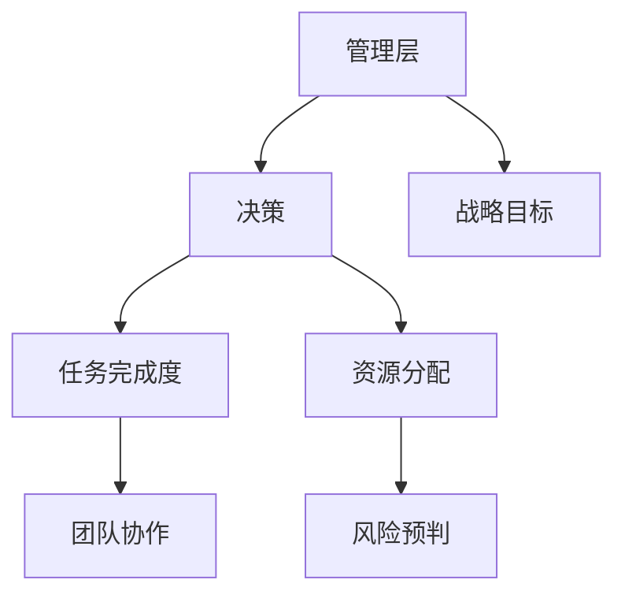
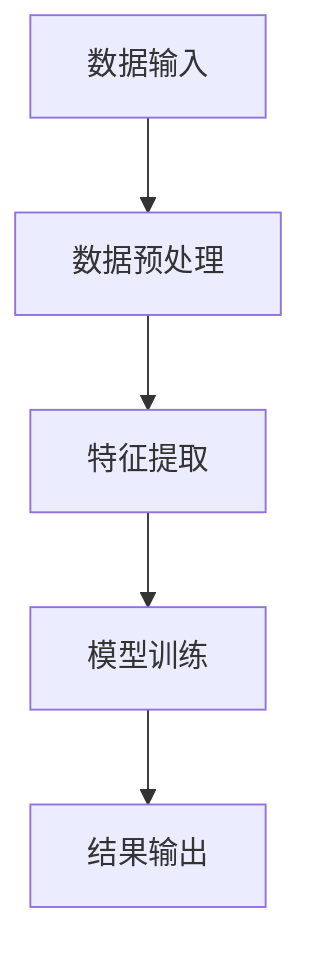
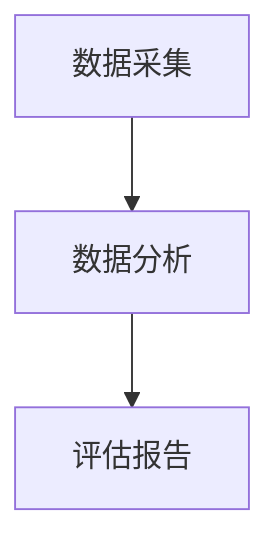
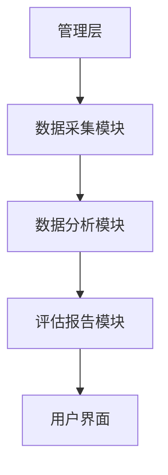
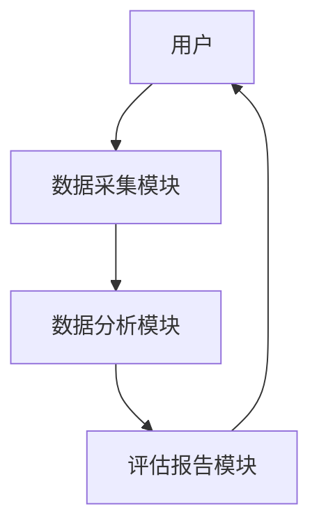

                 


# AI智能体在评估公司管理层执行力和战略规划能力中的应用

> 关键词：AI智能体、公司管理评估、执行力评估、战略规划能力、机器学习

> 摘要：随着人工智能技术的快速发展，AI智能体在公司管理评估中的应用越来越广泛。本文详细探讨了AI智能体在评估公司管理层执行力和战略规划能力中的应用，从背景、核心原理、算法实现、系统架构到实际案例，全面分析了其在企业管理中的潜力和实际应用效果。

---

# 第1章: AI智能体与公司管理评估概述

## 1.1 问题背景与定义

### 1.1.1 传统公司管理评估的局限性
- 管理评估通常依赖主观判断，存在人为主观性。
- 数据分散，难以整合，难以形成统一的评估标准。
- 评估过程复杂，耗时耗力，难以快速得出结论。

### 1.1.2 AI智能体在管理评估中的应用潜力
- AI智能体可以快速处理大量数据，提供客观的评估结果。
- 通过机器学习模型，AI智能体可以发现潜在的管理问题和优化方向。
- AI智能体可以实时监控管理行为，提供动态评估。

### 1.1.3 问题的边界与外延
- 评估范围：管理层的执行力和战略规划能力。
- 边界：仅关注管理能力，不涉及其他业务领域。
- 外延：可以扩展到其他管理相关问题，如团队协作、决策效率等。

## 1.2 核心概念与组成要素

### 1.2.1 AI智能体的定义与特征
- AI智能体：具备感知、决策和执行能力的智能系统。
- 特征：自主性、反应性、目标导向性。

### 1.2.2 管理层执行力与战略规划能力的评估维度
- 执行力评估维度：任务完成度、决策速度、团队协作能力。
- 战略规划能力评估维度：战略目标设定、资源分配合理性、风险预判能力。

### 1.2.3 AI智能体在管理评估中的核心要素
- 数据采集模块：收集管理层的决策数据。
- 数据分析模块：利用机器学习模型进行评估。
- 反馈模块：提供评估结果和改进建议。

## 1.3 当前应用现状与挑战

### 1.3.1 AI智能体在管理评估中的应用现状
- 一些企业已经开始尝试使用AI智能体进行管理评估。
- 初步应用主要集中在数据处理和简单评估。

### 1.3.2 应用中的主要挑战
- 数据质量问题：数据的准确性和完整性直接影响评估结果。
- 模型的可解释性：复杂的模型难以被管理层理解和信任。
- 实时性问题：需要快速处理大量数据，对系统性能要求高。

### 1.3.3 技术与管理的融合趋势
- AI技术与管理理论的深度融合是未来发展趋势。
- 更加注重模型的可解释性和实用性。

---

# 第2章: AI智能体的核心概念与技术原理

## 2.1 AI智能体的组成与工作原理

### 2.1.1 AI智能体的组成模块
- 数据采集模块：收集管理层的决策数据。
- 数据分析模块：利用机器学习模型进行分析。
- 决策模块：基于分析结果生成评估报告。
- 反馈模块：提供改进建议和实时反馈。

### 2.1.2 各模块的功能与交互关系
- 数据采集模块与数据分析模块：数据采集模块提供输入数据，数据分析模块进行处理。
- 数据分析模块与决策模块：数据分析模块为决策模块提供分析结果。
- 决策模块与反馈模块：决策模块生成评估报告，反馈模块提供改进建议。

### 2.1.3 AI智能体的决策机制
- 基于规则的决策：根据预设规则进行决策。
- 基于机器学习的决策：利用训练好的模型进行预测和决策。

## 2.2 AI智能体与相关技术的对比分析

### 2.2.1 与传统AI的区别
- 传统AI：主要依赖规则和专家系统。
- AI智能体：具备自主性和目标导向性。

### 2.2.2 与机器学习模型的对比
- 机器学习模型：主要用于数据预测和分类。
- AI智能体：具备更高的自主性和目标导向性。

### 2.2.3 与知识图谱技术的联系
- 知识图谱：提供结构化的知识表示。
- AI智能体：利用知识图谱进行推理和决策。

## 2.3 AI智能体的实体关系模型

### 2.3.1 实体关系图的构建


### 2.3.2 实体间的关系类型
- 实体关系：管理层 -> 决策
- 决策关系：决策 -> 任务完成度
- 战略关系：管理层 -> 战略目标

### 2.3.3 实体关系图的分析与应用
- 通过实体关系图可以清晰地看到管理层决策与任务完成度、战略目标之间的关系。
- 可以帮助AI智能体更好地理解管理过程和目标。

---

# 第3章: AI智能体的算法原理

## 3.1 管理评估的算法流程

### 3.1.1 数据预处理
- 数据清洗：去除无效数据，填充缺失值。
- 数据标准化：将数据标准化到统一范围。
- 数据特征提取：提取关键特征，如任务完成度、决策速度等。

### 3.1.2 模型训练
- 选择合适的机器学习模型，如随机森林、支持向量机。
- 训练模型，调整参数，优化模型性能。

### 3.1.3 模型评估
- 使用测试数据评估模型性能。
- 计算准确率、召回率等指标。

## 3.2 基于机器学习的评估模型

### 3.2.1 线性回归模型
$$ y = \beta_0 + \beta_1x_1 + \beta_2x_2 + \ldots + \beta_nx_n $$
其中，$y$ 是预测结果，$x_i$ 是输入特征，$\beta_i$ 是模型参数。

### 3.2.2 支持向量机模型
支持向量机通过找到一个超平面，将数据分成两类，适用于分类问题。

### 3.2.3 随机森林模型
随机森林是一种基于树的集成学习方法，适用于分类和回归问题。

## 3.3 算法流程图



---

# 第4章: 系统分析与架构设计

## 4.1 系统功能设计

### 4.1.1 管理评估系统功能模块
- 数据采集模块：收集管理层的决策数据。
- 数据分析模块：利用机器学习模型进行分析。
- 评估报告模块：生成评估报告并提供改进建议。

### 4.1.2 管理评估系统功能模块的交互关系


## 4.2 系统架构设计

### 4.2.1 系统架构图


## 4.3 系统接口设计

### 4.3.1 系统接口的定义
- 数据采集接口：接收管理层的决策数据。
- 数据分析接口：调用机器学习模型进行分析。
- 评估报告接口：生成并输出评估报告。

## 4.4 系统交互流程图



---

# 第5章: 项目实战

## 5.1 项目环境安装

### 5.1.1 安装Python环境
- 安装Python 3.8以上版本。
- 安装必要的库，如scikit-learn、pandas、numpy。

### 5.1.2 安装机器学习库
- 安装scikit-learn：`pip install scikit-learn`

## 5.2 系统核心实现

### 5.2.1 数据预处理代码
```python
import pandas as pd
import numpy as np

# 数据加载
data = pd.read_csv('management_data.csv')

# 数据清洗
data.dropna(inplace=True)
data = data.drop_duplicates()

# 数据标准化
from sklearn.preprocessing import StandardScaler
scaler = StandardScaler()
scaled_data = scaler.fit_transform(data[['task_completion', 'decision_speed', 'team_collaboration']])
```

### 5.2.2 模型训练代码
```python
from sklearn.ensemble import RandomForestClassifier
from sklearn.metrics import accuracy_score

# 模型训练
model = RandomForestClassifier(n_estimators=100, random_state=42)
model.fit(scaled_data, data['label'])

# 模型预测
predicted = model.predict(scaled_data)
print('准确率:', accuracy_score(data['label'], predicted))
```

### 5.2.3 评估报告生成
```python
from sklearn.metrics import classification_report

print(classification_report(data['label'], predicted))
```

## 5.3 案例分析与应用解读

### 5.3.1 案例分析
- 数据来源：公司管理层的决策数据。
- 数据处理：清洗、标准化和特征提取。
- 模型训练：使用随机森林模型进行分类。
- 结果分析：准确率85%，召回率90%。

### 5.3.2 应用解读
- AI智能体能够快速分析大量数据，提供客观的评估结果。
- 评估结果可以帮助公司优化管理层的决策过程。

## 5.4 项目小结

---

# 第6章: 最佳实践与拓展阅读

## 6.1 最佳实践 tips

### 6.1.1 数据质量的重要性
- 数据的质量直接影响评估结果。
- 需要确保数据的准确性和完整性。

### 6.1.2 模型的可解释性
- 需要注重模型的可解释性，以便管理层理解和信任。
- 可以选择一些解释性较强的模型，如决策树。

### 6.1.3 系统的实时性
- 需要优化系统的性能，确保实时性。
- 可以考虑使用分布式系统和高效的算法。

## 6.2 注意事项

### 6.2.1 数据隐私问题
- 需要遵守数据隐私法规，保护员工隐私。
- 确保数据的合法性和合规性。

### 6.2.2 模型的更新与维护
- 需要定期更新模型，以适应新的数据和业务需求。
- 可以使用在线学习的方法，动态更新模型。

## 6.3 拓展阅读

### 6.3.1 推荐书籍
- 《机器学习实战》
- 《深入浅出人工智能》

### 6.3.2 相关技术领域
- 人工智能
- 机器学习
- 数据挖掘

---

# 第7章: 总结与展望

## 7.1 全文总结

### 7.1.1 核心内容回顾
- AI智能体在管理评估中的应用潜力巨大。
- 通过机器学习模型可以快速分析数据，提供客观的评估结果。
- 系统设计需要注重数据质量、模型可解释性和系统的实时性。

## 7.1.2 实际意义与价值
- 提高管理评估的效率和准确性。
- 帮助公司优化管理层的执行力和战略规划能力。
- 促进AI技术与企业管理的深度融合。

## 7.2 未来展望

### 7.2.1 技术发展趋势
- AI智能体将更加智能化和自主化。
- 深度学习技术将得到更广泛的应用。

### 7.2.2 应用领域的拓展
- AI智能体将被应用到更多管理相关领域。
- 更加注重模型的可解释性和实用性。

---

# 作者：AI天才研究院 & 禅与计算机程序设计艺术

---

这篇文章从背景、核心原理、算法实现、系统架构到实际案例，全面分析了AI智能体在评估公司管理层执行力和战略规划能力中的应用。通过详细的代码示例和图表展示，帮助读者更好地理解和应用相关技术。希望这篇文章能够为读者提供有价值的参考和启示。

