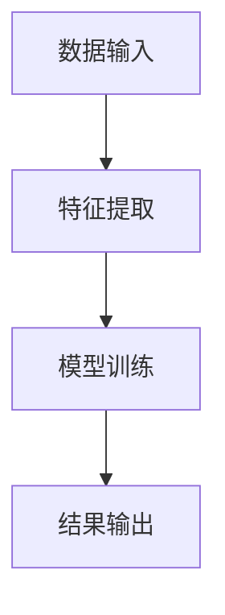
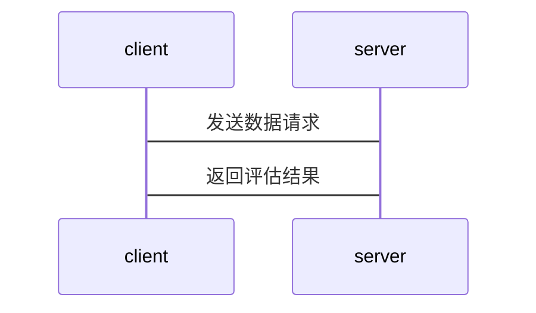

                 


# AI智能体在评估公司资本结构中的作用

## 关键词：AI智能体，资本结构评估，机器学习，财务分析，风险管理

## 摘要：随着人工智能技术的快速发展，AI智能体在公司资本结构评估中的作用日益凸显。本文详细探讨了AI智能体如何优化资本结构评估流程，提升评估效率和准确性。通过分析核心概念、算法原理、系统架构以及实际案例，本文揭示了AI智能体在资本结构评估中的独特优势，并展望了其未来的发展潜力。

---

# 第1章: AI智能体与资本结构评估的背景

## 1.1 AI智能体的基本概念

### 1.1.1 AI智能体的定义
AI智能体是一种能够感知环境、自主决策并执行任务的智能系统，具备学习、推理和自适应能力。它通过数据驱动的方式优化复杂问题的解决方案。

### 1.1.2 AI智能体的核心特征
- **自主性**：无需外部干预，自主完成任务。
- **反应性**：能够实时感知环境变化并做出反应。
- **学习能力**：通过数据和经验不断优化决策模型。

### 1.1.3 AI智能体与传统评估方法的区别
AI智能体能够处理非结构化数据，发现隐藏模式，提供实时反馈，而传统方法依赖人工分析，效率较低且易出错。

## 1.2 资本结构评估的基本概念

### 1.2.1 资本结构的定义
资本结构是指公司负债和股东权益的组合方式，直接影响公司的资本成本和财务风险。

### 1.2.2 资本结构评估的重要性
资本结构优化有助于降低资本成本，提高公司价值，增强财务稳定性。

### 1.2.3 资本结构评估的常见方法
- **资本资产定价模型（CAPM）**
- **加权平均资本成本（WACC）**
- **Modigliani-Miller模型**

## 1.3 AI智能体在资本结构评估中的作用

### 1.3.1 AI智能体如何优化资本结构评估
AI智能体通过大数据分析和机器学习算法，快速识别影响资本结构的关键因素，提供最优解决方案。

### 1.3.2 AI智能体在资本结构评估中的优势
- **高效性**：快速处理大量数据，缩短评估时间。
- **准确性**：基于复杂模型，提高评估结果的可靠性。
- **适应性**：实时调整模型，应对市场变化。

## 1.4 本章小结
本章介绍了AI智能体的基本概念及其在资本结构评估中的作用，强调了AI技术在提升评估效率和准确性方面的重要价值。

---

# 第2章: AI智能体与资本结构评估的核心概念

## 2.1 资本结构评估的关键要素

### 2.1.1 资产负债率
负债与资产的比率，反映公司财务杠杆程度。

### 2.1.2 净债务与股权比例
净债务与股东权益的比率，影响公司的财务风险。

### 2.1.3 利率与资本成本
资金成本的高低直接影响资本结构的优化。

## 2.2 AI智能体的评估机制

### 2.2.1 数据采集与处理
AI智能体通过爬取公开数据、财务报表等来源，提取关键指标。

### 2.2.2 模型训练与优化
基于历史数据，训练机器学习模型，预测最优资本结构。

### 2.2.3 结果输出与反馈
生成评估报告，提供优化建议，并根据反馈调整模型。

## 2.3 资本结构评估的流程

### 2.3.1 数据收集与预处理
清洗数据，去除异常值，确保数据质量。

### 2.3.2 模型选择与训练
选择合适的机器学习算法，训练评估模型。

### 2.3.3 结果分析与优化
解读模型输出，验证结果的合理性，进行优化调整。

## 2.4 本章小结
本章详细阐述了资本结构评估的关键要素和AI智能体的评估机制，为后续算法实现奠定了基础。

---

# 第3章: AI智能体的资本结构评估算法

## 3.1 算法原理概述

### 3.1.1 机器学习模型的选择
常用模型包括线性回归、支持向量机（SVM）和随机森林等。

### 3.1.2 特征工程与数据预处理
提取特征，如资产规模、净利润率等，进行标准化处理。

### 3.1.3 模型训练与调优
使用训练数据训练模型，并通过交叉验证优化参数。

## 3.2 算法流程图



## 3.3 算法实现代码

```python
import pandas as pd
from sklearn.model import LinearRegression

data = pd.read_csv('capital_data.csv')
X = data[['资产', '负债', ' equity']]
y = data['capital_cost']

model = LinearRegression()
model.fit(X, y)
predictions = model.predict(X)
```

## 3.4 算法的数学模型和公式

资本结构评估的回归模型可以表示为：
$$ y = \beta_0 + \beta_1x_1 + \beta_2x_2 + \epsilon $$
其中，$y$ 是资本成本，$x_1$ 和 $x_2$ 是资产和负债的特征，$\beta$ 是回归系数，$\epsilon$ 是误差项。

---

# 第4章: 系统分析与架构设计

## 4.1 问题场景介绍
公司需要实时评估资本结构，优化资本成本，降低财务风险。

## 4.2 系统功能设计

### 4.2.1 数据采集模块
从财务报表和市场数据中提取关键指标。

### 4.2.2 模型训练模块
训练机器学习模型，预测资本结构。

### 4.2.3 结果分析模块
生成评估报告，提供优化建议。

## 4.3 系统架构设计


## 4.4 系统接口设计
API接口用于数据输入和结果输出，支持RESTful协议。

## 4.5 系统交互流程图



## 4.6 本章小结
本章设计了系统的整体架构和功能模块，展示了AI智能体在资本结构评估中的实际应用。

---

# 第5章: 项目实战

## 5.1 环境安装
安装必要的库，如Python、TensorFlow、Scikit-learn。

## 5.2 核心代码实现

```python
# 数据预处理
data = pd.read_csv('capital_data.csv')
data = data.dropna()
data = (data - data.mean()) / data.std()

# 模型训练
from sklearn.model import RandomForestRegressor
model = RandomForestRegressor(n_estimators=100)
model.fit(X_train, y_train)

# 结果分析
importances = model.feature_importances_
top_features = data.columns[importances.argsort()[::-1]]
```

## 5.3 代码解读与分析
- 数据预处理：去除缺失值，标准化数据。
- 模型训练：使用随机森林回归器，训练评估模型。
- 结果分析：提取特征重要性，识别关键影响因素。

## 5.4 实际案例分析
以某公司为例，分析其资本结构，提供优化建议。

## 5.5 项目总结
总结项目的实现过程，评估AI智能体在实际应用中的效果和改进空间。

---

# 第6章: 最佳实践与未来展望

## 6.1 小结
AI智能体在资本结构评估中展现了强大的优势，能够显著提升评估效率和准确性。

## 6.2 注意事项
- 数据质量：确保数据准确性和完整性。
- 模型选择：根据不同场景选择合适的算法。
- 风险管理：关注模型的稳定性和可解释性。

## 6.3 拓展阅读
推荐相关书籍和论文，深入学习AI在金融领域的应用。

---

# 作者：AI天才研究院/AI Genius Institute & 禅与计算机程序设计艺术 /Zen And The Art of Computer Programming

---

通过以上结构，文章详细探讨了AI智能体在资本结构评估中的应用，从理论到实践，层层深入，为读者提供了全面的知识体系。

