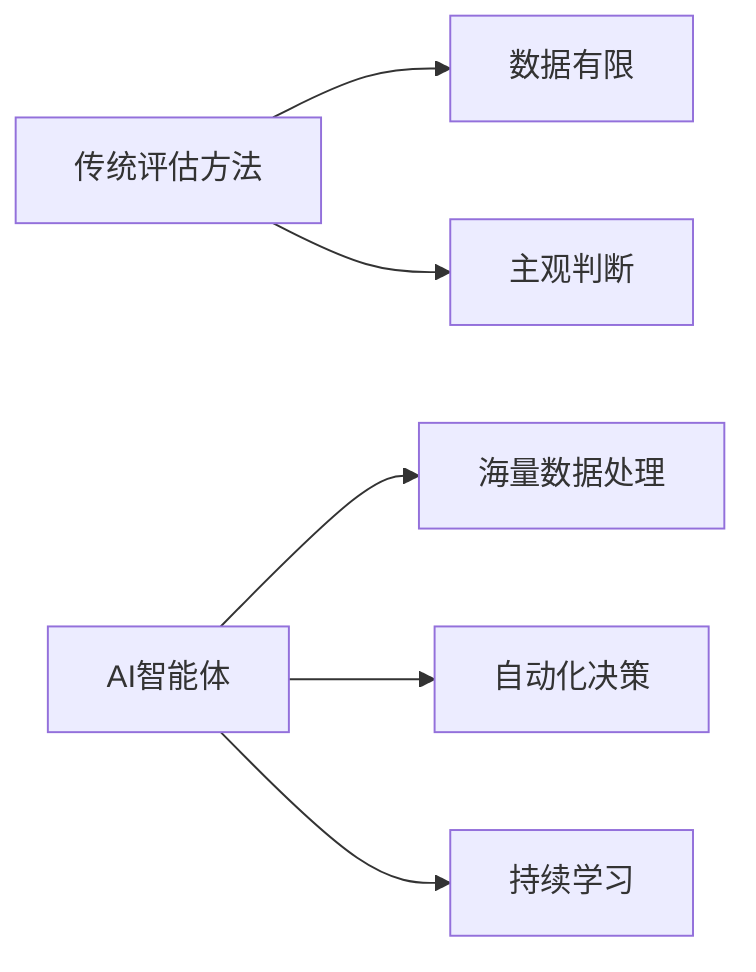

                 


# AI智能体在评估公司长期盈利能力和增长潜力中的应用

> **关键词**: AI智能体, 公司评估, 长期盈利能力, 增长潜力, 财务分析, 机器学习, 神经网络

> **摘要**: 本文探讨AI智能体在评估公司长期盈利能力和增长潜力中的应用，通过分析传统方法的局限性，介绍AI智能体的核心概念、数学模型、系统架构和实际项目案例。文章详细讲解了AI智能体在财务数据处理、算法选择、系统设计及优化策略中的优势，同时提供了一个完整的项目实战案例，展示了如何利用AI技术提升公司评估的准确性和效率。最后，本文总结了AI智能体在公司评估中的最佳实践和未来发展趋势。

---

## 第1章: AI智能体与公司评估概述

### 1.1 问题背景与描述

#### 1.1.1 传统公司评估方法的局限性
传统公司评估方法主要依赖财务报表分析、市场分析和管理判断。然而，这种方法存在以下问题：
- 数据量有限：传统方法通常依赖历史数据，难以预测未来的市场变化。
- 主观性较强：管理判断的主观性可能导致评估结果偏差。
- 简化假设：传统模型（如杜邦分析）假设市场环境稳定，忽视了动态变化。

#### 1.1.2 长期盈利能力与增长潜力的核心要素
长期盈利能力与增长潜力的评估需要考虑以下关键要素：
- 财务状况：收入、利润、资产负债表等。
- 市场地位：市场份额、品牌价值、竞争对手分析。
- 创新能力：研发投入、专利数量、产品生命周期。
- 管理能力：管理团队的经验和战略规划。
- 宏观环境：经济周期、政策变化、行业趋势。

#### 1.1.3 AI智能体在公司评估中的优势
AI智能体通过以下方式提升了公司评估的准确性：
- 处理海量数据：AI能够分析大量非结构化数据（如新闻、社交媒体）。
- 动态调整：AI可以实时更新模型，适应市场变化。
- 自动化与智能化：AI能够自动识别关键指标，提供实时反馈。

### 1.2 AI智能体的核心概念与定义

#### 1.2.1 AI智能体的基本定义
AI智能体是指能够感知环境、学习知识、推理决策并采取行动的智能系统。在公司评估中，AI智能体通过以下步骤工作：
1. 数据采集：从财务报表、市场数据、新闻等多渠道获取数据。
2. 数据处理：清洗、转换和特征提取。
3. 模型训练：使用机器学习算法构建预测模型。
4. 决策与反馈：根据模型结果提供评估建议，并根据实际结果调整模型。

#### 1.2.2 AI智能体的属性与特征对比

| 属性 | AI智能体 | 传统评估方法 |
|------|----------|---------------|
| 数据处理能力 | 强大，支持结构化和非结构化数据 | 有限，主要依赖结构化数据 |
| 决策能力 | 自动化，基于数据驱动 | 主要依赖人工判断 |
| 学习能力 | 能够自适应，优化模型 | 需要人工调整和优化 |
| 可扩展性 | 高，适用于大规模数据 | 低，难以处理海量数据 |

#### 1.2.3 AI智能体与传统评估方法的对比分析
图1-1展示了AI智能体与传统评估方法在数据处理能力、决策能力和学习能力上的对比：



### 1.3 本章小结
本章介绍了AI智能体在公司评估中的背景、核心概念和优势，强调了AI在处理复杂数据和动态环境中的独特价值。

---

## 第2章: AI智能体的核心原理

### 2.1 AI智能体的基本原理

#### 2.1.1 知识表示与推理
知识表示是AI智能体理解数据的基础。常见的表示方法包括：
- 符号逻辑：使用符号表示概念和关系（如一阶逻辑）。
- 语义网络：通过节点和边表示知识。
- 概率图模型：通过概率分布表示不确定性。

推理是基于知识表示进行逻辑推导的过程。例如，使用逻辑推理从财务数据推导出盈利能力。

#### 2.1.2 学习与自适应机制
AI智能体通过机器学习算法不断优化模型。监督学习、无监督学习和强化学习是主要的学习方式：
- 监督学习：使用标注数据训练分类或回归模型。
- 无监督学习：发现数据中的隐藏模式（如聚类分析）。
- 强化学习：通过试错优化决策策略。

#### 2.1.3 决策与优化策略
AI智能体基于学习到的模型做出最优决策。例如，使用遗传算法优化投资组合，或者使用深度强化学习优化股票交易策略。

### 2.2 AI智能体与财务数据的关系

#### 2.2.1 数据采集与处理
AI智能体需要从多个来源采集数据，包括：
- 财务报表：收入、利润、资产负债表。
- 市场数据：行业趋势、竞争对手信息。
- 非结构化数据：新闻、社交媒体情绪。

#### 2.2.2 数据分析与特征提取
特征提取是将原始数据转化为有意义的特征。例如，将收入增长率、净利润率等指标作为特征输入模型。

#### 2.2.3 数据驱动的决策支持
AI智能体通过分析数据提供决策支持，如预测公司未来盈利能力和增长潜力。

### 2.3 AI智能体的数学模型与算法

#### 2.3.1 传统财务模型的局限性
传统财务模型（如杜邦分析）依赖于线性假设，无法捕捉非线性关系和复杂市场动态。

#### 2.3.2 基于AI的财务模型构建
基于AI的模型可以捕捉复杂的非线性关系，如使用神经网络模型预测公司违约风险。

#### 2.3.3 神经网络模型在公司评估中的应用
神经网络模型广泛应用于公司评估，如分类任务（预测公司是否盈利）和回归任务（预测公司收入）。

### 2.4 本章小结
本章详细讲解了AI智能体的基本原理，包括知识表示、学习机制和决策策略，并探讨了AI在财务数据分析中的应用。

---

## 第3章: AI智能体的数学模型与算法

### 3.1 传统财务分析模型

#### 3.1.1 杜邦分析法
杜邦分析法将ROE分解为净利率、资产周转率和杠杆率的乘积。公式为：
$$
ROE = \frac{净利润}{股东权益} = 净利率 \times 资产周转率 \times 杠杆率
$$

#### 3.1.2 帕拉迪姆模型
帕拉迪姆模型通过多因素分析预测公司价值，公式为：
$$
V = \sum_{i=1}^{n} w_i \times factor_i
$$
其中，$w_i$是因子权重，$factor_i$是影响公司价值的因素。

#### 3.1.3 资产负债表分析
通过分析资产负债表中的各项指标（如流动比率、速动比率）评估公司财务健康状况。

### 3.2 基于AI的公司评估模型

#### 3.2.1 神经网络模型
神经网络模型通过多层感知机（MLP）或卷积神经网络（CNN）处理财务数据。例如，使用LSTM网络预测公司股票价格走势。

#### 3.2.2 支持向量机模型
支持向量机（SVM）用于分类任务，如预测公司是否盈利。

#### 3.2.3 随机森林模型
随机森林通过集成学习提高预测准确性，常用于回归和分类任务。

### 3.3 算法实现与优化

#### 3.3.1 算法选择与优化策略
根据任务类型选择算法，如分类任务选择SVM或随机森林，回归任务选择神经网络。

#### 3.3.2 模型训练与调优
通过交叉验证选择最佳参数，优化模型性能。

#### 3.3.3 模型评估与验证
使用准确率、召回率、F1分数等指标评估模型性能。

### 3.4 本章小结
本章介绍了传统财务模型的局限性，详细讲解了基于AI的公司评估模型，并探讨了算法选择与优化策略。

---

## 第4章: 系统架构设计

### 4.1 系统功能设计

#### 4.1.1 数据采集模块
数据采集模块从多个来源获取数据，如财务报表、新闻、社交媒体。

#### 4.1.2 数据分析模块
数据分析模块对数据进行清洗、转换和特征提取。

#### 4.1.3 智能评估模块
智能评估模块基于机器学习模型提供公司评估结果。

### 4.2 系统架构设计

#### 4.2.1 分层架构设计
系统架构分为数据层、服务层和应用层。

#### 4.2.2 模块化设计
每个功能模块独立开发，便于维护和扩展。

#### 4.2.3 高可用性设计
通过负载均衡和容错设计确保系统稳定运行。

### 4.3 系统接口设计

#### 4.3.1 数据接口
数据接口用于与外部数据源交互，如数据库和API。

#### 4.3.2 用户接口
用户接口提供友好的操作界面，供用户输入数据和查看结果。

#### 4.3.3 API接口
API接口允许其他系统调用本系统的服务。

### 4.4 本章小结
本章详细设计了系统的功能模块、架构和接口，确保系统的高效和稳定。

---

## 第5章: 系统实现与项目实战

### 5.1 环境安装与配置

#### 5.1.1 Python环境搭建
安装Python和必要的库，如TensorFlow、Scikit-learn。

#### 5.1.2 库的安装与配置
使用pip安装机器学习库和数据分析库。

#### 5.1.3 数据集的准备
收集和整理公司财务数据和市场数据。

### 5.2 核心算法实现

#### 5.2.1 数据预处理代码
```python
import pandas as pd

data = pd.read_csv('company_data.csv')
data = data.dropna()
```

#### 5.2.2 模型训练代码
```python
from sklearn.ensemble import RandomForestClassifier
model = RandomForestClassifier()
model.fit(X_train, y_train)
```

#### 5.2.3 模型评估代码
```python
from sklearn.metrics import accuracy_score
y_pred = model.predict(X_test)
print(accuracy_score(y_test, y_pred))
```

### 5.3 项目实战与案例分析

#### 5.3.1 案例背景介绍
以某科技公司为例，使用AI智能体评估其长期盈利能力和增长潜力。

#### 5.3.2 数据分析与模型训练
使用收集的数据训练随机森林模型，预测公司未来三年的收入增长率。

#### 5.3.3 模型评估与结果解读
评估模型的准确率为85%，并根据预测结果制定投资策略。

### 5.4 本章小结
本章通过实际项目案例展示了AI智能体的实现过程和应用效果。

---

## 第6章: 最佳实践与未来展望

### 6.1 AI智能体在公司评估中的最佳实践

#### 6.1.1 数据质量的重要性
确保数据准确性和完整性，避免偏差。

#### 6.1.2 模型选择与优化
根据任务需求选择合适的算法，并通过调优提高性能。

#### 6.1.3 结果解释与可解释性
确保模型结果可解释，便于决策者理解和应用。

### 6.2 未来展望

#### 6.2.1 多模态数据融合
结合文本、图像等多种数据源，提升评估准确性。

#### 6.2.2 自适应学习
开发能够自适应市场变化的智能系统。

#### 6.2.3 解释性AI
提高模型的可解释性，增强决策者的信任。

### 6.3 本章小结
本章总结了AI智能体在公司评估中的最佳实践，并展望了未来的发展方向。

---

## 作者：AI天才研究院/AI Genius Institute & 禅与计算机程序设计艺术 /Zen And The Art of Computer Programming

