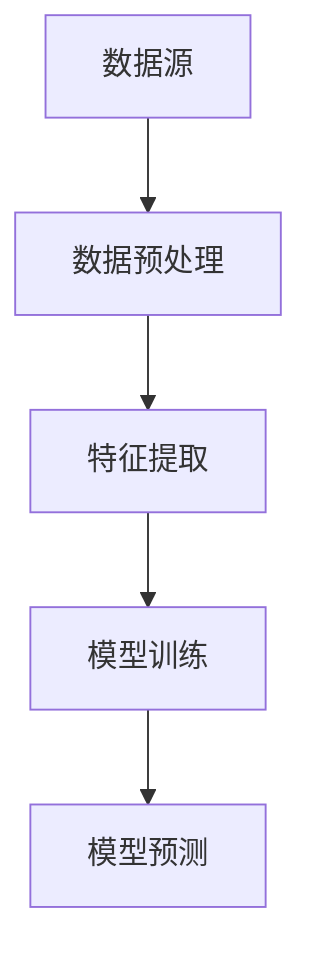
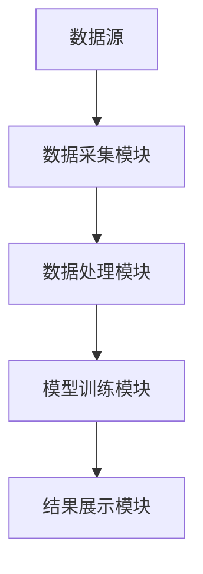

                 


# AI智能体在评估品牌忠诚度中的作用

> 关键词：AI智能体，品牌忠诚度，机器学习，数据挖掘，客户关系管理

> 摘要：本文探讨了AI智能体在评估品牌忠诚度中的应用，通过详细分析其在数据处理、模型训练和系统架构中的作用，展示了如何利用AI技术提升品牌忠诚度的评估效率和准确性。

---

## 第1章：引言

### 1.1 问题背景与研究意义

#### 1.1.1 品牌忠诚度的定义与重要性
品牌忠诚度是指客户对某个品牌的情感依赖和持续购买行为。高忠诚度客户不仅为品牌带来持续的收入，还能为企业降低营销成本，提高市场竞争力。

#### 1.1.2 AI智能体在品牌忠诚度评估中的作用
AI智能体通过数据处理、特征提取和模型训练，能够高效地预测客户的忠诚度，帮助企业优化客户关系管理。

#### 1.1.3 当前研究现状与挑战
当前，品牌忠诚度评估主要依赖传统的统计方法，但随着数据量的增加，AI技术的应用成为提升评估效率和准确性的关键。

### 1.2 问题描述
#### 1.2.1 品牌忠诚度评估的核心问题
如何从海量数据中提取关键特征，并准确预测客户忠诚度。

#### 1.2.2 AI智能体在评估中的优势
AI智能体能够处理复杂的数据关系，提供实时的决策支持。

#### 1.2.3 问题解决的目标与边界
目标是通过AI技术提升忠诚度评估的准确性和效率，边界在于数据隐私和模型解释性。

---

## 第2章：AI智能体与品牌忠诚度的核心概念

### 2.1 AI智能体的定义与类型
#### 2.1.1 AI智能体的基本定义
AI智能体是指能够感知环境并采取行动以实现目标的智能系统。

#### 2.1.2 基于规则的智能体与基于模型的智能体
基于规则的智能体通过预定义的规则进行决策，而基于模型的智能体则通过机器学习模型进行预测。

#### 2.1.3 品牌忠诚度评估中的智能体类型
在品牌忠诚度评估中，基于模型的智能体更为适用，能够处理复杂的数据关系。

### 2.2 品牌忠诚度评估的关键要素
#### 2.2.1 忠诚度的度量标准
常用的度量标准包括客户生命周期价值（CLV）和净推荐值（NPS）。

#### 2.2.2 影响忠诚度的因素
主要包括产品质量、价格、服务质量和客户体验。

#### 2.2.3 数据来源与特征提取
数据来源包括购买记录、社交媒体评论、问卷调查等，特征提取需要关注客户的购买频率、金额和反馈评分。

### 2.3 AI智能体与品牌忠诚度的关系
#### 2.3.1 智能体在数据处理中的作用
AI智能体能够高效地处理和分析海量数据，提取关键特征。

#### 2.3.2 智能体在决策支持中的应用
通过预测模型，AI智能体能够帮助企业识别高忠诚度客户并制定针对性的营销策略。

#### 2.3.3 智能体与品牌忠诚度评估的结合
结合实时数据和动态模型，AI智能体能够提供及时的忠诚度评估结果。

---

## 第3章：AI智能体在品牌忠诚度评估中的算法原理

### 3.1 基于机器学习的忠诚度预测模型

#### 3.1.1 监督学习与无监督学习的对比
监督学习适用于已标注数据的预测，无监督学习适用于数据聚类分析。

#### 3.1.2 常见算法选择与优缺点
随机森林适用于特征重要性分析，神经网络适用于复杂的非线性关系。

#### 3.1.3 算法流程图（Mermaid）


### 3.2 算法实现与数学模型

#### 3.2.1 数据预处理与特征工程
数据预处理包括缺失值填充和标准化，特征工程涉及选择和构造特征。

#### 3.2.2 模型训练与优化
使用随机森林模型进行训练，通过交叉验证优化参数。

#### 3.2.3 模型评估与调优
评估指标包括准确率、召回率和F1分数，通过网格搜索进行调优。

### 3.3 代码实现与案例分析

#### 3.3.1 环境安装与数据准备
安装Python和相关库，准备客户数据集。

#### 3.3.2 核心代码实现
```python
from sklearn.ensemble import RandomForestClassifier
from sklearn.model_selection import train_test_split
from sklearn.metrics import accuracy_score, recall_score, f1_score

# 数据准备
X = ...  # 特征矩阵
y = ...  # 标签

# 数据分割
X_train, X_test, y_train, y_test = train_test_split(X, y, test_size=0.2, random_state=42)

# 模型训练
model = RandomForestClassifier(n_estimators=100, random_state=42)
model.fit(X_train, y_train)

# 模型预测
y_pred = model.predict(X_test)

# 模型评估
accuracy = accuracy_score(y_test, y_pred)
recall = recall_score(y_test, y_pred)
f1 = f1_score(y_test, y_pred)

print(f'准确率: {accuracy:.2f}')
print(f'召回率: {recall:.2f}')
print(f'F1分数: {f1:.2f}')
```

#### 3.3.3 案例分析与结果解读
通过实际案例分析，展示模型如何预测客户忠诚度，并解释结果的实际意义。

---

## 第4章：系统架构与设计方案

### 4.1 系统功能设计

#### 4.1.1 数据采集模块
负责从数据库、API接口等来源收集客户数据。

#### 4.1.2 数据处理模块
进行数据清洗、特征提取和转换。

#### 4.1.3 模型训练模块
训练机器学习模型并保存模型参数。

#### 4.1.4 结果展示模块
以可视化形式展示忠诚度评估结果。

### 4.2 系统架构设计（Mermaid）



### 4.3 接口设计与交互流程

#### 4.3.1 API接口
定义RESTful API接口，供其他系统调用忠诚度评估结果。

---

## 第5章：项目实战

### 5.1 环境安装与数据准备
安装Python、Jupyter Notebook、scikit-learn等工具，准备客户数据集。

### 5.2 核心代码实现
实现数据预处理、特征提取、模型训练和结果展示。

### 5.3 案例分析与详细解读
通过具体案例分析，展示AI智能体在品牌忠诚度评估中的实际应用效果。

---

## 第6章：总结与展望

### 6.1 总结
总结AI智能体在品牌忠诚度评估中的优势和成果。

### 6.2 未来展望
探讨未来可能的发展方向，如结合自然语言处理技术，进一步提升模型的准确性和精细度。

---

## 作者：AI天才研究院/AI Genius Institute & 禅与计算机程序设计艺术 /Zen And The Art of Computer Programming

