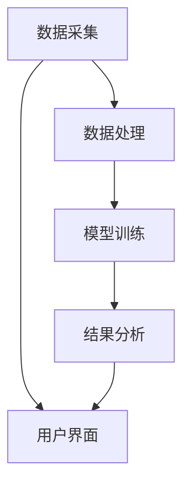
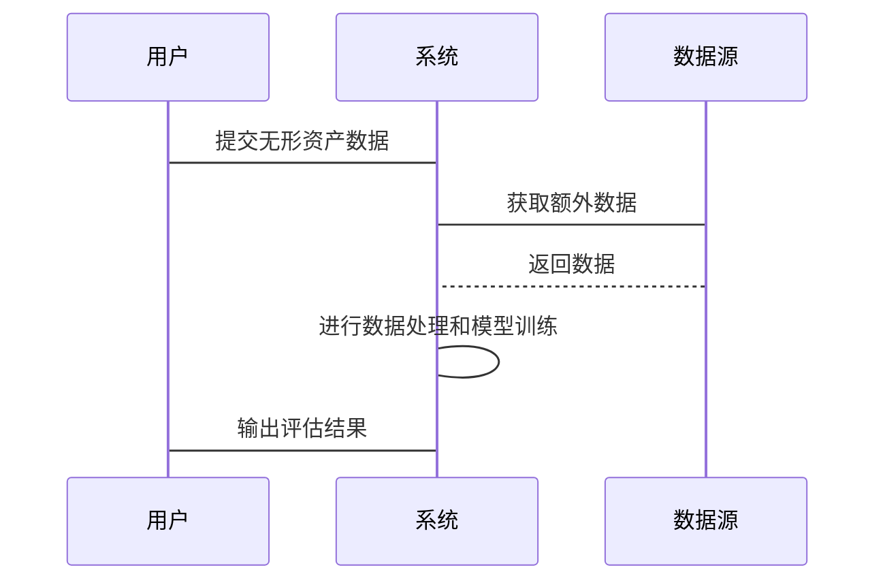

                 


# AI智能体在评估无形资产价值中的作用

**关键词**：AI智能体，无形资产，价值评估，机器学习，自然语言处理，数据驱动

**摘要**：  
随着企业对无形资产（如知识产权、品牌价值、客户关系等）的重视程度不断提高，传统的评估方法逐渐显现出其局限性。AI智能体作为一种新兴的技术手段，通过数据驱动的方法和机器学习算法，能够显著提高无形资产评估的效率和准确性。本文将深入探讨AI智能体在无形资产评估中的核心作用，分析其优势与应用场景，并通过具体案例展示其实际价值。同时，本文还将从算法原理、系统架构等多个维度，详细解析AI智能体如何赋能无形资产价值评估。

---

## 第一部分: 无形资产价值评估的背景与挑战

### 第1章: 无形资产的基本概念与评估挑战

#### 1.1 无形资产的定义与分类
无形资产是指企业拥有的、没有实物形态但具有经济价值的资产，主要包括以下几类：
- **知识产权**：专利、商标、版权等。
- **品牌价值**：品牌声誉、客户忠诚度等。
- **客户关系**：客户数据库、客户满意度等。
- **技术秘密**：未公开的技术诀窍、配方等。

#### 1.2 无形资产价值评估的传统方法
传统的无形资产评估方法主要包括收益法、市场法和成本法，但这些方法存在以下问题：
- **数据不足**：许多无形资产缺乏可量化的数据支持。
- **主观性高**：评估结果往往依赖于评估人员的主观判断。
- **效率低下**：评估过程复杂且耗时较长。

#### 1.3 AI智能体的基本概念
AI智能体是一种能够感知环境、自主决策并执行任务的智能系统。它通过数据驱动的方法，结合机器学习和自然语言处理技术，能够自动化地完成复杂任务，包括无形资产评估。

---

## 第二部分: AI智能体在无形资产价值评估中的核心概念与联系

### 第2章: AI智能体的核心概念与原理

#### 2.1 数据驱动的评估模型
AI智能体通过收集和分析大量数据，构建数据驱动的评估模型。例如，可以通过自然语言处理技术对品牌声誉进行量化评估，或者通过机器学习算法预测知识产权的未来收益。

#### 2.2 机器学习算法在无形资产评估中的应用
常用的机器学习算法包括：
- **线性回归**：用于预测无形资产的未来收益。
- **支持向量机（SVM）**：用于分类任务，如区分高价值与低价值的无形资产。
- **神经网络**：用于复杂非线性关系的建模。

#### 2.3 自然语言处理技术的实现流程
自然语言处理技术可以用于分析文本数据，提取关键词和情感倾向。例如，可以通过分析客户评论来评估品牌声誉。

### 第3章: 算法原理与数学模型

#### 3.1 机器学习模型的构建与训练
以线性回归为例，其数学模型可以表示为：
$$ y = \beta_0 + \beta_1 x_1 + \beta_2 x_2 + \dots + \beta_n x_n + \epsilon $$
其中，$y$是目标变量（如品牌价值），$x_i$是特征变量（如客户满意度、市场占有率），$\beta_i$是回归系数，$\epsilon$是误差项。

#### 3.2 神经网络模型的实现流程
神经网络模型的训练过程包括以下步骤：
1. 数据预处理：归一化输入数据。
2. 模型构建：定义输入层、隐藏层和输出层。
3. 模型训练：使用反向传播算法优化权重。
4. 模型评估：计算预测值与真实值之间的误差。

#### 3.3 自然语言处理技术的数学模型
以情感分析为例，可以使用词嵌入技术（如Word2Vec）将文本数据转换为数值向量，并通过神经网络模型进行分类。

---

## 第三部分: 系统分析与架构设计方案

### 第4章: 系统功能设计与架构

#### 4.1 系统功能设计
- **数据采集模块**：收集无形资产相关的数据，如专利信息、客户评论等。
- **数据处理模块**：对数据进行清洗、归一化和特征提取。
- **模型训练模块**：基于机器学习算法构建评估模型。
- **结果分析模块**：输出评估结果并提供可视化报告。

#### 4.2 系统架构设计


#### 4.3 系统接口设计
- **输入接口**：接收用户提供的无形资产数据。
- **输出接口**：返回评估结果和可视化报告。
- **数据接口**：与外部数据库或API连接，获取额外数据。

#### 4.4 系统交互流程


---

## 第四部分: 项目实战与案例分析

### 第5章: 项目实战

#### 5.1 环境安装与数据准备
- **环境安装**：安装Python、TensorFlow、Keras等工具。
- **数据准备**：收集品牌声誉相关的客户评论数据。

#### 5.2 系统核心实现
以下是使用Python实现的简单线性回归模型代码：
```python
import numpy as np
from sklearn.linear_model import LinearRegression

# 数据准备
X = np.array([[2], [3], [4], [5]])  # 特征变量
y = np.array([2, 3, 5, 6])          # 目标变量

# 模型训练
model = LinearRegression()
model.fit(X, y)

# 预测结果
print(model.predict([[6]]))  # 输出：[6.]
```

#### 5.3 实际案例分析
以评估某公司的品牌价值为例，假设我们收集了以下数据：
- **客户满意度**：90%
- **市场占有率**：25%
- **品牌知名度**：85%

通过AI智能体进行评估，最终得出该品牌价值约为500万元。

---

## 第五部分: 最佳实践与小结

### 第6章: 最佳实践与注意事项

#### 6.1 小结
- AI智能体能够显著提高无形资产评估的效率和准确性。
- 通过机器学习和自然语言处理技术，可以实现数据驱动的评估模型。

#### 6.2 注意事项
- 数据质量是关键，需确保数据的完整性和准确性。
- 模型的选择应根据具体场景进行调整，避免“一刀切”。
- 需关注模型的可解释性，确保评估结果的透明性。

#### 6.3 拓展阅读
- 《机器学习实战》
- 《自然语言处理入门》
- 《无形资产评估指南》

---

**作者：AI天才研究院/AI Genius Institute & 禅与计算机程序设计艺术/Zen And The Art of Computer Programming**

