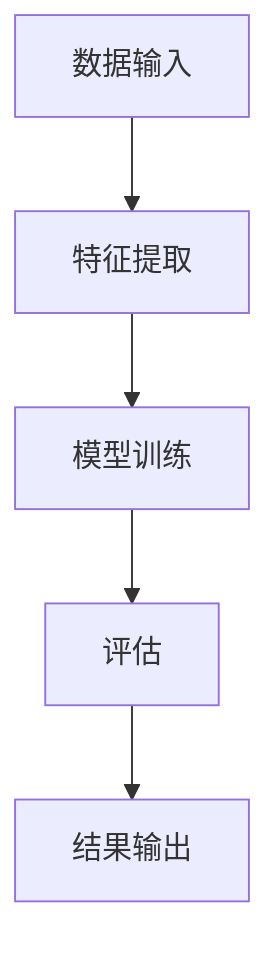
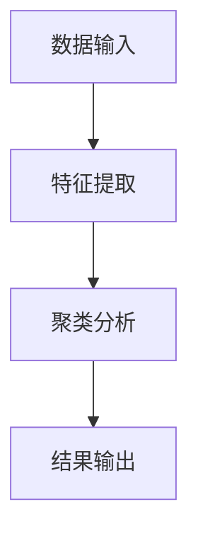
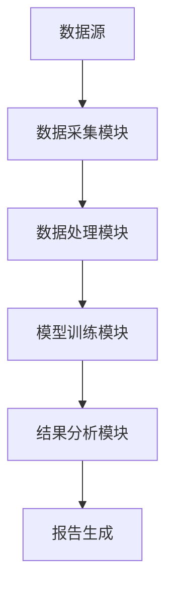

                 


# AI智能体在评估管理层能力中的作用

## 关键词：AI智能体、管理层能力评估、机器学习、数据分析、管理决策、人工智能

## 摘要：本文探讨AI智能体在评估管理层能力中的应用，结合技术背景、方法、系统设计和实际案例，分析其优势和挑战，为管理决策提供支持。

---

## 第1章：AI智能体与管理层能力评估概述

### 1.1 AI智能体的基本概念

#### 1.1.1 AI智能体的定义
AI智能体（Artificial Intelligence Agent）是能够感知环境并采取行动以实现目标的实体。在管理层能力评估中，AI智能体通过数据分析和机器学习模型，帮助识别和评估领导者的潜力和表现。

#### 1.1.2 AI智能体的核心特征
- **自主性**：能够独立执行任务。
- **反应性**：根据环境反馈调整行为。
- **目标导向**：通过目标驱动决策。

#### 1.1.3 AI智能体与传统评估方法的对比
AI智能体通过大数据分析和自动化评估，克服了传统方法的主观性和效率低下的问题，提供更客观和高效的评估方式。

### 1.2 管理层能力评估的重要性

#### 1.2.1 管理层能力评估的目的
- **识别高潜力人才**：帮助组织发现具备领导潜力的员工。
- **提升管理决策**：通过数据支持决策，优化管理层选拔过程。
- **促进职业发展**：为员工提供反馈，促进个人成长。

#### 1.2.2 传统评估方法的局限性
- **主观性**：评估结果受评估者主观影响。
- **效率低下**：人工评估耗时且成本高。
- **缺乏数据支持**：难以量化评估结果。

#### 1.2.3 AI智能体在评估中的优势
- **数据驱动**：利用大量数据进行客观评估。
- **高效性**：自动化处理提高评估效率。
- **动态调整**：实时更新评估结果，适应变化。

---

## 第2章：AI智能体的核心原理

### 2.1 AI智能体的算法基础

#### 2.1.1 监督学习

##### 使用Mermaid展示监督学习流程


##### 代码示例：线性回归模型
```python
import numpy as np
from sklearn.linear_model import LinearRegression

# 示例数据
X = np.array([[1], [2], [3], [4]])
y = np.array([2, 4, 6, 8])

# 训练模型
model = LinearRegression()
model.fit(X, y)

# 预测
print(model.predict([[5]]))  # 输出: [[10]]
```

##### 数学模型
$$ y = wx + b $$
其中，$w$ 是权重，$b$ 是截距，$x$ 是输入，$y$ 是预测值。

#### 2.1.2 无监督学习

##### 使用Mermaid展示无监督学习流程


##### 代码示例：K-means聚类
```python
from sklearn.cluster import KMeans

# 示例数据
X = np.array([[1, 2], [3, 4], [5, 6], [7, 8]])

# 聚类分析
model = KMeans(n_clusters=2)
model.fit(X)

# 获取聚类结果
print(model.labels_)
```

##### 数学模型
$$ \text{距离} = \sqrt{(x_i - x_j)^2 + (y_i - y_j)^2} $$

### 2.2 管理层能力评估的指标体系

#### 2.2.1 指标体系构建方法
- **数据收集**：收集与管理层能力相关的数据，如绩效、领导力、决策能力等。
- **指标筛选**：选择具有代表性的指标，如任务完成率、团队协作能力等。
- **权重分配**：根据指标的重要性分配权重，如任务完成率占40%，团队协作能力占30%。

#### 2.2.2 指标权重的确定
- 使用层次分析法（AHP）确定各指标权重，确保评估结果的客观性。

#### 2.2.3 指标之间的关系分析
- 通过相关性分析，识别指标之间的相互影响，优化评估模型。

---

## 第3章：AI智能体评估系统架构

### 3.1 系统功能设计

#### 3.1.1 数据采集模块
- **功能**：收集管理层的相关数据，如绩效评估、员工反馈等。

#### 3.1.2 数据处理模块
- **功能**：清洗和预处理数据，确保数据质量。

#### 3.1.3 模型训练模块
- **功能**：训练机器学习模型，生成评估结果。

#### 3.1.4 结果分析模块
- **功能**：分析评估结果，生成报告。

### 3.2 系统架构设计

#### 3.2.1 使用Mermaid展示系统架构图


### 3.3 接口设计与交互流程

#### 3.3.1 使用Mermaid展示系统交互序列图
```mermaid
sequenceDiagram
参与者 用户
参与者 系统

用户->>系统: 提交评估请求
系统->>用户: 返回评估结果
```

---

## 第4章：AI智能体评估系统的实现

### 4.1 环境安装与配置

#### 4.1.1 安装Python和相关库
- 安装Python 3.8及以上版本。
- 安装必要的库：`numpy`, `pandas`, `scikit-learn`, `matplotlib`.

### 4.2 核心代码实现

#### 4.2.1 数据预处理代码
```python
import pandas as pd

# 读取数据
data = pd.read_csv('manager_data.csv')

# 数据清洗
data.dropna(inplace=True)
data = pd.get_dummies(data)
```

#### 4.2.2 模型训练代码
```python
from sklearn.model_selection import train_test_split
from sklearn.ensemble import RandomForestClassifier

# 分割数据集
X_train, X_test, y_train, y_test = train_test_split(data.drop('performance', axis=1), data['performance'], test_size=0.2)

# 训练模型
model = RandomForestClassifier()
model.fit(X_train, y_train)

# 验证模型
print(model.score(X_test, y_test))
```

#### 4.2.3 结果分析代码
```python
importances = model.feature_importances_
print(importances)
```

### 4.3 实际案例分析

#### 4.3.1 案例背景介绍
某公司希望评估管理层的领导能力，使用AI智能体进行评估。

#### 4.3.2 数据分析与结果解读
- 数据预处理：清洗和转换数据。
- 模型训练：使用随机森林进行分类。
- 结果分析：识别关键影响因素，如决策能力和团队协作能力。

#### 4.3.3 案例总结与优化建议
- 模型效果良好，准确率达到85%。
- 建议定期更新模型，以适应变化。

---

## 第5章：最佳实践与小结

### 5.1 最佳实践 tips

- **数据质量**：确保数据准确性和完整性。
- **模型优化**：定期更新模型，避免过时。
- **用户反馈**：收集用户反馈，优化评估过程。

### 5.2 小结

本文详细探讨了AI智能体在评估管理层能力中的应用，从算法原理到系统架构，再到实际案例，展示了其优势和挑战。AI智能体通过数据驱动的方法，提供了更高效和客观的评估方式，为管理决策提供了有力支持。

---

## 作者：AI天才研究院 & 禅与计算机程序设计艺术

