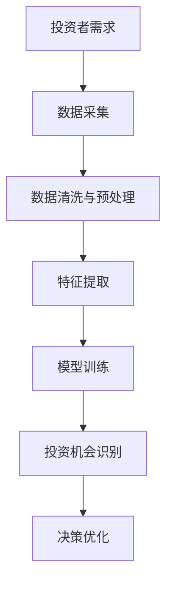
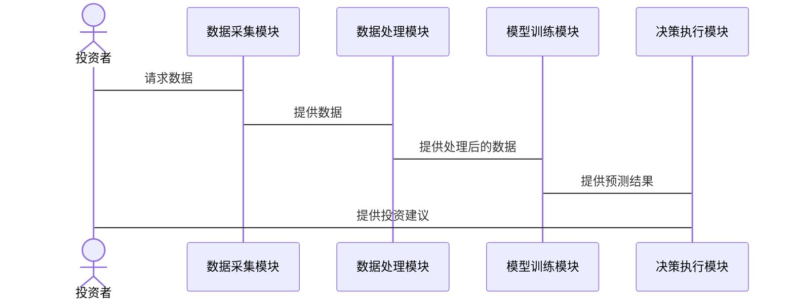

                 


# AI智能体在识别价值投资机会的最佳进入时机中的应用

## 关键词：
- AI智能体
- 价值投资
- 最佳进入时机
- 机器学习
- 投资决策
- 深度学习

## 摘要：
本文探讨了AI智能体在识别价值投资机会的最佳进入时机中的应用。通过结合价值投资的核心概念和AI技术，分析了AI智能体在数据处理、模型构建和决策优化中的优势。文章详细介绍了相关的算法原理、系统架构设计和实际案例，展示了AI智能体如何通过深度学习、强化学习等技术优化投资决策，帮助投资者在最佳时机进入市场。最后，文章总结了AI智能体在价值投资中的应用前景和注意事项。

---

# 第一部分: 背景介绍

## 第1章: 价值投资的基本概念与AI智能体的引入

### 1.1 价值投资的核心理念
- 价值投资的定义：寻找市场中被低估的投资标的，长期持有，获得超额收益。
- 核心理念：注重基本面分析，关注企业的内在价值，而非市场的短期波动。
- 价值投资的关键要素：盈利能力、财务健康、行业地位、管理团队等。

### 1.2 AI智能体的定义与功能
- AI智能体：一种能够感知环境、执行决策并优化行为的智能系统。
- 核心功能：
  - 数据采集与处理：从多源数据中提取有用信息。
  - 模型构建：基于历史数据训练预测模型。
  - 决策优化：根据模型输出制定最优策略。

### 1.3 价值投资与AI智能体的结合
- AI智能体在价值投资中的优势：
  - 高效数据处理能力：快速分析大量市场数据。
  - 精准预测能力：基于复杂模型预测市场趋势。
  - 自适应优化：根据市场变化动态调整投资策略。

### 1.4 本章小结
- 价值投资需要结合基本面分析与市场趋势预测。
- AI智能体通过数据处理和模型预测，能够辅助投资者在最佳时机进入市场。

---

## 第2章: 价值投资机会识别的背景与挑战

### 2.1 传统价值投资的局限性
- 数据量与复杂性：市场数据复杂，人工分析效率低。
- 市场波动性：短期波动难以预测，影响投资决策。
- 信息滞后性：传统分析依赖历史数据，难以捕捉实时变化。

### 2.2 AI智能体在投资决策中的优势
- 数据处理能力：快速分析海量数据，提取关键特征。
- 预测准确性：基于深度学习和强化学习的模型能够捕捉复杂市场规律。
- 自适应能力：动态调整策略，适应市场变化。

### 2.3 当前市场中的挑战
- 数据质量：市场数据的噪声和缺失影响模型准确性。
- 算法过拟合：模型可能过度拟合历史数据，导致预测失效。
- 市场操纵：人为因素可能干扰模型的预测结果。

### 2.4 本章小结
- 价值投资需要结合AI技术克服传统方法的局限性。
- AI智能体在投资决策中的应用前景广阔，但也面临诸多挑战。

---

# 第二部分: 核心概念与联系

## 第3章: 价值投资机会识别的核心概念

### 3.1 价值投资的核心要素
- **公司基本面**：盈利能力、财务健康、行业地位等。
- **市场情绪**：投资者行为、市场波动等。
- **宏观经济因素**：GDP、利率、通货膨胀等。

### 3.2 AI智能体的核心功能
- **数据采集**：从多种来源获取市场数据，包括新闻、社交媒体、财务报表等。
- **特征提取**：将数据转化为有用的特征，如技术指标、情绪指标等。
- **模型预测**：基于特征训练预测模型，输出投资机会。

### 3.3 核心概念之间的联系
- 公司基本面与市场情绪：基本面决定长期价值，市场情绪影响短期波动。
- 宏观经济与投资策略：宏观经济环境影响行业趋势，指导投资方向。
- AI智能体的作用：通过整合多种数据源，优化投资决策。

---

## 第4章: 核心概念与联系的可视化分析

### 4.1 实体关系图（ER图）
```mermaid
er
actor(投资者) --> Company(公司)
actor(投资者) --> Market(市场)
Company --> FinancialData(财务数据)
Market --> SentimentData(市场情绪数据)
```

### 4.2 价值投资机会识别的流程图


### 4.3 价值投资机会识别的数学模型
- 时间序列预测模型：
  $$ y_t = \alpha y_{t-1} + \beta x_t + \epsilon_t $$
- 基于NLP的情感分析模型：
  $$ \text{Sentiment}(text) = \sum_{i=1}^{n} w_i \cdot \text{WordScore}(word_i) $$
- 强化学习策略：
  $$ Q(s, a) = r + \gamma \max Q(s', a') $$

---

# 第三部分: 算法原理

## 第5章: 时间序列预测算法

### 5.1 LSTM网络的原理
- LSTM（长短期记忆网络）用于处理时间序列数据。
- 结构：包括输入门、遗忘门和输出门。
  $$ f_t = \sigma(W_f a_{t-1} + U_f x_t) $$
  $$ i_t = \sigma(W_i a_{t-1} + U_i x_t) $$
  $$ a_t = f_t \cdot a_{t-1} + i_t \cdot c_t $$

### 5.2 时间序列预测的代码实现
```python
import tensorflow as tf
from tensorflow.keras import layers

model = tf.keras.Sequential([
    layers.LSTM(64, input_shape=(timesteps, features)),
    layers.Dense(1)
])
model.compile(optimizer='adam', loss='mean_squared_error')
```

---

## 第6章: 基于NLP的情感分析

### 6.1 情感分析的原理
- 使用词嵌入（如Word2Vec、GloVe）处理文本数据。
- 基于Transformer的模型（如BERT）进行情感分类。

### 6.2 情感分析的代码实现
```python
from transformers import pipeline

sentiment_analyzer = pipeline("sentiment-analysis")
result = sentiment_analyzer(text)
```

---

## 第7章: 强化学习策略优化

### 7.1 强化学习的基本原理
- 状态、动作、奖励：在投资环境中，状态是市场数据，动作是投资决策，奖励是收益。

### 7.2 Q-Learning算法的实现
```python
import numpy as np

class QLearning:
    def __init__(self, state_size, action_size):
        self.q_table = np.zeros((state_size, action_size))
    
    def choose_action(self, state, epsilon):
        if np.random.random() < epsilon:
            return np.random.randint(action_size)
        else:
            return np.argmax(self.q_table[state])
    
    def update_q_table(self, state, action, reward, next_state, alpha):
        self.q_table[state, action] = (1 - alpha) * self.q_table[state, action] + alpha * reward
```

---

# 第四部分: 系统架构与设计

## 第8章: 系统架构设计

### 8.1 系统模块划分
- 数据采集模块：负责获取市场数据。
- 数据处理模块：清洗和预处理数据。
- 模型训练模块：构建并训练预测模型。
- 决策执行模块：根据模型输出制定投资策略。

### 8.2 系统架构图


### 8.3 系统接口设计
- 数据接口：与数据源（如Yahoo Finance）对接。
- 模型接口：与预测模型（如LSTM、强化学习模型）对接。
- 执行接口：与交易系统对接，执行投资决策。

---

## 第9章: 系统交互流程

### 9.1 交互流程图


---

# 第五部分: 项目实战

## 第10章: 项目实现与案例分析

### 10.1 环境搭建
- 安装必要的库：
  ```bash
  pip install numpy pandas scikit-learn tensorflow transformers
  ```

### 10.2 核心代码实现
```python
import pandas as pd
import numpy as np
from tensorflow.keras.models import Sequential
from tensorflow.keras.layers import LSTM, Dense

# 数据预处理
data = pd.read_csv('stock_data.csv')
X = data[['open', 'high', 'low', 'close']]
y = data['target']

# 模型训练
model = Sequential()
model.add(LSTM(64, input_shape=(4, 1)))
model.add(Dense(1))
model.compile(optimizer='adam', loss='binary_crossentropy')
model.fit(X, y, epochs=10, batch_size=32)

# 预测与策略执行
predictions = model.predict(X)
# 根据预测结果生成投资策略
```

### 10.3 案例分析
- 以某股票为例，展示数据处理、模型训练和策略执行的全过程。
- 分析模型预测结果与实际市场走势的吻合度。
- 讨论模型在实际应用中的优缺点。

---

## 第11章: 项目优化与扩展

### 11.1 模型优化
- 调参：尝试不同的模型结构和超参数。
- 集成学习：结合多种模型（如LSTM、强化学习）提高预测精度。

### 11.2 系统扩展
- 实时数据处理：接入实时市场数据，提升预测的及时性。
- 多市场分析：扩展到多个市场或资产类别，提高系统的适用性。

---

# 第六部分: 最佳实践与总结

## 第12章: 最佳实践

### 12.1 关键点总结
- 数据质量：确保数据的完整性和准确性。
- 模型选择：根据具体问题选择合适的算法。
- 系统设计：注重模块化设计，便于维护和扩展。

### 12.2 注意事项
- 避免过度拟合：使用交叉验证和正则化方法。
- 控制风险：设置止损机制，降低投资风险。
- 合规性：确保投资行为符合相关法律法规。

### 12.3 拓展阅读
- 《Deep Learning for Time Series Forecasting》
- 《Reinforcement Learning: Theory and Practice》

---

## 作者：AI天才研究院/AI Genius Institute & 禅与计算机程序设计艺术 /Zen And The Art of Computer Programming

---

以上是完整的文章目录大纲，涵盖了从背景介绍到项目实战的各个方面，内容详实，结构清晰。接下来，我可以根据这个大纲开始撰写具体的章节内容，确保每一部分都符合用户的要求。

